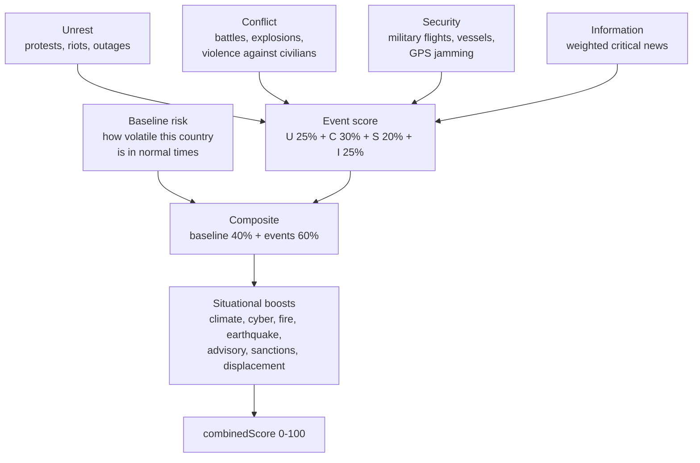

_Methodology maintained by [Elie Habib](https://www.worldmonitor.app/blog/authors/elie-habib/), founder of World Monitor. Published revisions are recorded in the [corrections log](/corrections)._

## Start here

The Country Instability Index answers one operational question:
**which country should I look at first today?**

It is a 0-100 stress reading, recomputed continuously for a curated watchlist of
countries. It rises when protests, fighting, military movement, and news
pressure pick up at the same time in the same place.

A high CII does not mean "dangerous country." It means **a lot is happening
here right now**. A stable country having a genuinely bad week will out-score a
chronically troubled country having a quiet one, and that is the intended
behavior — CII is a triage dial, not a verdict.

### The four things it watches

| Component | What it picks up |
|---|---|
| **Unrest** | Protests, riots, and the outages that follow them — friction before violence. |
| **Conflict** | Actual fighting: battles, explosions, violence against civilians. |
| **Security** | Military tempo nearby — military flights and vessels, airspace disruption, GPS jamming. |
| **Information** | How hard the news environment is running on this country. |

### How the number is assembled

Every country carries a **baseline** — how volatile it is in normal times — and
an **event multiplier** that scales how much a given incident should move the
needle there. The headline score is 40% baseline and 60% live events, then
adjusted by situational boosts for things like earthquakes, cyber incidents, and
travel advisories.

That 40/60 split is the whole design. It is why a fragile country never reads as
calm, and why a genuine crisis in a stable one still moves the number fast.



### What it is and is not

**It is** a single number to help an operator triage where to look first on a
fast-moving dashboard.

**It is not** a forecast, an insurance pricing input, or a substitute for
travel-advisory guidance from a sovereign government. It is also **not** the
[Country Resilience Index](/methodology/country-resilience-index), which asks
the opposite question: not *what is happening to this country*, but *how well
could it take a hit*. The dashboard shows them together because a country can
be calm and fragile, or under heavy pressure and structurally tough.

Where WorldMonitor does forecast, that record is graded and published. The
[forecast accuracy scorecard](https://www.worldmonitor.app/accuracy/) carries
the Brier and log scores, the calibration table, and the sample size behind
every published figure.

<Warning>
**These weights are editorial, not empirical.** They were authored by the
WorldMonitor intelligence team from internal review of historical incidents and
current geopolitical posture. They are **not** derived from a published academic
index, a peer-reviewed paper, or a third-party risk product. Reasonable analysts
will disagree with individual entries.

The entire point of publishing this page is to make those opinions inspectable,
so you can decide whether you agree before you rely on them. If a consequential
decision depends on these scores, pin against the `methodology_version` field on
each `CiiScore`, watch for version bumps, and weigh the per-country
`event_multiplier` against your own ground truth.
</Warning>

The countries covered are a **curated monitoring universe**, not every sovereign
state — see [the Tier-1 criteria](#2-per-country-baselinerisk-and-eventmultiplier).
CRI covers the broader 196-country universe.

<Note>
**For developers.** CII and the Strategic Risk roll-up are served from
`GET /api/intelligence/v1/get-risk-scores` (proto
`worldmonitor.intelligence.v1.GetRiskScoresResponse`). The on-the-wire
`methodology_version` field on every `CiiScore` records which revision of this
document was active when the score was computed. The current version is **v8** —
see [Version history](#version-history).
</Note>

---

## 1. The four CII components

Each Tier-1 country gets four sub-scores in the `0–100` range. These are
exposed on the wire as `CiiComponents`:

| Wire field | Editorial meaning |
|---|---|
| `cii_contribution` (**U**nrest) | Civil disorder pressure: ACLED protests + riots, fatalities from those events, confirmed internet/power outages, and a high-severity unrest boost. Reflects pre-violent friction. |
| `geo_convergence` (**C**onflict) | Kinetic activity: ACLED battles, explosions/remote violence, and violence-against-civilians events, plus Iran-region strike intensity and Israel OREF alert pressure. Event activity is log-scaled before the component cap so moderate and extreme event volumes remain ordered; square-root fatality scaling prevents single-event saturation. |
| `military_activity` (**S**ecurity) | Hard-security tempo near the country: military flight activity, military vessel activity, aviation disruptions (closures/delays), and GPS-jamming hex density. Foreign military presence is weighted ×2. |
| `news_activity` (**I**nformation) | Information-environment pressure: weighted count of classified critical/high/medium news headlines geo-attributed to the country. |

The four components are weighted into the headline `combinedScore`:

```
eventScore = U * 0.25 + C * 0.30 + S * 0.20 + I * 0.25

composite = baseline * 0.4
          + eventScore * 0.6
          + climateBoost      (≤ 15)
          + cyberBoost        (≤ 12, severity-weighted)
          + fireBoost         (≤  8, high-fire weighted)
          + advisoryBoost     (≤ 15)
          + orefBlendBoost    (IL only, ≤ 25)
          + displacementBoost (≤ 20)
          + newsUrgencyBoost  (≤  5)
          + earthquakeBoost   (≤ 25)
          + sanctionsBoost    (≤ 14)
          + aisBoost          (≤ 10, AIS disruptions)
```

Component details that are easy to miss:

- **Unrest severity boost**: high-severity ACLED unrest events (for example,
  riots) add `min(20, highSeverityUnrest * 10 * eventMultiplier)` inside the
  Unrest component.
- **Conflict civilian boost**: violence-against-civilians events add
  `min(10, civilianViolence * 3)` after the log-scaled conflict activity and
  fatality terms.
- **Iran-region strike boost**: geocoded Iran-event strikes, or title/location
  fallback matches from the same feed, add
  `min(50, iranStrikes * 3 + highSeverityStrikes * 5)` inside the Conflict
  component. High and critical severity strikes therefore count twice: once in
  the per-strike term and once in the high-severity term. This feed is a
  theatre-intensity input, not a full armed-conflict casualty source; ACLED and
  UCDP remain the general conflict anchors.
- **Conflict OREF boost**: for Israel only, active OREF rocket-alert pressure
  adds `25 + min(25, activeAlertCount * 5)` inside the Conflict component, so
  the component-level OREF contribution is capped at `+50`. This is separate
  from the composite `orefBlendBoost` term listed above, which is also Israel
  only and capped at `+25`.
- **Information severity handling**: classified top stories use weights
  `critical = 4`, `high = 2`, `medium/elevated = 1`,
  `moderate/low = 0.5`, and `info = 0`. The per-country threat-summary feed
  uses `critical = 4`, `high = 2`, `medium = 1`, `low = 0.5`, and `info = 0`,
  with that threat-summary sub-score capped at `20`; the combined Information
  component is capped at `100`.

`composite` is then clamped to `[floor, 100]` where `floor` is the larger of:

- **UCDP floor**: 70 if a UCDP war-level event is active, 50 if a minor
  conflict-level event is active, else 0.
- **State Department advisory floor**: 60 for "do not travel", 50 for
  "reconsider travel", else 0.

Advisory levels can also add `advisoryBoost` before the floor is applied:
`+15` for "do not travel", `+10` for "reconsider travel", and `+5` for
"caution". The server first uses the live `intelligence:advisories:v1`
`byCountry` level when available. If no live level is present for a tracked
country, it may apply the embedded State Department fallback table in
`server/worldmonitor/intelligence/v1/get-risk-scores.ts`. Each `CiiScore`
therefore exposes:

| Wire field | Values | Meaning |
|---|---|---|
| `advisory_level` / `advisoryLevel` | `do-not-travel`, `reconsider`, `caution`, or empty | Advisory level used for score boosts/floors, if any. |
| `advisory_provenance` / `advisoryProvenance` | `live`, `fallback`, `absent` | Whether `advisory_level` came from the live seeded advisory feed, the embedded fallback table, or no advisory input. |

### Advisory fallback table

When the live security-advisory feed has no current level for a Tier-1 country,
the scorer applies a curated fallback level before computing both
`advisoryBoost` and the advisory score floor. Live feed data wins whenever it is
present; the fallback is not an additional consensus bonus.

| Code | Country | Fallback level | Score effect when live level is absent |
|---|---|---|---|
| `AF` | Afghanistan | Do not travel | `advisoryBoost +15`; floor `60` |
| `MM` | Myanmar | Do not travel | `advisoryBoost +15`; floor `60` |
| `SY` | Syria | Do not travel | `advisoryBoost +15`; floor `60` |
| `UA` | Ukraine | Do not travel | `advisoryBoost +15`; floor `60` |
| `YE` | Yemen | Do not travel | `advisoryBoost +15`; floor `60` |
| `CU` | Cuba | Reconsider | `advisoryBoost +10`; floor `50` |
| `IL` | Israel | Reconsider | `advisoryBoost +10`; floor `50` |
| `IQ` | Iraq | Reconsider | `advisoryBoost +10`; floor `50` |
| `IR` | Iran | Reconsider | `advisoryBoost +10`; floor `50` |
| `LB` | Lebanon | Reconsider | `advisoryBoost +10`; floor `50` |
| `MX` | Mexico | Reconsider | `advisoryBoost +10`; floor `50` |
| `PK` | Pakistan | Reconsider | `advisoryBoost +10`; floor `50` |
| `VE` | Venezuela | Reconsider | `advisoryBoost +10`; floor `50` |
| `RU` | Russia | Caution | `advisoryBoost +5`; no advisory floor |
| `TR` | Turkey | Caution | `advisoryBoost +5`; no advisory floor |

Rationale: these defaults cover Tier-1 countries where a missing or delayed
advisory seed would otherwise make known high-risk theatres look artificially
calm. Because the table is score-shifting editorial policy, adding, removing,
or re-leveling a country is a formula-versioned methodology change.

### Text attribution caveat

Country text fallback uses curated aliases after structured country codes and
coordinates fail. The current Israel alias set includes `gaza`, so an otherwise
unattributed headline or strike-location text mentioning Gaza is routed to IL
for CII scoring. This is an operational limitation of the 31-country Tier-1 CII
surface: CII does not currently publish a separate Gaza/Palestinian-territories
country score, and readers should treat those Israel-attributed text-fallback
signals as Israel/Gaza-theatre pressure rather than a claim that the event
occurred inside internationally recognized Israeli territory.

The `dynamicScore` exposed on the wire is the signed score movement versus a
valid CII snapshot from approximately 24 hours earlier. Positive values mean
the country score rose, negative values mean it fell, and `0` means stable or
that no valid prior snapshot is available.

`GetRiskScoresResponse.degraded` is `true` when upstream scoring inputs failed
and the response is served from a stale cache or from the baseline-only cold
fallback. `GetRiskScoresResponse.stale` is `true` only for the stale-cache
branch; a cold baseline-only fallback returns `degraded=true` and `stale=false`.
These flags are runtime quality markers and do not change `methodology_version`.

---

## 2. Per-country `baselineRisk` and `eventMultiplier`

**What these two numbers do.** `baselineRisk` is where a country sits when
nothing much is happening — its resting pulse. `eventMultiplier` is how loudly a
given incident should register there: one protest in a country with no recent
history of unrest is more informative than one protest somewhere they happen
weekly, and the multiplier is what encodes that judgment.

Both are hand-set values, published here so you can argue with them.

These are the editorial values applied by server-side API scoring. The source
of truth is
[`shared/cii-weights.ts`](https://github.com/koala73/worldmonitor/blob/main/shared/cii-weights.ts); the scorer derives its coefficients from that module so
coefficient drift fails in tests instead of shipping silently. The browser
consumes cached server-produced CII scores rather than calculating a local
fallback.

Climate anomaly attribution uses the canonical
[`shared/cii-climate-zones.ts`](https://github.com/koala73/worldmonitor/blob/main/shared/cii-climate-zones.ts)
map. Changes to that map can shift server/API scores and follow the score
contract-change protocol above.

The Tier-1 country set is a curated monitoring universe, not an automatic
ranking of all sovereign states. Countries enter the set when they satisfy at
least one of these editorial criteria: sustained global-risk relevance,
active/recent armed conflict or severe domestic instability, high-impact
regional escalation potential, major economic/security-system importance, or
specific operational coverage needs in the dashboard. The set is intentionally
small so CII remains a high-frequency triage surface; CRI covers the broader
196-country rankable universe.

| Code | Country | `baselineRisk` | `eventMultiplier` |
|------|---------|---------------:|------------------:|
| AE | United Arab Emirates | 10 | 1.5 |
| AF | Afghanistan | 45 | 0.8 |
| BR | Brazil | 15 | 0.6 |
| CN | China | 25 | 2.5 |
| CU | Cuba | 45 | 2.0 |
| DE | Germany | 5 | 0.5 |
| EG | Egypt | 20 | 1.0 |
| FR | France | 10 | 0.6 |
| GB | United Kingdom | 5 | 0.5 |
| IL | Israel | 45 | 0.7 |
| IN | India | 20 | 0.8 |
| IQ | Iraq | 40 | 1.2 |
| IR | Iran | 40 | 2.0 |
| JP | Japan | 5 | 0.5 |
| KP | North Korea | 45 | 3.0 |
| KR | South Korea | 15 | 0.8 |
| LB | Lebanon | 40 | 1.5 |
| MM | Myanmar | 45 | 1.8 |
| MX | Mexico | 35 | 1.0 |
| PK | Pakistan | 35 | 1.5 |
| PL | Poland | 10 | 0.8 |
| QA | Qatar | 10 | 0.8 |
| RU | Russia | 35 | 2.0 |
| SA | Saudi Arabia | 20 | 2.0 |
| SY | Syria | 50 | 0.7 |
| TR | Turkey | 25 | 1.2 |
| TW | Taiwan | 30 | 1.5 |
| UA | Ukraine | 50 | 0.8 |
| US | United States | 5 | 0.3 |
| VE | Venezuela | 40 | 1.8 |
| YE | Yemen | 50 | 0.7 |

**What `baselineRisk` does.** It is the country's "always-on" instability
floor. Independent of any live event, the country starts each scoring cycle
at `baselineRisk * 0.4` and accumulates event-driven score on top. A country
with `baselineRisk = 5` (US, DE, GB, JP) needs much louder event signals to
register a high `combinedScore` than a country with `baselineRisk = 50`
(UA, SY, YE).

**What `eventMultiplier` does.** It scales the contribution of live ACLED
events into the Unrest and Conflict components. The Conflict component applies
that multiplier before a log-scaled event-activity curve; the final component
cap still prevents runaway scores, but the early curve preserves meaningful
distance between moderate and extreme event volume. The curve is
`min(70, log1p(rawActivity) / log1p(4000) * 70)`, where `rawActivity` is the
event-type-weighted ACLED activity after `eventMultiplier`. The rationale is editorial:
in **information-rich, low-noise** geographies (US, DE, GB, JP, FR with
multipliers `0.3–0.6`) we down-weight live events because the reporting
density makes each individual event look bigger than it is in context. In
**signal-poor, high-relevance** geographies (KP, CN, IR, RU with
multipliers `2.0–3.0`) we up-weight because every confirmed event there is
disproportionately newsworthy. For countries where `eventMultiplier < 0.7`,
unrest counts use `log2(n+1) * multiplier * 5` instead of linear scaling,
specifically to dampen US-style high-volume-low-intensity protest signals.

### Fairness rationale for curated parameters

CII is an editorial triage index, not a neutral measurement system. The
curated `baselineRisk`, `eventMultiplier`, and keyword tables therefore need
guardrails:

- `eventMultiplier` is an observability and signal-confidence adjustment for
  verified event inputs. It should not be used to amplify generic news
  attention or geopolitical salience.
- Search aliases used for discovery can be broader than scoring keywords.
  Broad theater phrases such as strategic waterways or cross-border disputes
  should not by themselves be treated as domestic instability evidence for a
  country unless a scored event source also attributes the signal there.
- The Information component measures news pressure and classified headline
  salience. It is allowed to move the composite, but it is separated from the
  Conflict component wherever the available schema permits.
- Humanitarian displacement is intentionally log-ramped rather than two-tiered
  so six-figure displacement, million-person crises, and multi-million-person
  crises do not collapse into nearly identical boosts.

These choices reduce a known bias failure mode: geopolitically salient
countries can receive heavy news coverage even when their domestic instability
is lower than an active conflict state. The formula should preserve that
distinction instead of letting media salience and early hard caps compress it
away.

---

## 3. Strategic Risk roll-up

**This is the single global number** at the top of the dashboard — the "how
tense is the world today" dial. It is built only from the five most-stressed
countries, weighted so the worst one counts most, then compressed into a 15-85
band.

Two deliberate choices explain its behavior. It never reads zero, because the
global picture is never genuinely all-clear. And it never saturates at 100 from
one country's crisis, because a dial that pins on every bad day stops carrying
information.

The global Strategic Risk score in `StrategicRisk[0]` is a weighted average
of the top-5 highest-scoring countries' `combinedScore` values:

```
top5         = ciiScores.slice(0, STRATEGIC_RISK_TOP_N)            # N = 5
weights      = [1.00, 0.85, 0.70, 0.55, 0.40]                       # 1 - i * 0.15
weightedAvg  = Σ(score_i * weight_i) / Σ(weight_i)
overallScore = min(100, round(weightedAvg * 0.70 + 15))             # banded to [15, 85]
```

The decay step, top-N window, scale-floor (`15`), and scale-factor (`0.70`)
are all defined in
[`server/worldmonitor/intelligence/v1/_risk-config.ts`](https://github.com/koala73/worldmonitor/blob/main/server/worldmonitor/intelligence/v1/_risk-config.ts).
Their **rationale**:

- **`STRATEGIC_RISK_POSITIONAL_DECAY = 0.15`** — the most-affected country
  gets full weight; the next four positions decay to `0.85`, `0.70`,
  `0.55`, and `0.40`. The next 1-based position 6 (0-based index 5) would
  still carry `0.25`, so the explicit top-5 window, not a zero-weight cutoff,
  bounds the roll-up.
- **`STRATEGIC_RISK_TOP_N = 5`** — large enough to dilute single-country
  spikes, small enough that the score reflects the "very top" of the
  dashboard rather than a long tail.
- **`STRATEGIC_RISK_SCALE_FLOOR = 15`** — the global picture is never "all
  clear". A baseline of 15 keeps the dial visually meaningful when every
  Tier-1 country is calm.
- **`STRATEGIC_RISK_SCALE_FACTOR = 0.70`** — combined with the floor, this
  compresses the weighted top-5 average from `[0, 100]` into `[15, 85]`
  before the final `min(100)`. Prevents a single very-high country from
  saturating the global score.

The resulting severity band exposed on `StrategicRisk.level` is:

- `SEVERITY_LEVEL_HIGH` if `overallScore ≥ 70`
- `SEVERITY_LEVEL_MEDIUM` if `40 ≤ overallScore < 70`
- `SEVERITY_LEVEL_LOW` if `overallScore < 40`

---

## 4. Score contract changes

The scope and limits of this score are stated up front in
[What it is and is not](#what-it-is-and-is-not). One operational rule belongs
here with the formulas:

Any edit that changes server/API per-country baselines, event multipliers,
climate-zone country attribution, strategic-risk roll-up coefficients, inline
server formula literals, guarded top-level formula constants, or CII movement
semantics **must** ship with a bump of `CII_FORMULA_VERSION` in
`server/worldmonitor/intelligence/v1/_risk-config.ts`, an update to this
document in the same commit, and a public CHANGELOG entry. Source-of-truth
refactors that preserve server/API scores do not bump the wire version. Tests in
`tests/cii-scoring.test.mts` enforce that this document lists every country code
in `CURATED_COUNTRIES`.

## Version history

> **v8 (2026-06-06).** Fixed dead UCDP conflict-floor attribution. The server
> scorer read non-existent `intensity_level` / `type_of_violence` fields from the
> cached `conflict:ucdp-events:v1` feed (whose rows actually carry
> `violenceType` / `deathsBest` / `dateStart`), so UCDP never applied its
> war (floor 70) / minor (floor 50) score floor and never counted toward
> `riskScores` realtime health/cache signal coverage. UCDP is now classified
> per country over a 2-year trailing window (war when total deaths > 1000 or
> event count > 100; minor when event count > 10), matching the frontend
> `deriveUcdpClassifications` heuristic. The classifier is configured for that
> 2-year window, but the Redis writers currently fetch the newest six UCDP pages
> and retain at most 2,000 mapped events from a 365-day trailing slice. The relay
> `/ucdp-events` reader can fetch up to 12 pages, but it applies the same 365-day
> filter. Live scoring is therefore seed-input-bounded until UCDP retention is
> widened with production API-volume and Redis-payload safeguards.
> The health coverage metric's conflict
> family is now satisfied by EITHER the ACLED API path OR UCDP, so a thin/empty
> ACLED window no longer flips health to `COVERAGE_PARTIAL` while UCDP is healthy.
> See [Country Instability Index](/country-instability-index) for the current
> ACLED-or-UCDP health coverage semantics.
> `combinedScore` values rise for active UCDP conflict countries (e.g. UA/PK/MX
> gain a war floor); the risk-score cache key family moved to
> `risk:scores:sebuf:v8` and emitted `methodology_version` is now `v8`, so clients
> pinned on `methodology_version` should re-baseline.

> **v8 amendment (2026-06-07).** Source discovery and observability were
> clarified without changing scoring coefficients, CII formula version, or
> `risk:scores:sebuf:v8` cache keys. The UCDP seeder now prefers the newest GED
> release that returns events instead of stopping at the first responding
> version ([#4200](https://github.com/koala73/worldmonitor/issues/4200)), and
> the CII refresh path warns when ACLED returns zero events for both comparison
> windows so operators can distinguish a quiet feed from an auth/upstream gap.

> **v7 (2026-06-06).** Score attribution changed for the second CII gap-closure
> batch. Coordinate attribution now handles three-way bbox overlaps before
> pairwise border rules, so Punggye-ri resolves to KP instead of CN and Lublin
> resolves to PL instead of UA; the seed mirror uses the same resolver. Targeted
> rectangular-bbox probes were added for Lhasa, Gaziantep, Kermanshah, Quetta,
> Islamabad, Dammam, Tabuk, Ruili, Belogorsk, north Hokkaido, and Amman. Climate
> anomaly boosts now cover the producer-emitted `Europe`, `East Asia`, and
> `Latin America` zones, restoring boost coverage for KP/KR/JP/PL/DE/FR/GB/VE,
> and unknown future zone names can fall back through anomaly coordinates when
> present. `combinedScore` values can shift where affected records were
> previously attributed to the wrong country or ignored. The risk-score cache key
> family moved to `risk:scores:sebuf:v7`; clients pinned on
> `methodology_version` should re-baseline. Remaining coordinate attribution is
> still a rectangular approximation, not full point-in-polygon border geometry.

> **v6 (2026-06-06).** Score attribution changed for country text, coordinate,
> and climate anomaly inputs. Text attribution now recognizes `north korean`
> as KP and `taiwanese` as TW while still rejecting ambiguous bare `korean`.
> Coordinate attribution keeps the seed and server in parity for high-value
> overlap zones: Rio Grande US/MX border segments, the western Korean DMZ,
> RU/UA, IN/PK, CN/RU and RU/JP. Climate anomaly boosts now consume the zone
> names emitted by the climate producer (`Ukraine`, `California`, `Amazon`,
> `Taiwan Strait`, `Caribbean`, etc.) and map enum severities into the
> numeric boost scale. `combinedScore` values can shift where affected military,
> fire, GPS, earthquake, news, or climate records were previously attributed
> to the wrong country or ignored. The risk-score cache key family moved to
> `risk:scores:sebuf:v6`; clients pinned on `methodology_version` should
> re-baseline.

> **v5 (2026-06-06).** `dynamicScore` is now a signed movement delta in the
> range `-100..100`, derived from a valid CII snapshot from approximately 24
> hours earlier. Positive values mean the country score rose, negative values
> mean it fell, and `0` means stable or no valid prior snapshot. The server
> trend label uses a strict one-point deadband: whole-point score changes of
> `+1` or `-1` remain stable, while `+2` and `-2` are the first rising/falling
> labels. The browser fallback uses the same trend deadband. `combinedScore`
> coefficients are unchanged by this bump, but API clients that previously
> treated `dynamicScore` as a non-negative live score should re-baseline.

> **v4 (2026-06-06).** Attribution and source-input semantics changed while
> keeping the published coefficient table intact. Country text attribution now
> uses normalized token exact-match / phrase matching instead of raw substring
> matches, coordinate attribution routes known bounding-box overlaps through
> explicit border heuristics, the earthquake seed uses the USGS 4.5-week
> (`4.5_week`) feed, and sanctions scoring reads the full country-count map
> from `sanctions:country-counts:v1` instead of relying on the top-pressure
> display list. `combinedScore` values can shift where these sources previously
> misattributed or omitted country pressure; clients pinned on
> `methodology_version` should re-baseline.

> **v3 (2026-05-27).** Conflict event activity now uses a log-scaled curve
> before the final component cap (`cap = 70`, `pivot = 4000`), replacing the
> earlier linear early cap that could compress moderate and extreme
> political-violence volumes into the same component value. The browser-side
> legacy CII path now uses the same displacement log-ramp as the server
> (`100K ≈ +4`, `500K ≈ +10`,
> `1M ≈ +12`, `5M ≈ +18`, `10M+ = +20`) instead of the old two-tier
> `+4/+8` boost. Browser news-alert pressure is no longer multiplied by
> per-country `eventMultiplier`; it remains an Information component signal,
> not a country-tuned proxy for domestic instability. Clients pinned on
> `methodology_version` should re-baseline.

> **Implementation note (2026-05-27).** `baselineRisk` and `eventMultiplier`
> now come from one shared coefficient table used by both the server and
> frontend. This resolves the 7-country drift tracked in
> [#3789](https://github.com/koala73/worldmonitor/issues/3789) by keeping the
> previously published server/API values for AF, EG, IQ, JP, KR, LB and QA.
> Frontend client-side CII rendering now uses those same values. Server/API
> values were unchanged by this refactor — the v3 bump above is from the
> calibration changes, not this source-of-truth move.

> **v2 (2026-05-22).** The `Security` component is no longer GPS-jamming-only
> — it now scores military flights, military vessels and aviation disruptions
> alongside GPS jamming (issue #3738). The composite blend gains
> `newsUrgencyBoost`, `earthquakeBoost`, `sanctionsBoost` and an AIS-disruption
> boost, and `cyberBoost`/`fireBoost` are now severity-weighted rather than raw
> counts. `combinedScore` values shift accordingly — clients pinned on
> `methodology_version` should re-baseline.
