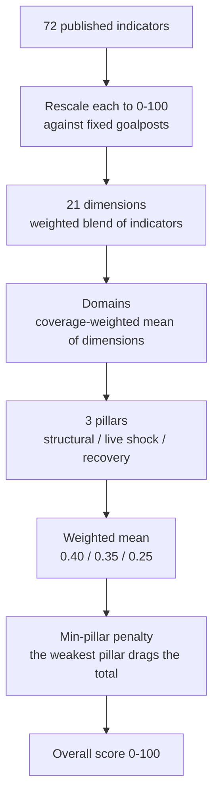

_Methodology maintained by [Elie Habib](https://www.worldmonitor.app/blog/authors/elie-habib/), founder of World Monitor. Published revisions are recorded in the [corrections log](/corrections)._

## Start here

The Country Resilience Index answers one question about each of 196 countries:
**when something goes badly wrong, how well can this country absorb it and get
back up?**

It is a single 0-100 score, refreshed every 6 hours, built from 72 published
indicators. A high score does not mean a country is rich, safe, or pleasant to
live in. It means that when a shock arrives — a currency crisis, a blackout, a
drought, a cyberattack, a war next door — that country has the fiscal room, the
institutions, the infrastructure, and the supplies to take the hit and recover.

### How to read a score

| Score | Level | What it means in practice |
|---|---|---|
| 60-100 | **High** | Deep buffers. Absorbs a serious shock without losing basic function. |
| 30-59 | **Medium** | Real capacity, but a large shock would strain it, and recovery may depend on outside help. |
| 0-29 | **Low** | Little slack anywhere. A shock in one area cascades into the others. |

Two things are worth knowing before you compare two countries.

**A country cannot average its way out of a weak spot.** The score deliberately
punishes lopsidedness: a country that is excellent at five things and dire at
the sixth scores below one that is merely good at all six. In a real crisis the
weakest link is what fails, so the formula is built to say so. (This is the
min-pillar penalty in the [scoring formula](#overall-score).)

**Coverage matters as much as the score.** Every score ships with a coverage
figure saying how much of it rests on real observations rather than inference.
A country whose data is too thin is flagged `lowConfidence` and held out of the
public ranking, rather than quietly ranked on guesswork.

### What it is not

- **Not a wealth ranking**, and [deliberately so](#construct-contract). An
  indicator whose only story is "this country is rich" is excluded by design.
  Wealth buys resilience, but the two are not the same thing.
- **Not the [Composite Instability Index](/methodology/cii-risk-scores).** CII
  asks *how much stress is on this country right now?* CRI asks *how well could
  it take a hit?* A country can be calm and fragile, or under pressure and
  tough. The dashboard shows them side by side for exactly that reason.
- **Not a forecast**, and not a verdict on a government.

### How a score gets built

Indicators are rescaled onto a common 0-100 ruler, blended into dimensions,
grouped into domains, regrouped into three pillars, and finally combined with a
penalty anchored to the country's weakest pillar.



Each stage is documented below: [normalization](#normalization),
[dimensions and indicators](#dimensions-and-indicators),
[domains and weights](#domains-and-weights), and the
[scoring formula](#scoring-formula).

### How often it updates

Live API scores refresh every 6 hours. The crawlable country snapshot is published monthly from a credentialed full-universe capture. Each country page identifies its snapshot file, capture date, temporal coverage, and publication note. The [revision and corrections log](/corrections) records material methodology changes that affect published snapshots.

Upstream feeds can include more territories than the published ranking covers. The public ranking is filtered to the rankable universe before publication.

Everything on this page describes the **currently shipping** index: 72 indicators across 21 active dimensions and 6 domains, the `schemaVersion "2.0"` shape, 3 pillars (plus 2 structurally-retired dimensions kept in the registry at `coverage=0` for schema continuity), the pillar-combined penalized `overall_score`, and the energy v2 construct. Version flags, rollback paths, and the runtime manifest are covered under [For developers](#for-developers).

## Construct contract

**In plain terms:** rich countries tend to be resilient, but "rich" is not what
this index measures. If an indicator's only explanation for why it belongs is
that wealthy countries score well on it, it is thrown out — no matter how well
it correlates with resilience in the historical record. Indicators earn their
place by naming a specific shock they help absorb.

That rule is what stops CRI collapsing into a GDP ranking with extra steps, and
it is why some wealthy countries score lower here than readers expect.

Country Resilience measures **absolute national shock-absorption and recovery capacity at a point in time**. It does not adjust for income level. Development-adjacent indicators enter only when they measure a direct resilience mechanism. Those indicators use threshold or saturating transforms so the score rewards functional capacity, not affluence itself. Peer-relative over- and under-performance will be published separately as an analytical overlay, not inside the core score.

The scorer will treat development as relevant only where it creates a direct and measurable shock-absorption mechanism. Pure level-of-affluence proxies are excluded. Development-relative overperformance will be reported separately and will not alter the ordinal country ranking.

Every indicator in the scorer is evaluated against a single **mechanism test**: *what direct shock channel does this measure?* An indicator whose only answer is "this country is rich" is excluded from the core score regardless of its historical correlation with resilience outcomes. An indicator whose answer is "capacity X absorbs shock Y" can enter but must use a threshold or saturating transform so it rewards the mechanism rather than the level of resource that drives it.

Current production already reflects the recovery-domain, currency/external, and energy construct repairs described below: `reserveAdequacy` and `fuelStockDays` are structurally retired, `liquidReserveAdequacy` and `sovereignFiscalBuffer` are active, `currencyExternal` scores from IMF inflation plus World Bank reserves, `energy` uses the v2 power-system-security construct, and the coverage/influence cap is enforced in tests. The legacy energy scorer remains in code only as the emergency rollback path for `RESILIENCE_ENERGY_V2_ENABLED=false`.

## In the dashboard

CRI is surfaced across three places in the product, all driven from the same currently-shipping score:

- **Resilience widget** — a standalone panel (component: `src/components/ResilienceWidget.ts`) that ranks countries by resilience score with filter and search affordances. Reach it from Cmd+K by typing *resilience*.
- **Country Deep-Dive** — inside the per-country drill-down panel, CRI appears alongside CII (Country Instability Index) as a structural complement to the short-horizon stress signal. CII and CRI are intentionally **not interchangeable**: CII answers "how much stress is on this country right now?"; CRI answers "how well-positioned is this country to absorb and recover from shocks?"
- **Map choropleth** — the resilience score drives a country-level choropleth layer on the main map. Toggle it from the map's layer panel or via Cmd+K.

All three dashboard surfaces are free to view. Direct score and ranking API calls require the normal Pro/API auth path, while the runtime manifest is public at `/api/resilience/v1/get-runtime-manifest`; see [Resilience service](https://github.com/koala73/worldmonitor/blob/main/docs/api/ResilienceService.openapi.yaml) for the HTTP contract.

The Pro-only `/api/resilience/v1/get-resilience-indicators` method explains one country across the complete 72-row registry. It reports the exact normalized component scores and runtime weights used by the active scorer, then reconciles post-policy effective contributions to each published dimension score. Rows also distinguish observed, imputed, missing, fallback, source-failure, inactive, retired, and not-applicable states. The existing `get-resilience-score` response remains unchanged. Raw source values are selective and fail closed under the [indicator redistribution audit](./resilience-indicator-licensing.mdx); restricted rows still return WorldMonitor's normalized score, contribution, source attribution, and source year when known.

## What goes into it

The score mixes three kinds of evidence, which is what separates it from a
static country profile:

- **Structural baselines** that move slowly — governance quality, health
  infrastructure, fiscal capacity.
- **Live stress signals** that move daily — cyber threats, conflict events,
  shipping disruption.
- **Recovery capacity** — the fiscal space, reserves, and supply diversity a
  country would draw on afterwards.

Data comes from official and authoritative providers: World Bank, IMF, WHO, WTO, UNHCR, UCDP, BIS, IEA, FAO, Reporters Sans Frontieres, and the Institute for Economics and Peace, among others. The full list is in [Data Sources](#data-sources).

CRI scores the 196-country public rankable universe on a 0-100 scale using 72 indicators across 21 active dimensions and 6 domains, plus 2 structurally-retired dimensions kept in the registry at `coverage=0` for schema continuity. The ranking handler can route low-confidence or headline-ineligible countries to `greyedOut[]`, but the rankable universe itself is fixed by the committed UN-member + SAR whitelist.

## Domains and Weights

The index is organized into 6 domains. Each domain weight reflects its design contribution to national resilience. Under the active pillar-combined formula, the weight sets that domain's relative influence inside its pillar, scaled by the domain's average dimension coverage. Under the legacy six-domain rollback formula, the same weights are used directly in the flat domain aggregate. Recovery carries the largest single-domain weight (0.25) because the ability to absorb and recover from a shock is the single best structural predictor of post-shock outcomes; this is why fiscally strong smaller states cluster at the top of the ranking and fragile states separate cleanly at the bottom.

| Domain | ID | Weight | Dimensions |
|---|---|---|---|
| Economic | `economic` | 0.17 | Macro-Fiscal, Currency & External, Trade Policy, Financial System Exposure |
| Infrastructure | `infrastructure` | 0.15 | Cyber & Digital, Logistics & Supply, Infrastructure |
| Energy | `energy` | 0.11 | Energy |
| Social & Governance | `social-governance` | 0.19 | Governance, Social Cohesion, Conflict & Displacement, Information, Education |
| Health & Food | `health-food` | 0.13 | Health & Public Service, Food & Water |
| Recovery | `recovery` | 0.25 | Fiscal Space, External Debt Coverage, Import Concentration, State Continuity, Liquid Reserve Adequacy, Sovereign Fiscal Buffer |

Weights sum to 1.00. The authoritative values live in `RESILIENCE_DOMAIN_WEIGHTS` in `server/worldmonitor/resilience/v1/_dimension-scorers.ts`; if this table and the code disagree, the code wins. In the active `pc` formula, absolute top-level influence also depends on the outer pillar weights.

The 6 domains are regrouped into 3 pillars (structural-readiness, live-shock-exposure, recovery-capacity) with weights 0.40 / 0.35 / 0.25 for the Phase 2 pillar-combined score. The pillar shape is emitted today on every response (`schemaVersion="2.0"`, `pillars[]` populated with real domain-weighted, coverage-scaled scores). The top-level `overallScore` is computed by `_shared.ts#penalizedPillarScore`: the weighted pillar mean multiplied by the min-pillar penalty factor `(1 - 0.5 * (1 - min_pillar / 100))`.

| Pillar | Weight | Member domains |
|---|---:|---|
| `structural-readiness` | 0.40 | `economic`, `social-governance` |
| `live-shock-exposure` | 0.35 | `infrastructure`, `energy`, `health-food` |
| `recovery-capacity` | 0.25 | `recovery` |

## Dimensions and Indicators

Each dimension is scored from 0-100 using a weighted blend of its sub-metrics. Below is the complete indicator registry.

### Economic Domain (weight 0.17)

The Economic domain has four active dimensions. `macroFiscal` and
`currencyExternal` carry the default per-dimension weight `1.0`.
`tradePolicy` and `financialSystemExposure` each carry weight `0.5`, splitting
the Phase 2 trade-and-financial-exposure design space so tariff-policy friction
and cross-border financial-system exposure do not each claim a full equal-share
slot. With all four economic dimensions at full coverage, their economic-domain
shares are approximately 33.3%, 33.3%, 16.7%, and 16.7%.

| Dimension | Weight | Share at full coverage |
|---|---:|---:|
| `macroFiscal` | 1.0 | 33.3% |
| `currencyExternal` | 1.0 | 33.3% |
| `tradePolicy` | 0.5 | 16.7% |
| `financialSystemExposure` | 0.5 | 16.7% |

Note: the share column assumes `RESILIENCE_FIN_SYS_EXPOSURE_ENABLED=true`;
with the default flag-off posture, the live economic shares are 40%, 40%, 20%,
and 0%.

#### Macro-Fiscal

| Indicator | Description | Direction | Goalposts (worst-best) | Weight | Source | Cadence |
|---|---|---|---|---|---|---|
| govRevenuePct | Government revenue as % of GDP (IMF GGR_G01_GDP_PT) | Higher is better | 5 - 45 | 0.40 | IMF | Annual |
| debtGrowthRate | Annual debt growth rate | Lower is better | 20 - 0 | 0.20 | National debt data | Annual |
| currentAccountPct | Current account balance as % of GDP (IMF) | Higher is better | -20 - 20 | 0.20 | IMF | Annual |
| unemploymentPct | Unemployment rate (IMF WEO LUR) | Lower is better | 25 - 3 | 0.15 | IMF | Annual |
| householdDebtService | BIS household debt service ratio (% income) | Lower is better | 20 - 0 | 0.05 | BIS | Quarterly |

#### Currency & External

PR 3 §3.5 point 2 retired the BIS REER-backed core construct. BIS REER covers only the BIS-reporting economy set, so the old composite fell through to curated_list_absent (coverage 0.3) or a thin IMF proxy (coverage 0.45) for roughly two-thirds of the 196-country public rankable universe. The rebuilt dimension uses two globally-covered World Bank / IMF series. BIS household debt-service ratio remains a separate `macroFiscal` source (`economic:bis:dsr:v1`) and does not drive `currencyExternal`.

| Indicator | Description | Direction | Goalposts (worst-best) | Weight | Source | Cadence |
|---|---|---|---|---|---|---|
| inflationStability | Headline consumer inflation, % YoY (IMF WEO); primary signal for currency stability globally | 1-3% target band is best | &lt;= -5 or >= 50 -> 0; 1-3 -> 100 | 0.60 | IMF | Annual |
| fxReservesAdequacy | Total reserves in months of imports (World Bank FI.RES.TOTL.MO) | Higher is better | 1 - 12 | 0.40 | World Bank | Annual |

Coverage ladder (post-PR-3): both present → 0.85; inflation only → 0.55; reserves only → 0.40; neither → 0.30 (curated_list_absent imputation, subject to source-failure re-tagging on adapter outage).

Retained as experimental (enrichment-only, ~64 BIS-reporting countries): `fxVolatility` (annualized BIS REER volatility, 50-0 goalpost) and `fxDeviation` (absolute deviation of BIS REER from 100, 35-0). These do not contribute to the core overall score; they surface on the country drill-down for BIS-tracked economies.

#### Trade Policy

Renamed from "Trade & Sanctions" in plan 2026-04-25-004 Phase 1 (Ship 1).
The OFAC `sanctionCount` component (was weight 0.45) was dropped — counting
designated-party domicile locations is a corporate-finance liability metric,
not a country-resilience indicator (a transit-hub like UAE or Singapore
hosts many shell-company entries without that reflecting on the host
country's structural resilience). The remaining 3 components were reweighted
to total 1.0. The separate `financialSystemExposure` dimension replaces that
dropped proxy with structural sanctions exposure via BIS Consolidated Banking
Statistics (CBS, `WS_CBS_PUB`) + WB IDS short-term external debt + FATF
AML/CFT listing status. The Redis key is still `economic:bis-lbs:v1` for
historical continuity.

For the full construct rationale and the rejected alternatives (program-
weight categorization, transit-hub exclusion lists), see
[known-limitations.md § tradeSanctions → tradePolicy](./known-limitations.md#tradesanctions-%E2%86%92-tradepolicy-ofac-domicile-component-dropped-ship-1-2026-04-25).

| Indicator | Description | Direction | Goalposts (worst-best) | Weight | Source | Cadence |
|---|---|---|---|---|---|---|
| tradeRestrictions | WTO trade restriction severity from the current one-row-per-reporter seed (`low=0`, `moderate=1`, `high=2`; legacy no-status rows count as moderate) | Lower is better | 2 - 0 | 0.30 | WTO | Weekly |
| tradeBarriers | WTO tariff-gap barrier severity from the current one-row-per-reporter seed (`low=0`, `moderate=1`, `high=2`; legacy no-status rows count as moderate) | Lower is better | 2 - 0 | 0.30 | WTO | Weekly |
| appliedTariffRate | Applied tariff rate, weighted mean, all products (World Bank TM.TAX.MRCH.WM.AR.ZS) | Lower is better | 20 - 0 | 0.40 | World Bank | Annual |

**Tariff-overlap disclosure.** `tradePolicy` is deliberately tariff-heavy after the WTO severity repair: `tradeRestrictions` now uses WTO MFN applied-tariff severity at weight 0.30, `appliedTariffRate` uses the World Bank weighted-mean applied tariff at weight 0.40, and `tradeBarriers` uses WTO tariff-gap severity at weight 0.30. The overlap is intentional because the dimension measures policy friction after the OFAC-domicile component was removed; future tariff-source changes should preserve this disclosure or split the construct explicitly.

#### Financial System Exposure

Added in plan 2026-04-25-004 Phase 2 (Ship 2). Replaces the dropped OFAC-domicile signal (Phase 1) with a structural-exposure construct built from audited cross-border banking + AML/CFT data. Where the OFAC count conflated transit-hub corporate domicile with host-country risk (penalizing financial centers like UAE / Singapore / Hong Kong for shell-entity behavior), this dimension uses sources that measure actual sovereign vulnerability: short-term external debt overhang, concentrated cross-border banking exposure, and AML/CFT compliance status.

The dimension is currently flag-gated. `RESILIENCE_FIN_SYS_EXPOSURE_ENABLED`
defaults to `false`; when the flag is off, the scorer returns the empty-data
shape (`score=0`, `coverage=0`, `observedWeight=0`, `imputedWeight=0`,
`imputationClass=null`) and the dimension contributes no signal through the
coverage-weighted economic-domain mean. This dark default is intentional until
the BIS CBS (`economic:bis-lbs:v1`), FATF listing, and WB external-debt seeders
are provisioned and healthy in production.

When the flag is on, the dimension uses a **fail-closed preflight** pattern
(mirrors `scoreEnergy` v2): all 3 required seed envelopes
(`economic:wb-external-debt:v1`, `economic:bis-lbs:v1`,
`economic:fatf-listing:v1`) MUST be reachable. Missing seed-meta indicates a
Railway bundle outage and surfaces as `imputationClass='source-failure'` rather
than silently zeroing the dim. Per-country data gaps are distinct:
per-component reads return null and the slot drops out of the weighted blend.
The `economic:bis-lbs:v1` payload is produced from BIS Consolidated Banking
Statistics (CBS, `WS_CBS_PUB`), not Locational Banking Statistics; the retained
key name reflects the original draft and is not a source label. Redis key is still `economic:bis-lbs:v1` for historical continuity.

| Indicator | Description | Direction | Goalposts (worst-best) | Weight | Source | Cadence |
|---|---|---|---|---|---|---|
| shortTermExternalDebtPctGni | Short-term external debt as % of GNI ((WB IDS DT.DOD.DSTC.CD / NY.GNP.MKTP.CD) × 100); IMF Article IV vulnerability threshold is 15% GNI | Lower is better | 15 - 0 | 0.35 | World Bank IDS | Annual |
| bisLbsXborderPctGdp | BIS CBS (`WS_CBS_PUB`) sum of by-parent foreign claims (US/UK/major-EU/CH/JP/CA/AU/SG) as % of GDP; asymmetric U-shape band — isolation (0%) is the worst reading at 30, over-exposure is penalized but floors at 35 | Lower is better (U-shape) | 0 - 25 | 0.30 | BIS CBS | Quarterly |
| fatfListingStatus | FATF AML/CFT listing status — black list (call for action) → 0, gray list (increased monitoring) → 55, compliant → 100 | Higher is better | 0 - 100 | 0.20 | FATF | Monthly |
| financialCenterRedundancy | Count of distinct BIS CBS by-parent reporters with non-trivial (>1% GDP) foreign claims; rewards multi-counterparty financial centers, balances Component 2 over-exposure penalty | Higher is better | 1 - 10 | 0.15 | BIS CBS | Quarterly |

**Coverage**: WB IDS publishes for World Bank borrowers only (119 countries in the 2026-08-11 payload). Jurisdictions with no IDS row but a BIS CBS row take an imputed short-term-debt slot (score 75, certainty 0.3, `imputationClass='not-applicable'`) rather than dropping it — absence from the Debtor Reporting System means no reported short-term external commercial debt, not an unknown. Countries absent from both sources keep the null/drop behaviour. FATF + BIS CBS together cover effectively all manifest countries.

**Comprehensive-embargo cap**: jurisdictions under a comprehensive or government-wide Western blocking programme (RU, BY, IR, KP, CU, SY, MM, VE, LY) are capped at 15 after blending. Three of the four graded components read financial severance as strength — thin short-term debt because there is no market access, low cross-border claims because nobody lends, and FATF `compliant` because FATF assesses AML/CFT deficiency rather than sanctions. See [financial-system-exposure.md](./financial-system-exposure.md) for the membership criterion and why a band retune alone cannot carry the signal.

**Data sources and licensing**: BIS data (Components 2 + 4) is published under [BIS terms of use](https://www.bis.org/terms_conditions.htm) — publicly available with attribution; redistribution restricted. WB IDS (Component 1) and FATF (Component 3) are open-data. The BIS-derived indicators are tagged `non-commercial` / `enrichment` in the indicator registry per the existing BIS classification convention; the dimension itself is `core` (contributes to the headline score) per Codex R1 #8.

For the full construct rationale, alternatives considered (program-weight categorization, transit-hub exclusion, single-dim formula rewrite, drop entirely), and the staged rollout decision, see [financial-system-exposure.md](./financial-system-exposure.md).

### Infrastructure Domain (weight 0.15)

#### Cyber & Digital

| Indicator | Description | Direction | Goalposts (worst-best) | Weight | Source | Cadence |
|---|---|---|---|---|---|---|
| cyberThreats | Discovery-day decayed severity-weighted cyber threat count (critical 3x, high 2x, medium 1x, low 0.5x) | Lower is better | 25 - 0 | 0.45 | Cyber threat feeds | Daily |
| internetOutages | Internet outage penalty (total 4x, major 2x, partial 1x) | Lower is better | 20 - 0 | 0.35 | Outage monitoring | Realtime |
| gpsJamming | GPS jamming hex penalty (high 3x, medium 1x) | Lower is better | 20 - 0 | 0.20 | GPSJam | Daily |

#### Logistics & Supply

| Indicator | Description | Direction | Goalposts (worst-best) | Weight | Source | Cadence |
|---|---|---|---|---|---|---|
| roadsPavedLogistics | Paved roads as % of total road network (World Bank IS.ROD.PAVE.ZS) | Higher is better | 0 - 100 | 0.50 | World Bank | Annual |
| shippingStress | Global shipping stress score | Lower is better | 100 - 0 | 0.25 | Supply-chain monitor | Daily |
| transitDisruption | Mean transit corridor disruption | Lower is better | 30 - 0 | 0.25 | Transit summaries | Daily |

**v15 (2026-04-26) — small-state bias fix.** The exposure-weighting
formula `shippingScore × tradeExposure + 100 × (1 − tradeExposure)`
intentionally suppresses global-stress penalties for closed economies
(low trade-to-GDP), where `tradeExposure = min(tradeToGdp / 50, 1.0)`;
but the prior `tradeExposure = 0.5` default for
countries with NO observed trade-to-GDP extended that suppression to
tiny states with no trade-to-GDP data at all (TV, PW, NR), inflating
their shipping/transit components to ~75 in v14. v15 removes the 0.5
default: missing trade-to-GDP now drops the exposure-weighted
components from the dimension entirely (coverage derate to 0.5)
rather than imputing them at "average openness". Closed economies
WITH observed trade-to-GDP keep the neutralizer (Norway, Iceland,
landlocked LICs continue to score correctly).

#### Infrastructure

| Indicator | Description | Direction | Goalposts (worst-best) | Weight | Source | Cadence |
|---|---|---|---|---|---|---|
| electricityAccess | Access to electricity, % of population (World Bank EG.ELC.ACCS.ZS) | Higher is better | 40 - 100 | 0.30 | World Bank | Annual |
| roadsPavedInfra | Paved roads as % of total road network (World Bank IS.ROD.PAVE.ZS) | Higher is better | 0 - 100 | 0.30 | World Bank | Annual |
| infraOutages | Internet outage penalty (shared source with Cyber & Digital) | Lower is better | 20 - 0 | 0.25 | Outage monitoring | Realtime |
| broadband | Fixed broadband subscriptions per 100 people (World Bank IT.NET.BBND.P2) | Higher is better | 0 - 40 | 0.15 | World Bank | Annual |

**Note on the paved-roads indicator.** The same World Bank series (`IS.ROD.PAVE.ZS`) feeds two dimensions inside the Infrastructure domain: `roadsPavedLogistics` under Logistics & Supply (weight 0.50 within the dimension) and `roadsPavedInfra` here under Infrastructure (weight 0.30 within the dimension). This is deliberate source reuse, not accidental double counting: Logistics & Supply uses paved-road coverage as a proxy for transit viability, while Infrastructure uses it as a proxy for baseline public capital stock. The two dimensions legitimately care about the same signal for different reasons, and each dimension's contribution to the domain is further mediated by the dimension weight in `coverage-weighted mean` aggregation (see the Scoring Formula section). The v2.0 reference-grade upgrade plan is expected to consolidate shared upstream signals into a single indicator registry so this kind of reuse is documented at the source level rather than per-dimension; for v1.0 the two separate metric rows are preserved for backward compatibility.

### Energy Domain (weight 0.11)

#### Energy

The `energy` dimension now uses the PR 1 v2 construct repair (plan §3.1-§3.3) in production. The **v2 construct** is the active runtime path when `RESILIENCE_ENERGY_V2_ENABLED=true`; the **legacy construct** remains available only as the emergency rollback path if that flag is set back to `false`. Active runtime state is reported as `constructVersions.energy` in `/api/resilience/v1/get-runtime-manifest` so production can be audited without exposing the raw env flag. The 2026-06-02 post-flip audit observed `constructVersions.energy="v2"` and `/api/health` green for all three v2 seed-meta entries. The indicator registry's flat `tier` field follows this active production construct: v2 global inputs are Core, EU gas storage remains Enrichment because coverage is regional, and legacy-only standalone inputs are Experimental rollback surfaces.

**Legacy construct (rollback only).** Carries three known `wealth-proxy` / denominator-mismatch flaws tracked in `docs/methodology/indicator-sources.yaml` and in "Known construct limitations" at the top of this page. It is retained to make rollback a flag change, not because it is the current methodology.

| Indicator | Description | Direction | Goalposts (worst-best) | Weight | Source | Cadence |
|---|---|---|---|---|---|---|
| energyImportDependency | IEA energy import dependency (% of supply from imports) | Lower is better | 100 - 0 | 0.25 | IEA | Annual |
| gasShare | Natural gas share of energy mix | Lower is better | 100 - 0 | 0.12 | Energy mix data | Annual |
| coalShare | Coal share of energy mix | Lower is better | 100 - 0 | 0.08 | Energy mix data | Annual |
| renewShare | Renewable energy share of energy mix | Higher is better | 0 - 100 | 0.05 | Energy mix data | Annual |
| euGasStorageStress (legacy name: `gasStorageStress`) | Gas storage fill stress: (80 - fillPct) / 80, clamped [0,1] | Lower is better | 100 - 0 | 0.10 | GIE AGSI+ | Daily |
| energyPriceStress | Mean absolute energy price change across commodities | Lower is better | 25 - 0 | 0.10 | Energy prices | Daily |
| electricityConsumption | Per-capita electricity consumption (kWh/year, World Bank EG.USE.ELEC.KH.PC) | Higher is better | 200 - 8000 | 0.30 | World Bank | Annual |

**v2 construct (active; framing decision: Option B, power-system security).** Under v2 the dimension measures **power-system security**, not total-energy security. Electricity grids are the dominant short-horizon shock-transmission channel; transport-fuel security enters via `fuelStockDays`-successor work, and industrial energy security enters via transition-risk indicators on the `economic` domain. The framing choice is what lets the v2 indicator set share one denominator: percent of electricity generation, not percent of primary energy supply. Any future reversal to Option A (primary-energy framing) would require rebuilding `lowCarbonGenerationShare` and `euGasStorageStress` on IEA/BP primary-energy data — out of scope for PR 1.

| Indicator | Description | Direction | Goalposts (worst-best) | Weight | Source | Cadence |
|---|---|---|---|---|---|---|
| importedFossilDependence | `EG.ELC.FOSL.ZS × max(EG.IMP.CONS.ZS, 0) / 100`: fossil share of electricity × net-energy-import share, net exporters collapsed to 0; values above 100 clamp at the worst anchor | Lower is better | 100 - 0 | 0.35 | World Bank | Annual |
| lowCarbonGenerationShare | Low-carbon share of electricity generation from OWID Grapher `share-electricity-low-carbon` (renewables plus nuclear; renewables include hydro). | Higher is better | 0 - 80 | 0.20 | OWID / Ember / Energy Institute | Annual |
| powerLossesPct | Electric power transmission + distribution losses (`EG.ELC.LOSS.ZS`). Direct grid-integrity measure. Weight temporarily absorbs `reserveMarginPct`'s 0.10 until the latter's IEA seeder lands. | Lower is better | 25 - 3 | 0.20 | World Bank | Annual |
| euGasStorageStress | Same transform as `gasStorageStress`, scoped to EU-only (weight 0 for non-EU) | Lower is better | 100 - 0 | 0.10 | GIE AGSI+ | Daily |
| energyPriceStress | Mean absolute energy price change across commodities | Lower is better | 25 - 0 | 0.15 | Energy prices | Daily |

Retired under v2: `electricityConsumption` (wealth proxy, §3.1 of repair plan), `gasShare` / `coalShare` / `energyImportDependency` (replaced by `importedFossilDependence`, §3.2), `renewShare` (absorbed into `lowCarbonGenerationShare`, §3.3). `electricityAccess` moves from `energy` to the `infrastructure` domain under v2, where it acts as a grid-collapse threshold signal rather than an affluence proxy.

**Deferred under v2 (plan §3.1 open-question):** `reserveMarginPct` does not ship in PR 1. IEA electricity-balance coverage is sparse outside OECD+G20; the indicator will likely ship at `tier='unmonitored'` with weight 0.05 if it lands at all. Its Redis key is reserved in `_dimension-scorers.ts`; when a seeder lands, split 0.10 out of `powerLossesPct` and add `reserveMarginPct` at 0.10 in the scorer blend.

**Fail-closed semantics (plan `2026-04-24-001`).** When `RESILIENCE_ENERGY_V2_ENABLED=true` but any of the three required seeds (`resilience:fossil-electricity-share:v1`, `resilience:low-carbon-generation:v1`, `resilience:power-losses:v1`) is absent from Redis, the scorer throws `ResilienceConfigurationError` at dispatch rather than silently falling back to IMPUTE. The error is caught per-dimension in `scoreAllDimensions` and surfaces as `imputationClass='source-failure'` with `coverage=0`, visible in the widget and the API response. `/api/health` also reports CRIT on the three `seed-meta:resilience:\{low-carbon-generation,fossil-electricity-share,power-losses\}` entries when they are absent or stale. The flag is safe to keep on only while `seed-bundle-resilience-energy-v2` remains provisioned on Railway and health stays green on all three. Rollback remains a single env-var change to `RESILIENCE_ENERGY_V2_ENABLED=false`; reactivation requires all three seed-meta entries to be green and a score-cache prefix bump if cached legacy scores may exist.

### Social & Governance Domain (weight 0.19)

#### Governance

| Indicator | Description | Direction | Goalposts (worst-best) | Weight | Source | Cadence |
|---|---|---|---|---|---|---|
| wgiVoiceAccountability | World Bank WGI: Voice and Accountability | Higher is better | -2.5 - 2.5 | 1/6 | World Bank WGI | Annual |
| wgiPoliticalStability | World Bank WGI: Political Stability | Higher is better | -2.5 - 2.5 | 1/6 | World Bank WGI | Annual |
| wgiGovernmentEffectiveness | World Bank WGI: Government Effectiveness | Higher is better | -2.5 - 2.5 | 1/6 | World Bank WGI | Annual |
| wgiRegulatoryQuality | World Bank WGI: Regulatory Quality | Higher is better | -2.5 - 2.5 | 1/6 | World Bank WGI | Annual |
| wgiRuleOfLaw | World Bank WGI: Rule of Law | Higher is better | -2.5 - 2.5 | 1/6 | World Bank WGI | Annual |
| wgiControlOfCorruption | World Bank WGI: Control of Corruption | Higher is better | -2.5 - 2.5 | 1/6 | World Bank WGI | Annual |

All six WGI indicators are equally weighted.

#### Social Cohesion

| Indicator | Description | Direction | Goalposts (worst-best) | Weight | Source | Cadence |
|---|---|---|---|---|---|---|
| gpiScore | Global Peace Index score | Lower is better | 3.6 - 1.0 | 0.55 | IEP | Annual |
| displacementTotal | UNHCR total displaced persons (log10 scale) | Lower is better | 7 - 0 | 0.25 | UNHCR | Annual |
| unrestEvents | Severity-weighted unrest events + sqrt(fatalities), population-normalized per million with a 0.5M floor | Lower is better | 10 - 0 | 0.20 | Unrest monitoring | Realtime |

**v15 (2026-04-26) — gated GPI-only impute for sparse-data tiny
states.** When both displacement and unrest data were absent for a
country (typical for tiny island states absent from UNHCR's
displacement registry), the dimension previously collapsed to GPI
alone. Tiny peaceful states (TV, PW, NR with GPI ~1.3) rode this to a
near-perfect ~93 dim score. v15 introduces a gated impute: when the
country is absent from the displacement registry, displacement is
imputed at 70/coverage 0.6 (`stable-absence`), while zero unrest events
fall back to `curated_list_absent` at 50/coverage 0.3 (`unmonitored`)
because the unrest feed is non-comprehensive. This pulls the blend down
for tiny peaceful states without treating English-biased source absence
as a strong stable-absence signal. Countries WITH observed displacement
and zero unrest events keep the historical "stable-absence ≈ 85" anchor
(matching `IMPUTE.unhcrDisplacement`), preserving Iceland/Norway scoring.
Per-row imputation flags do not bubble up: dim-level `imputationClass`
remains null because GPI is still observed. Seed-outage paths (raw payload
absent) continue to drop the weight rather than imputing — the
outage-vs-absence distinction is preserved.

#### Conflict & Displacement

This dimension measures **armed-conflict event intensity and refugee
displacement**. It does **not** measure border-control infrastructure,
customs throughput, or cross-border-crime enforcement. The internal
identifier is `borderSecurity` for proto / cache-key stability; the
relabeling is tracked in #3737.

| Indicator | Description | Direction | Goalposts (worst-best) | Weight | Source | Cadence |
|---|---|---|---|---|---|---|
| ucdpConflict | UCDP armed conflict: eventCount*2 + typeWeight + sqrt(deaths), population-normalized per million with a 0.5M floor | Lower is better | 15 - 0 | 0.65 | UCDP | Annual GED releases |
| displacementHosted | UNHCR hosted displaced persons (log10 scale) | Lower is better | 7 - 0 | 0.35 | UNHCR | Annual |

#### Information & Cognitive

| Indicator | Description | Direction | Goalposts (worst-best) | Weight | Source | Cadence |
|---|---|---|---|---|---|---|
| rsfPressFreedom | RSF press freedom score | Lower is better | 100 - 0 | 0.55 | RSF | Annual |
| socialVelocity | Reddit social velocity (log10(velocity+1)) | Lower is better | 3 - 0 | 0.15 | Reddit intelligence | Hourly relay (freshness budget: 180 min) |
| newsThreatScore | AI news threat severity (critical 4x, high 2x, medium 1x, low 0.5x) | Lower is better | 20 - 0 | 0.30 | News threat analysis | Daily |

**Language-coverage weighting.** `socialVelocity` and `newsThreatScore` are
English-source-sensitive signals, so their score weights are multiplied by the
country's language-coverage tier. The raw signal values are not divided or
amplified. Lower-coverage countries therefore lean more heavily on the static
RSF press-freedom signal while preserving nominal coverage math for the
dimension. Unlisted countries default to the `minimal` tier.

| Tier | Multiplier | Countries |
|---|---:|---|
| `primary` | 1.0 | AU, CA, GB, IE, NZ, SG, US |
| `secondary` | 0.7 | AE, BB, BD, BH, BW, CM, CY, ET, FJ, GH, GM, GY, HK, IL, IN, JM, JO, KE, KH, KW, LK, LR, LS, MT, MW, MY, MM, MZ, NA, NG, NP, PG, PH, PK, QA, RW, SL, SZ, TT, TZ, UG, WS, ZA, ZM, ZW |
| `limited` | 0.4 | AM, AR, AT, AZ, BE, BG, BR, BY, CH, CL, CN, CO, CZ, DE, DK, DZ, EC, EE, EG, ES, FI, FR, GE, GR, HR, HU, ID, IQ, IR, IT, JP, KR, KZ, LB, LT, LV, MA, MX, NL, NO, PE, PL, PT, RO, RS, RU, SA, SE, SI, SK, TH, TN, TR, TW, UA, UZ, VE, VN |
| `minimal` | 0.2 | Default for any country not listed above |

#### Education

Added 2026-08-10, **activated 2026-08-11** (#6460) at `tier='core'`. Measured coverage is 181 of the 196 rankable countries, re-measured immediately before promotion — one country above the `CORE_MIN_COVERAGE = 180` floor. The 15 absent (BB, ER, GA, GQ, KG, KN, KP, LI, LY, MC, SS, ST, SY, TW, VC) impute to `unmonitored` at score 50 / coverage 0.3, which is "not measured", not "the phenomenon is absent" — treating it as a stable absence would hand DPRK and Syria a score near 85.

Activation added a fifth core-bearing dimension to the social-governance domain, moving every other dimension in that domain from a 1/4 to a 1/5 gate share; the six WGI governance indicators are the largest single loser. Measured against production seeds across all 196 countries, flag-off vs flag-on: Spearman 1.00, maximum country drift 3.45 points, worst cohort median shift −1.08.

`RESILIENCE_EDUCATION_ENABLED=false` remains the rollback kill switch; with it set the scorer returns the empty-data shape and the dimension contributes nothing to any published score.

**Known construct property — cohort lag.** The series measures an attainment *stock* over the 25+ population, so it penalises late-developing school systems and rewards states with near-universal upper-secondary credentials regardless of institutional quality. Southern Europe sits materially below post-Soviet states on this indicator alone (Portugal 50.0, Spain 55.8, Italy 55.1 against Belarus 98.2, Turkmenistan 98.1, Uzbekistan 96.0). This is defensible — it is what the causal literature the construct rests on actually measures — but it is bounded rather than assumed: three whole-index matched pairs (`pt-vs-uz`, `es-vs-by`, `ch-vs-tm` in `tests/helpers/resilience-matched-pairs.mts`) require the broader institutional profile to survive the education deficit at the overall-score level, and the concave bend above 85 caps credential inflation at the top of the range. Measured effect on the southern-Europe cohort at activation: PT −0.55, ES −0.29, IT −0.29, MT −0.43, GR +0.12 overall points.

| Indicator | Description | Direction | Goalposts (worst-best) | Weight | Source | Cadence |
|---|---|---|---|---|---|---|
| femaleUpperSecondaryAttainment | Female upper-secondary educational attainment, population 25+ (World Bank SE.SEC.CUAT.UP.FE.ZS). Piecewise transform: linear to 85, shallower slope above. | Higher is better | 0 - 100 | 1.00 | World Bank | Annual |

**Mechanism.** Female upper-secondary attainment governs how fast a population can receive, understand, and act on emergency instruction, and how fast it can re-skill after a shock. The construct contract excludes indicators whose only answer to the mechanism test is "this country is rich", so the income-independence of this signal is the load-bearing claim. Two forms of evidence support it. Externally, the Wittgenstein Centre / IIASA strand (Striessnig, Lutz & Patt 2013, *Ecology & Society* 18(1):16; Lutz, Muttarak & Striessnig 2014, *Science* 346(6213):1061) reports that rising GDP per capita did not track falling climate-disaster deaths over four decades while rising female secondary attainment did. Internally and more directly, the measured top of this series is post-Soviet rather than Western — Belarus 98.2, Turkmenistan 98.1, Uzbekistan 96.0, with the United States tenth at 92.1. An affluence proxy would put Norway and Switzerland on top.

**Why the female variant.** The female, male, and total series cover an identical 181 of the 196 rankable countries, so choosing the variant the causal literature credits costs nothing in coverage.

**Transform.** The measured distribution does not saturate: median 50.0, near-uniform deciles, only 1.7% above 95% (adult literacy, by contrast, puts 42% there). A log or logistic squash would erase discrimination in the 20–80 band holding two-thirds of the universe. The dimension therefore uses a two-segment map with a slope drop at 85 — decreasing slope is concave, satisfying the contract's threshold requirement, while the first segment stays linear where countries actually sit. The bend affects 22 of 181 countries.

Goalposts are fixed 0 and 100, never observed extremes. An observed-max anchor would let Turkmenistan define a perfect score; a percentile lower anchor would tie 18 Sahel and Horn countries at the floor, precisely the band this series was chosen to resolve.

**Known limitations.** This indicator measures attainment, not education *quality* or the freedom to act on what one knows — a series led by Turkmenistan and Belarus partly reflects credential issuance under authoritarian state education systems. Those failure modes are scored elsewhere: Turkmenistan is penalized by Governance, Information & Cognitive, and Conflict & Displacement, and the min-pillar penalty limits how far one strong pillar can compensate. No published effect size is cited because none was available in the secondary literature; the primary papers should be consulted before quoting a coefficient. A separate literature finds income outpredicts education for *individual, within-country* mortality — a different unit of analysis, not a rebuttal of the cross-national finding.

**Excluded: the female-minus-male gap.** The gap carries real cross-country signal, but its positive tail is Gulf migrant labor (Qatar +30.2, Bahrain +18.7) inflating the male 25+ denominator rather than female advancement. A raw gap term would rank Qatar the most female-favorable country on earth — the same construct error the OFAC-domicile component was retired for. Deferred until a migrant-stock adjustment exists.

**Coverage and staleness.** 181 of 196 rankable countries. The 15 absent (BB, ER, GA, GQ, KG, KN, KP, LI, LY, MC, SS, ST, SY, TW, VC) are tagged `unmonitored`, not `stable-absence` — the World Bank does not survey everywhere, so absence means "not measured", not "the phenomenon is not happening". Taiwan is absent from all World Bank data, so 195/196 is the practical ceiling for any World Bank series. A stale-but-present observation is kept at reduced certainty rather than dropped: 1.0 within 5 years, 0.8 at 5–10, 0.6 beyond. There is deliberately no drop rule at 5 years — that bucket holds 39 countries including Japan, China, New Zealand, and Kazakhstan.

### Health & Food Domain (weight 0.13)

#### Health & Public Service

| Indicator | Description | Direction | Goalposts (worst-best) | Weight | Source | Cadence |
|---|---|---|---|---|---|---|
| uhcIndex | WHO Universal Health Coverage service coverage index | Higher is better | 40 - 90 | 0.35 | WHO | Annual |
| measlesCoverage | Measles immunization coverage among 1-year-olds (%) | Higher is better | 50 - 99 | 0.25 | WHO | Annual |
| hospitalBeds | Hospital beds per 1,000 people | Higher is better | 0 - 8 | 0.10 | WHO | Annual |
| physiciansPer1k | Physicians per 1,000 people | Higher is better | 0 - 5 | 0.15 | WHO | Annual |
| healthExpPerCapitaUsd | Current health expenditure per capita, USD | Higher is better | 20 - 3000 | 0.15 | WHO | Annual |

#### Food & Water

| Indicator | Description | Direction | Goalposts (worst-best) | Weight | Source | Cadence |
|---|---|---|---|---|---|---|
| ipcPeopleInCrisis | IPC/FAO people in food crisis (log10 scale) | Lower is better | 7 - 0 | 0.45 | FAO/IPC | Annual |
| ipcPhase | IPC food crisis phase (1-5) | Lower is better | 5 - 1 | 0.15 | FAO/IPC | Annual |
| aquastatScore | Legacy field name for the selected World Bank water-stress observation; indicator-tag routing remains for backward-compatible seed shapes | Indicator semantics | Indicator-dependent | 0.40 | World Bank WDI | Annual |

### Recovery Domain (weight 0.25)

This domain forms the recovery-capacity pillar. It measures a country's ability to bounce back from an acute shock along fiscal, monetary, trade, institutional, and energy dimensions.

**Per-dimension weights in the recovery domain (PR 2 §3.4).** Four
core recovery dimensions (`fiscalSpace`, `externalDebtCoverage`,
`importConcentration`, `stateContinuity`) carry the default weight
`1.0`. The two PR 2 §3.4 replacements for the retired `reserveAdequacy`
carry weight `0.5` each:

| Dimension | Weight | Share at full coverage |
|---|---:|---:|
| fiscalSpace | 1.0 | 20% |
| externalDebtCoverage | 1.0 | 20% |
| importConcentration | 1.0 | 20% |
| stateContinuity | 1.0 | 20% |
| liquidReserveAdequacy | 0.5 | 10% |
| sovereignFiscalBuffer | 0.5 | 10% |

The `0.5` weight on the two new dims caps their combined contribution
to the recovery score at ~20%, matching the plan's direction that the
sovereign-wealth signal complement — rather than dominate — the
classical liquid-reserves and fiscal-space signals. The weights are
applied via `RESILIENCE_DIMENSION_WEIGHTS` in
`server/worldmonitor/resilience/v1/_dimension-scorers.ts`;
`coverageWeightedMean` in `_shared.ts` multiplies each dim's coverage
by its weight before computing the domain average, so a dim with
`coverage=0` (retirement) still contributes zero regardless of weight.

#### Fiscal Space

The first three indicators measure the **state** of public finances; the fourth — `debtSustainabilityGap` — measures the **trajectory**. The gap is the standard IMF DSA construct (used by Article IV missions, ECB MIP scoreboard, and S&P sovereign methodology):

```
g    = (1 + realGdpGrowth/100) × (1 + cpiInflation/100) − 1
r    = max(0, (primaryBalance − fiscalBalance) / debtToGdp)
pb*  = ((r − g) / (1 + g)) × debtToGdp
gap  = primaryBalance − pb*       (positive ⇒ debt path declining)
```

The gap is **computed at seed time** and stored as `debtSustainabilityGapPct` in the canonical fiscal-space blob, so the scorer just normalizes. Inputs are year-aligned via `latestCommonYear` across the 5 formula series (debt, balance, primary balance, real growth, inflation); year-mismatched countries get `gap=null` and the scorer's `weightedBlend` redistributes weight across the remaining 3 indicators. The inflation cap (CPI > 10%) drops `gap` to null for inflation-tax-regime countries (Argentina, Turkey, Lebanon, Egypt, Nigeria, Ethiopia, etc.) — above ~10% inflation the formula's nominal-growth term mechanically erodes debt while masking underlying fiscal pathology, and the IMF DSA framework itself only treats sustainability as meaningful below this threshold. Realistic joint coverage is ~140 countries (down from 190 nominal) because of the year-alignment + cap interaction.

| Indicator | Description | Direction | Goalposts (worst-best) | Weight | Source | Cadence |
|---|---|---|---|---|---|---|
| recoveryGovRevenue | Government revenue as % of GDP (IMF GGR_G01_GDP_PT) | Higher is better | 5 - 45 | 0.25 | IMF | Annual |
| recoveryFiscalBalance | General government net lending/borrowing as % of GDP (IMF GGXCNL_G01_GDP_PT) | Higher is better | -15 - 5 | 0.20 | IMF | Annual |
| recoveryDebtToGdp | General government gross debt as % of GDP (IMF GGXWDG_NGDP_PT) | Lower is better | 150 - 0 | 0.20 | IMF | Annual |
| debtSustainabilityGap | Primary-balance gap to debt-stabilizing level (IMF DSA construct); see formula above. Dropped to null when CPI > 10% to avoid inflation-tax masking. | Higher is better | -5 - 3 | 0.35 | IMF (5 series: GGXONLB_NGDP, GGXCNL_NGDP, GGXWDG_NGDP, NGDP_RPCH, PCPIPCH) | Annual |

#### Reserve Adequacy

PR 2 §3.4 retired `reserveAdequacy` from the core overall score. The dimension remains registered for schema continuity but pins at `coverage=0`, `score=50`, `imputationClass=null` for every country (same shape as the PR 3 `fuelStockDays` retirement — the `null` tag avoids a false "Source down" label in the widget for a deliberate construct retirement). The construct split into two dimensions that separate the liquid-reserves signal from the sovereign-wealth signal: `liquidReserveAdequacy` (below) and `sovereignFiscalBuffer` (below). See the v2.3 changelog entry for the rationale.

| Indicator | Description | Direction | Goalposts (worst-best) | Weight | Source | Cadence |
|---|---|---|---|---|---|---|
| recoveryReserveMonths | Total reserves in months of imports (World Bank FI.RES.TOTL.MO) — **experimental tier, not part of core score** | Higher is better | 1 - 18 | 1.00 | World Bank | Annual |

#### Liquid Reserve Adequacy

PR 2 §3.4 replacement for the liquid-reserves half of the retired `reserveAdequacy`. Same upstream source (World Bank `FI.RES.TOTL.MO`, total reserves in months of imports) but re-anchored `1..12` months instead of `1..18`. Twelve months is the ballpark IMF "full reserve adequacy" benchmark for a diversified emerging-market importer; the tighter ceiling prevents wealthy commodity-exporters from claiming outsized credit for on-paper reserve stocks that are not the relevant shock-absorption buffer. The sovereign-wealth half of the split lives in `sovereignFiscalBuffer` below.

| Indicator | Description | Direction | Goalposts (worst-best) | Weight | Source | Cadence |
|---|---|---|---|---|---|---|
| recoveryLiquidReserveMonths | Total reserves in months of imports (World Bank FI.RES.TOTL.MO), re-anchored 1..12 | Higher is better | 1 - 12 | 1.00 | World Bank | Annual |

#### Sovereign Fiscal Buffer

PR 2 §3.4 new dimension. Measures the per-country deployable fiscal buffer from sovereign wealth fund assets, discounted by a three-component haircut (access × liquidity × transparency) per published fund governance. The composite is:

```
effectiveMonths = Σ [ (aum / annualImports × 12) × access × liquidity × transparency ]
score           = 100 × (1 − exp(−effectiveMonths / 12))
```

The exponential saturation prevents Norway-type outliers (effective months in the 100s) from dominating the recovery pillar out of proportion to their marginal resilience benefit.

| Indicator | Description | Direction | Goalposts (worst-best) | Weight | Source | Cadence |
|---|---|---|---|---|---|---|
| recoverySovereignWealthEffectiveMonths | Haircut-weighted sovereign-wealth assets in months of imports, saturating | Higher is better | 0 - 60 | 1.00 | Wikipedia SWF list + per-fund articles (CC-BY-SA), haircut by swf-classification-manifest.yaml | Quarterly |

**v15 (2026-04-26) — construct reframing for non-SWF countries.**
The original PR 2 §3.4 construct treated countries not in the SWF
manifest (`scripts/shared/swf-classification-manifest.yaml`) as
**substantive absence**: `score=0, coverage=1.0` — a deliberate
penalty meant to lower their recovery-pillar score relative to
SWF-holding peers. Empirically this over-fired for advanced economies
(DE, JP, FR, IT, UK, US, NL, AT, BE, ES, PT) that hold reserves
through Treasury / central-bank channels rather than dedicated
sovereign-wealth funds, dragging their recovery-pillar coverage and
ranking artificially low.

v15 reframes Path 3 from **substantive absence** (`score=0,
coverage=1.0`) to **dim-not-applicable** (`score=0, coverage=0`).
The score field stays numeric (zero) per the
`ResilienceDimensionScore.score: number` contract; the `coverage:0`
is what causes the dim to contribute nothing to the
coverage-weighted recovery-domain mean. The recovery domain
re-normalizes around the OTHER recovery dims for non-SWF countries,
which continue to score them via their own data sources
(`liquidReserveAdequacy`, `externalDebtCoverage`, `importConcentration`,
`fiscalSpace`, etc.). No double-counting of reserves.

User-facing widget signals (`computeLowConfidence`,
`computeOverallCoverage`) also exclude this dim when its coverage is
0 — same pattern as `RESILIENCE_RETIRED_DIMENSIONS`, but gated to
the country level rather than the construct level via
`RESILIENCE_NOT_APPLICABLE_WHEN_ZERO_COVERAGE`. Countries WITH SWFs
in the manifest still score normally with positive coverage; the
dim continues to differentiate Norway / Kuwait / Singapore / UAE
from each other based on `effectiveMonths`.

#### External Debt Coverage

| Indicator | Description | Direction | Goalposts (worst-best) | Weight | Source | Cadence |
|---|---|---|---|---|---|---|
| recoveryDebtToReserves | Short-term external debt to reserves ratio (World Bank DT.DOD.DSTC.CD / FI.RES.TOTL.CD); anchored on Greenspan-Guidotti reserve-adequacy rule | Lower is better | 2 - 0 | 1.00 | World Bank | Annual |

#### Import Concentration

| Indicator | Description | Direction | Goalposts (worst-best) | Weight | Source | Cadence |
|---|---|---|---|---|---|---|
| recoveryImportHhi | Herfindahl-Hirschman Index of import partner concentration (UN Comtrade HS2 bilateral) | Lower is better | 5000 - 0 | 1.00 | UN Comtrade | Annual |

#### State Continuity

| Indicator | Description | Direction | Goalposts (worst-best) | Weight | Source | Cadence |
|---|---|---|---|---|---|---|
| recoveryWgiContinuity | Mean WGI score as institutional durability proxy | Higher is better | -2.5 - 2.5 | 0.50 | World Bank | Annual |
| recoveryConflictPressure | UCDP conflict metric inverted to state continuity | Lower is better | 30 - 0 | 0.30 | UCDP | Annual GED releases |
| recoveryDisplacementVelocity | UNHCR displacement as state continuity signal | Lower is better | 7 - 0 | 0.20 | UNHCR | Annual |

State continuity is a derived dimension: it reads from existing WGI, UCDP, and displacement keys rather than a dedicated seeder.

#### Fuel Stock Days

PR 3 §3.5 point 1 permanently retired `fuelStockDays` from the core overall score. The dimension remains registered for schema continuity but pins at `coverage=0`, `score=50`, `imputationClass=null` for every country. Domain averages skip it via the coverage-weighted mean (coverage=0 contributes zero weight), and the user-facing confidence / coverage-percent averages exclude it via the `RESILIENCE_RETIRED_DIMENSIONS` registry filter in `computeLowConfidence`, `computeOverallCoverage`, and the widget's `formatResilienceConfidence`. `imputationClass` is deliberately `null` rather than `source-failure` — a retirement is structural, not a runtime outage, and the widget maps `source-failure` to a "Source down: upstream seeder failed" label with a `!` icon which would manufacture a false outage signal for every country on a deliberate construct retirement.

Why retired: fuel-stock disclosure is an IEA/OECD-member obligation covering ~45 countries. Every non-member was imputed via `unmonitored` (score 50, coverage 0.30). Combined with its 1/6 share of the recovery domain, this was the single largest "construct-absent-for-most-of-the-world" carrier in the scorer — the primary reason UAE landed at rank 69 with `energy=53, reserveAdequacy=25, fuelStockDays=50/unmonitored` in the pre-repair audit.

| Indicator | Description | Direction | Goalposts (worst-best) | Weight | Source | Cadence |
|---|---|---|---|---|---|---|
| recoveryFuelStockDays | Days of fuel stock cover (IEA Oil Stocks / EIA Weekly Petroleum Status) — **experimental tier, not part of core score** | Higher is better | 0 - 120 | 1.00 | IEA/EIA | Monthly |

The seeder still runs on its weekly schedule so the data surfaces on IEA/OECD-member country drill-downs. It stays retired from the core score unless a globally-comparable concept (strategic-reserve disclosure mandated across >180 countries) emerges.

## Normalization

**The problem this solves:** the raw indicators arrive in units that cannot be
added together — percentages, dollars, days of supply, people per bed. Before
anything can be blended, each one has to be put on the same 0-100 ruler.

Each indicator gets two fixed reference points: a value that scores 0 (the
"worst" goalpost) and a value that scores 100 (the "best"). Anything at or
beyond a goalpost is clamped to that end. The goalposts are hand-picked from
empirical data ranges, not derived from percentiles, so a country's score is
measured against a fixed standard rather than against whoever else happens to
be in the dataset this year.

All indicators are normalized to a 0-100 scale using **goalpost scaling** (also called min-max normalization with domain-specific anchors).

For "higher is better" indicators:

```
score = clamp((value - worst) / (best - worst) * 100, 0, 100)
```

For "lower is better" indicators:

```
score = clamp((worst - value) / (worst - best) * 100, 0, 100)
```

Goalposts are hand-picked based on empirical data ranges (not percentile-derived). A score of 100 means the country meets or exceeds the "best" goalpost; 0 means it meets or exceeds the "worst" goalpost.

**Exceptions:** A few live indicators are explicitly non-linear and are tagged as such in the indicator registry: `inflationStability` uses a 1-3% target band with deflation and high-inflation zero-score anchors, `bisLbsXborderPctGdp` uses a U-shaped band, `fatfListingStatus` is categorical, and `recoverySovereignWealthEffectiveMonths` uses a saturating transform. Their goalposts are documentation anchors, not generic linear normalizer inputs.

## Scoring Formula

Four aggregations stack on top of each other: indicators become dimensions,
dimensions become domains, domains become pillars, and the pillars become one
number. Each step below states the rule and then why it is that rule.

### Dimension Score

Each dimension score is the **weighted blend** of its sub-metric scores:

```
dimensionScore = sum(metricScore_i * metricWeight_i) / sum(metricWeight_i)
```

Only metrics with available data participate in the blend. Missing metrics are excluded from both the numerator and denominator, so the score reflects what is known rather than penalizing for absent data.

### Domain Score

Each domain score is the **coverage-weighted mean** of its dimensions:

```
domainScore = sum(dimensionScore_i * dimensionCoverage_i) / sum(dimensionCoverage_i)
```

Coverage weighting ensures that dimensions with sparse data (low coverage) contribute proportionally less, preventing a low-coverage dimension from dragging the domain average down.

### Overall Score

The currently active overall score is the **pillar-combined penalized score**:

```
weightedPillarMean = sum(pillarScore_i * pillarWeight_i)
penalty = 1 - 0.5 * (1 - minPillarScore / 100)
overallScore = weightedPillarMean * penalty
```

Domain scores are first regrouped into the three pillars (`structural-readiness`, `live-shock-exposure`, and `recovery-capacity`). Inside each pillar, member domains are averaged by `domainWeight_i * averageDimensionCoverage_i`, preserving the coverage signal while honoring the published domain design weights. The three pillar scores are then combined with pillar weights 0.40 / 0.35 / 0.25. The penalty term is anchored to the weakest pillar, so an otherwise strong country cannot fully compensate for a severe weakness in one pillar. The legacy six-domain weighted aggregate remains the rollback formula when `RESILIENCE_PILLAR_COMBINE_ENABLED=false`; an earlier multiplicative form (`baseline * (1 - stressFactor)`) over-penalized every country and was reverted. See the [Changelog](#changelog) for the full version history.

### Resilience Level Classification

| Score Range | Level |
|---|---|
| 60-100 | High |
| 30-59 | Medium |
| 0-29 | Low |

The legacy six-domain rollback formula uses the older 70/40 cutoffs. The active pillar-combined formula uses the 60/30 cutoffs above to keep qualitative labels aligned after the score scale compression introduced by the min-pillar penalty.

## Missing Data Handling

**The distinction that matters:** "nothing is happening here" and "we have no
idea what is happening here" look identical in a spreadsheet, and treating them
the same is how country indices produce confident nonsense.

So the scorer never silently fills a gap. When an observation is absent it asks
*why*, and tags the answer: the source publishes globally and this country
simply is not on the list (a genuine good sign — no famine reported means no
famine); the source is a partial list and the absence proves nothing; the
upstream feed was down; or the thing being measured does not apply to this
country at all. Each answer carries a different score and a different certainty
weight, and all of them are visible in the response.

A country whose score leans too heavily on inference is flagged
`lowConfidence` and kept out of the public ranking rather than being presented
as if it were measured.

### Coverage Tracking

Each dimension carries a `coverage` value (0.0-1.0) representing the weighted certainty of its data. Real observed data contributes certainty 1.0. Imputed data contributes partial certainty. Absent data contributes 0.

```
coverage = sum(metricWeight_i * certainty_i) / sum(metricWeight_i)
```

### Imputation Taxonomy

When data is absent, the system tags it with one of four classes so downstream consumers can distinguish "nothing is happening" from "we do not know" from "the upstream is down" from "the dimension does not apply to this country." The taxonomy is defined in `server/worldmonitor/resilience/v1/_dimension-scorers.ts` as an exported `ImputationClass` type.

| Class | Meaning | Typical score | Certainty | Example sources |
|---|---|---:|---:|---|
| `stable-absence` | The source publishes globally. Country is not listed, which means the tracked phenomenon is not happening. Strong positive signal. | 85 to 88 | 0.6 to 0.7 | IPC food crisis, UNHCR displacement, UCDP conflict events |
| `unmonitored` | The source is a curated list that may not cover every country. Absence is ambiguous; penalized conservatively. | 50 to 60 | 0.3 to 0.4 | BIS / WTO curated feeds and other partial-coverage enrichments |
| `source-failure` | The upstream API was unavailable at seed time. Detected from `seed-meta` `failedDatasets`. Should be rare and transient. | inherits from the source being substituted | 0.3 to 0.5 | any source listed in `failedDatasets` during a seed run |
| `not-applicable` | The dimension is structurally N/A for this country (the construct does not apply). The scorer emits `score=0, coverage=0, observedWeight=0, imputedWeight=0` so the dim contributes zero weight to the domain coverage-weighted mean and is filtered from user-facing low-confidence and overall-coverage signals on both server and client. The dim is excluded ONLY when it appears in `RESILIENCE_NOT_APPLICABLE_WHEN_ZERO_COVERAGE` AND the triple-zero Path-3 fingerprint matches; a real data outage on a country that DOES carry the construct (`coverage=0` with `observedWeight>0`) still drags confidence so an operator notices. | 0 (by definition) | 0 (by definition) | `sovereignFiscalBuffer` for non-SWF countries (plan 2026-04-26-001 §U3 + review fixup) |

The generic imputation entries are declared in the `IMPUTATION` table and shared across dimensions. Per-metric overrides live in the `IMPUTE` table with their own score and certainty values, and inherit or override the class tag. Every entry is regression-tested in `tests/resilience-dimension-scorers.test.mts` to prevent silent drift.

| Concrete imputation entry | Class | Score | Certainty | Notes |
|---|---|---:|---:|---|
| `crisis_monitoring_absent` (IPC, UCDP, UNHCR general) | `stable-absence` | 85 | 0.7 | Used when the global crisis feed has no entry for the country |
| `curated_list_absent` (BIS, WTO general) | `unmonitored` | 50 | 0.3 | Used when a curated list does not cover the country |
| `ipcFood` (food-specific crisis monitoring) | `stable-absence` | 88 | 0.7 | Slightly higher score because no IPC data strongly implies food security |
| `wtoData` (trade-specific curated list) | `unmonitored` | 60 | 0.4 | Slightly higher than the generic curated list default |
| `unhcrDisplacement` (displacement-specific crisis monitoring) | `stable-absence` | 85 | 0.6 | Lower certainty than IPC because displacement is noisier |
| `bisEer` / `bisCredit` legacy fallbacks | `unmonitored` | 50 | 0.3 | Shared reference to `curated_list_absent`; retained for rollback and sparse-coverage compatibility paths |
| Runtime `failedDatasets` re-tag | `source-failure` | preserves substituted score | preserves substituted certainty | Applied at score aggregation time when `seed-meta:resilience:static.failedDatasets` lists the adapter behind an otherwise-imputed dimension |

The `source-failure` class is applied by the runtime scoring path: the aggregation pass reads `seed-meta:resilience:static.failedDatasets` through `_source-failure.ts` and re-tags affected imputed dimensions as `source-failure` when the underlying seed adapter failed. This keeps a country-level absence signal distinct from an upstream-source outage. The `not-applicable` class is emitted by `scoreSovereignFiscalBuffer` Path 3 (plan 2026-04-26-001 §U3 + review fixup): when the SWF manifest payload is present but the country is absent from it, the scorer returns `score=0, coverage=0, observedWeight=0, imputedWeight=0, imputationClass='not-applicable'`. The `RESILIENCE_NOT_APPLICABLE_WHEN_ZERO_COVERAGE` set in `_dimension-scorers.ts` enumerates which dimensions can emit this class, and `isExcludedFromConfidenceMean` is the single-source helper used by both server-side coverage means and the client widget — keeping cross-surface filter parity (server `overallCoverage` and widget "Coverage X% ✓" string match for non-SWF advanced economies). New dimensions that need structural N/A handling can opt in by adding their id to `RESILIENCE_NOT_APPLICABLE_WHEN_ZERO_COVERAGE` and following the 6-site lockstep recipe documented in the project memory.

### Low Confidence Flag

A score is flagged as `lowConfidence` when either:

- Average dimension coverage falls below **0.55**, or
- Imputation share (imputed weight / total weight) exceeds **0.40**.

### Grey-Out and Ranking Eligibility

The historical **0.40** sparse-coverage grey-out constant is retained in code
for legacy context but is currently unconsumed by the ranking/UI eligibility
path. Public ranking inclusion is governed by the stricter server-side
`headlineEligible` gate:
`overallCoverage >= 0.65 AND (populationMillions >= 0.2 OR overallCoverage >= 0.85) AND !lowConfidence`.
Scored but ineligible countries remain in `greyedOut[]` for analyst inspection
and are excluded from the headline ranking.

### Imputation Share

The API response includes `imputationShare` (0.0-1.0), representing the fraction of total indicator weight that came from imputed (synthetic) data rather than observed data. This allows consumers to assess data provenance.

### Supported Readings on Unranked Country Pages

A country that publishes no headline score still publishes a dimension evidence
inventory. The page uses three evidence terms that do not mean the same thing:

- **Observed.** The snapshot holds a usable partial series for that dimension
  and no more specific absence or failure class applies. Stable absence is
  labeled separately, even when its recorded coverage is positive.
- **Supported reading.** On a microstate or territory page, the dimension has no
  imputation class, clears **0.50** coverage, and has a finite score. The page
  publishes the dimension score and its coverage.
- **Available evidence.** On another unranked country page, the summary names
  non-gap dimensions that clear **0.50** coverage. The summary publishes their
  labels and coverage, but it does not publish dimension scores.

When a shown inventory row is labeled observed but falls below **0.50** coverage,
the page names that row and states the floor inline. This explains why the row
does not count as a supported reading.

The inventory is ordered weakest evidence first — not-applicable slots, then
dimensions with no usable series, then partial coverage ascending — and capped
at 12 rows. It is grouped rather than strictly sorted by coverage, so a
dimension with no usable series can precede one with a thin but real reading.
The cap splits the active dimensions into three buckets, and the scope note
accounts for all three: the dimensions shown, the dimensions already at full
coverage that never entered the weakest-first pool, and the dimensions the cap
omitted.
The counts are generated from a single partition and asserted at build time, so
a page whose inventory arithmetic does not close fails the build rather than
publishing (#7609).

## Data Sources

| Source | Indicators | Cadence | Scope |
|---|---|---|---|
| IMF (WEO/IFS) | Government revenue, current account, inflation | Annual | Global |
| World Bank (WDI) | Electricity access, paved roads, reserves, tariffs, power losses, fossil electricity share | Annual | Global |
| OWID Energy | Low-carbon electricity share and structural energy-mix context | Annual | Global |
| World Bank (WGI) | 6 governance indicators | Annual | Global |
| BIS | Consolidated Banking Statistics (CBS, `WS_CBS_PUB`) for `financialSystemExposure` via retained key `economic:bis-lbs:v1`; household debt-service ratio (`economic:bis:dsr:v1`) for `macroFiscal`; REER only experimental enrichment / rollback support | Quarterly / monthly | CBS broad coverage; DSR and REER cover curated BIS-reporting economies |
| WTO | Trade restrictions, trade barriers | Weekly | ~50 reporters |
| WHO | UHC index, measles coverage, hospital beds | Annual | Global |
| FAO (IPC) | People in food crisis, crisis phase | Annual | Affected countries |
| World Bank (WDI water stress) | Current observation behind the legacy `aquastatScore` field | Annual | Global |
| IEA / national energy balance inputs | Net energy import dependency used inside `importedFossilDependence`; legacy standalone energy-import-dependency path is rollback only | Annual | Global |
| IEP | Global Peace Index | Annual | Global |
| RSF | Press freedom score | Annual | Global |
| UNHCR | Displaced persons, hosted refugees | Annual | Affected countries |
| UCDP | Armed conflict events, fatalities | Annual GED releases; seeder liveness is monitored separately from source-data cadence | Global |
| Cyber threat feeds | Severity-weighted cyber threats | Daily | Global |
| Outage monitoring | Internet outages | Realtime | Global |
| GPSJam | GPS jamming incidents | Daily | Global |
| Supply-chain monitor | Shipping stress, transit disruption | Daily | Global |
| Unrest monitoring | Severity-weighted civil unrest events | Realtime | Global |
| Reddit intelligence | Social velocity scores | Hourly relay (freshness budget: 180 min) | Global |
| News threat analysis | AI-scored news threat severity | Daily | Global |
| Energy mix data | Gas, coal, renewable shares | Annual | Global |
| GIE AGSI+ | Gas storage fill levels | Daily | European countries |
| Energy prices | Commodity price changes | Daily | Global |
| National debt data | Debt-to-GDP growth rate | Annual | Global |

## Supplementary Fields

The API response includes additional context fields that are informational and not part of the primary ranking:

- **baselineScore**: Coverage-weighted mean of baseline and mixed dimensions. Reflects structural capacity (governance, health, infrastructure, fiscal strength). Informational only, not used in `overallScore`.
- **stressScore**: Coverage-weighted mean of stress and mixed dimensions. Reflects current threat environment (cyber, conflict, energy stress, supply disruption). Informational only, not used in `overallScore`.
- **trend**: Direction of score movement over the last 30 days (`rising`, `stable`, or `falling`), based on daily score history.
- **change30d**: Numeric score change over 30 days.
- **imputationShare**: Fraction of indicator weight from imputed (synthetic) data.
- **lowConfidence**: Boolean flag when data coverage or imputation thresholds are breached.

## For developers

The index versions along two independent axes — the shape of the response, and the formula that produces the score. Both are documented here so a client can tell which it is reading.

### Response shape

`schemaVersion: "2.0"` is the current default. Every response carries a real `pillars[]` array regrouping the six domains into structural readiness / live shock exposure / recovery capacity. Pillar scores use each member domain's published design weight scaled by that domain's average dimension coverage. The legacy `schemaVersion: "1.0"` shape (pillars empty) remains available via the `RESILIENCE_SCHEMA_V2_ENABLED=false` env flag for one release cycle.

### Active formula and rollback path

The top-level `overall_score` is the v2 non-compensatory pillar-combined formula with a min-pillar penalty. The legacy six-domain weighted aggregate remains in code as the rollback path when `RESILIENCE_PILLAR_COMBINE_ENABLED=false`, but production and validation cron are activated on the pillar-combined formula. The annual Reference Edition is a frozen, citation-quality artifact; it is intentionally separate from the live deployment manifest.

The subsection on [Pillar-combined score activation](#pillar-combined-score-activation-active) records the activation evidence and rollback mechanics. The live runtime manifest reported `formulaTag="pc"` and `constructVersions.energy="v2"` on 2026-06-02, with `/api/health` reporting `OK` for the three required energy v2 seed checks (`lowCarbonGeneration`, `fossilElectricityShare`, and `powerLosses`).

### Runtime manifest

For the live deployment state, use the [runtime manifest](https://www.worldmonitor.app/api/resilience/v1/get-runtime-manifest). It reports the active formula tag, static `dataVersion`, ranking-cache metadata, and safe derived construct versions: `constructVersions.energy` (`legacy` or `v2`) and `constructVersions.education` (`active` or `rollback`). It also reports `intervals` availability metadata for the public `scoreInterval`/`rankStable` support path without exposing deploy identifiers, raw `RESILIENCE_*` flag states, or internal cache keys. The Reference Edition remains a frozen shipped bundle; it should not be treated as proof of the runtime state currently active in production.

### Cache versioning

Cache keys include a versioned suffix that is bumped on formula changes. This invalidates stale caches and ensures all scores reflect the updated methodology. Score cache TTL is 6 hours.

## Reproducibility Appendix

The CRI is designed to be auditable end-to-end: given the Redis snapshot at any point in time, a reader should be able to reproduce any published country score from the documented formulas without running the live service.

### Redis keys used by the scorer

| Key | Type | TTL | Written by | Read by |
|---|---|---|---|---|
| `resilience:score:v28:{countryCode}` | JSON | 6 hours | `buildResilienceScore` in `server/worldmonitor/resilience/v1/_shared.ts` | `getResilienceScore` handler |
| `resilience:ranking:v28` | JSON | 12 hours | `getResilienceRanking` warm path, only when at least 90% of countries are scored (`RANKING_CACHE_MIN_COVERAGE = 0.90`) | `getResilienceRanking` handler |
| `resilience:history:v22:{countryCode}` | sorted set | indefinite, trimmed to 30 days | `appendHistory` during scoring | trend and `change30d` computation |
| `resilience:intervals:v11:{countryCode}` | JSON | 7 days; freshness monitored via `seed-meta`/health cadence | `scripts/seed-resilience-scores.mjs` | `getResilienceScore` (optional `scoreInterval` field) and `getResilienceRanking` (`rankStable`) |
| `seed-meta:resilience:static` | JSON | 400 days | `scripts/seed-resilience-static.mjs` at the end of each successful seed run | scorer for `dataVersion` population, health checks |
| `resilience:static:{countryCode}` | JSON | 400 days | `scripts/seed-resilience-static.mjs` | scorer for all baseline signals (WGI, WHO, FAO, GPI, RSF, and so on) |
| `resilience:static:index:v1` | JSON | 400 days | `scripts/seed-resilience-static.mjs` | warmup path to enumerate countries |

The public runtime manifest intentionally does not echo these Redis key names. Its `intervals` object reports a derived availability check using a fixed public sample country, the current interval methodology tag, and the latest safe observed timestamp from interval freshness metadata or the sample interval payload. `intervals.available` is `true` only when the sample payload matches the active formula, the active education construct version, and the interval methodology. If any tag is missing or different, or the interval data is missing or stale, `intervals.available` is `false` instead of throwing. This is the public audit signal that user-facing `scoreInterval` and `rankStable` support is not currently backed by readable intervals for the complete active scoring construct.

### dataVersion semantics

The `dataVersion` field on every `GetResilienceScoreResponse` is the ISO date of the `fetchedAt` timestamp stored in `seed-meta:resilience:static`. It reflects the most recent successful run of the Railway static-seed job; the widget renders it in the footer as `Seed date YYYY-MM-DD`. The label is narrower than "Data" because rolling inputs (annual UCDP GED conflict releases, outages, prices) can refresh at their own cadence after the static bundle runs — per-dimension freshness is surfaced separately via the freshness badge in the confidence grid.

### Reproducing a score by hand

Given a Redis snapshot at time T:

1. Read `seed-meta:resilience:static` for the `dataVersion`.
2. Read `resilience:static:{cc}` for the country's baseline record (WGI, WHO, GPI, RSF, FAO, IEA, and so on).
3. Read the rolling signal keys (annual UCDP GED releases, UNHCR, outages, cyber threats, prices, shipping stress, and so on) for the country's slice.
4. For each of the 21 active dimensions, apply the formulas in the Scoring Formula section with the goalposts from the Dimensions and Indicators tables. For missing signals, consult the Imputation Taxonomy table in this document.
5. Aggregate dimension scores into domain scores via coverage-weighted mean.
6. Aggregate domain scores into the three pillar scores using `domainWeight * averageDimensionCoverage` as each member domain's pillar-score influence, then compute the overall score with the pillar-combined penalized formula used by the production `pc` cache tag.

The reference-edition bundle under `docs/methodology/country-resilience-index/reference-edition/2026/` includes a frozen country-sliced Redis input manifest, the production score-cache values used as the published baseline, and a deterministic recompute script for the sampled published score run. The manifest records which large global feeds were pruned to the sampled countries so the artifact remains auditable without committing full live-event dumps.

## Construct repair history

The first-publication repair plan started with a diagnostic freeze, then sequenced energy repair, dead-signal cleanup, reserve/SWF split, and remaining health-domain follow-up. The current state is:

1. **`electricityConsumption` was a wealth proxy, not a resilience signal.** Landed in PR 1 and activated in production by the 2026-06-02 post-flip audit: the v2 construct replaces it with `powerLossesPct` (absorbing the full 0.20 grid-integrity share temporarily) plus the indirect effect via `accessToElectricityPct` (moved to the `infrastructure` domain). A second grid-integrity signal `reserveMarginPct` is deferred per plan §3.1 open-question (IEA electricity-balance coverage too sparse); when its seeder ships, 0.10 splits back out of `powerLossesPct`.
2. **Gas and coal penalized as vulnerability even when domestic.** The legacy `gasShare` / `coalShare` penalties conflate fossil-dominance with fossil-import-dependence. The v2 energy construct replaces them with a single `importedFossilDependence` composite using World Bank `EG.IMP.CONS.ZS` × `EG.ELC.FOSL.ZS` under the **Option B (power-system framing)** decision documented in the Energy Domain section.
3. **No nuclear credit in the legacy `scoreEnergy` path.** The v2 construct credits firm low-carbon generation by collapsing `renewShare` + new nuclear share + hydroelectric into a single `lowCarbonGenerationShare` indicator. The active seeder sources OWID Grapher `share-electricity-low-carbon`, a pre-aggregated renewables-plus-nuclear share of electricity generation. OWID renewables already include hydropower, so the seeder does not add hydro again; hydro-heavy countries (Norway, Paraguay, Brazil, Canada) retain their low-carbon grid credit without double-counting. The WB→OWID source swap was validated against the v2.1 acceptance gates over the full scorable universe (Spearman 0.99758, max overall move 4.04 pts, 0 countries >5 pts) — see `docs/snapshots/resilience-low-carbon-owid-migration-2026-06-10.json`. The swap also corrects WB-composite over-counting that had reported many developing-country grids at ~75-100% low-carbon (Mali 100→19.5%, Cambodia 100→40.9%, Honduras 98.5→55.4%).
4. **Sovereign-wealth buffers invisible to `reserveAdequacy`.** Fixed in PR 2 by retiring `reserveAdequacy` from the active score and splitting the construct into `liquidReserveAdequacy` + `sovereignFiscalBuffer` with a three-component haircut (access × liquidity × transparency) and a saturating transform.
5. **Dead and regional-only signals in the global core score.** ~~`fuelStockDays` (100% imputed globally), `euGasStorageStress` (EU-only), and `currencyExternal` (BIS 64-economy coverage) currently carry material weight despite insufficient coverage for a world ranking.~~ **Landed in PR 3 §3.5**: `fuelStockDays` permanently retired (coverage=0, imputationClass=null for every country — the scorer tags `null` rather than `source-failure` so the widget does not render a false "Source down" label, and the dimension is excluded from confidence/coverage averages via the `RESILIENCE_RETIRED_DIMENSIONS` registry); `currencyExternal` rebuilt on IMF inflation + WB reserves (no BIS); BIS `fxVolatility` + `fxDeviation` demoted to experimental tier; `externalDebtCoverage` re-goalposted from (0..5) to (0..2) per Greenspan-Guidotti to stop saturating at 100.
6. **No coverage-based weight cap.** ~~A dimension at 30% observed coverage carries the same weight as one at 95%.~~ **Landed in PR 3 §3.6**: CI-enforced gate (`tests/resilience-coverage-influence-gate.test.mts`) fails the build if any core indicator below the committed 70% coverage floor for the rankable universe carries more than 5% nominal weight in the overall score. The effective-influence half runs via `scripts/validate-resilience-sensitivity.mjs` as a committed artifact.

Items 1-3 are the now-active energy v2 repair; items 4-6 are landed repairs preserved here as the historical record for why the active registry has 20 scored dimensions plus 2 retired dimensions kept for schema continuity.

## Changelog

### v17 (April 2026) — universe + coverage rebuild (plan 2026-04-26-002)

**Current published shape.** Eight-PR sequence (PRs #3425, #3426, #3427, #3432, #3452, #3457, #3469, #3472, #3477) addressing the small-state inflation defect that surfaced after PR #3427's cohort dry-run: the high-income-country (HIC) cohort dropped on rank as designed (FR -33, SG -30, JP -23, AE -18, US -16, DE -13), but the tiny-state cohort still climbed (TV +6, PW +7, NR +22, MC +22). The rebuild attacks the structural cause: the index was treating microstates with thin data the same way it treated countries with full coverage.

**The five mechanisms now in the score:**

1. **Source-comprehensiveness flag (PR #3452, §U5).** 20 indicators are tagged `comprehensive: false` because their absence does not imply "nothing is happening" — event-only or sensor feeds (GPS jamming, internet outages, port activity), curated lists with partial coverage (BIS CBS/DSR, BIS REER, WTO), LMIC-only or bilateral series, and retired/rollback-only constructs. For these, `IMPUTE` swaps from the optimistic `stable-absence` (85, certainty 0.6) to the conservative `unmonitored` (50, certainty 0.3). Microstates that previously rode an "absence is good news" assumption no longer get the free lift. UCDP, IPC, and FATF are not examples here in the current registry.
2. **Coverage penalty multiplier (PR #3452, §U4).** Imputed indicators carry a 0.5× weight in the dimension blend. The dimension still scores, the imputed value still influences the result, but it does so at half-strength. Combined with the comprehensiveness flag this means a country whose dimension is entirely curated-list-absent contributes weight 0.15 (0.3 × 0.5) instead of weight 1.0 — the dim is functionally informational, not load-bearing.
3. **Per-capita normalization with 0.5M tiny-state floor (PR #3452, §U6).** `unrestEvents` and `ucdpConflict` divide by `max(populationMillions, 0.5)`. Tiny states with absolute event counts of zero used to score the same as large states with zero events; now the per-capita event rate is what enters normalization, and the floor caps the divisor so a country at 0.05M doesn't get a 200× artificial boost. UNHCR `displacementTotal` and `displacementHosted` are still scored on log10 absolute displaced-person counts, not population-normalized rates. The IMF labor seeder writes population to the static record (PR #3452 review-round-1 fix corrected a 1e6× units bug — the field is `populationMillions` but the upstream IMF `LP` series is in raw persons; fixed in commit 724dd4e95).
4. **Headline-eligible gate (PR #3469, §U7).** A country is `headlineEligible: true` only if `overallCoverage >= 0.65 AND (populationMillions >= 0.2 OR overallCoverage >= 0.85) AND !lowConfidence`. Ineligible countries surface in `greyedOut[]` (still served via the raw API for analysts who want them) but are excluded from the public ranking. This is the single change that solved the inflation defect end-to-end: the previously-inflated PW, NR, AD, FM, KI, GD, GQ, ER cohort is now routed by the headline-eligible gate instead of being described as part of the headline ranking.
5. **Symmetric gate filtering at the cache-hit path (PRs #3472, #3477, §U7 follow-up).** The gate had to be the single source of truth on every code path that returns a ranking, including the read-time path that hits cache. PR #3472 wired the gate into the cache-hit branch (the recompute path already filtered correctly); PR #3477 made it bidirectional (cached `greyedOut[]` entries with `headlineEligible: true` get promoted to `items[]` on read) and re-sorted post-promotion so a high-score promoted item lands at its correct rank, not appended at the end.

**Cache prefix bumps.** `resilience:score:v15:` → `:v16:` → `:v17:` → `:v18:` → `:v19:` → `:v20:` → `:v21:` → `:v22:` → `:v23:` → `:v24:` → `:v25:`; `resilience:ranking:v15` → `v16` → `v17` → `v18` → `v19` → `v20` → `v21` → `v22` → `v23` → `v24` → `v25`; `resilience:history:v10:` → `:v11:` → `:v12:` → `:v13:` → `:v14:` → `:v15:` → `:v16:` → `:v17:` → `:v18:` → `:v19:` → `:v20:`. The v17 bump shipped with the headline-eligible gate (PR #3469) because `headlineEligible` became a required field; cached v16 entries omitted it, and the conservative defensive default at v17 is `headlineEligible: false` (anomalous-missing → demoted) to match v17's "every legitimate writer stamps the field" contract. The v18 bump shipped with §U8.1 (net-imports denominator extended to `liquidReserveAdequacy`), v19 with the cyberDigital per-snapshot cap, v20 is reserved for the staleness-derate rollout, v21 ships the P1-1 pillar aggregation fix that applies domain design weights inside the active `pc` formula, v22 ships the round-2 inflation-stability and NaN-safe blend fixes, v23 ships the import-HHI stale/missing source-year certainty derate, the P3-8 outage-feed observed-quiet semantics, and the WTO trade-policy severity scorer fix (all batched into the same generation), and v24 ships the round-5 R5-2 / PR #4101 governance WGI indicator-slot semantics fix. v25 ships the #4009 cyberDigital discovery-day smoothing. v26 ships the flag-dark `education` scaffold so cached score payloads carry the serialized education row (#6450). **v27 ships the education activation itself (#6460)** — the flip adds a fifth core-bearing dimension to the social-governance domain, which moves every other dimension in that domain from a 1/4 to a 1/5 gate share and changes the published score for all 196 countries. Because the flip changes scores, `resilience:history:` also rotates `v20` → `v21` and the interval cache `v9` → `v10`: mixing pre- and post-flip history points would manufacture false trends, and stale sensitivity bands would produce stale `rankStable` verdicts. The interval cache was previously rotated to `resilience:intervals:v9:` so old sensitivity bands were not served alongside v25 scores. **v28 ships the production activation of `financialSystemExposure` (#6511)** — the score/ranking namespaces rotate `v27`→`v28`, history `v21`→`v22`, and intervals `v10`→`v11` so education-only and finance-on scores, trends, rankings, and stability bands do not mix.

**Empirical anchor (live `resilience:ranking:v17` captured 2026-04-28, post-#3477 merge):**

| Plan-002 anti-inversion target | v17 result | Status |
|---|---|---|
| `median(Nordics) >= median(GCC) − 5pt` | gap = +7.98 (Nordics 78.52, GCC 70.53) | **PASS** |
| `min(G7) >= max(LIC) − 10pt` | gap = +10.58 (CA 64.31, max-LIC 53.73) | **PASS** |
| `count(microstate in top 20) <= 1` | 1 (MO Macao at #4 — wealthy financial-hub case) | **PASS** |
| `median(G7) > median(microstate) + 15pt` | gap = -3.87 (G7 69.47, micro 73.34, n=2) | **margin** — only 2 microstates pass §U7 (MO + 1), and they're high-coverage hubs; the 11 demoted microstates are in `greyedOut[]` exactly as designed |

The "margin" miss on the fourth target is a measurement artifact of the gate working: the original target was calibrated against the *full* 13-state microstate cohort, but §U7 routes 11 of those 13 to `greyedOut[]` because they fail the coverage / population thresholds. The 2 microstates that pass (MO + IS) are exemplars, not the inflated cases. The defect the plan was scoped to fix — PW/NR/TV/AD class climbing into the top 30 — is solved.

**Top-20 cohort makeup at v17 publish:** 5 Nordics in top 12 (NO #2, IS #3, DK #5, SE #7, FI #12), 3 GCC in top 17 (KW #6, QA #10, AE #17), one wealthy microstate (MO #4), the rest distributed as expected (CH #1, UY #8, AT #9, NZ #11, LU #13, JP #14 — the only G7 in the top 20, PT #15, SR #16, CZ #18, WS #19, SI #20).

**v17.1 — Net-imports denominator parity for `liquidReserveAdequacy` (U8.1).** PR #3380 (Apr 24) shipped re-export-adjusted denominators for `sovereignFiscalBuffer` via the SWF seeder's `computeNetImports(grossImports, reexportShareOfImports) = grossImports × (1 − reexportShare)` helper, sourced from `resilience:recovery:reexport-share:v1` (Comtrade-backed, PR #3385). The same correction was structurally needed on the sibling `liquidReserveAdequacy` dimension — a re-export hub that consumes World Bank `FI.RES.TOTL.MO` (reserves in months of imports) gets penalized for goods that flow through its territory without settling as domestic consumption, artificially shortening the implied buffer runway.

v17.1 extends the fix to `liquidReserveAdequacy` at score time (no seeder change): the scorer reads the existing `resilience:recovery:reexport-share:v1` map and multiplies WB's pre-computed months by `1 / (1 − reexportShare)` for hub countries (today: AE at 35.5% share, PA similar). This is the algebraic inverse of dividing the denominator by `(1 − share)` — yields the same adjusted-months a custom `reserves / (net-imports / 12)` calc would produce, without re-fetching raw `FI.RES.TOTL.CD` + `BM.GSR.GNFS.CD` series. Non-hub countries (no entry in the reexport-share map) keep the raw WB value — status-quo behaviour preserved.

The fix ships with a cache-prefix bump (`v17` → `v18` for both `resilience:score:` and `resilience:ranking:`, plus `v12` → `v13` for `resilience:history:`). The `_formula` tag in cache payloads is binary `'d6' | 'pc'` and does NOT detect intra-`d6` scorer changes, so without the prefix bump cached `v17` AE/PA scores (gross-imports-denominated) would continue to serve until TTL expiry post-deploy, defeating the construct fix. History bumps in lockstep so the rolling 30-day window doesn't mix pre-fix and post-fix points and manufacture a false "improving" trend on day one. Same pattern as PR 3A's `v11` → `v12` lockstep when the SWF-side fix landed.

Expected impact at next ranking refresh (within the 6h cache TTL after deploy): AE `liquidReserveAdequacy` ≈ 38 → ≈ 64 (a +26-point dim swing); PA similar magnitude. Trend metric will show a one-time step at deploy time for these two countries; this is the corrected baseline going forward.

**v17.2 — `cyberDigital` per-snapshot burst cap (#3971).** The scorer caps each country's severity-weighted cyber-threat count at 8 before applying the existing `normalizeLowerBetter(weightedCount, 0, 25)` transform, so a same-day spike in `cyber:threats:v2` can no longer saturate the cyber sub-component to 0 and swing a country 5+ rank positions. The original fix was deliberately point-in-time because the live feed did not yet expose a usable `firstSeenAt`; the #4008 cyber seeder now persists a stable WorldMonitor-observed first-seen timestamp per indicator, enabling the #4009 discovery-day smoothing described below. The cap fix shipped with a cache-prefix bump (`v18` → `v19` for both `resilience:score:` and `resilience:ranking:`, plus `v13` → `v14` for `resilience:history:`) so cached uncapped scores and 30-day trend points do not mix with capped scores.

**v17.3 — stale observed data derates confidence coverage (P1-3).** Freshness is no longer observability-only for confidence semantics: observed dimensions marked `aging` or `stale` reduce confidence coverage for `lowConfidence`, `overallCoverage`, and headline eligibility, while the score aggregation weights remain unchanged. Expected impact at the next ranking refresh is limited to confidence badges and headline eligibility during source-specific seeder outages; steady-state annual or slow-cadence sources remain `fresh` when their seeders are running on schedule. The fix ships with a score/ranking cache-prefix bump (`v19` → `v20`) so cached `overallCoverage` and `headlineEligible` values cannot mix pre-fix full-confidence stale observations with post-fix derated confidence coverage.

**v17.4 — inflation-stability and NaN-safe blending (round 2 P2-N2/P2-N3).** `currencyExternal` now scores inflation stability around a 1-3% low-positive target band. Deflation below 0% and zero inflation no longer score as perfect; inflation above the band is penalized toward a 50% cap. The generic weighted blend helper now admits only finite numeric scores, so `NaN` cannot consume a metric's full weight and then collapse to zero. The fix ships with score/ranking cache-prefix bumps (`v21` → `v22`), history (`v16` → `v17`), and interval (`v5` → `v6`) so published scores, ranking aggregates, 30-day trends, and sensitivity bands all recompute from the same scorer math.

**v17.5 — import-HHI source-year certainty derating (#4088).** `importConcentration` keeps the Comtrade HHI score magnitude unchanged, but source years older than the normal four-year window, missing years, and malformed years now derate certainty coverage to the stale floor. Because coverage participates in the coverage-weighted recovery-domain aggregate, the fix ships with score/ranking cache-prefix bumps (`v22` → `v23`), history (`v17` → `v18`), and interval (`v6` → `v7`) so published scores, ranking aggregates, 30-day trends, and sensitivity bands do not mix pre-derate and post-derate values.

**v17.6 — outage-feed observed-quiet semantics (audit P3-8).** `infrastructure` now treats a loaded outage feed with an empty `outages[]` array as observed quiet (score 100), matching `cyberDigital`'s no-event semantics for the same upstream feed. The previous infrastructure scorer dropped the outage component when the penalty was zero, so countries with no current outage events lost the 0.25 component instead of receiving credit for observed absence. This ships in the same `v23` score / `v23` ranking / `v18` history / `v7` interval cache generation as the import-HHI derate above — both are coverage- and score-affecting freshness fixes batched into v23, so published scores, ranking aggregates, 30-day trends, and sensitivity bands recompute from the same scorer math.

**v17.7 — WTO trade-policy severity scoring (audit P2-1).** `tradePolicy` now scores WTO restriction and barrier feeds as the current one-row-per-reporter severity payload written by `scripts/seed-supply-chain-trade.mjs`: `low=0`, `moderate=1`, `high=2`, with legacy missing-status rows treated as moderate. The old count-based scorer normalized row counts against 30/40 anchors even though the seed emits at most one current row per reporter/country; that made ordinary WTO rows near-inert and never exercised the historical `IN_FORCE` multiplier. This ships in the same `v23` score / `v23` ranking / `v18` history / `v7` interval generation as the import-HHI derate and outage semantics above, so published scores, ranking aggregates, 30-day trends, and sensitivity bands recompute from the same severity-based trade-policy baseline.

**v17.8 — `cyberDigital` discovery-day smoothing (#4009).** With #4008's stable per-indicator `firstSeenAt`, `summarizeCyber` now buckets each country's severity-weighted cyber threats by discovery age (whole days), caps each discovery-day bucket at `CYBER_SNAPSHOT_WEIGHT_CAP` (8), decays older buckets with a one-day half-life (`CYBER_DISCOVERY_HALF_LIFE_DAYS = 1`), sums the decayed buckets, and re-caps the total at 8 before `normalizeLowerBetter(weightedCount, 0, 25)`. A one-off burst therefore fades to ~half after a day and ~quarter after two, while sustained day-over-day *new* discoveries can still reach the full cap. The decay is keyed on **discovery day (`firstSeenAt`), not last-active day (`lastSeenAt`)** — the feed re-stamps `lastSeenAt` toward fetch time and exposes no usable cross-day spread there, so `firstSeenAt` is the only stable axis. The honest consequence: a long-lived threat re-listed across many fetches still decays by its *original* discovery age unless the feed keeps surfacing genuinely new indicators, and upstream-dated IOCs (feodo/URLhaus/OTX `first_seen`) can enter already partly decayed. Missing, zero, malformed, or Unix-seconds `firstSeenAt` values fall back to the current-snapshot bucket, so legacy rows stay bounded rather than silently disappearing — pre-#4008 snapshots (all `firstSeenAt: 0`) score identically to the v17.2 per-snapshot cap. Expected impact at the next ranking refresh (within the 6h cache TTL after deploy): cyber-heavy countries whose `cyber:threats:v2` profile is dominated by older-`firstSeen` indicators see a one-time cyber sub-component improvement; this is the corrected baseline going forward. The fix ships with score/ranking cache-prefix bumps (`v24` → `v25`), history (`v19` → `v20`), and interval (`v8` → `v9`) so published scores, ranking aggregates, 30-day trends, and sensitivity bands recompute from the same discovery-decayed scorer math.

**Open construct gaps and operational caveats (documented honestly, not silently deferred):**

- **Economic-complexity / industrial-base indicator.** The index measures shock-absorption mechanisms (the construct test at the top of this document); it does not measure structural diversification. A country with monoculture exports + a strong central-government balance sheet can outscore a more diversified peer with weaker fiscal headroom. Adding an Atlas-of-Economic-Complexity (Hidalgo–Hausmann ECI) or manufacturing-value-added share would be a deliberate construct *expansion*, not a *correction* — flagged as a candidate for the v18 plan.
- **`importConcentration` seeder coverage gaps.** UN Comtrade HS2 bilateral can fall through to the `curated_list_absent` impute (50 / 0.3 / unmonitored) for countries whose data is available but not landing in the import-HHI cache. Known reporter-code drift is handled in the shared Comtrade reporter override map, and Russia uses a seed-only stale-period fallback because the standard four-year window currently returns no annual import rows. If valid-code reporters such as AE/RU/NO/CH remain absent after a force-refresh, treat HTTP 429s and quota-exhausted HTTP 403s as an operational Comtrade key-budget problem first: widen `IMPORT_HHI_PER_KEY_DELAY_MS`, add `COMTRADE_API_KEYS`, or lower `IMPORT_HHI_MAX_CONCURRENCY` per `docs/railway-seed-consolidation-runbook.md`. This is a seeder coverage and freshness issue, not a scoring construct issue.
- **`cyberDigital` measures discovery rate, not active stock.** Discovery-day smoothing (v17.8 / #4009, mechanics above) bounds same-day bursts and lets sustained *new-discovery* pressure reach the cap, but because decay is keyed on `firstSeenAt`, a steady-state attack from persistent infrastructure that stops surfacing new indicators fades even while still active — the dimension is a proxy for the *flow* of newly-observed threats, not the *stock* of active ones. Blending a last-active recency signal would require `cyber:threats:v2` to carry a stable, non-fetch-time `lastSeenAt`, which it currently does not. Until then this residual limitation is accepted, not silently deferred. The smoothing is scorer-side, not a separate resilience-owned EWMA key.

### v1.0 (April 2026)

**Baseline.** Scored on domain-weighted average of 5 domains and 13 dimensions (pre-Recovery domain).

- PR #2821: added the baseline-vs-stress engine and the `dataVersion` field on the response.
- PR #2847: reverted the overall-score formula from `baseline * (1 - stressFactor)` (which over-penalized every country) to a domain-weighted sum; fixed the RSF press-freedom direction so a low RSF abuse-index value maps to higher resilience.
- PR #2858: seed script now computes missing country scores directly via the scorer import path instead of relying on a separate ranking writer.

### v1.1 (April 2026) — Phase 1 reference-grade upgrade

**Previous published version.** Phase 1 of the reference-grade upgrade plan (`docs/internal/country-resilience-upgrade-plan.md`). Methodology surface reorganized for full reproducibility without changing the top-line domain weights or scoring formula.

- **T1.1** (#2941): regression test pins the Norway/US top-of-ranking ordering after an origin-document claim of a 100-point ceiling did not reproduce. Failing-then-passing test guards the invariant.
- **T1.2** (#2847, #2858): pre-existing fixes from the 2026-04-07 and 2026-04-09 origin-doc reviews that were already in main at the start of Phase 1. Re-verified no additional action needed.
- **T1.3** (#2945): methodology page promoted to `.mdx` at CII parity with the required sections (Framework / Domains / Dimensions / Normalization / Weighting / Missing-data / Confidence / Ranking / Reproducibility appendix).
- **T1.4** (#2943): `dataVersion` field wired end-to-end from `seed-resilience-static:v7.dataVersion` through the scorer to the widget footer so analysts see the exact ISO date of the underlying source data.
- **T1.5** (#2947 foundation, #2961 propagation): three-level staleness classifier (`fresh`, `aging`, `stale`) driven by the per-indicator cadence in the registry. Propagated through `scoreAllDimensions` and exposed as `ResilienceDimension.freshness.{lastObservedAtMs, staleness}` on the response.
- **T1.6** (#2949 scaffold, #2962 full grid): per-dimension confidence grid in the widget. The full grid adds an imputation-class icon column (consuming T1.7 schema) and a freshness-badge column (consuming T1.5 propagation). 5-column layout with mobile responsive breakpoint.
- **T1.7** (#2944 foundation, #2959 schema, #2964 source-failure wiring): four-class imputation taxonomy `stable-absence` / `unmonitored` / `source-failure` / `not-applicable` exposed on `ResilienceDimension.imputationClass`. The scorer aggregation pass consults `seed-meta:resilience:static.failedDatasets` and re-tags imputed dimensions as `source-failure` when the underlying adapter fetch failed. Deleted the last absence-based return branch in `scoreCurrencyExternal` so the taxonomy is the single source of truth for every imputed path.
- **T1.8** (#2946): methodology doc linter enforces dimension parity between this document and `_indicator-registry.ts`. CI fails if any dimension drifts.
- **T1.9** (this PR): cache-key / health-registry sync regression test so future version bumps in `_shared.ts` cannot silently break health probes. No cache keys were bumped in Phase 1 because every schema addition was additive with default fallbacks on the existing `resilience:score:v7` and `resilience:ranking:v9` keys.

**What did not change in v1.1**: the domain-weighted aggregation formula, the 5-domain / 13-dimension structure as of v1.1, the goalpost ranges, the per-dimension weights. (Phase 2 below added the Recovery domain + 6 new recovery dimensions for the current 6/19 shape and rewired domain weights; the aggregation formula itself was unchanged.) Phase 2 owns the structural three-pillar rebuild; v1.1 is the methodology-surface and observability lift only.

### Scorecard (v1.1 self-assessment)

Self-assessed against the standard composite-indicator review axes on a 0-10 scale. This is the Phase 1 acceptance gate defined in the upgrade plan (`Methodology ≥7.5`, `Explainability ≥7.5`). An external expert review (Phase 3 T3.8b) will supersede these self-ratings once it completes.

| Axis | Score | Rationale |
|---|---|---|
| **Methodology** | 7.5 | Every dimension has a named source, direction, goalpost range, weight, cadence, and imputation class. Missing-data rules are explicit and tagged with a 4-class taxonomy. The aggregation formula is a simple domain-weighted average, auditable from first principles. Gap: the overall-score formula is still single-axis compensatory (a strong institutional score can wash out a weak exposure score), which Phase 2 replaces with a partly non-compensatory three-pillar form. |
| **Explainability** | 7.5 | Per-dimension confidence grid in the widget shows coverage %, imputation class, and freshness for every dimension on every country. Tooltip text is generated from the taxonomy so analysts can click through to the meaning without reading this document. Gap: no waterfall chart of individual signal contributions yet, that lands in Phase 3 T3.3. |
| **Reproducibility** | 8.0 | Every dimension's sourceKey, cadence, and goalpost lives in `_indicator-registry.ts` and is linted against this doc. Cache keys were already versioned in the v1.1 implementation; see the Redis keys table above for the current score, ranking, history, and interval prefixes. `dataVersion` is written by the seed and plumbed to the widget footer. Gap: the benchmark and backtest scripts do not yet run on a CI cron; those land in Phase 2 T2.7. |
| **Source quality** | 7.0 | World Bank, IMF, WHO, IEA, UNHCR, UCDP, IPC, BIS, FAO, RSF, GPI: all authoritative. Gap: curated-list sources (BIS ~40 economies, WTO) do not cover the full WorldMonitor country set, which is why the `unmonitored` imputation class exists. Phase 2 T2.9 adds language-normalized information signal to reduce English-press bias. |
| **Timeliness** | 6.5 | Structural sources are annual (WGI, GPI, RSF, WHO, IMF macro) and dominate the total weight of the index. BIS EER is monthly. The Freshness classifier (T1.5) surfaces this at the dimension level so users can see which parts of a country score are 12 months old. The stress-side stack already includes realtime/hourly or daily inputs (`internetOutages`, `infraOutages`, `unrestEvents` at realtime; `socialVelocity` via the hourly Reddit relay with a 180-minute health budget; `cyberThreats`, `gpsJamming`, `shippingStress`, `transitDisruption`, `euGasStorageStress`, `energyPriceStress`, `newsThreatScore` at daily), while `ucdpConflict` follows annual UCDP GED releases with separate seeder-liveness monitoring. Gap: the live-shock pillar relies on those signals but the structural pillar is still capped by annual sources; Phase 2 T2.2 adds FX volatility at daily cadence to narrow the cadence gap on the currency-external dimension and the Phase 3 reference-edition split will formalize annual vs rolling cadences per pillar. |
| **Sensitivity** | 7.0 | Weight-perturbation Monte Carlo sensitivity (#2823) exists in the backtesting layer. Phase 1 did not add new sensitivity work. Overall p5/p95 score sensitivity bands are computed under the active score formula and exposed (#2877, #2885, #3967), and the widget renders the overall `[p05–p95]` range next to the score. The band is a formula-aware weight-perturbation sensitivity range, not an input-data uncertainty interval. Gap: no waterfall chart of individual signal contributions yet; that lands in Phase 3 T3.3. |

**Phase 1 acceptance gate status: met.** Both required thresholds (Methodology ≥7.5, Explainability ≥7.5) are satisfied with honest rationales. The two gaps flagged in each axis are tracked against Phase 2 and Phase 3 tasks in the upgrade plan.

### v2.0 (April 2026) — Phase 2 structural rebuild

**Current published version**. Phase 2 of the reference-grade upgrade plan (`docs/internal/country-resilience-upgrade-plan.md`). The response-shape rebuild is live: every response now carries a real domain-weighted, coverage-scaled `pillars[]` array regrouping the six domains into structural readiness, live shock exposure, and recovery capacity. The recovery domain adds six new dimensions, and the validation suite (cross-index benchmark, outcome backtest, sensitivity analysis) gates the activated pillar-combined formula. The top-level `overall_score` is now the partly non-compensatory pillar-combined score (see [Pillar-combined score activation](#pillar-combined-score-activation-active)); the six-domain weighted aggregate remains available only as the rollback path when `RESILIENCE_PILLAR_COMBINE_ENABLED=false`.

- **T2.1** (#2977): Three-pillar schema added to proto and OpenAPI. `schemaVersion: "2.0"` feature flag introduced with backward-compatible `"1.0"` fallback path for one release cycle. Response now carries a `pillars` array alongside existing `domains`.
- **T2.2a** (#2979): Signal tiering registry committed. Every indicator tagged Core, Enrichment, or Experimental with per-signal coverage percentage and license audit status. Registry enforced by CI linter.
- **T2.2b** (#2987): Recovery capacity pillar with new dimensions across a new `recovery` domain. The plan originally named hospital surge capacity, but the active recovery dimensions are fiscal space, the liquid-reserve / sovereign-fiscal-buffer split, external debt coverage, import concentration (HHI), and state continuity composite (WGI subset). Hospital capacity remains part of `healthPublicService`, not an active recovery-domain dimension. Five new seeders followed the Railway gold-standard pattern (3 real data sources, 2 stubs pending source configuration). Cache key bumped to the current version.
- **T2.3** (#2990/#3954): Three-pillar aggregation shape shipped and activated. Every response now carries real domain-weighted, coverage-scaled pillar scores and pillar coverage at `pillars[]`. Pillar weights: structural readiness 0.40, live shock exposure 0.35, recovery capacity 0.25. A penalty factor `(1 − α × (1 − min_pillar / 100))` with α = 0.5 is implemented as `penalizedPillarScore` in `server/worldmonitor/resilience/v1/_shared.ts` and is exercised by the sensitivity suite. The **top-level `overall_score` is the penalized pillar-combined form** in production; the six-domain weighted aggregate is retained as the flag-off rollback path.
- **T2.4** (#2985): Cross-index benchmark script validates the overall resilience score against three current public comparators: INFORM Risk Index, UNDP HDI, and the WorldRiskIndex vulnerability component. ND-GAIN is deferred until the validation image can unzip the 2026 archive, and Fragile States Index is retired from public artifacts because fresh bulk data is no longer available. Results are stored in `resilience:benchmark:external:v1` and committed as validation artifacts.
- **T2.5** (#2986): Outcome backtest framework covering 7 event families (FX stress, sovereign stress, power outages, food-crisis escalation, refugee surges, sanctions shocks, conflict spillover). Each family has a binary event definition, a 2024-2025 hold-out window, an AUC target of 0.75, and a 0.03 gate width for release decisions. Four families currently use frozen independently sourced 2024-2025 reference sets (FX stress, sovereign stress, power outages, sanctions shocks); three read live Redis seed outputs (food-crisis escalation, refugee surges, conflict spillover). The committed artifact exposes `dataSource` and `labelSources` per family so this split is auditable.
- **T2.6/T2.8** (#2991): Sensitivity suite v2 with 4-pass perturbation (weight, goalpost, imputation, alpha), alpha-curve analysis, and ceiling-effect detection. Release gate: no single-axis perturbation moves a top-50 country by more than 5 rank positions; overall dimension failure rate must be 20% or lower.
- **T2.7** (#2988): Railway cron service wired for weekly benchmark, backtest, and sensitivity runs. Results published to Redis with health monitoring integration. Weekly cron leaves the previous artifact in place on cold-start skips; release regeneration runs the scripts with `--strict` or `RESILIENCE_VALIDATION_STRICT=1` so skipped or failing artifacts block publication.
- **T2.9** (#2992): Language and source-density normalization for the informationCognitive dimension. The English-source-sensitive `socialVelocity` and `newsThreatScore` sub-indicator weights are attenuated by the language coverage of the source set so lower-coverage countries lean more heavily on the static RSF press-freedom indicator, which is not language-adjusted. The dimension is promoted back to Core tier after normalization.

**What changed from v1.1**: The five-domain flat structure was extended into a six-domain structure by adding the Recovery domain with six new dimensions, and a three-pillar outer layer groups the six domains into structural readiness (0.40), live shock exposure (0.35), and recovery capacity (0.25). Every response now carries real pillar scores at `pillars[]`. The `schemaVersion` field is `"2.0"` by default (env var `RESILIENCE_SCHEMA_V2_ENABLED=false` provides a rollback path). **The top-level `overall_score` is now the pillar-combined penalized formula**, which reduces compensatory washout by applying the min-pillar penalty to the weighted pillar mean. The cache key is bumped to the current version.

### Pillar-combined score activation (active)

The plan's non-compensatory pillar combine is the methodologically stronger form: it prevents a strong institutional score from fully washing out a severe live-shock exposure. Before activation we measured the actual impact on the live ranking.

**Sensitivity and comparison artifact** (2026-04-21, commit `048bb8b`, 52-country sample, regenerated after the comparison script was corrected to use the production `buildPillarList` aggregation): [`docs/snapshots/resilience-pillar-sensitivity-2026-04-21.json`](../snapshots/resilience-pillar-sensitivity-2026-04-21.json).

| Metric | Value |
|---|---|
| Spearman rank correlation (current vs proposed) | **0.9863** |
| Mean absolute score delta | **−11.30 points** (every country drops) |
| Max top-50 rank swing | **9 positions** (Syria) |
| Ceiling / floor effects under ±20% weight perturbation | **None detected** |
| Release gate result (≤20% dimensions exceeding 3-rank swing) | **PASS** (0/19 failures) |

**Top 5 movers by absolute rank change:**

| Country | Current rank | Proposed rank | Rank Δ | Current score | Proposed score | Score Δ |
|---|---:|---:|---:|---:|---:|---:|
| Syria | 40 | 49 | ↓9 | 49.64 | 30.55 | −19.09 |
| Central African Republic | 46 | 39 | ↑7 | 46.46 | 34.55 | −11.91 |
| Venezuela | 42 | 48 | ↓6 | 47.70 | 31.18 | −16.52 |
| Afghanistan | 33 | 37 | ↓4 | 54.55 | 37.97 | −16.58 |
| Russia | 23 | 27 | ↓4 | 61.08 | 46.28 | −14.80 |

**Interpretation**: Rank order is strongly preserved on the 52-country sample (Spearman 0.9863 clears the ≥0.90 bar typically required for a rank-stable methodology change). The ranking *shape* — who is top-10, who is bottom-10, Lebanon below South Africa, Norway above the US — does not materially change. However, every country's absolute score drops on average ~11 points because the penalty factor is always ≤ 1, and imbalanced countries with one very weak pillar (Syria, Afghanistan, Venezuela, Russia) drop the most (15-19 points). Balanced top-tier countries (Switzerland, Sweden, Denmark, Iceland, Norway) drop the least (5-7 points). This is the intended behavior: the penalty punishes pillar imbalance, and pillar imbalance is strongly correlated with state fragility.

**Activation status**: `RESILIENCE_PILLAR_COMBINE_ENABLED=true` is live in production and in the Railway validation cron. The rank-stability evidence supports the activated default — there is no statistical reason to keep the legacy compensatory form. The visible score drop is a methodology change, not a deterioration in country conditions. The activation wiring keeps rollback a single env-var change:

1. **Feature flag**: `RESILIENCE_PILLAR_COMBINE_ENABLED`, read dynamically from `process.env` per call. The published pillar-combined methodology is the runtime default: production Vercel and Railway validation environments set this to `true`, and an unset value also resolves to `true`. Set the flag explicitly to `false` only for the legacy six-domain rollback. Formula-tag checks (`pc` versus `d6`) reject cached scores from the other methodology, so a default or operator change cannot silently reuse cross-formula cache entries.
2. **Cache invalidation**: per-country score cache bumped from `resilience:score:v9:` to `resilience:score:v10:`, ranking cache bumped from `resilience:ranking:v9` to `resilience:ranking:v10`, and score-history bumped from `resilience:history:v4:` to `resilience:history:v5:` (subsequently bumped to `resilience:score:v11:`, `resilience:ranking:v11`, and `resilience:history:v6:` in the recovery-domain weight rebalance — see the Redis keys table above for current values). The version bumps are a clean-slate guard; the actual cross-formula isolation is the `_formula` tag written into every cached score / ranking payload and the `:d6` / `:pc` suffix on every history sorted-set member, checked at read time so a flag flip forces a rebuild without waiting for TTLs.
3. **Methodology-aware level thresholds**: `classifyResilienceLevel` reads `isPillarCombineEnabled()` and switches the high/medium cutoffs from 70/40 (6-domain) to 60/30 (pillar-combined). Without this, scale compression alone would demote FI (75.64 → 68.60) and NZ (76.26 → 67.93) from "high" to "medium" purely because the formula changed, not because anything about the country changed. The re-anchored cutoffs preserve the qualitative label for every country whose old label was correct.
4. **Re-anchored release-gate bands**: `tests/resilience-pillar-combine-activation.test.mts` pins high-band anchors (NO, CH, DK) at ≥ 55 (vs the 6-domain formula's ≥ 70 floor) and low-band anchors (YE, SO) at ≤ 40 (vs ≤ 45). The snapshot test reads `methodologyFormula` from each snapshot and applies the matching bands. The reference-edition recompute confirms the bands hold with margin after domain-weighted pillar aggregation: NO = 74.85 (≥ 55 by 19.85 points), YE = 29.20 (≤ 40 by 10.80 points).
5. **Projected and authoritative snapshots**: `docs/snapshots/resilience-ranking-pillar-combined-projected-2026-04-21.json` carries the 52-country preview tables used before activation. `docs/snapshots/resilience-ranking-2026-05-28.json` remains a labelled pre-P1-1 historical capture. `docs/snapshots/resilience-ranking-2026-08-29.json` is the current full-universe capture and applies domain design weights inside pillar aggregation.

Rollback: set `RESILIENCE_PILLAR_COMBINE_ENABLED=false`, flush the current `resilience:score:v28:*`, `resilience:ranking:v28`, `resilience:history:v22:*`, and `resilience:intervals:v11:*` keys (or wait for TTLs to expire). The 6-domain formula lives alongside the pillar combine in `_shared.ts` and needs no code change to come back.

### Scorecard (v2.0 self-assessment)

Self-assessed against the standard composite-indicator review axes on a 0-10 scale. This is the Phase 2 acceptance gate defined in the upgrade plan (`Validation >= 8.0`, `Data >= 9.0`, `Architecture >= 9.0`). An external expert review (Phase 3 T3.8b) will supersede these self-ratings once it completes.

| Axis | Score | Rationale |
|---|---|---|
| **Validation** | 8.0 | Cross-index benchmark against INFORM, UNDP HDI, and the WorldRiskIndex vulnerability component with explicit directional hypotheses. Outcome backtest across 7 event families with AUC release gates. Sensitivity suite with 4-pass perturbation and ceiling detection. Gap: external expert review (Phase 3 T3.8b) not yet complete. |
| **Data** | 9.0 | The current registry contains 72 indicators across 21 active dimensions and 6 domains (plus 2 structurally-retired dimensions kept for schema continuity). Recovery capacity uses real import-HHI data where Comtrade quota/backfill limits permit; `fuelStockDays` is retired from the core score and retained only as an experimental registry surface. Signal tiering registry tags every indicator Core/Enrichment/Experimental with coverage + license audit. Gap: reserve-margin integration, external expert review, formal refresh SLAs, and attribution/explanation surfaces. |
| **Architecture** | 9.0 | Three-pillar schema with schemaVersion feature flag for backward compat. Penalized weighted mean aggregation with documented alpha. Domain-weighted pillar scores. Cache-key versioning (bumped per schema change). Language normalization corrects English-press bias. Gap: alpha tuning is initial (0.5), needs backtest-driven refinement after live data accumulates. |
| **Methodology** | 8.5 | Every dimension has a named source, direction, goalpost, weight, cadence, imputation class, AND tier. Four-class imputation taxonomy live end-to-end. Freshness classifier surfaces staleness at the dimension level. Methodology doc linter enforces parity. Gap: three-pillar weight rationale is defensible but not yet empirically optimized. |
| **Explainability** | 8.0 | Per-dimension confidence grid with imputation icon + freshness badge. Pillar structure makes the index decomposable (structural vs live-shock vs recovery). Gap: no waterfall chart yet (Phase 3 T3.3), no change attribution (Phase 3 T3.5). |
| **Timeliness** | 7.0 | Stress-side indicators include realtime/daily inputs, with UCDP conflict pressure updated on annual GED releases and monitored separately for seeder liveness. Language normalization corrects for source-density bias. Recovery capacity adds monthly reserve + debt signals. Gap: structural sources still annual (WGI/GPI/RSF/WHO). Phase 3 reference-edition split formalizes annual vs rolling cadences per pillar. |

**Phase 2 acceptance gate status: met.** All three required thresholds (Validation >= 8.0, Data >= 9.0, Architecture >= 9.0) are satisfied. The gaps flagged in each axis are tracked against Phase 3 tasks in the upgrade plan.

### v2.1 (April 2026) — PR 1 energy construct repair (active)

**Status: active in production.** The energy construct repair originally landed behind `RESILIENCE_ENERGY_V2_ENABLED`; production now runs with the flag on, the runtime manifest reports `constructVersions.energy="v2"`, and the legacy scorer is retained as the flag-off rollback path.

- **Framing decision: Option B (power-system security).** The `energy` dimension under v2 measures power-system security, not total-energy security. See Energy Domain section above for rationale and future-reversal cost.
- **Indicators retired:** `electricityConsumption` (wealth proxy), `gasShare` / `coalShare` / `dependency` (replaced by `importedFossilDependence`), `renewShare` (absorbed into `lowCarbonGenerationShare`).
- **Indicators added (live in PR 1):** `importedFossilDependence` (composite: `EG.ELC.FOSL.ZS × max(EG.IMP.CONS.ZS, 0) / 100`, reusing the existing `resilience:static.iea.energyImportDependency.value` for net-imports), `lowCarbonGenerationShare` (OWID Grapher `share-electricity-low-carbon`: renewables plus nuclear share of electricity generation), `powerLossesPct` (`EG.ELC.LOSS.ZS`, weight absorbs the deferred `reserveMarginPct`'s 0.10 share). `accessToElectricityPct` moves to the `infrastructure` domain where it acts as a grid-collapse threshold.
- **Indicator deferred in PR 1:** `reserveMarginPct` — IEA electricity-balance seeder is out of scope per plan §3.1 open-question. Redis key name + scorer-plumbing slot reserved for the commit that ships the seeder.
- **New seeders (weekly):** `seed-low-carbon-generation.mjs` (OWID Grapher `share-electricity-low-carbon`), `seed-fossil-electricity-share.mjs` (EG.ELC.FOSL.ZS), `seed-power-reliability.mjs` (EG.ELC.LOSS.ZS). Bundled by `seed-bundle-resilience-energy-v2.mjs` for a single Railway cron service. Net-energy-imports (`EG.IMP.CONS.ZS`) is NOT a new seeder — it reuses the existing `seed-resilience-static.mjs` path. All three seed-meta keys are registered as STRICT `SEED_META` entries in `api/health.js` (NOT `ON_DEMAND_KEYS`) per plan `2026-04-24-001`: `/api/health` reports CRIT on absence/staleness and the scorer fails closed (`ResilienceConfigurationError` → source-failure) if v2 is active before seeds populate. The 2026-06-02 live audit reported `OK` for `lowCarbonGeneration`, `fossilElectricityShare`, and `powerLosses`.
- **Acceptance gates (plan §6):** Spearman vs baseline >= 0.85; no country moves >15 points; matched-pair gap signs verified; cohort median shifts capped at 10 points; per-indicator effective influence measured via the PR 0 apparatus. The post-flip ranking and acceptance artifacts still need a credentialed operator capture as `docs/snapshots/resilience-ranking-live-post-pr1-{date}.json` and `docs/snapshots/resilience-energy-v2-acceptance-{date}.json`; see `docs/methodology/energy-v2-flag-flip-runbook.md` for the exact commands and required credentials.

### v2.2 (April 2026) — PR 3 dead-signal cleanup

**Status: landing.** The dead-signal cleanup and coverage-based nominal-weight cap apply immediately because the retired constructs were never producing global signal.

- **§3.5 point 1 — `fuelStockDays` permanently retired from the core score.** IEA/EIA fuel-stock disclosure covers ~45 OECD-member countries; every other country was imputed `unmonitored`. `scoreFuelStockDays` now pins at `score=50, coverage=0, imputationClass=null` for every country. Coverage-weighted domain aggregation excludes it (coverage=0 contributes zero weight), and user-facing confidence / coverage averages exclude it via the `RESILIENCE_RETIRED_DIMENSIONS` registry filter (distinct from non-retired runtime coverage=0 entries, which must keep dragging confidence down — that is the sparse-data signal). `imputationClass=null` (not `source-failure`) because retirement is structural, not a runtime outage; `source-failure` would render a false "Source down" label in the widget on every country. The `recoveryFuelStockDays` registry entry remains (tier=`experimental`) so the data surfaces on IEA-member drill-downs. Re-retention requires a globally-comparable strategic-reserve disclosure concept (>180 countries) to emerge.
- **§3.5 point 2 — `currencyExternal` rebuilt on IMF inflation + WB reserves.** BIS REER covered only the BIS-reporting economy set, so the old composite fell through to curated_list_absent (coverage 0.3) or a thin IMF proxy (coverage 0.45) for roughly two-thirds of the 196-country public rankable universe. New dimension: `inflationStability` (IMF WEO headline inflation, weight 0.60) + `fxReservesAdequacy` (WB reserves in months, weight 0.40). Coverage ladder: both=0.85, inflation-only=0.55, reserves-only=0.40, neither=0.30. Legacy `fxVolatility` + `fxDeviation` kept as `tier='experimental'` on country drill-downs for BIS-tracked economies; BIS household debt-service ratio remains active under `macroFiscal`, not `currencyExternal`.
- **§3.5 point 3 — `externalDebtCoverage` re-goalposted from (0..5) to (0..2).** The old goalpost made ratios under 0.5 all score above 90, saturating at 100 across the full 9-country probe (including stressed states). New goalpost is anchored on Greenspan-Guidotti: ratio=1.0 (short-term debt matches reserves = reserve inadequacy threshold) → score 50; ratio=2.0 (double the threshold = acute rollover-shock exposure) → score 0. Ratios above 2.0 clamp to 0.
- **§3.6 — Coverage-and-influence gate on indicator weight.** `tests/resilience-coverage-influence-gate.test.mts` fails the build if any core indicator below the committed 70% coverage floor for the rankable universe carries more than 5% nominal weight in the overall score. The effective-influence half (variance-explained, Pearson-derivative) runs through `scripts/validate-resilience-sensitivity.mjs` and is committed as an artifact per plan §5 acceptance-criterion 9.
- **Acceptance gates (plan §6):** Spearman vs prior-state >= 0.85, no country swings >5 points from PR 1 state (plan §3.5 deliverable row 4), all release-gate anchors hold, matched-pair directions verified. Sensitivity rerun and post-PR-3 snapshot committed as `docs/snapshots/resilience-ranking-live-post-pr3-{date}.json` at flag-flip/ranking-refresh time.
- **Construct-audit updates:** `docs/methodology/indicator-sources.yaml` updates `recoveryDebtToReserves.constructStatus` from `dead-signal` to `observed-mechanism` citing the Greenspan-Guidotti anchor.

### v2.3 (August 2026) — education dimension activated (#6460)

**Status: active.** The `education` dimension shipped flag-dark on 2026-08-10 (#6450) and was activated on 2026-08-11. `RESILIENCE_EDUCATION_ENABLED` now defaults to `true`; setting it to `false` in the production environment is the rollback.

- **Construct.** One indicator, `femaleUpperSecondaryAttainment` (World Bank `SE.SEC.CUAT.UP.FE.ZS` — at least completed upper secondary, population 25+, female), promoted from `tier='experimental'` to `tier='core'`. Coverage re-measured immediately before promotion: **181 of 196**, one country above the `CORE_MIN_COVERAGE = 180` floor. The female variant is used because the causal literature the construct rests on (Striessnig, Lutz & Patt 2013; Lutz, Muttarak & Striessnig 2014) reports the income-independent effect on female secondary attainment specifically, and coverage is identical across the female, male, and total series.
- **Domain effect.** Adds a fifth core-bearing dimension to social-governance, moving every other dimension in that domain from a 1/4 to a 1/5 gate share. The six WGI governance indicators are the largest single loser.
- **Measured acceptance (196 countries, production seeds, flag-off vs flag-on, pillar-combined penalized):** Spearman 1.00, max country drift 3.45 (VU), worst cohort median shift −1.08 (fragile-states), 47/51 Core indicators measurable (92.16%). Harness: `scripts/dry-run-resilience-education-flip.mjs`.
- **Directional gates.** Spearman and max-drift are magnitude gates — they bound how far a ranking moves, never which way, and a fully inverted low-weight dimension passes both (the `financialSystemExposure` finding in #6459). Three whole-index matched pairs were added specifically to bound this construct's known cohort-lag property: `pt-vs-uz` and `es-vs-by` at minGap 3, `ch-vs-tm` at minGap 5. All hold post-flip at 5.84, 9.01 and 28.28. They are whole-index rather than dimension-scoped because education is a single monotone component whose direction cannot invert; the risk it carries is a correct dimension with a wide spread moving the overall ranking, which only the overall score can see.
- **Weight.** Held at 0.5. The runbook's pre-agreed fallback (halve to 0.25 if a gate fails) was measured and found not to apply: the only failing matched pair, `in-vs-za`, was already below its minGap with the flag off (2.54 vs 3) and remained so at 0.25 (2.13), so it is a pre-existing condition this activation did not cause. Tracked in #6466.
- **Cache generations rotated** — score `v26`→`v27`, ranking `v26`→`v27`, history `v20`→`v21`, intervals `v9`→`v10`. History and intervals rotate because the flip changes scores: mixing pre- and post-flip history points would manufacture false trends and stale sensitivity bands would produce stale `rankStable` verdicts.
- **Dark-dimension reconciliation.** `financialSystemExposure` remains outside `RESILIENCE_FLAG_DARK_WHEN_ZERO_COVERAGE`, but its owner-controlled production flag is now on. Keeping it outside the exclusion set means active observations and source failures remain visible in coverage and `headlineEligible`; the code default remains false for CI and rollback.

### v2.4 (August 2026) — financial-system exposure activated (#6511)

**Status: active in production.** `RESILIENCE_FIN_SYS_EXPOSURE_ENABLED=true` was already set in Vercel production when this protocol was backfilled. The code default remains `false`, so CI keeps the flag-off rollback posture and an operator can disable the production flag without a code change.

- **Cache generations rotated** — score/ranking `v27`→`v28`, history `v21`→`v22`, and intervals `v10`→`v11`. The rotation keeps education-only and finance-on scores, history, rankings, and stability bands separate.
- **Acceptance harness.** `scripts/dry-run-resilience-financial-system-exposure-flip.mjs` reads one production Upstash snapshot without writing Redis, then compares flag-off and flag-on full-universe scores. It fails closed on unresolved reads and records source and harness provenance in the committed acceptance artifact.
- **Measured acceptance (196 countries, 2026-08-13).** Spearman **0.9983**; **196/196 (100%)** moved by less than 3 overall points; maximum absolute movement **2.23**; no non-sanctions country moved by more than 12; headline eligibility changed for **0** countries. The capture resolved **650** Redis keys and used score/ranking `v28`, history `v22`, and intervals `v11`. The run emitted the known static WGI source-failure diagnostics, so this is a paired finance activation measurement, not an all-source health claim.
- **Acceptance gates.** Spearman must be at least 0.85, at least 60% of countries must move by less than 3 overall points, and no non-sanctions country may move by more than 12 points. Headline-eligibility changes and finance source-failure rows remain explicit in the artifact.
- **Issue state.** #6461 is already closed by #6515, which landed the residual absence-as-strength fix. No issue reprioritization mutation is required.

See [`financial-system-exposure-flag-flip-runbook.md`](https://github.com/koala73/worldmonitor/blob/main/docs/methodology/financial-system-exposure-flag-flip-runbook.md) and the committed [`resilience-financial-system-exposure-acceptance-2026-08-13.json`](../snapshots/resilience-financial-system-exposure-acceptance-2026-08-13.json) snapshot for the operator procedure and measured result.

### Editorial notes

- This document is maintained at parity with OECD/JRC composite-indicator standards: every dimension has a named source, direction, goalpost range, weight rationale, cadence, and imputation class. A methodology doc linter (Phase 1 T1.8) validates that the list of dimensions in the indicator registry matches the list documented here and fails CI if they drift.
- For questions about an individual country's score, the widget footer shows the `dataVersion`, the confidence label, and the 30-day delta; the deep-dive panel exposes per-dimension breakdowns so an analyst can see which component moved. The full proto schema lives in `docs/api/ResilienceService.openapi.yaml`.
