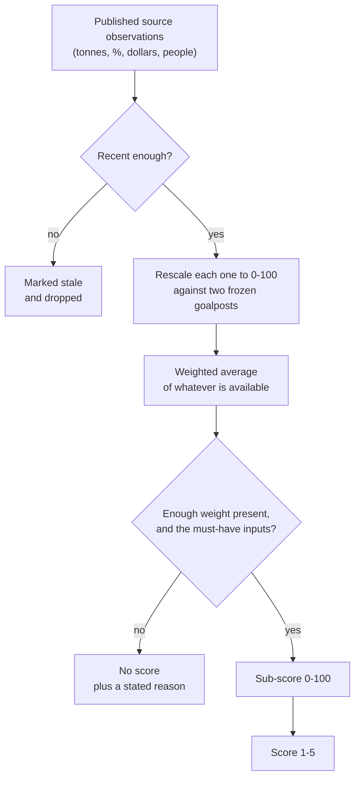

_Methodology maintained by [Elie Habib](https://www.worldmonitor.app/blog/authors/elie-habib/), founder of World Monitor. Published revisions are recorded in the [corrections log](/corrections)._

## Start here

The five-factor scorecard asks five blunt questions about a country, and answers
each one with a number from 1 to 5:

1. **Food** — can it feed itself?
2. **Energy** — can it supply its own energy?
3. **Demographics** — does it have the people, skills, and workforce to sustain itself?
4. **Technology** — can it develop and use technology?
5. **Defense** — can it defend itself?

A **1** means a severe structural deficit. A **5** means the country is largely
self-sufficient on that factor. Nothing else about the number is complicated.

The point is to answer, in one screen, the question analysts usually spend a
week assembling from a dozen datasets: *if this country were cut off, what
would break first?*

<Note>
The scorecard describes **structure**, not **events**. It changes on the scale of
years, because the underlying data — harvests, energy balances, census age
structures, defense budgets — is published annually. For fast-moving risk, use
the [Composite Instability Index](/methodology/cii-risk-scores) instead.
</Note>

## How to read a score

Each score is **absolute**, not a ranking. A 4 for Japan and a 4 for Brazil mean
the same thing about self-sufficiency; they are not "4th place." A country can
score 5 on every factor, or 1 on every factor, and both are legitimate outcomes.
Nothing is graded on a curve.

| Score | Label | What it means in practice |
|---:|---|---|
| 1 | `severe-deficit` | The country cannot cover this need on its own. Disruption bites almost immediately. |
| 2 | `material-deficit` | A real gap, closed by imports or partners. Vulnerable to a supplier shock. |
| 3 | `mixed-capability` | Covers much of the need domestically, with important holes. |
| 4 | `strong-capability` | Broadly self-sufficient. Gaps exist but are manageable. |
| 5 | `high-capability` | Structurally self-sufficient, often with surplus to export. |

Alongside the 1-5 score, every factor also reports a **sub-score from 0 to 100**.
Use the 1-5 score to compare countries at a glance; use the sub-score when you
need to see movement *inside* a band — the difference between a country sitting
at 61 (a shaky 4) and one sitting at 79 (nearly a 5).

### A worked reading

Suppose a country returns:

- Food **4** (sub-score 68.8)
- Energy **2** (sub-score 31.0)
- Demographics **3**
- Technology **4**
- Defense **2**

The plain reading: this country grows more food than it eats and holds decent
reserves, but it buys most of its energy abroad and depends on foreign suppliers
for military equipment. A blockade or a sanctions regime would hurt it through
fuel and weapons long before it hurt anyone's dinner plate.

### What the scorecard is *not*

- **Not a quality-of-life or "good country" index.** A wealthy, safe, deeply
  interdependent country can score low. Self-sufficiency and desirability are
  different things.
- **Not a forecast.** It says what capacity exists today, not what will happen.
- **Not the [Composite Instability Index (CII)](/methodology/cii-risk-scores)**,
  which measures near-term instability risk, and **not the
  [Country Resilience Index (CRI)](/methodology/country-resilience-index)**,
  which measures recovery capacity. The three are independent and are not
  substitutes for one another.
- **Not editorial.** Every number traces back to a named public source
  observation with a year attached, which the API returns alongside the score.

## How a score gets built

Every factor is built the same way, in four steps.



**Step 1 — collect the observations.** For each factor, the scorer pulls a small
set of published indicators. Food, for example, uses calorie production,
calorie consumption, ending stocks, water stress, and import concentration.

**Step 2 — put every indicator on the same 0-100 ruler.** Raw indicators arrive
in incompatible units — tonnes, percentages, dollars, people. Each one is
converted onto a common 0-100 scale using two fixed reference points, called
*goalposts*: a value that scores 0 and a value that scores 100. Anything at or
beyond a goalpost is clamped to that end.

For example, the food-balance goalposts are `0.50 -> 0` and `1.25 -> 100`. A
country producing half the calories it consumes scores 0; one producing 25%
more than it consumes scores 100; one producing exactly as much as it consumes
lands at 67. The goalposts are frozen as part of the published methodology, so
last year's score and this year's score are measured against the same ruler.

**Step 3 — take a weighted average.** Indicators are not equally important.
Within Food, the production-versus-consumption balance carries 55% of the
weight, while import diversity carries 5%. The weighted average of the
component scores becomes the factor's 0-100 sub-score.

**Step 4 — convert to a 1-5 score.** The sub-score is mapped to a band using
fixed cutoffs. The lower boundary is inclusive, so exactly 40.0 is a 3.

| Sub-score | Score | Label |
|---|---:|---|
| `0 <= x < 20` | 1 | `severe-deficit` |
| `20 <= x < 40` | 2 | `material-deficit` |
| `40 <= x < 60` | 3 | `mixed-capability` |
| `60 <= x < 80` | 4 | `strong-capability` |
| `80 <= x <= 100` | 5 | `high-capability` |

### Worked example: one country's food score

Take a country with these four published observations.

| Indicator | Observed value | Goalposts | Component score | Weight | Contribution |
|---|---:|---|---:|---:|---:|
| Calorie production / consumption | 1.05 | `0.50 -> 0`, `1.25 -> 100` | 73.33 | 0.55 | 40.33 |
| Calorie ending stocks / total use | 0.15 | `0.05 -> 0`, `0.25 -> 100` | 50.00 | 0.25 | 12.50 |
| Water security (water stress) | 25% | `100 -> 0`, `10 -> 100` | 83.33 | 0.15 | 12.50 |
| Import partner diversity (HHI) | 0.30 | `0.65 -> 0`, `0.15 -> 100` | 70.00 | 0.05 | 3.50 |

All four indicators are present, so coverage is `1.00` and the contributions
simply add up:

```text
sub-score = 40.33 + 12.50 + 12.50 + 3.50 = 68.83
score     = 4  (because 60 <= 68.83 < 80)
```

Read as prose: the country grows about 5% more calories than it eats, holds
roughly two months of buffer stock, has moderate water stress, and spreads its
food imports across enough partners that no single supplier can squeeze it.
**Strong capability, with room to improve on buffers.**

## Why a factor sometimes has no score at all

Sometimes a factor comes back empty instead of low. That is deliberate, and the
distinction matters: **a missing score is not a bad score.**

The scorer never invents a placeholder for a missing indicator. It does not
substitute a neutral 50, and it does not treat "we have no data" as zero
capability — doing either would quietly turn a data gap into a false finding
about a real country.

Instead, each factor has a **coverage floor**: a minimum share of its indicator
weight that must actually be present, plus a short list of indicators it cannot
do without. Food, for instance, needs 70% of its weight available *and* must
have the production-versus-consumption balance. If a country clears the bar, the
factor is scored using only the indicators that are present, with the weights
rescaled across them. If it does not clear the bar, the factor reports no score
and says why.

<Warning>
**Never read a missing score as a zero.** Over the API, unscored factors come
back with `hasScore: false` and numeric fields set to `0` — those zeros are
protocol placeholders for "no data," not measurements. Always check `hasScore`
before reading `score` or `subScore`. See [Reading the API response](#reading-the-api-response).
</Warning>

Every unscored factor names its reason from this closed set:

| Reason | In plain English |
|---|---|
| `source-unavailable` | The upstream dataset could not be read at all. |
| `country-unavailable` | The dataset is healthy but has no entry for this country. |
| `invalid-value` | The published figure is impossible or out of range. |
| `stale` | The most recent figure is older than this indicator's age limit. |
| `coverage-below-floor` | Too few indicators were available to score the factor honestly. |
| `required-group-missing` | An indicator the factor cannot do without is missing. |
| `missing-population` | A population-weighted calculation had no population figure. |
| `redistribution-blocked` | The source licence forbids republishing this evidence. |

## How current the data is

Each indicator carries a maximum age, because a 12-year-old energy balance is
not evidence about today. The boundary year is inclusive.

| Maximum age | Indicators |
|---:|---|
| 3 years | Population, food balance, food stocks, age structure |
| 4 years | Physical energy balance |
| 5 years | Low-carbon generation, trade diversity, workforce, defense |
| 7 years | All other annual indicators |

An observation past its limit is marked `stale` and drops out of the score
rather than dragging it. If a source's own content-age envelope expires, every
indicator it feeds goes stale too, even when the stored values are still
readable.

The scorecard also refuses to publish a thin day. A fresh daily cohort replaces
the previous one only when it covers at least 180 countries with a scoreable
factor and 150 with usable population evidence, and clears these per-factor
country counts: food 80, energy 120, demographics 150, technology 110,
defense 30. These floors came from an audit of 196 countries against production
sources, with headroom for normal coverage wobble. The pre-activation
production refresh measured 116 scoreable technology countries, so that floor
was corrected to 110 — a six-country outage margin — without loosening any
country's evidence, scoring, freshness, or null rules. A partial source outage
therefore cannot overwrite a richer snapshot with a poorer one — the previous
good cohort simply stays live.

## The five factors in detail

Each factor below lists the indicators it uses, how much each one counts, the
0-100 goalposts, and how the score is aggregated when you ask for a bloc rather
than a single country.

### Food

**The question:** can the country cover the calories it consumes from its own
production and stored reserves, without being at the mercy of one supplier?

Food combines a physical calorie balance with buffer stocks, water stress, and
import concentration. Commodity quantities published in thousand metric tonnes
are converted to trillion kcal as
`thousand metric tonnes * kcal/kg / 1,000,000` using a frozen commodity
conversion table before anything is aggregated.

| Component | Weight | Direction and goalposts | Input source |
|---|---:|---|---|
| Calorie production / consumption | 0.55 | higher; `0.50 -> 0`, `1.25 -> 100` | USDA PSD / FAOSTAT Food Balances |
| Calorie ending stocks / total use | 0.25 | higher; `0.05 -> 0`, `0.25 -> 100` | USDA PSD |
| Water security | 0.15 | lower stress; `100 -> 0`, `10 -> 100` | World Bank AQUASTAT static evidence |
| Import partner diversity proxy | 0.05 | lower HHI; `0.65 -> 0`, `0.15 -> 100` | UN Comtrade import HHI |

Coverage floor: **0.70**. Calorie production / consumption is required.

- **Score 1:** production is near or below half of use and buffers are weak.
- **Score 3:** domestic output covers much, but not all, use — or buffers are mixed.
- **Score 5:** output materially exceeds use and stock buffers are strong.

**For blocs:** production and consumption are summed across members before their
ratio is scored, and ending stocks and total use are summed the same way — the
bloc is treated as one physical system. Water and import diversity are
population-weighted across the members that have evidence.

### Energy

**The question:** does the country produce the primary energy it burns, and is
the system that delivers it sound?

Consumption comes from OWID `primary_energy_consumption`. Production is derived
from the audited net-energy-imports observation already carried by the
resilience static source, Eurostat `nrg_ind_id` for covered European countries
and World Bank `EG.IMP.CONS.ZS` elsewhere:

```text
production TWh = consumption TWh * (1 - net imports percent / 100)
```

Both providers are audited for raw redistribution, so the `netEnergyImportsPercent`
observation carries the provenance of whichever one supplied it.

| Component | Weight | Direction and goalposts | Input source |
|---|---:|---|---|
| Primary production / consumption | 0.60 | higher; `0.25 -> 0`, `1.25 -> 100` | OWID plus World Bank or Eurostat |
| Low-carbon generation share | 0.25 | higher; `0% -> 0`, `80% -> 100` | resilience low-carbon generation |
| Grid delivery efficiency | 0.15 | lower losses; `25% -> 0`, `3% -> 100` | resilience power losses |

Coverage floor: **0.60**. Primary production / consumption is required.

- **Score 1:** production covers little of use.
- **Score 3:** the balance is mixed and imports remain material.
- **Score 5:** energy self-sufficient or a net producer, with strong supporting
  power-system evidence.

**For blocs:** production and consumption TWh are summed before scoring.
Low-carbon share and grid efficiency are population-weighted across members with
evidence.

### Demographics

**The question:** does the country have enough working-age people, and are they
educated and trained enough to run a modern economy?

This factor deliberately mixes *how many* people are available to work with
*what they can do* — a favorable age pyramid with no engineers is not capability,
and neither is a deep university system attached to a collapsing workforce.
Inputs come from `demographics:capability:v1`.

| Component | Weight | Direction and goalposts |
|---|---:|---|
| Total dependency ratio | 0.15 | lower; `100 -> 0`, `35 -> 100` |
| Old-age dependency ratio | 0.10 | lower; `50 -> 0`, `10 -> 100` |
| Working-age population, 10-year ratio | 0.20 | higher; `0.80 -> 0`, `1.10 -> 100` |
| Tertiary enrollment | 0.15 | higher; `20% -> 0`, `90% -> 100` |
| Researchers per million | 0.10 | higher; `100 -> 0`, `5,000 -> 100` |
| STEM graduate share | 0.10 | higher; `10% -> 0`, `40% -> 100` |
| Trained industrial occupation share | 0.15 | higher; `2% -> 0`, `25% -> 100` |
| Manufacturing employment share | 0.05 | higher; `5% -> 0`, `25% -> 100` |

Coverage floor: **0.60**. At least one age-structure input and one education,
research, or workforce input are required.

- **Score 1:** severe dependency or contraction, with little capability evidence.
- **Score 3:** mixed age structure and human-capability depth.
- **Score 5:** favorable labor supply plus deep education, research, and
  industrial workforce capacity.

**For blocs:** the population-weighted mean of member sub-scores. It never
averages the 1-5 scores — averaging bands would let a tiny member swing the
result as hard as a large one.

### Technology

**The question:** is the country connected, and does it generate its own
technology rather than only consuming it?

The existing technology-readiness score, rank, and components are unchanged;
v1 adds the raw observations needed to show and reproduce this scorecard.

| Component | Weight | Direction and goalposts | Input source |
|---|---:|---|---|
| Internet use | 0.20 | higher; `20% -> 0`, `95% -> 100` | `IT.NET.USER.ZS` |
| Mobile subscriptions | 0.10 | higher; `50 -> 0`, `150 -> 100` per 100 people | `IT.CEL.SETS.P2` |
| Fixed broadband | 0.15 | higher; `0 -> 0`, `45 -> 100` per 100 people | `IT.NET.BBND.P2` |
| Research and development spend | 0.25 | higher; `0.2% -> 0`, `4% -> 100` | `GB.XPD.RSDV.GD.ZS` |
| Researchers per million | 0.15 | higher; `100 -> 0`, `5,000 -> 100` | demographics capability |
| STEM graduate share | 0.10 | higher; `10% -> 0`, `40% -> 100` | demographics capability |
| Electricity access | 0.05 | higher; `50% -> 0`, `100% -> 100` | resilience static evidence |

Coverage floor: **0.65**. At least one connectivity input and one innovation
input are required.

- **Score 1:** limited digital access and little measured innovation capacity.
- **Score 3:** broad use *or* research capacity, but material gaps remain.
- **Score 5:** high connectivity plus deep and sustained innovation capability.

**For blocs:** the population-weighted mean of member sub-scores.

### Defense

**The question:** can the country sustain a military — and equip it without
depending on someone else's factories?

Note the heaviest weight sits on the arms-transfer balance rather than on
spending. A large budget spent entirely on imported equipment is a weaker
structural position than a smaller budget backed by domestic production, and
the weighting says so. World Bank defense observations come from
`military:industrial-base:v1`.

| Component | Weight | Direction and goalposts |
|---|---:|---|
| Military expenditure, USD | 0.20 | higher, log scale; `$100m -> 0`, `$100bn -> 100` |
| Military expenditure, % GDP | 0.15 | higher; `0.5% -> 0`, `5% -> 100` |
| Armed forces personnel | 0.15 | higher, log scale; `10,000 -> 0`, `1,000,000 -> 100` |
| Arms export share of transfers | 0.30 | higher; `0 -> 0`, `1 -> 100`; same-year exports / (exports + imports) |
| Supplier diversity | 0.20 | lower HHI; `0.65 -> 0`, `0.15 -> 100` |

Coverage floor: **0.50**. At least one posture input (spending or personnel) and
the arms-transfer industrial-balance input are required.

- **Score 1:** small posture with high external equipment dependence.
- **Score 3:** material posture *or* industrial capability, with important gaps.
- **Score 5:** large sustained posture and strong domestic and export industrial
  depth.

The industrial balance is only computed when exports and imports are both
explicit, finite observations from the same year. A missing side is never
coerced to zero; an explicit measured zero remains valid.

<Info>
**Supplier diversity is currently unavailable for every country.** SIPRI raw
transfer rows are not stored or returned, and until the source policy permits
public use of the already derived supplier HHI, that component reports
`redistribution-blocked`. Defense scores are therefore computed from the
remaining 0.80 of weight.
</Info>

**For blocs:** the population-weighted mean of member sub-scores, with supplier
diversity still unavailable while the policy block applies.

## Scoring a bloc instead of a country

You can score a group of countries as a single unit — the EU as one energy
system, BRICS as one food system.

Six presets ship as part of the versioned methodology: `USMCA`, `EU27`,
`BRICS`, `GCC`, `ASEAN`, and `NATO`. Custom blocs take 2-30 unique uppercase
ISO-2 codes from the public rankable universe. A request selects exactly one
preset *or* one custom member list. Presets themselves may exceed 30 members.

Two aggregation rules are used, and the difference is deliberate:

- **Food and energy are aggregated physically, then scored.** Tonnes and
  terawatt-hours are summed across members first, because a bloc really does
  share one physical balance sheet.
- **Demographics, technology, and defense are population-weighted continuous
  scores.** These are per-capita capabilities that cannot be summed, so member
  sub-scores are averaged by population.

**No bloc formula ever averages the 1-5 scores.** Each bloc factor reports its
aggregation method, its included and excluded members, population coverage where
applicable, and the evidence used.

Preset membership was verified on 2026-08-29 against the official
[EU country list](https://european-union.europa.eu/principles-countries-history/eu-countries_en),
[BRICS member list](https://brics.br/en/about-the-brics),
[ASEAN member list](https://asean.org/member-states/), and
[NATO member-country history](https://www.nato.int/cps/en/natohq/nato_countries.htm).
The ASEAN preset includes Timor-Leste and the BRICS preset uses the official
11-member list. Membership changes require a methodology changelog entry.

## For developers

### Access

All three scorecard RPCs — `GetFiveFactorScorecard`, `GetBlocScorecard`, and
`ListFiveFactorScorecards` — require a Pro subscription (tier 1), as do the MCP
tools `get_five_factor_scorecard` and `list_five_factor_scorecards`. See
[Pro Intelligence Suite](/pro-intelligence-suite) for request shapes.

### Reading the API response

Each factor returns four fields that are easy to confuse:

| Field | Type | Meaning |
|---|---|---|
| `hasScore` | bool | Read this first. When `false`, the factor was not scored. |
| `score` | int32 | The 1-5 score. `0` when `hasScore` is `false`. |
| `subScore` | double | The 0-100 sub-score, rounded to 2 decimals. `0` when `hasScore` is `false`. |
| `band` | string | The label for `score`: `severe-deficit`, `material-deficit`, `mixed-capability`, `strong-capability`, or `high-capability`. Empty when `hasScore` is `false`. |

`inputCoverage` reports the share of indicator weight that was available,
from 0 to 1, rounded to 4 decimals.

<Warning>
Protobuf JSON keeps numeric fields present as zero, so an unscored factor is
indistinguishable from a genuine zero unless you branch on `hasScore` first.
Those zeros are insufficient-data placeholders, not measured zero capability.
</Warning>

### Do not re-derive the score from the sub-score

`score` is derived from the **unrounded** continuous value; `subScore` is that
same value rounded to two decimals. Near a band boundary the two can legitimately
disagree. A continuous value of `19.996` publishes as:

```json
{ "hasScore": true, "score": 1, "subScore": 20, "band": "severe-deficit" }
```

That is correct, not a bug. Always use the published `score` and `band`; never
recompute a band from `subScore`.

### Evidence records

Every indicator returns a tagged available/unavailable record. Available
evidence carries the input ID, value, year, unit, source, and source key. A
retained last-good upstream observation stays available and is marked
`quality=retained`.

### Version contract

- **Methodology:** `1.0.0`
- **Input registry:** `1.0.0`
- **Stored schema:** `1`
- **Canonical snapshot:** `scorecard:five-factor:v1`
- **Atomic read model:** `scorecard:five-factor:v1:read-model`
- **Seed health:** `seed-meta:scorecard:five-factor`

Every result carries its methodology version and computation time. Changing a
weight, goalpost, band cutoff, coverage floor, required group, aggregation rule,
or input mapping requires a methodology version bump and a changelog entry. A
change to the stored shape also requires a schema version bump. Health publishes
the population count and the five per-factor counts separately.

## Changelog

### 1.0.0 - 2026-08-29

- Initial five-factor methodology.
- Frozen absolute bands, goalposts, weights, coverage floors, required groups,
  aggregation rules, unavailable reasons, and rounding rules.
- Added source-safe evidence provenance and an explicit SIPRI redistribution
  block.
- Defined current preset and custom bloc validation contracts.
- Froze per-input evidence ages and per-factor publication floors; stale or
  coverage-collapsed cohorts preserve the prior last-good snapshot.
