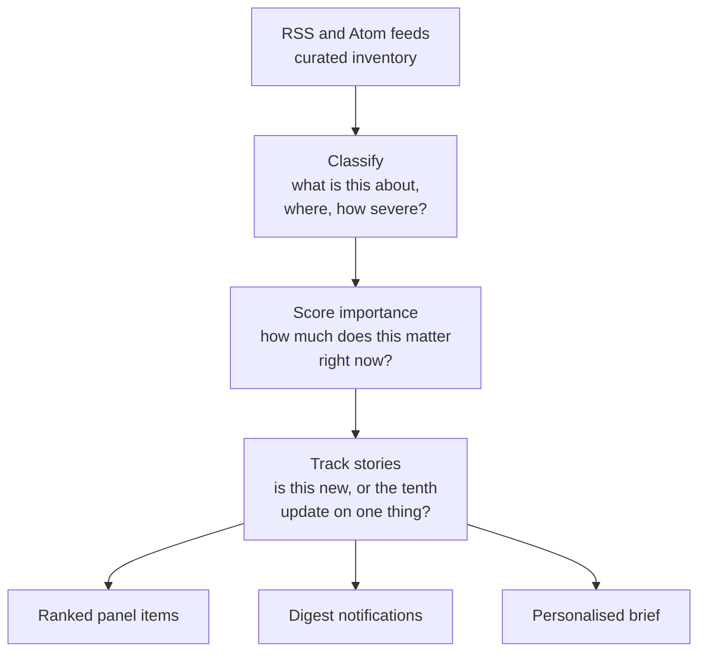

_Methodology maintained by [Elie Habib](https://www.worldmonitor.app/blog/authors/elie-habib/), founder of World Monitor. Published revisions are recorded in the [corrections log](/corrections)._

## Start here

Thousands of headlines arrive every day. This is the machinery that decides
which ones you see, in what order, and what gets written into your morning
brief.

There are four stages, and they answer four different questions:

**Story tracking is the part people underestimate.** Without it a single
developing event floods the panel with twenty near-identical headlines and
buries everything else. Grouping headlines into a persistent story means a major
event occupies one slot that updates, rather than crowding out the rest of the
world.

### Two numbers, deliberately kept apart

Every headline carries an **importance** score (how much this matters now) and a
separate **credibility** score (how much to trust this source on this story). A
state outlet can rank high on the first and low on the second at the same time.
See [News credibility](/methodology/news-credibility) for how the second is
built.

### Where AI is used, and where it is not

Language models act as **bounded editorial assistants, never the source of
record**. They write the brief's prose and can adjust a story's category or
severity — but only within hard caps that stop a model from unilaterally
promoting something to critical.

What they are never allowed to do is invent provenance. Publishers, article
URLs, and publication times come from the structured feed, never from the model.
Brief prose must pass a proper-noun grounding check against its input headlines;
output that fails falls back to a deterministic synthesis. Every LLM step has
such a fallback, so a model outage degrades the brief rather than breaking it —
or worse, filling it in.

<Note>
**No human review queue.** Quality comes from source curation, date gates,
classifier caps, published score formulae, read-path filters, cooldown
telemetry, and those LLM fallback guards — not from an editor approving items.
Every one of those mechanisms is documented on this page.
</Note>

## Scope

This page is the canonical public methodology for the news-feed digest,
daily digest notifications, and WorldMonitor Brief. It covers the automated
pipeline that turns RSS/Atom feeds into ranked panel items, persisted story
tracks, digest notifications, and the personalised editorial brief.

## Feed Inventory

Feed inventory lives in `server/worldmonitor/news/v1/_feeds.ts`.
The accepted digest variants are:

| Variant | Purpose |
| --- | --- |
| `full` | Global geopolitical, regional, government, intelligence, climate, finance, and topical feeds. |
| `tech` | Startup, AI, security, cloud, hardware, developer, funding, policy, and tech-market streams. |
| `finance` | Market, policy, derivatives, forex, crypto, central-bank, and institutional streams. |
| `happy` | Constructive-news streams for conservation, science, philanthropy, progress, events, and positive public action. |
| `commodity` | Commodity, mining, energy, shipping, agriculture, metals, and policy streams. |

`energy` is a site and client-feed variant (`energy.worldmonitor.app`), but it
is not a separate server digest variant yet: `listFeedDigest` accepts only the
variants above and normalises any other request, including `variant=energy`, to
`full`. Energy panels still have client-side feed inventory for energy
headlines, energy markets, and chokepoints/routes; categories absent from the
server digest use the direct per-feed fallback path instead of a dedicated
`news:digest:v1:energy:{lang}` cache key.

Each feed entry carries a display name, URL, and optional language tag.
Language-scoped feeds are included only when the request language matches.
For the `full` variant, the build also adds the `INTEL_SOURCES` feed set under
the `intel` category.

The fetch path tries the publisher URL directly first. Every direct request
sends `User-Agent`, RSS/XML `Accept`, and English `Accept-Language` headers.
If the direct response is absent, non-OK, or looks like HTML rather than
RSS/Atom/RDF, the system tries the Railway relay at `/rss?url=...`. The relay
path uses relay auth headers and applies the same RSS-shape sniffing, so a
Cloudflare page or captcha body does not get cached as an empty feed.

Fetch observability logs whether a cache miss was satisfied by `direct`,
`relay`, or `both-failed`, along with relay status and body shape. Healthy
parsed feeds are cached for 3600 seconds; zero-from-zero or failed parses are
cached for 300 seconds so transient blocks recover quickly.

## RSS And Freshness

The parser accepts RSS `<item>` and Atom `<entry>` blocks. It reads at most
`5` items per feed before applying downstream category caps.

Date extraction is strict. RSS-style items try `pubDate`, `dc:date`,
`dc:Date.Issued`, then `published`; Atom-style entries try `published`,
`updated`, `dc:date`, then `dc:Date.Issued`. A feed item without a parseable
date is dropped. A future timestamp more than 1 hour ahead of the server clock
is also dropped.

After parsing, the digest applies a hard freshness floor. The default
`NEWS_MAX_AGE_HOURS` is `96`; invalid, unset, or non-positive values fall back
to 96 hours. This floor drops stale items before corroboration counting so an
old copy cannot inflate a fresh cluster. The recency score remains separate:
it contributes over a 24-hour curve and reaches zero after 24 hours.

The `feed_statuses` response map emits only non-OK feed states:

| Status | Meaning |
| --- | --- |
| `empty` | The feed completed but produced no kept items. |
| `timeout` | The feed did not complete before the build deadline. |
| `all-undated` | Items were found, but every parsed item was dropped for missing, unparseable, or future dates. |
| `partial-undated` | Some parsed items were kept and some were dropped for date problems. |

Absent feed-status keys imply OK.

## Classification

Every parsed item starts with the keyword classifier in
`server/worldmonitor/news/v1/_classifier.ts`.

The classifier emits a threat level, event category, confidence, and source
tag. Levels are `critical`, `high`, `medium`, `low`, and `info`. Event
categories include conflict, protest, disaster, diplomatic, economic,
terrorism, cyber, health, environmental, military, crime, infrastructure,
tech, and general. The `tech` variant has additional tech-specific keyword
sets so technology incidents are not forced through the geopolitical keyword
profile.

Critical and high keyword matches are checked for historical-retrospective
markers. Examples include anchored "Science history", "Throwback", "Flashback",
"On this day in YYYY", "This day in history", anniversary language, and full
dates at least two years in the past. If a critical/high keyword match has a
historical marker, it is downgraded to `info` and tagged
`keyword-historical-downgrade`.

Before severity keywords run, the classifier applies a consumer/lifestyle
exclusion list. If the lower-cased title contains any of these substrings,
the story is forced to `info` / `general` with low confidence:
`protein`, `couples`, `relationship`, `dating`, `diet`, `fitness`, `recipe`,
`cooking`, `shopping`, `fashion`, `celebrity`, `movie`, `tv show`, `sports`,
`game`, `concert`, `festival`, `wedding`, `vacation`, `travel tips`,
`life hack`, `self-care`, and `wellness`. These are substring matches, not
word-boundary keyword matches, because the goal is to suppress broad lifestyle
and entertainment false positives before words such as "war", "ban", or
"virus" can promote them.

The digest can enrich items from the LLM classify cache. Cached LLM results
are bounded by three controls:

- Historical-marker guard: any historical-looking title is kept at `info`.
- High-confidence critical skip: keyword-classified critical items do not need
  an LLM cache upgrade.
- Upgrade cap: the LLM can raise severity by at most `+2` levels above the
  keyword result. `info` can rise only to `medium`; `low` can rise only to
  `high`; `medium` can rise to `critical`; `high` can rise to `critical`.

LLM downgrades pass through. When an upgrade is capped, the system logs the
keyword level, LLM level, applied level, and a title sample for audit.

## Importance Score

`importanceScore` is computed after keyword/LLM classification, freshness
filtering, exact-title corroboration, and entity-level corroboration. The
base score uses these weights:

| Component | Weight |
| --- | --- |
| Severity | `0.55` |
| Source tier | `0.20` |
| Corroboration | `0.15` |
| Recency | `0.10` |

Severity maps to:

| Level | Score |
| --- | --- |
| `critical` | `100` |
| `high` | `75` |
| `medium` | `50` |
| `low` | `25` |
| `info` | `0` |

Source tier maps to 100 for Tier 1, 75 for Tier 2, 50 for Tier 3, and 25 for
Tier 4. The canonical tier table is `shared/source-tiers.json`, imported by
`server/_shared/source-tiers.ts` and mirrored for the relay. Provenance is the
feed name: if a feed is absent from the table, it defaults to Tier 4.

Exact-title corroboration counts unique sources per normalised-title hash.
Corroboration score is capped at five sources, with 20 points per source before
the `0.15` weight.

Entity-level corroboration is separate from exact-title corroboration. For
fresh stories in the last 24 hours, diplomacy/flashpoint terms are bucketed by
entity-action pairs or a generic diplomacy-flashpoint key. When at least two
sources hit the same entity-level bucket, each matching story receives an
`entityCorroborationCount`. The scoring path uses the larger of exact-title
and entity-level corroboration, and adds a direct entity boost of `4` points
per entity-level source, capped at five sources.

Diplomacy/flashpoint stories get an additional `18` point boost when the title
contains a configured entity-action pair or a diplomacy keyword plus a
flashpoint keyword. Any non-`critical`, non-`high` item, including `info`, can
also be promoted to `high` when it is not historical, has a
diplomacy/flashpoint signal, and has at least `3` Tier 1 or Tier 2
entity-level sources.

Within each category, items sort by `importanceScore` descending, then
publication time descending. The feed digest returns at most `20` items per
category.

## Credibility Score

`credibilityScore` is a separate 0-100 field on the same `NewsItem`. It does
not replace `importanceScore`. It measures source reliability, not
newsworthiness, so a highly newsworthy RT story can score high on importance
and low on credibility.

The canonical public methodology is
[News Credibility Score](/methodology/news-credibility). The digest computes
it in `shared/news-credibility.js` after the same classification and
corroboration pass:

| Component | Weight |
| --- | --- |
| Propaganda risk | `0.50` |
| Source tier | `0.30` |
| Independent corroboration | `0.20` |

High propaganda-risk sources (state-controlled media) are capped at `40`.
Unreviewed sources use propaganda risk `unknown` (`35`), never `low`.
Severity, recency, and the diplomacy/flashpoint boost are **not** inputs.
Third-party AllSides/MBFC ratings are reserved and not applied.

The news list renders a `CRED NN` badge on both the flat list and clustered
cards. MCP `get_news_intelligence` and `get_news_clusters` expose the same
field. Relevance sort remains `importanceScore`.

## Story Tracking

The digest persists sliced stories to Redis so later digest notifications and
briefs can read the same story pool.

| Key | Type | Purpose | TTL |
| --- | --- | --- | --- |
| `story:track:v1:{titleHash}` | Hash | Current story metadata and classifier stamps. | 7 days |
| `story:sources:v1:{titleHash}` | Set | Feed names that mentioned the story. | 7 days |
| `story:peak:v1:{titleHash}` | ZSet | Single `peak` member holding the highest score seen. | 7 days |
| `digest:accumulator:v1:{variant}:{lang}` | ZSet | Story hashes by last-seen time for digest windows. | 48 hours |

The story-track hash fields written today are:

`firstSeen`, `lastSeen`, `mentionCount`, `currentScore`, `title`, `link`,
`severity`, `lang`, `description`, `publishedAt`,
`entityCorroborationCount`, `isOpinion`, `isFeelGood`,
`isEphemeralLiveCoverage`, `category`, and `anchorEligible`.

`anchorEligible` is `1` only when the mention has a curated tier-1/2 source
or corroboration from at least two independent publisher families. Canonical
adoption ignores rows with `0` or missing legacy metadata.

Corroboration uses the server-configured feed label by default. An RSS
`<source>` name can replace that label only for an explicitly configured
trusted aggregator (currently Google News); ordinary feed content cannot
manufacture publisher families. Redis tracking writes use pipelines of at most
1,000 commands. Alias rows are committed separately, one complete canonical
group per fenced atomic transaction; an oversized group is deferred so readers
never observe a partial alias cohort. A short Redis lease and an in-transaction
token check prevent an older delayed digest from overwriting a newer cohort.

`sourceCount` is not stored in the story-track hash for current rows.
Distinct feed names are written to `story:sources:v1:{titleHash}` with
`SADD`; consumers that need the real source count must read the set and count
it with `SCARD` or equivalent set cardinality. `peakScore` is likewise a
reserved read-path placeholder in the story-track hash; the live peak score is
kept in the `story:peak:v1:{titleHash}` ZSet.

The title hash is a SHA-256 hash of a normalised title: lowercased, stripped
of common publisher suffixes, stripped to Unicode letters/numbers/spaces,
collapsed whitespace, and clipped to 120 characters.

Story phase is derived from first seen time and mention count:

| Phase | Rule |
| --- | --- |
| `breaking` | Mention count is 1. |
| `developing` | Mention count is 2-5 and the story is under 2 hours old. |
| `sustained` | Fallback for ongoing tracked stories. |
| `fading` | Reserved. The feed API does not emit this phase. |

The feed API does not emit `fading`. The wire enum keeps the value, and clients
must continue to handle it, but no digest response sets it.

Issue #7081 tested the rule that this phase used to promise. That rule marked a
story as fading when its current importance score fell below half of its peak
score. The test used frozen production evidence and gave a no-go result. There
were three reasons:

1. The rule could not run. It read `peakScore` from the `story:track:v1` hash,
   but the peak is written to the `story:peak:v1` sorted set. The hash field has
   no writer, so it was absent on all 14,000 sampled rows. An earlier version of
   this page said that the writer stores zero placeholders for both scores. That
   was correct for `peakScore` only. `currentScore` is written on each cycle and
   was above zero on all 14,000 rows.
2. The ratio measures article age, not traction. Importance score gives severity
   a weight of 55% and recency a weight of 10%. A critical or high story cannot
   fall to half of its peak unless its severity changes. An info story falls
   below half on the recency term alone when its article becomes more than 24
   hours old. In the sampled rows the rule fired 673 times. 670 of those rows
   were info or low severity. None of the 679 critical or high rows fired.
3. Fading cannot be seen at that point in the build. The phase is derived only
   for stories that appear in the current cycle, and the record passed to the
   deriver has a last-seen time of now. A story that is no longer covered is
   absent from the cycle, so it never reaches the deriver.

The notification cron has its own read-path phase helper for digest delivery. It
reads the accumulator, so it can see stories that are absent from the current
cycle. There, a story with more than 24 hours of silence is treated as `fading`
and dropped from the delayed digest/brief pool. That helper is internal. Its
`fading` result does not reach the feed API response.

The frozen evidence is in `tests/fixtures/story-phase-fading-study.json`. Run
`node scripts/study-story-phase-fading.mjs` to replay it.

## Digest And Brief Read Path

The digest notification cron reads `digest:accumulator:v1:{variant}:{lang}` for
the user's digest window, then batch-reads story-track hashes.

The read-time freshness floor is anchored to the user's own digest window and
has a 24-hour buffer. Daily users have a 48-hour effective cutoff; weekly users
have an 8-day effective cutoff. Legacy rows without `publishedAt` are kept for
backward compatibility, but current rows with stale source publication times
are dropped.

The cron excludes rows that are not event-driven intelligence:

- Opinion and analysis columns, using the ingest stamp or a residue
  re-classification from title/link/description.
- Feel-good and lifestyle stories, using the ingest stamp or residue
  re-classification.
- Ephemeral live-programming teasers such as "WATCH LIVE" or live briefing
  previews. These can remain acceptable in a live panel, but not in a delayed
  daily brief.
- Institutional static pages on sensitive government, military, and
  international-organisation domains as a defense-in-depth URL/path filter.
- Fading stories and stories below the user's sensitivity threshold.

Stories are sorted by `currentScore`, then deduplicated. The default deduper is
embedding-based (`DIGEST_DEDUP_MODE=embed`) with single-link clustering,
entity veto on, cosine threshold `0.60`, and a `45000` ms wall-clock budget.
`DIGEST_DEDUP_MODE=jaccard` is the instant rollback. If the embedding path
throws because a provider, key, timeout, or response shape failed, the whole
batch falls back to Jaccard. The Jaccard fallback merges clusters when title
word overlap is greater than `0.55`; that threshold is intentionally not
env-tunable. `DIGEST_DEDUP_CLUSTERING=complete` switches the embedding path to
the more conservative complete-link mode, and invalid clustering values also
fall back to complete-link. Topic grouping is enabled by default after dedupe
with threshold `0.45`; `DIGEST_DEDUP_TOPIC_GROUPING=0` disables it.

An optional absolute score floor runs after dedupe. `DIGEST_SCORE_MIN` defaults
to `0`, which means no floor. Positive values drop clusters whose representative
`currentScore` is below the floor.

The digest pool caps at `30` clusters before channel formatting. Severity
formatters cap high stories at `15`, medium stories at `10`, and do not cap
critical stories. The rendered brief uses `MAX_STORIES_PER_USER`, default `12`
and tunable by `DIGEST_MAX_STORIES_PER_USER`. The brief also caps each
source/category pair at `2` stories to reduce editorial clutter.

Topic ordering in the brief is deterministic first: severity, count of stories
at that severity, eligible block size, score, and only then LLM-provided
`rankedStoryHashes`. A narrow override lets a top-ranked, entity-corroborated
diplomacy/flashpoint story lead its topic block.

## Cooldowns

Cooldown is currently a shadow/off system. `DIGEST_COOLDOWN_MODE` accepts:

| Mode | Behavior |
| --- | --- |
| `shadow` | Default. Compute and log cooldown decisions without suppressing sends. |
| `off` | Do not compute a cooldown decision artifact. |

Any unrecognised value, including `enforce`, falls back to `shadow` and
surfaces `invalidRaw` for an operator warning.

The cooldown table is:

| Type | Floor | Bypasses |
| --- | --- | --- |
| `critical-developing` | 4h | +5 sources, new fact, or severity tier change. |
| `critical-sustained` | 24h | Hard floor except a new fact. |
| `high-event` | 18h | +5 sources, new fact, or severity tier change. |
| `high-single-corporate` | 48h | Hard floor except a real escalation. |
| `sanctions-regulatory` | 18h | +5 sources, new fact, or severity tier change. |
| `analysis` | 7d | Hard floor. |
| `med` | 36h | +5 sources, new fact, or severity tier change. |

The evaluator classifies obvious analysis domains, government regulatory
notices, single-corporate earnings headlines, and severity-derived fallbacks.
When a prior delivery exists inside the floor, it can allow on tier change,
headline-based new fact, or source-count evolution depending on the row.

## LLM Usage

LLMs are used as bounded editorial assistants, not as the source of record.

The classify-cache path can update category/severity, but only within the
historical-marker, high-confidence critical, and `+2` upgrade-cap controls
described above.

WorldMonitor Brief uses two LLM surfaces:

- Digest prose (`brief:llm:digest:v9`) produces a JSON lead, thread list,
  signals, and `rankedStoryHashes` from the visible story pool.
- Per-story `whyMatters` uses an analyst endpoint first, then a direct Gemini
  fallback, then the baseline stub if every LLM layer fails.

Both paths are grounded. Prompt inputs are built from story fields that were
already selected by the deterministic pipeline. The digest prose cache key
includes sensitivity, profile hash, greeting bucket, public/private mode, story
hashes, headlines, threat levels, categories, countries, and sources. Cached
and fresh LLM outputs are shape-validated. Digest prose must pass proper-noun
grounding against the input headlines; ungrounded or malformed output falls
through to degraded synthesis or the stub. Every prompt receives a current-date
line so the model should not invent years when the source stories omit dates.

The brief is editorial context, not investment, legal, medical, security, or
travel advice. The LLM instructions prohibit markdown, preamble, questions,
calls to action, and generic editorial filler. The product language should
describe what changed and why it may matter, not tell the reader what to buy,
sell, do, or believe.

## How Brief Sources Are Shown

AI brief source lists are derived from the feed items selected as grounding
inputs. The model is never asked to create URLs, publishers, or publication
times. Web brief surfaces and MCP brief tools attach a bounded `sources` array
from the same selected digest or country-news items used for context. Unsafe or
missing article URLs are dropped instead of rendered.

The source footer is a provenance aid, not sentence-level citation alignment.
Bracket markers such as `[1]` may link into the local source list when the model
uses them, but the authoritative article links still come from the structured
feed data. Cached briefs preserve their structured sources with the cached
summary; older source-free cache entries are discarded before reuse.

The canonical digest prose and direct fallback `whyMatters` paths pin the
provider chain to OpenRouter by skipping Ollama and Groq, so the live brief
uses Gemini 3.5 Flash-Lite (`google/gemini-3.5-flash-lite`) for those surfaces when the
LLM layer is enabled. Digest prose and
story-description calls use temperature `0.4`. Regional weekly briefs
intentionally differ from those digest prose and `whyMatters` surfaces:
`scripts/regional-snapshot/weekly-brief.mjs`
tries OpenRouter first with `deepseek/deepseek-v4-flash`, then the fixed free
OpenRouter models `google/gemma-4-26b-a4b-it:free` and
`minimax/minimax-m3:free`, then Groq `openai/gpt-oss-20b`. It sends every
provider temperature `0.3` because the output is structured weekly JSON for regional snapshots
rather than per-user digest prose. The digest prompt requires a named
actor/event lead, bans generic editorial phrases such as "the global stage"
and weak stitching phrases such as "this comes as" or "meanwhile", requires
substantive linkage before a lead combines two stories, and validates cache
hits and fresh outputs through the same shape, proper-noun grounding,
status-qualifier, and stitching-phrase gates. The stitching-phrase gate
matches stems (`comes as`, `occurs as`, `meanwhile`) rather than the prompt's
exact variants, drops the offending lead sentence, and rejects the digest
when the surviving lead falls under 40 characters. Per-story prompts also
require named actors where possible and can use the RSS description as grounding
context.

## Bias Posture

The system intentionally favours false-positive reduction in the brief path.
Undated items are dropped rather than stamped with server time; historical
anniversary headlines are downgraded; LLM upgrades are capped; opinion,
lifestyle, and live-programming items are excluded from delayed briefs; and
institutional static pages are filtered on the read path. This can create
false negatives when a real event is poorly dated, weakly sourced, or phrased
like a retrospective.

The digest score still favours serious, corroborated, recent, authoritative
events. Source tiering can underweight local outlets and over-represent large
English-language wires. Source concentration is a known risk: multiple articles
from the same editorial ecosystem can look more diverse than they are, while
important local-language reports can arrive late or not at all. Non-English
coverage exists for selected regions, but the classifier keywords and many
LLM grounding heuristics are strongest in English.

Geography is similarly uneven. Regions with many curated feeds and strong
wire coverage will surface more reliably than regions with sparse RSS,
blocked publisher feeds, or weak date metadata.

Followed-country personalisation is a soft within-lane lift. The nominal
`FOLLOWED_BIAS_MULTIPLIER` is `1.25` and is env-tunable between `1` and `2`,
but the live list mechanism is a stable severity-lane sort: a followed-country
story can move ahead of non-followed stories inside the same severity lane, and
never promotes a lower-severity story above a higher-severity one. Free-tier
readers can follow up to `3` countries; PRO readers can keep a larger followed
set. If the followed-country relay is unavailable, the brief falls back to the
unbiased ordering rather than treating the missing list as ground truth.

The `happy` variant is intentionally different from intelligence briefs. It
surfaces constructive and positive-news streams and should not be interpreted
as a global risk brief with negative events removed. In the intelligence brief
path, feel-good and lifestyle items are excluded because the brief is meant to
be event-driven global intelligence.

## Source Files

- Feed inventory and digest build: `server/worldmonitor/news/v1/_feeds.ts`,
  `server/worldmonitor/news/v1/list-feed-digest.ts`
- Keyword classifier: `server/worldmonitor/news/v1/_classifier.ts`
- API contract: `proto/worldmonitor/news/v1/list_feed_digest.proto`
- Digest cron and brief compose: `scripts/seed-digest-notifications.mjs`,
  `scripts/lib/brief-compose.mjs`, `shared/brief-filter.js`
- Dedupe and topic grouping: `scripts/lib/brief-dedup.mjs`,
  `scripts/lib/brief-dedup-jaccard.mjs`,
  `scripts/lib/brief-dedup-embed.mjs`
- Cooldown: `scripts/lib/digest-cooldown-config.mjs`,
  `scripts/lib/digest-cooldown-decision.mjs`
- Relay parity: `scripts/ais-relay.cjs`
- MCP brief surface: `api/mcp/registry/rpc-tools.ts`
