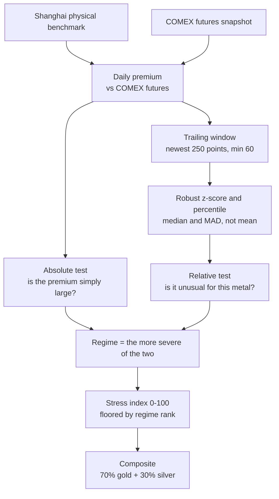

_Methodology maintained by [Elie Habib](https://www.worldmonitor.app/blog/authors/elie-habib/), founder of World Monitor. Published revisions are recorded in the [corrections log](/corrections)._

## Start here

**The idea in one paragraph.** Gold and silver trade in two different worlds:
paper contracts on COMEX in New York, and physical metal in Shanghai. Normally
the two prices track each other closely. When Shanghai starts paying a
noticeable *premium* over the paper price, it means somebody is willing to pay
extra to hold the actual metal rather than a promise of it — and that gap is a
recognized early symptom of physical-market stress.

This index watches that gap for gold and silver, and tells you whether today's
reading is unusual.

### What the output tells you

Each metal gets a **regime** — `normal`, `elevated`, `stressed`, or `extreme` —
and a **stress index** from 0 to 100.

The regime is decided two ways at once, and the more severe answer wins:

- **Absolute:** is the premium simply large? A 3% gold premium is `stressed`
  whatever the history says.
- **Relative:** is the premium unusual *for this metal recently*? A modest
  premium that sits in the top 1% of the last year still counts.

That double test is deliberate. Absolute alone misses a market quietly drifting
away from its own norms; relative alone screams every time a calm period ticks
up by a rounding error. A magnitude floor stops that second failure — a premium
has to be at least half-way to `elevated` before its percentile can promote it
at all.

<Note>
**This is a market-structure indicator, not trading advice.** It describes a
condition in the physical metals market. It does not forecast prices and it is
not a signal to buy or sell anything.
</Note>

### How a reading is produced



The window statistics use the **median and MAD** rather than the mean and
standard deviation, because a single spike would otherwise inflate the yardstick
it is being measured against and hide the very event you care about.

### Why a reading can be missing

The index refuses to publish rather than guess. Every result carries one
explicit state — `missing_input`, `stale_input`, `insufficient_history`, or
`ok` — and only `ok` results carry a number. The composite fails closed if
either metal is not `ok`. See [Explicit data states](#explicit-data-states).

<Info>
**Access.** The daily premiums come from `GET /api/market/v1/get-physical-premiums`; the derived index from `GET /api/market/v1/get-physical-divergence-index`. Both require a Pro subscription — see [Pro Intelligence Suite](/pro-intelligence-suite). The cache-backed MCP tool `get_market_data` also carries the `physical-premium` and `physical-divergence` datasets in its bundle, and that tool remains available to signed-in free accounts within their daily allowance.
</Info>

## History

The daily seeder stores one list for each metal:

- `market:physical-premium-history:v1:gold`
- `market:physical-premium-history:v1:silver`

Each point is keyed by the physical print date. A repeated print date replaces the earlier point. The write, deduplication, and trim run as one Redis operation. Each list keeps at most 750 points, or about three trading years. The classifier uses the newest 250 points and needs at least 60 valid points.

Every history point and response declares `methodologyVersion: physical-divergence-v2`.

## Robust normalization

For the current premium `x`, the robust z-score is:

```text
robust z = 0.67448975 * (x - median) / MAD
MAD = median(abs(history point - median))
```

When MAD is zero, the score is `0` if the current value equals the median. Otherwise, the score is unavailable. This rule prevents division by zero and does not invent scale.

The percentile rank is the share of window values less than or equal to the current premium. It is reported on a 0 to 100 scale.

## Hybrid regimes

The classifier assigns one absolute regime and one relative regime. The higher regime wins.

Relative thresholds apply only once the premium clears a magnitude floor of half the metal's `elevated` floor — 0.5% for gold, 2.5% for silver. A sign test is not enough: the current print is part of its own trailing window and the percentile is inclusive, so any new window high scores 100 regardless of size. Without the magnitude floor a trivially small positive premium reads as `extreme` purely for topping a calm window. The floor is set below the `elevated` threshold rather than at it so that the 80th-percentile rung stays reachable. Gating at the full `elevated` floor would not disable relative escalation altogether — the 95th and 99th rungs could still lift an absolutely `elevated` premium to `stressed` or `extreme` — but it would make the 80th rung unreachable, because any premium clearing that gate is already `elevated` on absolute size alone. Half is the chosen point in that range, not the only one that satisfies the constraint.

| Metal | Elevated | Stressed | Extreme |
| --- | ---: | ---: | ---: |
| Gold | 1% | 3% | 5% |
| Silver | 5% | 10% | 20% |

| Relative percentile | Regime |
| ---: | --- |
| Below 80 | Normal |
| 80 to below 95 | Elevated |
| 95 to below 99 | Stressed |
| 99 or higher | Extreme |

For example, a gold premium of 3% is at least `stressed` even when the trailing window also contains higher observations.

The per-metal stress index is on a 0 to 100 scale. Absolute magnitude interpolates across compressed band tops of 45 (elevated), 70 (stressed), and just under 90 (approaching extreme; the stressed span stops short of 90 so two-decimal rounding cannot reach the extreme floor). Clearing the absolute extreme premium floor (gold 5%, silver 20%) publishes `100`.

When the relative ladder outruns absolute magnitude, `index` still means **stress magnitude with a regime-ordered floor**, not a second copy of the percentile:

| Regime | Index floor |
| --- | ---: |
| Normal | 0 |
| Elevated | 45 |
| Stressed | 70 |
| Extreme | 90 |

`index = max(absoluteStressIndex, regimeFloor)`. A relative-only extreme therefore floors at 90 rather than saturating at 100. That reserves the top of the scale for absolute extreme premiums and keeps the index monotonic in regime rank: no `stressed` reading can report a higher index than any `extreme` reading. `regime` still carries the hybrid classification (absolute or relative, whichever is higher). Percentile remains a separate published field.

This follows the ECB CISS lesson that a single-indicator percentile must not pin the published index at its maximum. Option chosen over dropping the floors entirely (which would let `regime: extreme` ship with a low magnitude index) and over widening the proto with a second index field.

The composite is `70% gold + 30% silver`. It is published only when both metals are in the `ok` state. The gold weight reflects its larger and more liquid benchmark role. The response always includes both weights so consumers can reproduce the result.

## Trends

The 5-day and 20-day changes are the current premium minus the premium 5 or 20 observations earlier.

- A change greater than `0.01` percentage points is `widening`.
- A change below `-0.01` percentage points is `narrowing`.
- Other changes are `stable`.

These are observation counts, not calendar-day offsets.

## Explicit data states

Every per-metal result has one state. The checks run in this order:

1. `missing_input`: no current physical-premium input exists.
2. `stale_input`: the physical print date is more than 12 calendar days old, the daily COMEX cohort is more than 36 hours old, or the FX snapshot is more than 60 hours old. The physical threshold tolerates long scheduled Chinese market closures. The paper threshold matches the daily 08:00 UTC publisher with deployment and schedule jitter, while the FX threshold matches its source-health budget.
3. `insufficient_history`: fewer than 60 valid history points exist.
4. `ok`: the input is current enough and history is sufficient.

A 9-day-old carried-forward print is accepted for a market closure. A 13-day-old print is stale. Non-`ok` results omit the numerical index. The composite also fails closed when either metal is not `ok`.

## Transition signals

The cross-source signal stream emits a physical-premium regime transition only when:

- the previous and current states are both `ok`;
- the regime changed; and
- the same metal has not emitted a transition in the last 48 hours.

The 48-hour cooldown is exactly two times the daily seed cadence. Missing, stale, or warming data never creates a transition signal. Downward regime transitions are retained because normalization can also be material.

## Provenance and operations

The response carries the physical benchmark source, symbol, physical print date, COMEX snapshot time, FX snapshot time, history key, sample count, window size, and methodology version. `/api/health` monitors the derived snapshot under `market:physical-divergence:v1` with its own seed metadata and activation marker.

## Version history

| Version | Date | Change |
| --- | --- | --- |
| `physical-divergence-v1` | 2026-08-30 | Initial bounded-history, hybrid-regime, explicit-state, composite, trend, and transition contract. |
| `physical-divergence-v2` | 2026-08-30 | Index floors compressed to 0 / 45 / 70 / 90; absolute band tops nest under those floors; `100` reserved for absolute extreme so a relative-only extreme cannot saturate the scale (#7423). Clients pinned on `methodologyVersion` should re-baseline. |
