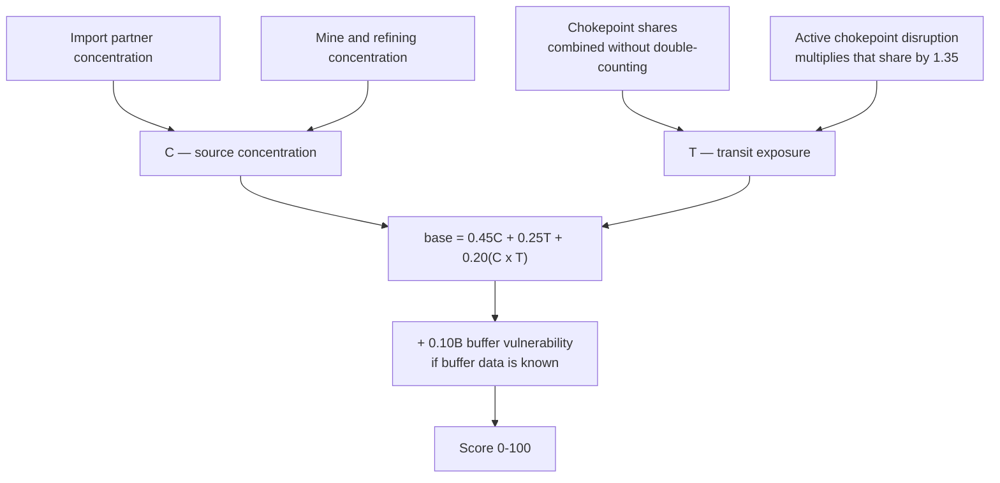

_Methodology maintained by [Elie Habib](https://www.worldmonitor.app/blog/authors/elie-habib/), founder of World Monitor. Published revisions are recorded in the [corrections log](/corrections)._

## Start here

One country, one commodity, one question: **if this supply were interrupted, how
badly is this country exposed?**

Exposure comes from three places, and the score is built from exactly those:

1. **Concentration** — does the supply come from many places, or one? A country
   buying copper from twelve partners is in a different position from one buying
   it all from a single mine and a single refinery.
2. **Transit** — does it have to come through a maritime chokepoint? A cargo
   that must pass Hormuz or Malacca carries the risk of that strait.
3. **Buffers** — is there stock on hand to ride out a gap?

The first two **compound** rather than simply add. Being single-sourced is bad;
being single-sourced *through one strait* is worse than the sum of its parts,
and the formula has an explicit interaction term saying so.



### What it is not

It is **not** a price forecast, a shortage prediction, or a measure of domestic
demand. A high score says a country would feel an interruption keenly — not that
one is coming.

### Missing data is neutral, never zero

If buffer data is unknown, the scorer does not assume there are no buffers. It
drops the buffer weight and renormalizes what is left, so absence neither helps
nor hurts the score. Where evidence is genuinely missing for a covered route,
the score is withheld entirely (`state: insufficient_data`) rather than guessed.

Methodology version: `supply-vulnerability-v2.0.0`.

Each record includes its score components, source evidence, coverage state, freshness state, reasons, and methodology version. A missing measurement stays missing. The scorer never changes a missing value to zero.

## Score

The score is an absolute 0–100 scale. The components are normalized to 0–1:

- `C`: source concentration. This combines import-partner HHI with global mine and refining HHI.
- `T`: maritime transit exposure. This combines all observed chokepoint shares without double-counting overlapping shares.
- `B`: buffer vulnerability. A larger value means less available cover.

```text
base = 0.45C + 0.25T + 0.20(C × T)

if B is known:
  score = 100 × clamp(base + 0.10B, 0, 1)

if B is unknown:
  score = 100 × clamp(base / 0.90, 0, 1)
```

The `C × T` term makes concentration and transit risk compound. It does not let transit exposure alone outrank complete single-source concentration. When buffer data is unknown, the scorer removes the buffer weight and normalizes the other weights. Unknown is therefore neutral, not zero.

### Source concentration

Import HHI is the sum of squared partner shares. A residual share bucket covers import value outside the returned top suppliers. Those shares come from the canonical bilateral shard's leading five origins; the deeper per-origin evidence the country briefs read is published in a separate key that this scorer does not read, so it leaves every score unchanged.
The mineral-production source publishes standard HHI values on a 0–10,000 scale; the scorer divides those values by 10,000 before combining them with unit-scale import HHI.

When mine and refining HHI are both available:

```text
production HHI = 0.25 × mine HHI + 0.75 × refining HHI
C = 0.55 × import HHI + 0.45 × production HHI
```

Refining has the larger production-stage weight because processing concentration can remain high even when mine supply is more diverse. If only one production stage exists, that stage is used. If only import or production concentration exists, the available leg is used and the coverage label says which leg is present.

### Transit exposure and disruption sensitivity

For chokepoint shares `t1...tn`:

```text
T = 1 - product(1 - ti)
```

An active chokepoint disruption multiplies that chokepoint's share by `1.35`, capped at `1.0`, before the union is calculated. Clearing the disruption restores the baseline score. The model uses the existing HS2 country-chokepoint exposure index and the current PortWatch/EIA flow-status record.

A missing flow status is treated in one of two ways, depending on whether the route has a status source at all.

- **`unknown` — covered route, status row temporarily absent.** For a route with positive transit share, the country-commodity score is null with `state: insufficient_data` and `missing_transit_status` until the evidence returns. This applies only to routes the flow-status source publishes.
- **`uncovered` — no flow-status source exists for the route.** The exposure index tracks more chokepoints than the PortWatch/EIA flow record covers. Waiting for evidence that is never published would null every score on those corridors, so an uncovered route contributes its transit share at the baseline multiplier and the record carries a `transit_status_uncovered` coverage label. The score is real; the absence of live disruption data for that route is disclosed rather than hidden.

An uncovered route can therefore never be shown as `disrupted`: its share is always counted at baseline. Zero-share routes remain visible for reconciliation, but their missing or stale flow status does not affect score eligibility or freshness.

### Buffers

Known buffers are converted to vulnerability as follows:

| Commodity class | Input | Conversion |
|---|---|---|
| Food | USDA PSD stocks-to-use ratio | `1 - clamp(ratio / 0.35, 0, 1)` |
| LNG proxy | GIE AGSI+ storage fill | `1 - clamp(fill percent / 100, 0, 1)` |
| Oil and refined fuel | IEA days of cover | `1 - clamp(days / 90, 0, 1)` |

An SPR policy with capacity but no consumption denominator is evidence, but it is not a numeric buffer. The record remains `buffer_unknown`.

## Bands and data states

| Score | Band |
|---:|---|
| 0–24.99 | `low` |
| 25–49.99 | `moderate` |
| 50–74.99 | `high` |
| 75–100 | `critical` |

The band is absolute. It is not a percentile rank.

| State | Meaning |
|---|---|
| `ok` | Minimum evidence exists and all used inputs are within their freshness budgets. |
| `stale_input` | A last-good score exists, but at least one used input exceeded its freshness budget. |
| `insufficient_data` | Source concentration or transit exposure is absent. `score` and `band` are null. |

Freshness budgets are 45 days for bilateral trade, 2 days for chokepoint exposure, 400 days for mineral production, 3 days for flow status and gas storage, 120 days for food stocks, 90 days for fuel stocks, and 400 days for reviewed SPR policy. A stale input does not become fresh because the derived job ran.

## Reviewed commodity mappings

The versioned registry uses UN Comtrade HS 2022 (`H6`) headings. The HS2 column selects the existing transit-exposure sector. The JSON registry is the executable source of truth and carries a rationale, caveat, and source URL for every row.

| Commodity id | HS4 | Transit HS2 | Buffer | Main limitation |
|---|---|---:|---|---|
| `ree` | 2805 | 28 | — | Heading is broader than separated rare-earth oxides and compounds. |
| `lithium` | 2836 | 28 | — | Heading contains non-lithium carbonates. |
| `cobalt` | 8105 | 81 | — | Ore and some battery chemicals are outside the heading. |
| `copper` | 2603 | 26 | — | Ore-stage proxy excludes refined copper. |
| `nickel` | 2604 | 26 | — | Ore-stage proxy excludes unwrought and chemical forms. |
| `graphite` | 2504 | 25 | — | Synthetic graphite and anode material are outside the heading. |
| `tungsten` | 2611 | 26 | — | Ore-stage proxy excludes refined products. |
| `gallium` | 8112 | 81 | — | Residual heading also contains germanium and other metals. |
| `germanium` | 8112 | 81 | — | Residual heading also contains gallium and other metals. |
| `helium` | 2804 | 28 | — | Heading also contains hydrogen and other rare gases. |
| `aluminum` | 7601 | 76 | — | Bauxite and alumina are separate records. |
| `bauxite` | 2606 | 26 | — | Does not represent alumina or refined aluminum. |
| `alumina` | 2818 | 28 | — | Also includes aluminum hydroxide. |
| `uranium` | 2612 | 26 | — | Combines uranium and thorium and excludes enriched fuel. |
| `crude_oil` | 2709 | 27 | fuel stock days | Cover can include multiple petroleum products. |
| `lng` | 2711 | 27 | gas storage fill | HS4 also includes non-liquefied petroleum gases. |
| `refined_petroleum` | 2710 | 27 | fuel stock days | Aggregates products with different substitution options. |
| `wheat` | 1001 | 10 | stocks-to-use | Marketing year differs from the customs year. |
| `soybeans` | 1201 | 12 | stocks-to-use | Marketing year differs from the customs year. |
| `corn` | 1005 | 10 | stocks-to-use | Bounded bilateral coverage is not universal. |
| `rice` | 1006 | 10 | stocks-to-use | Customs states differ from the milled-rice stock balance. |
| `barley` | 1003 | 10 | stocks-to-use | Bounded bilateral coverage is not universal. |
| `palm_oil` | 1511 | 15 | stocks-to-use | Combines crude and refined palm-oil fractions. |

## Provenance

Each score component includes the source key, source name, source URL, value, source year when available, fetch time, stale flag, and a short detail. The source families are:

- [UN Comtrade](https://comtradeplus.un.org/) bilateral HS4 imports and the [HS 2022 reference](https://comtradeapi.un.org/files/v1/app/reference/H6.json)
- [USGS Mineral Commodity Summaries](https://www.usgs.gov/centers/national-minerals-information-center/mineral-commodity-summaries) and reviewed BGS-backed mineral stages in the existing mineral-production dataset
- [World Bank PortWatch](https://www.worldbank.org/en/programs/ports) and existing EIA baselines for chokepoint status
- [USDA FAS PSD](https://apps.fas.usda.gov/psdonline/app/index.html) food stocks
- [GIE AGSI+](https://agsi.gie.eu/) gas storage
- [IEA](https://www.iea.org/data-and-statistics) fuel stock cover and [oil security policy](https://www.iea.org/reports/oil-security-policy)

Source licenses and attribution requirements are listed in [Source Attribution](/source-attribution).

The mineral snapshot preserves provider identity per mine or refining stage. USGS stages can cross the programmatic redistribution boundary. The canonical cohort retains BGS stages with the required BGS credit and link for internal audit. Every direct RPC and MCP response fails closed, including requests that replay a freely mintable anonymous browser-session token: the affected score and BGS-derived values are absent, the record is `insufficient_data`, and `redistribution_blocked` is included in its reasons. This policy never changes an unavailable value to zero.

## Publication and freshness

The Railway `seed-bundle-static-ref-heavy` service starts daily at 04:00 UTC and runs the `Supply-Vulnerability` section after its mirrored inputs. The section reads upstream Redis envelopes, computes one in-memory snapshot, and projects both indexes in the same run. The canonical keys are compact manifests:

- `supply-chain:vulnerability:v1`: country identifiers plus the bounded global ranking index
- `supply-chain:chokepoint-dependencies:v1`: chokepoint identifiers

Full country and chokepoint records are stored in deterministic per-entity shards. Publication alternates between two slots: all inactive-slot shards and both public manifests are written first, then one authoritative cohort descriptor and the durable activation marker switch atomically. Every reader uses that shared descriptor. The descriptor and every shard carry the current redistribution-policy version. A reader rejects an older unmarked cohort as unavailable, so an API deployment cannot expose pre-policy persisted evidence while the matching publisher is still pending. A failed country or inverse manifest write therefore leaves the prior complete compatible cohort visible, and the next run cannot overwrite a slot that a reader still references. This keeps each Redis value and pipeline request below its publication limit and prevents a partial shard write from replacing the last complete cohort. Manifests and the cohort descriptor have a 72-hour TTL; shards have a six-day TTL so both bounded slots survive a normal daily rotation. Publication must meet the configured country and chokepoint floors. It also measures the countries with country-specific import evidence, the commodities with global production evidence, the rankable and fresh rankable record depth, the commodity IDs with source evidence, the HS4 headings seen in bilateral inputs, and the HS2 sectors seen in transit inputs; registry constants do not count as observed coverage. Those measurements are persisted in seed metadata, and the publication gate and health enforce the same floors on them. The count of countries that carry evidence for every reviewed mapping is published as a diagnostic only. Health probes the authoritative cohort descriptor used by every RPC plus the inverse manifest and both seed metadata keys. Before the first complete cohort, the probes stay pending; after atomic activation, missing, stale, or partial output is strict. The inverse index is built in the same pass as the country index, so each dependency carries the same score, state, transit share, and method version as its country record. The three audience-dependent RPCs are `no-store`; a browser cache cannot reuse dashboard evidence for a later API-key response at the same URL.

The RPCs are `GetCountryVulnerabilities`, `GetChokepointDependencies`, and `ListVulnerabilityRankings`. The MCP tools are `get_supply_vulnerabilities` and `get_chokepoint_dependencies`; `ListVulnerabilityRankings` has no MCP tool.

All three RPCs require a Pro subscription (tier 1) — see [Pro Intelligence Suite](/pro-intelligence-suite). This is a separate gate from the redistribution policy described above: entitlement decides whether the caller gets a response at all, while the redistribution policy decides which provider-derived values that response may carry.

## Reproducible hand checks

These are synthetic, fixed inputs. They verify expected direction and arithmetic; they are not claims about current live country conditions.

| Case | Expected score | Band | Check |
|---|---:|---|---|
| Japan rare earths with China-like import concentration and high refining HHI | 69.03 | high | Refining dominance and concentrated imports compound with Malacca transit. |
| Japan rare-earth diversified import counterfactual | 33.50 | moderate | Lower imports and transit reduce the score. |
| Japan helium with Qatar-like concentration and Hormuz transit | 58.45 | high | Supplier and transit concentration compound. |
| Japan helium diversified counterfactual | 24.65 | low | Diversification reduces the score. |
| Japan gallium with high refining concentration | 64.14 | high | Refining dominates the production leg. |
| South Korea germanium with high refining concentration | 63.43 | high | Refining dominates the production leg. |
| Gulf wheat importer during Hormuz disruption with low stocks | 65.88 | high | Disruption and weak buffer increase the score. |
| Diversified wheat imports with complete transit exposure | 42.22 | moderate | Transit alone stays below complete single-source concentration. |
| Germany LNG before storage fill | 48.95 | moderate | Low storage creates high buffer vulnerability. |
| Germany LNG after storage fill | 41.95 | moderate | Higher storage reduces the score by 7 points. |

The automated hand-check test calculates these values through the production scorer. Other tests prove component monotonicity, unknown-buffer neutrality, disruption restore behavior, absolute band boundaries, and country/inverse-index reconciliation.

## Changelog

- `supply-vulnerability-v2.0.0` — First published country commodity-vulnerability method. Adds refining-dominant production HHI, concentration-transit compounding, neutral unknown buffers, disruption sensitivity, explicit coverage and freshness states, and a single-pass chokepoint inverse index.
