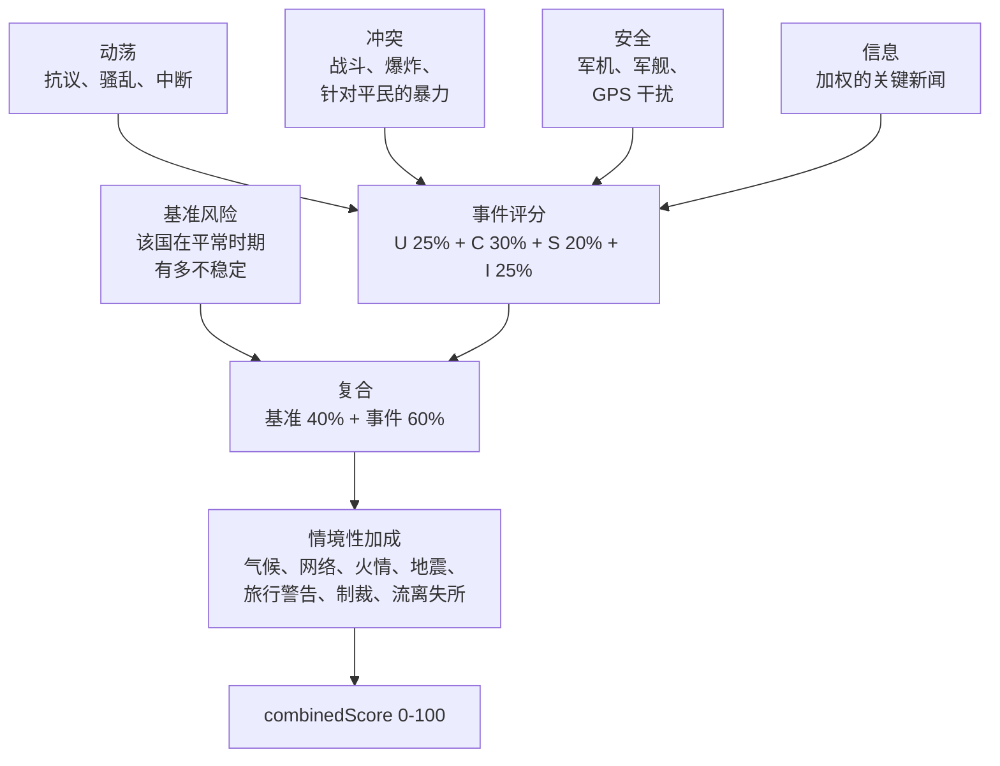

_本方法论由 World Monitor 创始人 [Elie Habib](https://www.worldmonitor.app/blog/authors/elie-habib/) 维护。已发布的修订记录在[更正日志](/zh/corrections)中。_

## 从这里开始

综合不稳定指数回答一个可操作的问题：
**今天我应该先看哪个国家？**

它是一个 0–100 的压力读数，为一份策展的观察名单持续重算。当抗议、交火、军事调动与新闻压力在同一时间、同一地点一起抬头时，这个数字就会上升。

高 CII **不等于**"危险的国家"。它意味着**此地此刻正在发生很多事**。一个稳定国家真正糟糕的一周，得分会高过一个长期动荡国家平静的一周——这正是设计意图：CII 是一个分诊转盘，不是一份判决书。

### 它观察的四件事

| 分量 | 它捕捉什么 |
|---|---|
| **动荡（Unrest）** | 抗议、骚乱，以及随之而来的中断——暴力之前的摩擦。 |
| **冲突（Conflict）** | 真正的交火：战斗、爆炸、针对平民的暴力。 |
| **安全（Security）** | 周边的军事节奏——军机、军舰、空域中断、GPS 干扰。 |
| **信息（Information）** | 关于这个国家的新闻环境有多热。 |

### 这个数字是怎么拼出来的

每个国家都带有一个**基准值**——它在平常时期有多不稳定——以及一个**事件乘数**，用来决定同一起事件在该国应当推动多大幅度。头条评分是 40% 基准 + 60% 实时事件，再叠加地震、网络事件、旅行警告等情境性加成。

这个 40/60 的比例就是全部设计。它使得一个脆弱国家永远不会读作平静，也使得一个稳定国家真正的危机仍能迅速拉动数字。



### 它是什么，不是什么

**它是**一个帮助值班人员在快速变化的仪表盘上决定先看哪里的单一数字。

**它不是**预测、保险定价输入，也不能替代主权国家发布的旅行警告。它同样**不是**[国家韧性指数](/zh/methodology/country-resilience-index)——后者问的是相反的问题：不是*这个国家正在发生什么*，而是*它扛得住吗*。仪表盘把两者并排展示，正是因为一个国家可以平静而脆弱，也可以承压而坚韧。

WorldMonitor 确实做预测的地方，那份记录会被评分并公开发布。[预测准确度记分卡](https://www.worldmonitor.app/accuracy/)载有 Brier 分数与对数分数、校准表，以及每个已发布数字背后的样本量。

<Warning>
**这些权重是编辑性的，不是经验性的。** 它们由 WorldMonitor 情报团队基于对历史事件和当前地缘政治姿态的内部审阅撰写，**并非**派生自已发布的学术指数、同行评审论文或第三方风险产品。合理的分析师会对其中某些条目持不同意见。

公开本页的全部意义，就是让这些判断可被检查，以便你在依赖它们之前先决定是否同意。如果某个重要决策依赖这些评分，请固定每个 `CiiScore` 上的 `methodology_version` 字段、留意版本提升，并对照你自己的实况来权衡各国的 `event_multiplier`。
</Warning>

覆盖的国家是一份**策展的监测范围**，而非全部主权国家——参见[一级国家标准](#2-各国-baselinerisk-和-eventmultiplier)。CRI 覆盖更广的 196 国范围。

<Note>
**面向开发者。** CII 与战略风险汇总由 `GET /api/intelligence/v1/get-risk-scores`（proto `worldmonitor.intelligence.v1.GetRiskScoresResponse`）提供。每个 `CiiScore` 上传输的 `methodology_version` 字段记录了计算该评分时本文档所处的修订版本。当前版本为 **v8**——参见[版本历史](#版本历史)。
</Note>

---

## 1. 四个 CII 分量

每个一级国家在 `0–100` 范围内获得四个子评分。这些在线上作为 `CiiComponents` 暴露：

| 传输字段 | 编辑含义 |
|---|---|
| `cii_contribution`（**U**nrest/动荡） | 民间动乱压力：ACLED 抗议 + 骚乱、这些事件的死亡人数、确认的互联网/电力中断，以及高严重性动荡加成。反映前暴力摩擦。 |
| `geo_convergence`（**C**onflict/冲突） | 动能活动：ACLED 战斗、爆炸/远程暴力及针对平民的暴力事件，加上伊朗地区打击强度和以色列 OREF 警报压力。事件活动在分量上限前进行对数缩放，以保持中等和极端事件体量的有序性；平方根死亡缩放防止单事件饱和。 |
| `military_activity`（**S**ecurity/安全） | 国家附近的硬安全节奏：军事飞行活动、军事船舶活动、航空中断（关闭/延误）和 GPS 干扰六边形密度。外国军事存在权重 ×2。 |
| `news_activity`（**I**nformation/信息） | 信息环境压力：归属到该国的已分类关键/高/中等新闻标题的加权计数。 |

四个分量加权为头条 `combinedScore`：

```
eventScore = U * 0.25 + C * 0.30 + S * 0.20 + I * 0.25

composite = baseline * 0.4
          + eventScore * 0.6
          + climateBoost      (≤ 15)
          + cyberBoost        (≤ 12, severity-weighted)
          + fireBoost         (≤  8, high-fire weighted)
          + advisoryBoost     (≤ 15)
          + orefBlendBoost    (IL only, ≤ 25)
          + displacementBoost (≤ 20)
          + newsUrgencyBoost  (≤  5)
          + earthquakeBoost   (≤ 25)
          + sanctionsBoost    (≤ 14)
          + aisBoost          (≤ 10, AIS disruptions)
```

容易遗漏的分量细节：

- **动荡严重性加成**：高严重性 ACLED 动荡事件（例如骚乱）在 Unrest 分量内添加 `min(20, highSeverityUnrest * 10 * eventMultiplier)`。
- **冲突平民加成**：针对平民的暴力事件在对数缩放的冲突活动和死亡条款后添加 `min(10, civilianViolence * 3)`。
- **伊朗地区打击加成**：地理编码的伊朗事件打击，或来自同一源的标题/位置回退匹配，在 Conflict 分量内添加 `min(50, iranStrikes * 3 + highSeverityStrikes * 5)`。高和关键严重性打击因此计两次：一次在每打击项中，一次在高严重性项中。该源是战区强度输入，而非完整的武装冲突伤亡来源；ACLED 和 UCDP 仍是一般冲突锚点。
- **冲突 OREF 加成**：仅对以色列，活跃 OREF 火箭警报压力在 Conflict 分量内添加 `25 + min(25, activeAlertCount * 5)`，因此分量级 OREF 贡献上限为 `+50`。这与上方列出的复合 `orefBlendBoost` 项分开，后者也仅限以色列且上限为 `+25`。
- **信息严重性处理**：已分类的头条报道使用权重 `critical = 4`、`high = 2`、`medium/elevated = 1`、`moderate/low = 0.5` 和 `info = 0`。各国威胁摘要信息流使用 `critical = 4`、`high = 2`、`medium = 1`、`low = 0.5` 和 `info = 0`，该威胁摘要子评分上限为 `20`；合并的 Information 分量上限为 `100`。

`composite` 随后被钳制到 `[floor, 100]`，其中 `floor` 是以下两者中较大者：

- **UCDP 下限**：若 UCDP 战争级事件活跃则为 70，若轻微冲突级事件活跃则为 50，否则为 0。
- **国务院旅行建议下限**：60 对应"请勿旅行"，50 对应"重新考虑旅行"，否则为 0。

警示等级也可在下限应用前添加 `advisoryBoost`：
"请勿旅行" `+15`，"重新考虑旅行" `+10`，"谨慎" `+5`。服务端优先使用
可用的实时 `intelligence:advisories:v1` `byCountry` 等级。若被追踪国家无实时等级，它可应用
`server/worldmonitor/intelligence/v1/get-risk-scores.ts` 中内嵌的国务院兜底表。因此每个 `CiiScore`
暴露：

| 传输字段 | 取值 | 含义 |
|---|---|---|
| `advisory_level` / `advisoryLevel` | `do-not-travel`、`reconsider`、`caution` 或空 | 用于评分加成/下限的警示等级（如有）。 |
| `advisory_provenance` / `advisoryProvenance` | `live`、`fallback`、`absent` | `advisory_level` 来自实时已播种警示源、内嵌兜底表，还是无警示输入。 |

### 警示兜底表

当实时安全警示源对某 Tier-1 国家无当前等级时，
评分器在同时计算 `advisoryBoost` 和警示评分下限之前应用一个精选兜底等级。只要实时源数据
存在，实时数据即胜出；兜底不是额外的共识加成。

| 代码 | 国家 | 兜底等级 | 实时等级缺失时的评分效果 |
|---|---|---|---|
| `AF` | 阿富汗 | 请勿旅行 | `advisoryBoost +15`；下限 `60` |
| `MM` | 缅甸 | 请勿旅行 | `advisoryBoost +15`；下限 `60` |
| `SY` | 叙利亚 | 请勿旅行 | `advisoryBoost +15`；下限 `60` |
| `UA` | 乌克兰 | 请勿旅行 | `advisoryBoost +15`；下限 `60` |
| `YE` | 也门 | 请勿旅行 | `advisoryBoost +15`；下限 `60` |
| `CU` | 古巴 | 重新考虑 | `advisoryBoost +10`；下限 `50` |
| `IL` | 以色列 | 重新考虑 | `advisoryBoost +10`；下限 `50` |
| `IQ` | 伊拉克 | 重新考虑 | `advisoryBoost +10`；下限 `50` |
| `IR` | 伊朗 | 重新考虑 | `advisoryBoost +10`；下限 `50` |
| `LB` | 黎巴嫩 | 重新考虑 | `advisoryBoost +10`；下限 `50` |
| `MX` | 墨西哥 | 重新考虑 | `advisoryBoost +10`；下限 `50` |
| `PK` | 巴基斯坦 | 重新考虑 | `advisoryBoost +10`；下限 `50` |
| `VE` | 委内瑞拉 | 重新考虑 | `advisoryBoost +10`；下限 `50` |
| `RU` | 俄罗斯 | 谨慎 | `advisoryBoost +5`；无警示下限 |
| `TR` | 土耳其 | 谨慎 | `advisoryBoost +5`；无警示下限 |

理由：这些默认值覆盖了缺失或延迟的警示种子会使已知高风险战区看起来人为平静的 Tier-1 国家。由于该表是会改变评分的编辑策略，添加、删除或重新定级一个国家是一次公式版本化的方法论变更。

### 文本归属注意事项

国家文本回退在结构化国家代码和坐标失败后使用精选别名。当前以色列别名集包含 `gaza`，因此未归属的头条或打击位置文本提及加沙时会被路由到 IL
进行 CII 评分。这是 31 国 Tier-1 CII 面的运营限制：CII 当前不发布单独的加沙/巴勒斯坦领土国家评分，读者应将这些以色列归属的文本回退
信号视为以色列/加沙战区压力，而非声称事件发生在国际承认的以色列领土内。

线上暴露的 `dynamicScore` 是与约 24 小时前的有效 CII 快照相比的带符号评分移动。正值表示国家评分上升，负值表示下降，`0` 表示稳定或无有效先前快照。

当上游评分输入失败且响应从过时缓存或仅基线冷回退提供时，`GetRiskScoresResponse.degraded` 为 `true`。`GetRiskScoresResponse.stale` 仅对过时缓存分支为 `true`；仅基线冷回退返回 `degraded=true` 和 `stale=false`。这些标志是运行时质量标记，不改变 `methodology_version`。

---

## 2. 各国 `baselineRisk` 和 `eventMultiplier`

**这两个数字是干什么的。** `baselineRisk` 是一个国家在没什么事发生时所处的位置——它的静息脉搏。`eventMultiplier` 则决定同一起事件在那里应当发出多大的响声：在一个近期毫无动荡记录的国家发生一次抗议，其信息量远大于在一个每周都有抗议的地方发生一次，而乘数正是用来编码这个判断的。

两者都是人工设定的值，公布在此正是为了让你可以质疑它们。

这些是服务端 API 评分和前端客户端 CII 渲染都应用的编辑值。真相源是 [`shared/cii-weights.ts`](https://github.com/koala73/worldmonitor/blob/main/shared/cii-weights.ts)；服务端和前端表从该模块派生，因此系数漂移在测试中失败而非静默发布。

Tier-1 国家集是一个精选的监测范围，而非所有主权国家的自动排名。当一个国家满足至少一项编辑标准时进入该集：持续的全球风险相关性、活跃/近期的武装冲突或严重国内动荡、高影响区域升级潜力、重大经济/安全体系重要性，或仪表盘中的特定运营覆盖需求。该集有意保持小规模，以使 CII 维持为高频分诊面；CRI 覆盖更广的 196 国可排名范围。

| 代码 | 国家 | `baselineRisk` | `eventMultiplier` |
|------|---------|---------------:|------------------:|
| AE | 阿联酋 | 10 | 1.5 |
| AF | 阿富汗 | 45 | 0.8 |
| BR | 巴西 | 15 | 0.6 |
| CN | 中国 | 25 | 2.5 |
| CU | 古巴 | 45 | 2.0 |
| DE | 德国 | 5 | 0.5 |
| EG | 埃及 | 20 | 1.0 |
| FR | 法国 | 10 | 0.6 |
| GB | 英国 | 5 | 0.5 |
| IL | 以色列 | 45 | 0.7 |
| IN | 印度 | 20 | 0.8 |
| IQ | 伊拉克 | 40 | 1.2 |
| IR | 伊朗 | 40 | 2.0 |
| JP | 日本 | 5 | 0.5 |
| KP | 朝鲜 | 45 | 3.0 |
| KR | 韩国 | 15 | 0.8 |
| LB | 黎巴嫩 | 40 | 1.5 |
| MM | 缅甸 | 45 | 1.8 |
| MX | 墨西哥 | 35 | 1.0 |
| PK | 巴基斯坦 | 35 | 1.5 |
| PL | 波兰 | 10 | 0.8 |
| QA | 卡塔尔 | 10 | 0.8 |
| RU | 俄罗斯 | 35 | 2.0 |
| SA | 沙特阿拉伯 | 20 | 2.0 |
| SY | 叙利亚 | 50 | 0.7 |
| TR | 土耳其 | 25 | 1.2 |
| TW | 台湾 | 30 | 1.5 |
| UA | 乌克兰 | 50 | 0.8 |
| US | 美国 | 5 | 0.3 |
| VE | 委内瑞拉 | 40 | 1.8 |
| YE | 也门 | 50 | 0.7 |

**`baselineRisk` 的作用。** 它是该国"始终开启"的不稳定性下限。独立于任何实时事件，该国每个评分周期从 `baselineRisk * 0.4` 起始，并在其上累积事件驱动评分。`baselineRisk = 5` 的国家（US、DE、GB、JP）需要比 `baselineRisk = 50`（UA、SY、YE）的国家更响亮的事件信号才能注册到高 `combinedScore`。

**`eventMultiplier` 的作用。** 它缩放实时 ACLED 事件对 Unrest 和 Conflict 分量的贡献。Conflict 分量在对数缩放事件活动曲线之前应用该乘数；最终分量上限仍防止失控评分，但早期曲线保留了中等和极端事件体量之间的有意义距离。曲线为 `min(70, log1p(rawActivity) / log1p(4000) * 70)`，其中 `rawActivity` 是 `eventMultiplier` 之后的事件类型加权 ACLED 活动。理由是编辑性的：在**信息丰富、低噪声**的地理区域（US、DE、GB、JP、FR，乘数 `0.3–0.6`）中，我们下调实时事件，因为报告密度使每个单独事件在上下文中看起来比实际更大。在**信号稀缺、高相关性**的地理区域（KP、CN、IR、RU，乘数 `2.0–3.0`）中，我们上调，因为那里每个确认事件都具有不成比例的新闻价值。对于 `eventMultiplier < 0.7` 的国家，动荡计数使用 `log2(n+1) * multiplier * 5` 而非线性缩放，专门用于抑制美式的高体量低强度抗议信号。

### 策展参数的公平性理由

CII 是一个编辑性分诊指数，而非中性测量系统。因此策展的 `baselineRisk`、`eventMultiplier` 和关键词表需要护栏：

- `eventMultiplier` 是用于已验证事件输入的可观测性与信号置信度调整。不应用于放大一般性新闻关注或地缘政治显著性。
- 用于发现的搜索别名可以比评分关键词更宽泛。诸如战略水道或跨境争端等宽泛战区短语，不应本身被视为某国国内不稳定性证据，除非已评分的事件来源也将该信号归属到那里。
- Information 分量衡量新闻压力和已分类头条显著性。允许它移动复合评分，但在模式允许之处将其与 Conflict 分量分开。
- 人道主义位移故意采用对数斜坡而非两档制，以便六位数位移、百万级危机和数百万级危机不会塌缩为几乎相同的加成。

这些选择减少了一种已知的偏见失效模式：地缘政治显著的国家即使其国内不稳定性低于活跃冲突国家，也可能获得大量新闻报道。公式应保留该区分，而非让媒体显著性和早期硬上限将其压缩掉。

---

## 3. 战略风险汇总

**这就是仪表盘顶部那个全局数字**——"今天世界有多紧张"的那个转盘。它只由压力最大的五个国家构成，加权时最糟的那个权重最高，最后压缩到 15–85 的区间。

它的行为由两个刻意的选择决定。它永远不会读作零，因为全局图景从来不是真正的"一切正常"。它也永远不会因某一国的危机而饱和到 100，因为一个每逢坏日子就顶格的转盘，就不再携带任何信息。

`StrategicRisk[0]` 中的全球战略风险评分是排名前 5 的最高分国家 `combinedScore` 值的加权平均：

```
top5         = ciiScores.slice(0, STRATEGIC_RISK_TOP_N)            # N = 5
weights      = [1.00, 0.85, 0.70, 0.55, 0.40]                       # 1 - i * 0.15
weightedAvg  = Σ(score_i * weight_i) / Σ(weight_i)
overallScore = min(100, round(weightedAvg * 0.70 + 15))             # banded to [15, 85]
```

衰减步长、top-N 窗口、尺度下限（`15`）和尺度因子（`0.70`）都定义在
[`server/worldmonitor/intelligence/v1/_risk-config.ts`](https://github.com/koala73/worldmonitor/blob/main/server/worldmonitor/intelligence/v1/_risk-config.ts)。
它们的**理由**：

- **`STRATEGIC_RISK_POSITIONAL_DECAY = 0.15`** — 受影响最大的国家获得完整权重；接下来四个位置衰减到 `0.85`、`0.70`、`0.55` 和 `0.40`。第 6 个 1 基位置（0 基索引 5）仍会携带 `0.25`，因此是显式的 top-5 窗口而非零权重截断界定了该汇总。
- **`STRATEGIC_RISK_TOP_N = 5`** — 足够大以稀释单国激增，又足够小以使评分反映仪表盘的"最顶部"而非长尾。
- **`STRATEGIC_RISK_SCALE_FLOOR = 15`** — 全球画面永远不会"一切正常"。15 的基线在每个一级国家都平静时保持表盘在视觉上有意义。
- **`STRATEGIC_RISK_SCALE_FACTOR = 0.70`** — 与下限结合，这把加权 top-5 平均从 `[0, 100]` 压缩到 `[15, 85]`，再经过最终的 `min(100)`。防止单个非常高的国家饱和全球评分。

在 `StrategicRisk.level` 上暴露的严重性分档为：

- `SEVERITY_LEVEL_HIGH`，若 `overallScore ≥ 70`
- `SEVERITY_LEVEL_MEDIUM`，若 `40 ≤ overallScore < 70`
- `SEVERITY_LEVEL_LOW`，若 `overallScore < 40`

---

## 4. 评分契约变更

本评分的适用范围与局限已在[它是什么，不是什么](#它是什么，不是什么)中开门见山地说明。这里只保留一条与公式同处的操作规则：

任何更改服务端/API 各国基线、事件乘数、气候分区的国家归属、战略风险汇总系数、内联服务端公式字面量、受保护的顶级公式常量或 CII 移动语义的编辑，**必须**同时提升 `server/worldmonitor/intelligence/v1/_risk-config.ts` 中的 `CII_FORMULA_VERSION`、在同一提交中更新本文档，并新增一条公开 CHANGELOG 条目。保留服务端/API 评分的真相源重构不提升传输版本。`tests/cii-scoring.test.mts` 中的测试会强制本文档列出 `CURATED_COUNTRIES` 中的每一个国家代码。

## 版本历史

> **v8（2026-06-06）。** 修复了失效的 UCDP 冲突下限归属。服务端
> 评分器从缓存的 `conflict:ucdp-events:v1` 源读取了不存在的
> `intensity_level` / `type_of_violence` 字段（该源的行实际携带
> `violenceType` / `deathsBest` / `dateStart`），因此 UCDP 从未应用其
> 战争（下限 70）/ 轻度（下限 50）评分下限，也从未计入
> `riskScores` 实时健康/缓存信号覆盖。UCDP 现按国家在 2 年滚动窗口内分类
> （战争：死亡总数 > 1000 或事件数 > 100；轻度：事件数 > 10），与前端的
> `deriveUcdpClassifications` 启发式一致。分类器为该
> 2 年窗口配置，但 Redis 写入器当前抓取最新的六页 UCDP，
> 并从 365 天滚动切片中保留最多 2,000 条映射事件。中继
> `/ucdp-events` 读取器最多可抓取 12 页，但应用相同的 365 天
> 过滤器。因此，在 UCDP 保留范围通过生产级 API 体量与
> Redis 载荷保障扩展之前，实时评分受种子输入约束。
> 健康覆盖度指标的冲突
> 族现在由 ACLED API 路径**或** UCDP 满足，因此当 UCDP 健康时，
> 薄/空 ACLED 窗口不再将健康翻转为 `COVERAGE_PARTIAL`。
> 当前 ACLED 或 UCDP 的健康覆盖语义请参见
> [国家不稳定指数](/zh/country-instability-index)。
> 活跃 UCDP 冲突国家的 `combinedScore` 值上升（例如 UA/PK/MX
> 获得战争下限）；风险评分缓存键家族迁移到
> `risk:scores:sebuf:v8`，发射的 `methodology_version` 现为 `v8`，固定于
> `methodology_version` 的客户端应重新基线。

> **v8 修正（2026-06-07）。** 来源发现与可观测性得到澄清，
> 未改变评分系数、CII 公式版本或
> `risk:scores:sebuf:v8` 缓存键。UCDP 种子器现在优先选择返回事件的
> 最新 GED 版本，而非停留在第一个响应版本
> （[#4200](https://github.com/koala73/worldmonitor/issues/4200)），且
> CII 刷新路径在 ACLED 对两个比较窗口均返回零事件时发出警告，
> 以便运维人员区分安静源与鉴权/上游缺口。

> **v7（2026-06-06）。** 第二批 CII 缺口关闭的评分归属发生了变化。坐标归属现在在成对边界规则之前处理三向 bbox 重叠，因此 Punggye-ri 归属到 KP 而非 CN，Lublin 归属到 PL 而非 UA；种子镜像使用相同的解析器。针对 Lhasa、Gaziantep、Kermanshah、Quetta、Islamabad、Dammam、Tabuk、Ruili、Belogorsk、北海道北部和 Amman 添加了定向矩形 bbox 探测。气候异常加成现在覆盖生产者发射的 `Europe`、`East Asia` 和 `Latin America` 区域，恢复了 KP/KR/JP/PL/DE/FR/GB/VE 的加成覆盖，且未知的未来区域名在存在异常坐标时可通过其回退。受影响记录此前归属到错误国家或被忽略处，`combinedScore` 值可能发生变化。风险评分缓存键家族迁移到 `risk:scores:sebuf:v7`；固定于 `methodology_version` 的客户端应重新基线。剩余的坐标归属仍是矩形近似，而非完整的点在多边形内边界几何。

> **v6（2026-06-06）。** 国家文本、坐标和气候异常输入的评分归属发生了变化。文本归属现在将 `north korean` 识别为 KP，将 `taiwanese` 识别为 TW，同时仍拒绝歧义的裸 `korean`。坐标归属在高价值重叠区域保持种子与服务端对齐：Rio Grande US/MX 边界段、朝鲜非军事区西部、RU/UA、IN/PK、CN/RU 和 RU/JP。气候异常加成现在消费气候生产者发射的区域名（`Ukraine`、`California`、`Amazon`、`Taiwan Strait`、`Caribbean` 等），并将枚举严重性映射到数值加成尺度。受影响的军事、火灾、GPS、地震、新闻或气候记录此前归属到错误国家或被忽略处，`combinedScore` 值可能发生变化。风险评分缓存键家族迁移到 `risk:scores:sebuf:v6`；固定于 `methodology_version` 的客户端应重新基线。

> **v5（2026-06-06）。** `dynamicScore` 现在是范围 `-100..100` 内的带符号移动增量，派生自约 24 小时前的有效 CII 快照。正值表示国家评分上升，负值表示下降，`0` 表示稳定或无有效先前快照。服务端趋势标签使用严格的一点死区：`+1` 或 `-1` 的整点评分变化保持稳定，而 `+2` 和 `-2` 是首个上升/下降标签。浏览器回退使用相同的趋势死区。此版本升级未改变 `combinedScore` 系数，但此前将 `dynamicScore` 视为非负实时评分的 API 客户端应重新基线。

> **v4（2026-06-06）。** 归属和源输入语义发生变化，同时保持已发布的系数表不变。国家文本归属现在使用规范化 token 精确匹配 / 短语匹配而非原始子串匹配，坐标归属将已知边界框重叠通过显式边界启发式路由，地震种子使用 USGS 4.5 周（`4.5_week`）信息流，制裁评分从 `sanctions:country-counts:v1` 读取完整国家计数图，而非依赖顶部压力显示列表。`combinedScore` 值在这些来源此前误归属或遗漏国家压力之处可能发生变化；固定于 `methodology_version` 的客户端应重新基线。

> **v3（2026-05-27）。** 冲突事件活动现在在最终分量上限（`cap = 70`，`pivot = 4000`）之前使用对数缩放曲线，取代了早期线性提前上限——后者可能将中等和极端政治暴力体量压缩到同一分量值。浏览器侧旧版 CII 路径现在使用与服务端相同的位移对数斜坡（`100K ≈ +4`、`500K ≈ +10`、`1M ≈ +12`、`5M ≈ +18`、`10M+ = +20`），而非旧的两档 `+4/+8` 加成。浏览器新闻警报压力不再乘以各国 `eventMultiplier`；它仍是一个信息分量信号，而非国内不稳定性的国家调校代理。固定于 `methodology_version` 的客户端应重新基线。

> **实现说明（2026-05-27）。** `baselineRisk` 和 `eventMultiplier` 现在来自服务端和前端共用的一张共享系数表。这通过为 AF、EG、IQ、JP、KR、LB 和 QA 保留此前已发布的服务端/API 值，解决了 [#3789](https://github.com/koala73/worldmonitor/issues/3789) 跟踪的 7 国漂移。前端客户端 CII 渲染现在使用相同的值。服务端/API 值在此重构中未变化——上方的 v3 升级来自校准变更，而非此次真相源迁移。

> **v2（2026-05-22）。** `Security` 分量不再是仅 GPS 干扰——它现在与 GPS 干扰一起对军事飞行、军事船舶和航空中断进行评分（issue #3738）。复合混合获得了 `newsUrgencyBoost`、`earthquakeBoost`、`sanctionsBoost` 和 AIS 中断加成，且 `cyberBoost`/`fireBoost` 现在按严重性加权而非原始计数。`combinedScore` 值相应变化——固定于 `methodology_version` 的客户端应重新基线。
