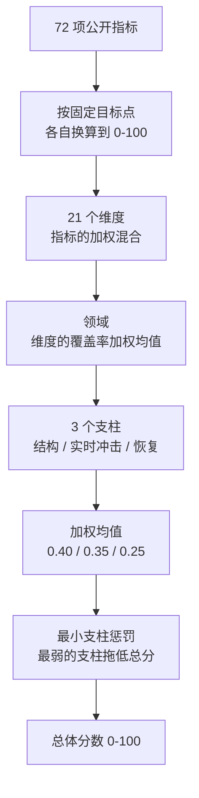

_本方法论由 World Monitor 创始人 [Elie Habib](https://www.worldmonitor.app/blog/authors/elie-habib/) 维护。已发布的修订记录在[更正日志](/zh/corrections)中。_

## 从这里开始

国家韧性指数对 196 个国家各问同一个问题：**当事情严重出错时，这个国家能多好地吸收它、并重新站起来？**

它是一个 0–100 的单一分数，每 6 小时刷新，由 72 项公开指标构建而成。分数高不代表这个国家富裕、安全或宜居。它意味着：当冲击到来时——货币危机、大停电、干旱、网络攻击、邻国战争——这个国家拥有承受住并恢复过来所需的财政空间、制度、基础设施与物资储备。

### 如何读懂分数

| 分数 | 等级 | 实际含义 |
|---|---|---|
| 60-100 | **高** | 缓冲深厚。能在不丧失基本功能的前提下吸收一次严重冲击。 |
| 30-59 | **中** | 具备真实能力，但大规模冲击会让它吃紧，恢复可能依赖外部援助。 |
| 0-29 | **低** | 各处都没有余量。一个领域的冲击会级联到其他领域。 |

在比较两个国家之前，有两件事值得知道。

**一个国家无法靠"平均"掩盖它的短板。** 这个分数刻意惩罚失衡：五项优秀、第六项糟糕的国家，得分会低于六项都只是良好的国家。真实危机中垮掉的是最弱的一环，公式就是这么说的。（这就是[评分公式](#总分)中的最小支柱惩罚。）

**覆盖率和分数同样重要。** 每个分数都附带一个覆盖率数字，说明其中有多少建立在真实观测而非推断之上。数据过于稀薄的国家会被标记为 `lowConfidence` 并排除在公开排名之外，而不是被悄悄地按猜测排名。

### 它不是什么

- **不是财富排名**，而且[这是刻意的](#构造合约)。一个指标如果唯一的理由是"这个国家富有"，就会被按设计剔除。财富能买到韧性，但两者不是一回事。
- **不是[综合不稳定指数](/zh/methodology/cii-risk-scores)。** CII 问的是*这个国家此刻承受多大压力*；CRI 问的是*它扛得住吗*。一个国家可以平静而脆弱，也可以承压而坚韧。仪表盘把两者并排展示，正是为此。
- **不是预测**，也不是对某个政府的评判。

### 分数是如何构建的

指标先被换算到统一的 0–100 标尺，混合成维度，归入领域，重新分组为三个支柱，最后用一个锚定在该国最弱支柱上的惩罚项合成。



每个环节都在下文有说明：[归一化](#归一化)、[维度与指标](#维度与指标)、[领域与权重](#领域与权重)，以及[评分公式](#评分公式)。

### 更新频率

实时 API 分数每 6 小时刷新。可抓取的国家快照通过凭据验证的全范围捕获每月发布。每个国家页面都会标明快照文件、捕获日期、时间覆盖范围和发布说明。[修订与更正日志](/zh/corrections)记录影响已发布快照的重要方法变更。

上游数据源可能包含比公开排名更广的领土集合。公开排名在发布前会过滤到可排名范围。

本页描述的全部内容都是指数**当前发布**的状态：72 个指标覆盖 21 个活跃维度与 6 个领域，`schemaVersion "2.0"` 形状，3 个支柱（加上 2 个为模式连续性保留在注册表中、`coverage=0` 的结构性退役维度），支柱组合惩罚 `overall_score`，以及能源 v2 构造。版本标志、回退路径与运行时清单见[面向开发者](#面向开发者)。

## 构造合约

**用通俗的话说：** 富裕国家往往更有韧性，但这个指数衡量的并不是"富裕"。如果一项指标之所以能入选，唯一的解释就是"富国在这项上得分高"，它就会被剔除——无论它在历史记录中与韧性的相关性有多好。指标要靠指名一种它有助于吸收的具体冲击，来赢得自己的位置。

正是这条规则，阻止了 CRI 退化成一份绕了几道弯的 GDP 排名，也解释了为什么某些富裕国家在这里的得分低于读者的预期。

国家韧性衡量**一国在特定时间点的绝对国家冲击吸收和恢复能力**。它不按收入水平调整。发展相关指标仅在衡量直接韧性机制时进入。这些指标使用阈值或饱和变换，使分数奖励功能能力而非富裕本身。同行相对的过度和低表现将作为分析覆盖层单独发布，不在核心分数内。

评分器仅在发展创造直接可衡量的冲击吸收机制时将其视为相关。纯粹的富裕水平代理被排除。发展相对的过度表现将单独报告，不改变国家序数排名。

评分器中的每个指标都根据单一**机制测试**评估：*这衡量了什么直接的冲击渠道？* 如果一个指标的唯一答案是"这个国家富有"，则无论其与韧性结果的历史相关性如何，都从核心分数中排除。如果一个指标的答案是"能力 X 吸收冲击 Y"，则可以进入，但必须使用阈值或饱和变换，使它奖励机制而非驱动它的资源水平。

当前生产已反映以下描述的恢复领域、货币/外部和能源构造修复：`reserveAdequacy` 和 `fuelStockDays` 已结构性退役，`liquidReserveAdequacy` 和 `sovereignFiscalBuffer` 活跃，`currencyExternal` 从 IMF 通胀加世界银行储备评分，`energy` 使用 v2 电力系统安全构造，覆盖率/影响力上限在测试中强制执行。遗留能源评分器仅作为 `RESILIENCE_ENERGY_V2_ENABLED=false` 的紧急回退路径保留在代码中。

## 在仪表盘中

CRI 在产品的三个位置呈现，均由同一当前发布分数驱动：

- **韧性 widget** — 一个独立面板（组件：`src/components/ResilienceWidget.ts`），按韧性分数对国家排名，带筛选和搜索功能。从 Cmd+K 输入 *resilience* 到达。
- **国家深度分析** — 在按国家的下钻面板内，CRI 与 CII（国家不稳定指数）并排，作为短程压力信号的结构性补充。CII 和 CRI 有意**不可互换**：CII 回答"这个国家当前承受多少压力？"；CRI 回答"这个国家在吸收和恢复冲击方面定位如何？"
- **地图分级统计图** — 韧性分数驱动主地图上的国家级分级统计图层。从地图的图层面板或通过 Cmd+K 切换。

三个仪表盘面均可免费查看。直接分数和排名 API 调用需要正常的 Pro/API 认证路径，而运行时清单在 `/api/resilience/v1/get-runtime-manifest` 公开；请参见 [Resilience service](https://github.com/koala73/worldmonitor/blob/main/docs/api/ResilienceService.openapi.yaml) 了解 HTTP 合约。

仅限 Pro 的 `/api/resilience/v1/get-resilience-indicators` 方法可在完整的 72 行注册表上解释单个国家的分数。它报告活动评分器所使用的确切归一化分量分数与运行时权重，然后把策略生效后的有效贡献与每个已发布的维度分数对账。各行还区分已观测、插补、缺失、回退、来源失败、未启用、已退役与不适用等状态。现有的 `get-resilience-score` 响应保持不变。原始来源值是选择性提供的，并在[指标再分发审查](./resilience-indicator-licensing.mdx)下失败关闭；受限行仍会返回 WorldMonitor 的归一化分数、贡献、来源署名，以及已知时的来源年份。

## 它由什么构成

这个分数混合了三类证据——这正是它区别于一份静态国家档案的地方：

- **缓慢变化的结构基线**——治理质量、健康基础设施、财政能力。
- **每日变化的实时压力信号**——网络威胁、冲突事件、航运中断。
- **恢复能力**——事后可动用的财政空间、储备与供应多样性。

数据来源于官方和权威提供商：世界银行、IMF、WHO、WTO、UNHCR、UCDP、BIS、IEA、FAO、无国界记者和经济学与和平研究所等。完整清单见[数据来源](#数据来源)。

WorldMonitor 国家韧性指数以 0-100 分对 196 国公开可排名范围评分，使用 72 个指标覆盖 21 个活跃维度和 6 个领域（加上 2 个结构性退役维度为模式连续性在注册表中以 `coverage=0` 保留）。排名处理器仍可将低置信度或标题不合格的国家路由到 `greyedOut[]`，但可排名范围本身由提交的 UN 成员 + SAR 白名单固定。

## 领域与权重

指数组织为 6 个领域。每个领域权重反映其对国家韧性的设计贡献。在活跃的支柱组合公式下，权重设置该领域在其支柱内的相对影响力，按领域的平均维度覆盖率缩放。在遗留的六领域回退公式下，相同权重直接用于平坦领域聚合。恢复领域承载最大的单领域权重（0.25），因为吸收和从冲击中恢复的能力是冲击后结果的最佳单一结构预测因子；这就是财政强劲的小国在排名顶部聚集、脆弱国家在底部清晰分离的原因。

| 领域 | ID | 权重 | 维度 |
|---|---|---|---|
| 经济 | `economic` | 0.17 | 宏观财政、货币与外部、贸易政策、金融系统暴露 |
| 基础设施 | `infrastructure` | 0.15 | 网络与数字、物流与供应、基础设施 |
| 能源 | `energy` | 0.11 | 能源 |
| 社会与治理 | `social-governance` | 0.19 | 治理、社会凝聚力、冲突与流离失所、信息、教育 |
| 健康与食品 | `health-food` | 0.13 | 健康与公共服务、食品与水 |
| 恢复 | `recovery` | 0.25 | 财政空间、外债覆盖、进口集中度、国家连续性、流动储备充足性、主权财政缓冲 |

权重总和为 1.00。权威值位于 `server/worldmonitor/resilience/v1/_dimension-scorers.ts` 的 `RESILIENCE_DOMAIN_WEIGHTS`；如果此表与代码不一致，以代码为准。在活跃的 `pc` 公式中，绝对顶层影响力还取决于外层支柱权重。

6 个领域重新分组为 3 个支柱（结构准备度、实时冲击暴露、恢复能力），Phase 2 支柱组合分数权重为 0.40 / 0.35 / 0.25。支柱形状现在在每个响应上发射（`schemaVersion="2.0"`，`pillars[]` 填充真实的领域加权、覆盖率缩放分数）。顶层 `overallScore` 由 `_shared.ts#penalizedPillarScore` 计算：加权支柱均值乘以最小支柱惩罚因子 `(1 - 0.5 * (1 - min_pillar / 100))`。

| 支柱 | 权重 | 成员领域 |
|---|---:|---|
| `structural-readiness` | 0.40 | `economic`、`social-governance` |
| `live-shock-exposure` | 0.35 | `infrastructure`、`energy`、`health-food` |
| `recovery-capacity` | 0.25 | `recovery` |

## 维度与指标

每个维度从 0-100 评分，使用其子指标的加权混合。以下是完整的指标注册表。

### 经济领域（权重 0.17）

经济领域有四个活跃维度。`macroFiscal` 和 `currencyExternal` 承载默认的按维度权重 `1.0`。`tradePolicy` 和 `financialSystemExposure` 各承载权重 `0.5`，拆分 Phase 2 贸易与金融暴露设计空间，使关税政策摩擦和跨境金融系统暴露不各自占据一个完整的等份槽位。四个经济维度全覆盖时，其经济领域份额约为 33.3%、33.3%、16.7% 和 16.7%。

| 维度 | 权重 | 全覆盖时份额 |
|---|---:|---:|
| `macroFiscal` | 1.0 | 33.3% |
| `currencyExternal` | 1.0 | 33.3% |
| `tradePolicy` | 0.5 | 16.7% |
| `financialSystemExposure` | 0.5 | 16.7% |

注：份额列假设 `RESILIENCE_FIN_SYS_EXPOSURE_ENABLED=true`；在默认标志关闭姿态下，实时经济份额为 40%、40%、20% 和 0%。

#### 宏观财政

| 指标 | 描述 | 方向 | 目标阈值（最差-最好） | 权重 | 来源 | 频率 |
|---|---|---|---|---|---|---|
| govRevenuePct | 政府收入占 GDP 百分比（IMF GGR_G01_GDP_PT） | 越高越好 | 5 - 45 | 0.40 | IMF | 年度 |
| debtGrowthRate | 年债务增长率 | 越低越好 | 20 - 0 | 0.20 | 国家债务数据 | 年度 |
| currentAccountPct | 经常账户余额占 GDP 百分比（IMF） | 越高越好 | -20 - 20 | 0.20 | IMF | 年度 |
| unemploymentPct | 失业率（IMF WEO LUR） | 越低越好 | 25 - 3 | 0.15 | IMF | 年度 |
| householdDebtService | BIS 家庭偿债比率（占收入百分比） | 越低越好 | 20 - 0 | 0.05 | BIS | 季度 |

#### 货币与外部

PR 3 §3.5 第 2 点退役了 BIS REER 支持的核心构造。BIS REER 仅覆盖 BIS 报告经济体集合，因此旧复合指标对约三分之二的 196 国公开可排名范围落入 curated_list_absent（覆盖率 0.3）或薄弱的 IMF 代理（覆盖率 0.45）。重建的维度使用两个全球覆盖的世界银行/IMF 系列。BIS 家庭偿债比率仍是独立的 `macroFiscal` 来源（`economic:bis:dsr:v1`），不驱动 `currencyExternal`。

| 指标 | 描述 | 方向 | 目标阈值（最差-最好） | 权重 | 来源 | 频率 |
|---|---|---|---|---|---|---|
| inflationStability | 标题消费者通胀，同比百分比（IMF WEO）；全球货币稳定的主要信号 | 1-3% 目标区间最佳 | &lt;= -5 或 >= 50 -> 0；1-3 -> 100 | 0.60 | IMF | 年度 |
| fxReservesAdequacy | 总储备折合进口月数（世界银行 FI.RES.TOTL.MO） | 越高越好 | 1 - 12 | 0.40 | 世界银行 | 年度 |

覆盖阶梯（PR 3 后）：两者均在 → 0.85；仅通胀 → 0.55；仅储备 → 0.40；均无 → 0.30（curated_list_absent 插补，在适配器中断时受 source-failure 重新标记）。

保留为实验性（仅丰富，约 64 个 BIS 报告国家）：`fxVolatility`（年化 BIS REER 波动率，50-0 目标阈值）和 `fxDeviation`（BIS REER 偏离 100 的绝对值，35-0）。这些不贡献核心总分；它们在 BIS 追踪经济体的国家下钻中呈现。

#### 贸易政策

在计划 2026-04-25-004 Phase 1（Ship 1）中从"贸易与制裁"更名。
OFAC `sanctionCount` 组件（原权重 0.45）被删除 — 统计指定方注册地是公司金融责任指标，不是国家韧性指标（像阿联酋或新加坡这样的中转枢纽承载许多空壳公司条目，但不反映所在国的结构韧性）。剩余 3 个组件重新加权至总计 1.0。独立的 `financialSystemExposure` 维度以 BIS Consolidated Banking Statistics（CBS，`WS_CBS_PUB`）+ WB IDS 短期外债 + FATF AML/CFT 列表状态的结构性制裁暴露替代了被删除的代理。Redis 键仍为 `economic:bis-lbs:v1` 以保持历史连续性。

关于完整构造理由和被拒绝的替代方案（项目权重分类、中转枢纽排除列表），请参见 [known-limitations.md § tradeSanctions → tradePolicy](https://github.com/koala73/worldmonitor/blob/main/docs/methodology/known-limitations.md#tradesanctions--tradepolicy-ofac-domicile-component-dropped-ship-1-2026-04-25)。

| 指标 | 描述 | 方向 | 目标阈值（最差-最好） | 权重 | 来源 | 频率 |
|---|---|---|---|---|---|---|
| tradeRestrictions | WTO 贸易限制严重性，来自当前每报告者一行种子（`low=0`、`moderate=1`、`high=2`；遗留无状态行算中等） | 越低越好 | 2 - 0 | 0.30 | WTO | 每周 |
| tradeBarriers | WTO 关税差距壁垒严重性，来自当前每报告者一行种子（`low=0`、`moderate=1`、`high=2`；遗留无状态行算中等） | 越低越好 | 2 - 0 | 0.30 | WTO | 每周 |
| appliedTariffRate | 适用关税率，加权均值，所有产品（世界银行 TM.TAX.MRCH.WM.AR.ZS） | 越低越好 | 20 - 0 | 0.40 | 世界银行 | 年度 |

**关税重叠披露。** `tradePolicy` 在 WTO 严重性修复后有意偏向关税：`tradeRestrictions` 现使用 WTO MFN 适用关税严重性，权重 0.30；`appliedTariffRate` 使用世界银行加权均值适用关税，权重 0.40；`tradeBarriers` 使用 WTO 关税差距严重性，权重 0.30。重叠是有意的，因为该维度在 OFAC 注册地组件移除后衡量政策摩擦；未来的关税来源变更应保留此披露或显式拆分构造。

#### 金融系统暴露

在计划 2026-04-25-004 Phase 2（Ship 2）中添加。以审计的跨境银行 + AML/CFT 数据构建的结构性暴露构造替代被删除的 OFAC 注册地信号（Phase 1）。OFAC 计数将中转枢纽公司注册地与所在国风险混淆（惩罚阿联酋/新加坡/香港等金融中心的空壳实体行为），而此维度使用衡量实际主权脆弱性的来源：短期外债悬垂、集中的跨境银行暴露和 AML/CFT 合规状态。

该维度当前受标志门控。`RESILIENCE_FIN_SYS_EXPOSURE_ENABLED` 默认为 `false`；当标志关闭时，评分器返回空数据形状（`score=0`、`coverage=0`、`observedWeight=0`、`imputedWeight=0`、`imputationClass=null`），维度通过覆盖率加权经济领域均值不贡献信号。这个暗默认是有意的，直到 BIS CBS（`economic:bis-lbs:v1`）、FATF 列表和 WB 外债种子器在生产中配置并健康。

当标志开启时，维度使用**失败关闭预检**模式（镜像 `scoreEnergy` v2）：所有 3 个必需的种子信封（`economic:wb-external-debt:v1`、`economic:bis-lbs:v1`、`economic:fatf-listing:v1`）必须可达。缺失 seed-meta 表明 Railway bundle 中断，表现为 `imputationClass='source-failure'` 而非静默将维度归零。按国家的数据间隙是不同的：按组件读取返回 null，槽位从加权混合中排除。`economic:bis-lbs:v1` 载荷从 BIS Consolidated Banking Statistics（CBS，`WS_CBS_PUB`）产出，而非 Locational Banking Statistics；保留的键名反映原始草稿，不是来源标签。Redis 键仍为 `economic:bis-lbs:v1` 以保持历史连续性。

| 指标 | 描述 | 方向 | 目标阈值（最差-最好） | 权重 | 来源 | 频率 |
|---|---|---|---|---|---|---|
| shortTermExternalDebtPctGni | 短期外债占 GNI 百分比（(WB IDS DT.DOD.DSTC.CD / NY.GNP.MKTP.CD) × 100）；IMF Article IV 脆弱性阈值为 GNI 的 15% | 越低越好 | 15 - 0 | 0.35 | 世界银行 IDS | 年度 |
| bisLbsXborderPctGdp | BIS CBS（`WS_CBS_PUB`）按母国外国债权总和（美国/英国/主要欧盟/瑞士/日本/加拿大/澳大利亚/新加坡）占 GDP 百分比；非对称 U 形区间 — 隔离（0%）是最差读数，得 30；过度暴露受惩罚但下限为 35 | 越低越好（U 形） | 0 - 25 | 0.30 | BIS CBS | 季度 |
| fatfListingStatus | FATF AML/CFT 列表状态 — 黑名单（呼吁行动）→ 0，灰名单（加强监控）→ 55，合规 → 100 | 越高越好 | 0 - 100 | 0.20 | FATF | 月度 |
| financialCenterRedundancy | 拥有非平凡（>1% GDP）外国债权的不同 BIS CBS 按母国报告者计数；奖励多对手方金融中心，平衡组件 2 过度暴露惩罚 | 越高越好 | 1 - 10 | 0.15 | BIS CBS | 季度 |

**覆盖率**：WB IDS 仅发布世界银行借款国（2026-08-11 载荷中为 119 国）。没有 IDS 行但有 BIS CBS 行的司法管辖区，其短期债务槽位采用推算值（分数 75，确定性 0.3，`imputationClass='not-applicable'`）而非丢弃 — 未参与债务报告系统（DRS）意味着没有已报告的短期外部商业债务，而非未知。两个来源都缺失的国家保持 null/丢弃行为。FATF + BIS CBS 一起有效覆盖所有清单国家。

**全面禁运上限**：受全面或政府层面西方封锁计划约束的司法管辖区（RU、BY、IR、KP、CU、SY、MM、VE、LY）在混合后上限为 15。四个分级组件中有三个将金融切断读作优势 — 短期债务薄是因为没有市场准入，跨境债权低是因为无人放贷，FATF `compliant` 是因为 FATF 评估的是反洗钱/反恐融资缺陷而非制裁。成员资格标准以及为何仅重新调整区间无法承载该信号，参见 [financial-system-exposure.md](../../methodology/financial-system-exposure.md)。

**数据来源与许可**：BIS 数据（组件 2 + 4）按 [BIS 使用条款](https://www.bis.org/terms_conditions.htm)发布 — 公开可用，需归属；再分发受限。WB IDS（组件 1）和 FATF（组件 3）是开放数据。BIS 衍生指标按现有 BIS 分类约定在指标注册表中标记 `non-commercial` / `enrichment`；维度本身按 Codex R1 #8 为 `core`（贡献标题分数）。

关于完整构造理由、考虑的替代方案（项目权重分类、中转枢纽排除、单维公式重写、完全删除）和分阶段推出决策，请参见 [financial-system-exposure.md](https://github.com/koala73/worldmonitor/blob/main/docs/methodology/financial-system-exposure.md)。

### 基础设施领域（权重 0.15）

#### 网络与数字

| 指标 | 描述 | 方向 | 目标阈值（最差-最好） | 权重 | 来源 | 频率 |
|---|---|---|---|---|---|---|
| cyberThreats | 发现日衰减的严重性加权网络威胁计数（关键 3x、高 2x、中 1x、低 0.5x） | 越低越好 | 25 - 0 | 0.45 | 网络威胁源 | 每日 |
| internetOutages | 互联网中断惩罚（全面 4x、重大 2x、部分 1x） | 越低越好 | 20 - 0 | 0.35 | 中断监控 | 实时 |
| gpsJamming | GPS 干扰 hex 惩罚（高 3x、中 1x） | 越低越好 | 20 - 0 | 0.20 | GPSJam | 每日 |

#### 物流与供应

| 指标 | 描述 | 方向 | 目标阈值（最差-最好） | 权重 | 来源 | 频率 |
|---|---|---|---|---|---|---|
| roadsPavedLogistics | 铺设道路占总公路网百分比（世界银行 IS.ROD.PAVE.ZS） | 越高越好 | 0 - 100 | 0.50 | 世界银行 | 年度 |
| shippingStress | 全球航运压力分数 | 越低越好 | 100 - 0 | 0.25 | 供应链监控 | 每日 |
| transitDisruption | 平均运输走廊中断 | 越低越好 | 30 - 0 | 0.25 | 运输摘要 | 每日 |

**v15（2026-04-26）— 小国偏差修复。** 暴露加权公式 `shippingScore × tradeExposure + 100 × (1 − tradeExposure)` 有意为封闭经济体（低贸易占 GDP 比）抑制全球压力惩罚，其中 `tradeExposure = min(tradeToGdp / 50, 1.0)`；但之前对无观测贸易占 GDP 的国家 `tradeExposure = 0.5` 默认值将该抑制延伸到完全没有贸易占 GDP 数据的微小国家（TV、PW、NR），在 v14 中将其航运/运输组件膨胀至约 75。v15 移除 0.5 默认值：缺失贸易占 GDP 现在从维度中完全删除暴露加权组件（覆盖率降级至 0.5），而非以"平均开放度"插补。有观测贸易占 GDP 的封闭经济体保留中性化器（挪威、冰岛、内陆 LIC 继续正确评分）。

#### 基础设施

| 指标 | 描述 | 方向 | 目标阈值（最差-最好） | 权重 | 来源 | 频率 |
|---|---|---|---|---|---|---|
| electricityAccess | 获得电力人口百分比（世界银行 EG.ELC.ACCS.ZS） | 越高越好 | 40 - 100 | 0.30 | 世界银行 | 年度 |
| roadsPavedInfra | 铺设道路占总公路网百分比（世界银行 IS.ROD.PAVE.ZS） | 越高越好 | 0 - 100 | 0.30 | 世界银行 | 年度 |
| infraOutages | 互联网中断惩罚（与网络与数字共享来源） | 越低越好 | 20 - 0 | 0.25 | 中断监控 | 实时 |
| broadband | 每 100 人固定宽带订阅数（世界银行 IT.NET.BBND.P2） | 越高越好 | 0 - 40 | 0.15 | 世界银行 | 年度 |

**关于铺设道路指标的说明。** 同一世界银行系列（`IS.ROD.PAVE.ZS`）在基础设施领域内为两个维度提供数据：物流与供应下的 `roadsPavedLogistics`（维度内权重 0.50）和此处基础设施下的 `roadsPavedInfra`（维度内权重 0.30）。这是故意的来源复用，非意外双重计数：物流与供应使用铺设道路覆盖率作为运输可行性代理，而基础设施使用它作为基线公共资本存量代理。两个维度因不同原因合法地关心同一信号，每个维度对领域的贡献进一步通过 `coverage-weighted mean` 聚合中的维度权重调解（见评分公式小节）。v2.0 参考级升级计划预计将共享上游信号整合为单一指标注册表，使这种复用在来源级而非按维度记录；v1.0 保留两个独立指标行以向后兼容。

### 能源领域（权重 0.11）

#### 能源

`energy` 维度现在在生产中使用 PR 1 v2 构造修复（计划 §3.1-§3.3）。**v2 构造**在 `RESILIENCE_ENERGY_V2_ENABLED=true` 时是活动运行时路径；**遗留构造**仅在该标志设回 `false` 时作为紧急回退路径保留。活动运行时状态在 `/api/resilience/v1/get-runtime-manifest` 中报告为 `constructVersions.energy`，使生产可在不暴露原始环境标志的情况下审计。2026-06-02 翻转后审计观测到 `constructVersions.energy="v2"`，`/api/health` 对三个 v2 seed-meta 条目为绿色。指标注册表的平坦 `tier` 字段遵循此活动生产构造：v2 全球输入为 Core，欧盟天然气存储仍为 Enrichment（因覆盖率为区域性），仅遗留的独立输入为 Experimental 回退面。

**遗留构造（仅回退）。** 承载三个在 `docs/methodology/indicator-sources.yaml` 和本页顶部"已知构造限制"中追踪的 `wealth-proxy` / 分母不匹配缺陷。保留它是为了使回退成为一个标志变更，而非因为它是当前方法论。

| 指标 | 描述 | 方向 | 目标阈值（最差-最好） | 权重 | 来源 | 频率 |
|---|---|---|---|---|---|---|
| energyImportDependency | IEA 能源进口依赖（供应中进口占比） | 越低越好 | 100 - 0 | 0.25 | IEA | 年度 |
| gasShare | 天然气占能源组合份额 | 越低越好 | 100 - 0 | 0.12 | 能源组合数据 | 年度 |
| coalShare | 煤炭占能源组合份额 | 越低越好 | 100 - 0 | 0.08 | 能源组合数据 | 年度 |
| renewShare | 可再生能源占能源组合份额 | 越高越好 | 0 - 100 | 0.05 | 能源组合数据 | 年度 |
| euGasStorageStress（遗留名：`gasStorageStress`） | 天然气存储填充压力：(80 - fillPct) / 80，钳位 [0,1] | 越低越好 | 100 - 0 | 0.10 | GIE AGSI+ | 每日 |
| energyPriceStress | 跨大宗商品平均绝对能源价格变化 | 越低越好 | 25 - 0 | 0.10 | 能源价格 | 每日 |
| electricityConsumption | 人均电力消费（千瓦时/年，世界银行 EG.USE.ELEC.KH.PC） | 越高越好 | 200 - 8000 | 0.30 | 世界银行 | 年度 |

**v2 构造（活动；框架决策：选项 B，电力系统安全）。** 在 v2 下，维度衡量**电力系统安全**，非总能源安全。电网是主导的短期冲击传播渠道；运输燃料安全通过 `fuelStockDays` 后续工作进入，工业能源安全通过 `economic` 领域的转型风险指标进入。框架选择使 v2 指标集可共享一个分母：发电百分比，非一次能源供应百分比。任何未来回退到选项 A（一次能源框架）需要在 IEA/BP 一次能源数据上重建 `lowCarbonGenerationShare` 和 `euGasStorageStress` — 超出 PR 1 范围。

| 指标 | 描述 | 方向 | 目标阈值（最差-最好） | 权重 | 来源 | 频率 |
|---|---|---|---|---|---|---|
| importedFossilDependence | `EG.ELC.FOSL.ZS × max(EG.IMP.CONS.ZS, 0) / 100`：电力中化石份额 × 净能源进口份额，净出口国折叠为 0；100 以上钳位至最差锚点 | 越低越好 | 100 - 0 | 0.35 | 世界银行 | 年度 |
| lowCarbonGenerationShare | 来自 OWID Grapher `share-electricity-low-carbon` 的低碳发电份额（可再生能源加核能；可再生能源含水电）。 | 越高越好 | 0 - 80 | 0.20 | OWID / Ember / Energy Institute | 年度 |
| powerLossesPct | 电力传输+分配损耗（`EG.ELC.LOSS.ZS`）。直接电网完整性指标。权重暂时吸收 `reserveMarginPct` 的 0.10 直至后者的 IEA 种子器落地。 | 越低越好 | 25 - 3 | 0.20 | 世界银行 | 年度 |
| euGasStorageStress | 与 `gasStorageStress` 相同变换，仅限欧盟（非欧盟权重 0） | 越低越好 | 100 - 0 | 0.10 | GIE AGSI+ | 每日 |
| energyPriceStress | 跨大宗商品平均绝对能源价格变化 | 越低越好 | 25 - 0 | 0.15 | 能源价格 | 每日 |

v2 下退役：`electricityConsumption`（富裕代理，修复计划 §3.1）、`gasShare` / `coalShare` / `energyImportDependency`（由 `importedFossilDependence` 替代，§3.2）、`renewShare`（吸收进 `lowCarbonGenerationShare`，§3.3）。`electricityAccess` 在 v2 下从 `energy` 移至 `infrastructure` 领域，在此作为电网崩溃阈值信号而非富裕代理。

**v2 下推迟（计划 §3.1 开放问题）：** `reserveMarginPct` 不在 PR 1 中发布。IEA 电力平衡覆盖在 OECD+G20 之外稀疏；该指标如果落地很可能以 `tier='unmonitored'` 权重 0.05 发布。其 Redis 键在 `_dimension-scorers.ts` 中保留；当种子器落地时，从 `powerLossesPct` 中分出 0.10 并在评分器混合中添加 `reserveMarginPct` 0.10。

**失败关闭语义（计划 `2026-04-24-001`）。** 当 `RESILIENCE_ENERGY_V2_ENABLED=true` 但三个必需种子（`resilience:fossil-electricity-share:v1`、`resilience:low-carbon-generation:v1`、`resilience:power-losses:v1`）中任一在 Redis 中缺失时，评分器在分派时抛出 `ResilienceConfigurationError` 而非静默回退到 IMPUTE。错误在 `scoreAllDimensions` 中按维度捕获，表现为 `imputationClass='source-failure'` 且 `coverage=0`，在 widget 和 API 响应中可见。`/api/health` 在三个 `seed-meta:resilience:\{low-carbon-generation,fossil-electricity-share,power-losses\}` 条目缺失或过期时也报告 CRIT。该标志仅在 `seed-bundle-resilience-energy-v2` 在 Railway 上保持配置且三个健康保持绿色时才可安全保持开启。回退仍是将 `RESILIENCE_ENERGY_V2_ENABLED` 设为 `false` 的单环境变量变更；重新激活需要三个 seed-meta 条目均为绿色，以及如果存在缓存遗留分数则需分数缓存前缀升级。

### 社会与治理领域（权重 0.19）

#### 治理

| 指标 | 描述 | 方向 | 目标阈值（最差-最好） | 权重 | 来源 | 频率 |
|---|---|---|---|---|---|---|
| wgiVoiceAccountability | 世界银行 WGI：话语权与问责 | 越高越好 | -2.5 - 2.5 | 1/6 | 世界银行 WGI | 年度 |
| wgiPoliticalStability | 世界银行 WGI：政治稳定 | 越高越好 | -2.5 - 2.5 | 1/6 | 世界银行 WGI | 年度 |
| wgiGovernmentEffectiveness | 世界银行 WGI：政府效能 | 越高越好 | -2.5 - 2.5 | 1/6 | 世界银行 WGI | 年度 |
| wgiRegulatoryQuality | 世界银行 WGI：监管质量 | 越高越好 | -2.5 - 2.5 | 1/6 | 世界银行 WGI | 年度 |
| wgiRuleOfLaw | 世界银行 WGI：法治 | 越高越好 | -2.5 - 2.5 | 1/6 | 世界银行 WGI | 年度 |
| wgiControlOfCorruption | 世界银行 WGI：腐败控制 | 越高越好 | -2.5 - 2.5 | 1/6 | 世界银行 WGI | 年度 |

六个 WGI 指标等权。

#### 社会凝聚力

| 指标 | 描述 | 方向 | 目标阈值（最差-最好） | 权重 | 来源 | 频率 |
|---|---|---|---|---|---|---|
| gpiScore | 全球和平指数分数 | 越低越好 | 3.6 - 1.0 | 0.55 | IEP | 年度 |
| displacementTotal | UNHCR 总流离失所人数（log10 尺度） | 越低越好 | 7 - 0 | 0.25 | UNHCR | 年度 |
| unrestEvents | 严重性加权动荡事件 + sqrt(死亡数)，按百万人口归一化，0.5M 下限 | 越低越好 | 10 - 0 | 0.20 | 动荡监控 | 实时 |

**v15（2026-04-26）— 稀疏数据微小国家的门控 GPI 插补。** 当一个国家的流离失所和动荡数据均缺失（对于 UNHCR 流离失所注册表中不存在的微小岛国典型），维度之前折叠为仅 GPI。微小和平国家（TV、PW、NR，GPI 约 1.3）借此获得接近完美的约 93 维度分数。v15 引入门控插补：当国家不在流离失所注册表中时，流离失所以 70/覆盖率 0.6（`stable-absence`）插补，而零动荡事件回退到 50/覆盖率 0.3 的 `curated_list_absent`（`unmonitored`），因为动荡源非全面。这在不将英语偏向的来源缺失视为强稳定缺失信号的情况下拉低了微小和平国家的混合分数。有观测流离失所和零动荡事件的国家保留历史"稳定缺失 ≈ 85"锚点（匹配 `IMPUTE.unhcrDisplacement`），保留冰岛/挪威评分。按行插补标志不上浮：维度级 `imputationClass` 保持 null 因为 GPI 仍被观测。种子中断路径（原始载荷缺失）继续删除权重而非插补 — 中断与缺失的区分被保留。

#### 冲突与流离失所

此维度衡量**武装冲突事件强度和难民流离失所**。它**不**衡量边境控制基础设施、海关吞吐量或跨境犯罪执法。内部标识符为 `borderSecurity`，为 proto / 缓存键稳定性保留；更名在 #3737 中追踪。

| 指标 | 描述 | 方向 | 目标阈值（最差-最好） | 权重 | 来源 | 频率 |
|---|---|---|---|---|---|---|
| ucdpConflict | UCDP 武装冲突：事件数*2 + 类型权重 + sqrt(死亡数)，按百万人口归一化，0.5M 下限 | 越低越好 | 15 - 0 | 0.65 | UCDP | 年度 GED 发布 |
| displacementHosted | UNHCR 托管流离失所人数（log10 尺度） | 越低越好 | 7 - 0 | 0.35 | UNHCR | 年度 |

#### 信息与认知

| 指标 | 描述 | 方向 | 目标阈值（最差-最好） | 权重 | 来源 | 频率 |
|---|---|---|---|---|---|---|
| rsfPressFreedom | RSF 新闻自由分数 | 越低越好 | 100 - 0 | 0.55 | RSF | 年度 |
| socialVelocity | Reddit 社交速度（log10(velocity+1)） | 越低越好 | 3 - 0 | 0.15 | Reddit 情报 | 小时 relay（新鲜度预算：180 分钟） |
| newsThreatScore | AI 新闻威胁严重性（关键 4x、高 2x、中 1x、低 0.5x） | 越低越好 | 20 - 0 | 0.30 | 新闻威胁分析 | 每日 |

**语言覆盖加权。** `socialVelocity` 和 `newsThreatScore` 是英语来源敏感信号，因此其分数权重乘以国家的语言覆盖层级。原始信号值不被除或放大。低覆盖国家因此更依赖静态 RSF 新闻自由信号，同时为维度保留标称覆盖率数学。未列出的国家默认为 `minimal` 层。

| 层级 | 乘数 | 国家 |
|---|---:|---|
| `primary` | 1.0 | AU, CA, GB, IE, NZ, SG, US |
| `secondary` | 0.7 | AE, BB, BD, BH, BW, CM, CY, ET, FJ, GH, GM, GY, HK, IL, IN, JM, JO, KE, KH, KW, LK, LR, LS, MT, MW, MY, MM, MZ, NA, NG, NP, PG, PH, PK, QA, RW, SL, SZ, TT, TZ, UG, WS, ZA, ZM, ZW |
| `limited` | 0.4 | AM, AR, AT, AZ, BE, BG, BR, BY, CH, CL, CN, CO, CZ, DE, DK, DZ, EC, EE, EG, ES, FI, FR, GE, GR, HR, HU, ID, IQ, IR, IT, JP, KR, KZ, LB, LT, LV, MA, MX, NL, NO, PE, PL, PT, RO, RS, RU, SA, SE, SI, SK, TH, TN, TR, TW, UA, UZ, VE, VN |
| `minimal` | 0.2 | 上方未列出的任何国家的默认值 |

### 教育（Education）

教育维度于 2026-08-11 激活（#6460），在社会与治理领域中的维度权重为 `1.0`。它使用世界银行女性 25 岁以上人口的高中阶段教育完成率 `SE.SEC.CUAT.UP.FE.ZS`。该指标衡量在冲击中接收和理解指令、以及冲击后重新学习技能的结构能力。

| 指标 | 描述 | 方向 | 目标阈值（最差-最好） | 权重 | 来源 | 频率 |
|---|---|---|---|---|---|---|
| femaleUpperSecondaryAttainment | 女性 25 岁以上人口的高中阶段教育完成率；0 到 85 线性映射，85 以上降低斜率 | 越高越好 | 0 - 100 | 1.00 | 世界银行 | 年度 |

**变换与覆盖率。** 变换在 85 处使用凹形折点，以保留 20–80 区间的区分度，并限制最高证书完成率的影响。196 个可排名国家中有 181 个有观测。缺失国家使用 `unmonitored` 插补（分数 50、覆盖率 0.3），而不是 `stable-absence`。观测年份在 5 年内的确定性覆盖率为 1.0，5–10 年为 0.8，超过 10 年为 0.6。

**限制与方向门。** 完成率衡量教育存量，不衡量教育质量或知识应用自由。南欧与后苏联国家之间的结构差异由三个整体指数配对门约束：`pt-vs-uz`、`es-vs-by` 和 `ch-vs-tm`。评分器使用固定的 0 和 100 目标阈值，不使用观测极值。

**回退。** 设置 `RESILIENCE_EDUCATION_ENABLED=false` 会返回 `score=0`、`coverage=0`、`observedWeight=0`、`imputedWeight=0` 的暗状态。该状态从领域、支柱和置信度分母中排除；真实观测和来源故障仍参与覆盖率计算。

### 健康与食品领域（权重 0.13）

#### 健康与公共服务

| 指标 | 描述 | 方向 | 目标阈值（最差-最好） | 权重 | 来源 | 频率 |
|---|---|---|---|---|---|---|
| uhcIndex | WHO 全民健康覆盖服务覆盖指数 | 越高越好 | 40 - 90 | 0.35 | WHO | 年度 |
| measlesCoverage | 1 岁儿童麻疹免疫覆盖率（%） | 越高越好 | 50 - 99 | 0.25 | WHO | 年度 |
| hospitalBeds | 每 1,000 人医院床位数 | 越高越好 | 0 - 8 | 0.10 | WHO | 年度 |
| physiciansPer1k | 每 1,000 人医生数 | 越高越好 | 0 - 5 | 0.15 | WHO | 年度 |
| healthExpPerCapitaUsd | 当前人均卫生支出（美元） | 越高越好 | 20 - 3000 | 0.15 | WHO | 年度 |

#### 食品与水

| 指标 | 描述 | 方向 | 目标阈值（最差-最好） | 权重 | 来源 | 频率 |
|---|---|---|---|---|---|---|
| ipcPeopleInCrisis | IPC/FAO 食品危机人数（log10 尺度） | 越低越好 | 7 - 0 | 0.45 | FAO/IPC | 年度 |
| ipcPhase | IPC 食品危机阶段（1-5） | 越低越好 | 5 - 1 | 0.15 | FAO/IPC | 年度 |
| aquastatScore | FAO AQUASTAT 值从其指标标签评分：压力/取水/依赖读数越低越好；可用性/可再生/获取读数越高越好 | 指标语义 | 指标依赖 | 0.40 | FAO AQUASTAT | 年度 |

### 恢复领域（权重 0.25）

此领域形成恢复能力支柱。它衡量一国沿财政、货币、贸易、制度和能源维度从急性冲击中恢复的能力。

**恢复领域内的按维度权重（PR 2 §3.4）。** 四个核心恢复维度（`fiscalSpace`、`externalDebtCoverage`、`importConcentration`、`stateContinuity`）承载默认权重 `1.0`。退役 `reserveAdequacy` 的两个 PR 2 §3.4 替代各承载权重 `0.5`：

| 维度 | 权重 | 全覆盖时份额 |
|---|---:|---:|
| fiscalSpace | 1.0 | 20% |
| externalDebtCoverage | 1.0 | 20% |
| importConcentration | 1.0 | 20% |
| stateContinuity | 1.0 | 20% |
| liquidReserveAdequacy | 0.5 | 10% |
| sovereignFiscalBuffer | 0.5 | 10% |

两个新维度的 `0.5` 权重将其对恢复分数的综合贡献限制在约 20%，符合计划中主权财富信号补充而非主导经典流动储备和财政空间信号的方向。权重通过 `server/worldmonitor/resilience/v1/_dimension-scorers.ts` 中的 `RESILIENCE_DIMENSION_WEIGHTS` 应用；`_shared.ts` 中的 `coverageWeightedMean` 在计算领域均值前将每个维度的覆盖率乘以其权重，因此 `coverage=0`（退役）的维度无论权重如何仍贡献零。

#### 财政空间

前三个指标衡量公共财政的**状态**；第四个 — `debtSustainabilityGap` — 衡量**轨迹**。差距是标准 IMF DSA 构造（Article IV 任务、ECB MIP 记分卡和 S&P 主权方法论使用）：

```
g    = (1 + realGdpGrowth/100) × (1 + cpiInflation/100) − 1
r    = max(0, (primaryBalance − fiscalBalance) / debtToGdp)
pb*  = ((r − g) / (1 + g)) × debtToGdp
gap  = primaryBalance − pb*       (positive ⇒ debt path declining)
```

差距在**种子时计算**并存储为标准财政空间 blob 中的 `debtSustainabilityGapPct`，因此评分器只需归一化。输入通过 `latestCommonYear` 跨 5 个公式系列（债务、余额、基本余额、实际增长、通胀）按年对齐；年份不匹配的国家获得 `gap=null`，评分器的 `weightedBlend` 在剩余 3 个指标间重新分配权重。通胀上限（CPI > 10%）将通胀税制度国家（阿根廷、土耳其、黎巴嫩、埃及、尼日利亚、埃塞俄比亚等）的 `gap` 降至 null — 通胀约 10% 以上时公式的名义增长项机械性地侵蚀债务同时掩盖底层财政病理，IMF DSA 框架本身仅在此阈值下将可持续性视为有意义。现实联合覆盖率约 140 国（从名义 190 下降），因为年份对齐 + 上限交互。

| 指标 | 描述 | 方向 | 目标阈值（最差-最好） | 权重 | 来源 | 频率 |
|---|---|---|---|---|---|---|
| recoveryGovRevenue | 政府收入占 GDP 百分比（IMF GGR_G01_GDP_PT） | 越高越好 | 5 - 45 | 0.25 | IMF | 年度 |
| recoveryFiscalBalance | 一般政府净贷/借占 GDP 百分比（IMF GGXCNL_G01_GDP_PT） | 越高越好 | -15 - 5 | 0.20 | IMF | 年度 |
| recoveryDebtToGdp | 一般政府总债务占 GDP 百分比（IMF GGXWDG_NGDP_PT） | 越低越好 | 150 - 0 | 0.20 | IMF | 年度 |
| debtSustainabilityGap | 基本余额与债务稳定水平的差距（IMF DSA 构造）；见上方公式。CPI > 10% 时降至 null 以避免通胀税掩盖。 | 越高越好 | -5 - 3 | 0.35 | IMF（5 系列：GGXONLB_NGDP、GGXCNL_NGDP、GGXWDG_NGDP、NGDP_RPCH、PCPIPCH） | 年度 |

#### 储备充足性

PR 2 §3.4 将 `reserveAdequacy` 从核心总分退役。维度为模式连续性保留注册但每个国家固定在 `coverage=0`、`score=50`、`imputationClass=null`（与 PR 3 `fuelStockDays` 退役相同形状 — `null` 标签避免 widget 中对故意构造退役的错误"来源中断"标签）。构造拆分为两个维度，分离流动储备信号和主权财富信号：`liquidReserveAdequacy`（下）和 `sovereignFiscalBuffer`（下）。理由见 v2.3 更新日志条目。

| 指标 | 描述 | 方向 | 目标阈值（最差-最好） | 权重 | 来源 | 频率 |
|---|---|---|---|---|---|---|
| recoveryReserveMonths | 总储备折合进口月数（世界银行 FI.RES.TOTL.MO）— **实验层，非核心分数部分** | 越高越好 | 1 - 18 | 1.00 | 世界银行 | 年度 |

#### 流动储备充足性

PR 2 §3.4 对退役 `reserveAdequacy` 流动储备半部分的替代。相同上游来源（世界银行 `FI.RES.TOTL.MO`，总储备折合进口月数）但重新锚定 `1..12` 月而非 `1..18`。十二个月是 IMF 对多元化新兴市场进口国"充分储备充足性"的粗略基准；更紧的上限防止富裕大宗商品出口国因纸面储备存量获得超额信用，而这些存量不是相关的冲击吸收缓冲。拆分的主权财富半部分在下方 `sovereignFiscalBuffer`。

| 指标 | 描述 | 方向 | 目标阈值（最差-最好） | 权重 | 来源 | 频率 |
|---|---|---|---|---|---|---|
| recoveryLiquidReserveMonths | 总储备折合进口月数（世界银行 FI.RES.TOTL.MO），重新锚定 1..12 | 越高越好 | 1 - 12 | 1.00 | 世界银行 | 年度 |

#### 主权财政缓冲

PR 2 §3.4 新维度。从主权财富基金资产衡量按国可部署财政缓冲，按已发布基金治理的三分量折扣（获取 × 流动性 × 透明度）折扣。复合指标：

```
effectiveMonths = Σ [ (aum / annualImports × 12) × access × liquidity × transparency ]
score           = 100 × (1 − exp(−effectiveMonths / 12))
```

指数饱和防止挪威型异常值（有效月数达百位数）主导恢复支柱，超出其边际韧性收益的比例。

| 指标 | 描述 | 方向 | 目标阈值（最差-最好） | 权重 | 来源 | 频率 |
|---|---|---|---|---|---|---|
| recoverySovereignWealthEffectiveMonths | 折扣加权主权财富资产折合进口月数，饱和 | 越高越好 | 0 - 60 | 1.00 | Wikipedia SWF 列表 + 按基金文章（CC-BY-SA），由 swf-classification-manifest.yaml 折扣 | 季度 |

**v15（2026-04-26）— 非 SWF 国家的构造重构。** 原 PR 2 §3.4 构造将不在 SWF 清单（`scripts/shared/swf-classification-manifest.yaml`）中的国家视为**实质性缺失**：`score=0, coverage=1.0` — 有意惩罚以降低其相对于持有 SWF 同行的恢复支柱分数。经验上这对先进经济体（DE、JP、FR、IT、UK、US、NL、AT、BE、ES、PT）过度触发，它们通过财政部/央行渠道而非专门主权财富基金持有储备，人为拖低其恢复支柱覆盖率和排名。

v15 将路径 3 从**实质性缺失**（`score=0, coverage=1.0`）重构为**维度不适用**（`score=0, coverage=0`）。分数字段保持数值（零），符合 `ResilienceDimensionScore.score: number` 合约；`coverage:0` 是导致维度对覆盖率加权恢复领域均值贡献为零的原因。恢复领域对非 SWF 国家围绕其他恢复维度重新归一化，这些维度继续通过自身数据来源评分（`liquidReserveAdequacy`、`externalDebtCoverage`、`importConcentration`、`fiscalSpace` 等）。无储备双重计数。

用户面 widget 信号（`computeLowConfidence`、`computeOverallCoverage`）也在此维度覆盖率为 0 时排除 — 与 `RESILIENCE_RETIRED_DIMENSIONS` 相同模式，但通过 `RESILIENCE_NOT_APPLICABLE_WHEN_ZERO_COVERAGE` 门控到国家级而非构造级。清单中有 SWF 的国家仍以正覆盖率正常评分；维度继续基于 `effectiveMonths` 区分挪威/科威特/新加坡/阿联酋。

#### 外债覆盖

| 指标 | 描述 | 方向 | 目标阈值（最差-最好） | 权重 | 来源 | 频率 |
|---|---|---|---|---|---|---|
| recoveryDebtToReserves | 短期外债与储备比率（世界银行 DT.DOD.DSTC.CD / FI.RES.TOTL.CD）；按 Greenspan-Guidotti 储备充足性规则锚定 | 越低越好 | 2 - 0 | 1.00 | 世界银行 | 年度 |

#### 进口集中度

| 指标 | 描述 | 方向 | 目标阈值（最差-最好） | 权重 | 来源 | 频率 |
|---|---|---|---|---|---|---|
| recoveryImportHhi | 进口伙伴集中度 Herfindahl-Hirschman 指数（UN Comtrade HS2 双边） | 越低越好 | 5000 - 0 | 1.00 | UN Comtrade | 年度 |

#### 国家连续性

| 指标 | 描述 | 方向 | 目标阈值（最差-最好） | 权重 | 来源 | 频率 |
|---|---|---|---|---|---|---|
| recoveryWgiContinuity | WGI 均值作为制度耐久性代理 | 越高越好 | -2.5 - 2.5 | 0.50 | 世界银行 | 年度 |
| recoveryConflictPressure | UCDP 冲突指标反转为国家连续性 | 越低越好 | 30 - 0 | 0.30 | UCDP | 年度 GED 发布 |
| recoveryDisplacementVelocity | UNHCR 流离失所作为国家连续性信号 | 越低越好 | 7 - 0 | 0.20 | UNHCR | 年度 |

国家连续性是派生维度：它从现有 WGI、UCDP 和流离失所键读取，而非专门种子器。

#### 燃料库存天数

PR 3 §3.5 第 1 点将 `fuelStockDays` 从核心总分永久退役。维度为模式连续性保留注册但每个国家固定在 `coverage=0`、`score=50`、`imputationClass=null`。领域平均值通过覆盖率加权均值跳过它（coverage=0 贡献零权重），用户面置信度/覆盖率百分比平均值通过 `computeLowConfidence`、`computeOverallCoverage` 和 widget 的 `formatResilienceConfidence` 中的 `RESILIENCE_RETIRED_DIMENSIONS` 注册表过滤器排除。`imputationClass` 有意为 `null` 而非 `source-failure` — 退役是结构性的，非运行时中断，widget 将 `source-failure` 映射为带 `!` 图标的"来源中断：上游种子器失败"标签，这将在故意构造退役时为每个国家制造错误的中断信号。

退役原因：燃料库存披露是 IEA/OECD 成员义务，覆盖约 45 国。每个非成员通过 `unmonitored` 插补（分数 50，覆盖率 0.30）。结合其在恢复领域 1/6 的份额，这是评分器中最大的"构造对世界大部分缺失"载体 — 阿联酋在修复前审计中排名第 69、`energy=53, reserveAdequacy=25, fuelStockDays=50/unmonitored` 的主要原因。

| 指标 | 描述 | 方向 | 目标阈值（最差-最好） | 权重 | 来源 | 频率 |
|---|---|---|---|---|---|---|
| recoveryFuelStockDays | 燃料库存覆盖天数（IEA Oil Stocks / EIA Weekly Petroleum Status）— **实验层，非核心分数部分** | 越高越好 | 0 - 120 | 1.00 | IEA/EIA | 月度 |

种子器仍按每周计划运行，使数据在 IEA/OECD 成员国下钻中呈现。它保持从核心分数退役，除非出现全球可比的概念（战略储备披露在 180+ 国强制）。

## 归一化

**这一步解决的问题：** 原始指标的单位无法相加——百分比、美元、可支撑天数、每千人床位数。在混合之前，必须先把每一项放到同一把 0–100 的尺子上。

每项指标获得两个固定参照点：一个得 0 分（"最差"目标点）和一个得 100 分（"最好"目标点）。达到或超出目标点的数值会被截断在该端。目标点是依据经验数据范围人工选定的，不是从分位数推导的——因此一个国家的分数是相对一把固定的尺子衡量的，而不是相对今年恰好出现在数据集里的其他国家。

所有指标使用**目标阈值缩放**（也称为具有领域特定锚点的 min-max 归一化）归一化到 0-100 尺度。

对"越高越好"指标：

```
score = clamp((value - worst) / (best - worst) * 100, 0, 100)
```

对"越低越好"指标：

```
score = clamp((worst - value) / (worst - best) * 100, 0, 100)
```

目标阈值基于经验数据范围手工选取（非百分位派生）。分数 100 意味着国家达到或超过"最好"目标阈值；0 意味着达到或超过"最差"目标阈值。

**例外：** 少数实时指标显式非线性并在指标注册表中如此标记：`inflationStability` 使用 1-3% 目标区间带通缩和高通胀零分锚点，`bisLbsXborderPctGdp` 使用 U 形区间，`fatfListingStatus` 是分类的，`recoverySovereignWealthEffectiveMonths` 使用饱和变换。其目标阈值是文档锚点，非通用线性归一化输入。

## 评分公式

四层聚合层层叠加：指标汇成维度，维度汇成领域，领域汇成支柱，支柱汇成一个数字。下面每一步先给出规则，再说明为什么是这条规则。

### 维度分数

每个维度分数是其子指标分数的**加权混合**：

```
dimensionScore = sum(metricScore_i * metricWeight_i) / sum(metricWeight_i)
```

仅有可用数据的指标参与混合。缺失指标从分子和分母中排除，因此分数反映已知信息，而非因缺失数据惩罚。

### 领域分数

每个领域分数是其维度的**覆盖率加权均值**：

```
domainScore = sum(dimensionScore_i * dimensionCoverage_i) / sum(dimensionCoverage_i)
```

覆盖率加权确保稀疏数据的维度（低覆盖率）按比例贡献更少，防止低覆盖率维度拖低领域均值。

### 总分

当前活跃总分是**支柱组合惩罚分数**：

```
weightedPillarMean = sum(pillarScore_i * pillarWeight_i)
penalty = 1 - 0.5 * (1 - minPillarScore / 100)
overallScore = weightedPillarMean * penalty
```

领域分数首先重新分组为三个支柱（`structural-readiness`、`live-shock-exposure` 和 `recovery-capacity`）。在每个支柱内，成员领域按 `domainWeight_i * averageDimensionCoverage_i` 平均，保留覆盖率信号同时尊重已发布的领域设计权重。三个支柱分数然后以支柱权重 0.40 / 0.35 / 0.25 组合。惩罚项锚定到最弱支柱，因此一个其他方面强劲的国家不能完全补偿一个支柱的严重弱点。遗留六领域加权聚合在 `RESILIENCE_PILLAR_COMBINE_ENABLED=false` 时仍为回退公式；早期的乘法形式（`baseline * (1 - stressFactor)`）过度惩罚每个国家，已被回退。完整版本历史见[更新日志](#更新日志)。

### 韧性级别分类

| 分数范围 | 级别 |
|---|---|
| 60-100 | 高 |
| 30-59 | 中 |
| 0-29 | 低 |

遗留六领域回退公式使用旧的 70/40 截断。活跃支柱组合公式使用上方 60/30 截断，以在最小支柱惩罚引入的分数尺度压缩后保持定性标签对齐。

## 缺失数据处理

**真正要紧的区别：** "这里什么都没发生"和"我们完全不知道这里发生了什么"，在表格里看起来一模一样；把两者同等对待，正是各类国家指数产出"自信的胡说"的方式。

因此评分器绝不悄悄填补空缺。当某项观测缺失时，它会追问*为什么*，并给答案打上标签：来源全球发布而这个国家不在名单上（这是真正的好迹象——没有饥荒报告就意味着没有饥荒）；来源是一份局部名单，缺席什么也证明不了；上游数据源当时挂了；或者被衡量的事物对这个国家根本不适用。每种答案对应不同的分数与不同的确定性权重，而且全部在响应中可见。

一个分数过度依赖推断的国家会被标记为 `lowConfidence` 并排除在公开排名之外，而不是被当作实测结果呈现。

### 覆盖率追踪

每个维度携带 `coverage` 值（0.0-1.0），表示其数据的加权确定性。真实观测数据贡献确定性 1.0。插补数据贡献部分确定性。缺失数据贡献 0。

```
coverage = sum(metricWeight_i * certainty_i) / sum(metricWeight_i)
```

### 插补分类法

当数据缺失时，系统用四类之一标记，使下游消费者可区分"没有发生"与"我们不知道"与"上游中断"与"维度不适用于此国家"。分类法定义在 `server/worldmonitor/resilience/v1/_dimension-scorers.ts` 中作为导出的 `ImputationClass` 类型。

| 类 | 含义 | 典型分数 | 确定性 | 示例来源 |
|---|---|---:|---:|---|
| `stable-absence` | 来源全球发布。国家未列出，意味着追踪的现象未发生。强正面信号。 | 85 至 88 | 0.6 至 0.7 | IPC 食品危机、UNHCR 流离失所、UCDP 冲突事件 |
| `unmonitored` | 来源是精选列表，可能不覆盖每个国家。缺失是模糊的；保守惩罚。 | 50 至 60 | 0.3 至 0.4 | BIS / WTO 精选源和其他部分覆盖丰富项 |
| `source-failure` | 上游 API 在种子时不可用。从 `seed-meta` `failedDatasets` 检测。应罕见且瞬态。 | 继承被替代来源 | 0.3 至 0.5 | 种子运行期间 `failedDatasets` 中列出的任何来源 |
| `not-applicable` | 维度对此国家结构性不适用（构造不适用）。评分器发射 `score=0, coverage=0, observedWeight=0, imputedWeight=0` 使维度对领域覆盖率加权均值贡献零权重，并从服务端和客户端的用户面低置信度和总覆盖率信号中过滤。维度仅在出现在 `RESILIENCE_NOT_APPLICABLE_WHEN_ZERO_COVERAGE` 中且三零路径 3 指纹匹配时才排除；携带构造的国家（`coverage=0` 且 `observedWeight>0`）的真实数据中断仍拖低置信度使操作员注意。 | 0（按定义） | 0（按定义） | 非 SWF 国家的 `sovereignFiscalBuffer`（计划 2026-04-26-001 §U3 + 审查修正） |

通用插补条目在 `IMPUTATION` 表中声明并跨维度共享。按指标覆盖在 `IMPUTE` 表中有自己的分数和确定性值，并继承或覆盖类标签。每个条目在 `tests/resilience-dimension-scorers.test.mts` 中回归测试以防止静默偏移。

| 具体插补条目 | 类 | 分数 | 确定性 | 备注 |
|---|---|---:|---:|---|
| `crisis_monitoring_absent`（IPC、UCDP、UNHCR 通用） | `stable-absence` | 85 | 0.7 | 全球危机源对该国无条目时使用 |
| `curated_list_absent`（BIS、WTO 通用） | `unmonitored` | 50 | 0.3 | 精选列表不覆盖该国时使用 |
| `ipcFood`（食品特定危机监控） | `stable-absence` | 88 | 0.7 | 略高分数因为无 IPC 数据强烈暗示食品安全 |
| `wtoData`（贸易特定精选列表） | `unmonitored` | 60 | 0.4 | 略高于通用精选列表默认 |
| `unhcrDisplacement`（流离失所特定危机监控） | `stable-absence` | 85 | 0.6 | 低于 IPC 因为流离失所更嘈杂 |
| `bisEer` / `bisCredit` 遗留回退 | `unmonitored` | 50 | 0.3 | 对 `curated_list_absent` 的共享引用；为回退和稀疏覆盖兼容路径保留 |
| 运行时 `failedDatasets` 重新标记 | `source-failure` | 保留替代分数 | 保留替代确定性 | 在 `seed-meta:resilience:static.failedDatasets` 列出其他方式插补维度背后的适配器时在分数聚合时应用 |

`source-failure` 类由运行时评分路径应用：聚合传递通过 `_source-failure.ts` 读取 `seed-meta:resilience:static.failedDatasets`，在底层种子适配器失败时将受影响的插补维度重新标记为 `source-failure`。这使国家级缺失信号与上游来源中断区分。`not-applicable` 类由 `scoreSovereignFiscalBuffer` 路径 3 发射（计划 2026-04-26-001 §U3 + 审查修正）：当 SWF 清单载荷存在但国家不在其中时，评分器返回 `score=0, coverage=0, observedWeight=0, imputedWeight=0, imputationClass='not-applicable'`。`_dimension-scorers.ts` 中的 `RESILIENCE_NOT_APPLICABLE_WHEN_ZERO_COVERAGE` 集合枚举哪些维度可发射此类，`isExcludedFromConfidenceMean` 是服务端覆盖率均值和客户端 widget 共同使用的单一来源助手 — 保持跨面过滤对等（服务端 `overallCoverage` 和 widget "Coverage X% ✓" 字符串匹配非 SWF 先进经济体）。需要结构性 N/A 处理的新维度可通过将其 id 添加到 `RESILIENCE_NOT_APPLICABLE_WHEN_ZERO_COVERAGE` 并遵循项目记忆中记录的 6 位点锁定步骤来选择加入。

### 低置信度标志

当满足以下任一条件时，分数标记为 `lowConfidence`：

- 平均维度覆盖率低于 **0.55**，或
- 插补份额（插补权重/总权重）超过 **0.40**。

### 灰显与排名合格性

历史 **0.40** 稀疏覆盖灰显常量在代码中为遗留上下文保留，但当前不被排名/UI 合格路径消费。公共排名纳入由更严格的服务端 `headlineEligible` 门控制：`overallCoverage >= 0.65 AND (populationMillions >= 0.2 OR overallCoverage >= 0.85) AND !lowConfidence`。已评分但不合格的国家保留在 `greyedOut[]` 中供分析师检查，并从标题排名中排除。

### 插补份额

API 响应包含 `imputationShare`（0.0-1.0），表示来自插补（合成）数据而非观测数据的总指标权重比例。这允许消费者评估数据来源溯源。

## 数据来源

| 来源 | 指标 | 频率 | 范围 |
|---|---|---|---|
| IMF（WEO/IFS） | 政府收入、经常账户、通胀 | 年度 | 全球 |
| 世界银行（WDI） | 电力获取、铺设道路、储备、关税、电力损耗、化石电力份额 | 年度 | 全球 |
| OWID Energy | 低碳电力份额和结构性能源组合上下文 | 年度 | 全球 |
| 世界银行（WGI） | 6 治理指标 | 年度 | 全球 |
| BIS | Consolidated Banking Statistics（CBS，`WS_CBS_PUB`）用于 `financialSystemExposure`，通过保留键 `economic:bis-lbs:v1`；家庭偿债比率（`economic:bis:dsr:v1`）用于 `macroFiscal`；REER 仅作实验丰富/回退支持 | 季度/月度 | CBS 广泛覆盖；DSR 和 REER 覆盖精选 BIS 报告经济体 |
| WTO | 贸易限制、贸易壁垒 | 每周 | 约 50 报告者 |
| WHO | UHC 指数、麻疹覆盖、医院床位 | 年度 | 全球 |
| FAO（IPC） | 食品危机人数、危机阶段 | 年度 | 受影响国 |
| FAO（AQUASTAT） | 水压力、水可用性 | 年度 | 全球 |
| IEA / 国家能源平衡输入 | `importedFossilDependence` 内部使用的净能源进口依赖；遗留独立能源进口依赖路径仅作回退 | 年度 | 全球 |
| IEP | 全球和平指数 | 年度 | 全球 |
| RSF | 新闻自由分数 | 年度 | 全球 |
| UNHCR | 流离失所人数、托管难民 | 年度 | 受影响国 |
| UCDP | 武装冲突事件、死亡数 | 年度 GED 发布；种子器活性与源数据频率分开监控 | 全球 |
| 网络威胁源 | 严重性加权网络威胁 | 每日 | 全球 |
| 中断监控 | 互联网中断 | 实时 | 全球 |
| GPSJam | GPS 干扰事件 | 每日 | 全球 |
| 供应链监控 | 航运压力、运输中断 | 每日 | 全球 |
| 动荡监控 | 严重性加权民间动荡事件 | 实时 | 全球 |
| Reddit 情报 | 社交速度分数 | 小时 relay（新鲜度预算：180 分钟） | 全球 |
| 新闻威胁分析 | AI 评分新闻威胁严重性 | 每日 | 全球 |
| 能源组合数据 | 天然气、煤炭、可再生份额 | 年度 | 全球 |
| GIE AGSI+ | 天然气存储填充水平 | 每日 | 欧洲国家 |
| 能源价格 | 大宗商品价格变化 | 每日 | 全球 |
| 国家债务数据 | 债务占 GDP 增长率 | 年度 | 全球 |

## 补充字段

API 响应包含额外上下文字段，这些字段是信息性的，不属于主要排名：

- **baselineScore**：基线和混合维度的覆盖率加权均值。反映结构能力（治理、健康、基础设施、财政实力）。仅信息性，不用于 `overallScore`。
- **stressScore**：压力和混合维度的覆盖率加权均值。反映当前威胁环境（网络、冲突、能源压力、供应中断）。仅信息性，不用于 `overallScore`。
- **trend**：过去 30 天分数移动方向（`rising`、`stable` 或 `falling`），基于每日分数历史。
- **change30d**：30 天数值分数变化。
- **imputationShare**：来自插补（合成）数据的指标权重比例。
- **lowConfidence**：数据覆盖率或插补阈值突破时的布尔标志。

## 面向开发者

本指数沿两个彼此独立的维度版本化——响应的形状，以及产生分数的公式。两者都记录在此，以便客户端分辨自己读到的是哪一个。

### 响应形状

`schemaVersion: "2.0"` 是当前默认值。每个响应携带一个真实的 `pillars[]` 数组，将六个领域重新分组为结构准备度/实时冲击暴露/恢复能力。支柱分数使用每个成员领域的已发布设计权重乘以该领域的平均维度覆盖率。遗留的 `schemaVersion: "1.0"` 形状（支柱为空）仍可通过 `RESILIENCE_SCHEMA_V2_ENABLED=false` 环境标志获取，保留一个发布周期。

### 活动公式与回退路径

顶层 `overall_score` 是 v2 非补偿性支柱组合公式，带最小支柱惩罚。遗留的六领域加权聚合仍保留在代码中作为 `RESILIENCE_PILLAR_COMBINE_ENABLED=false` 时的回退路径，但生产和验证 cron 已在支柱组合公式上激活。年度参考版是冻结的、引用级质量的工件；它有意与实时部署清单分离。

下方的**支柱组合分数激活（活动）**小节记录了激活证据和回退机制。2026-06-02 实时运行时清单报告 `formulaTag="pc"` 和 `constructVersions.energy="v2"`，`/api/health` 对三个必需的能源 v2 种子检查（`lowCarbonGeneration`、`fossilElectricityShare` 和 `powerLosses`）报告 `OK`。

### 运行时清单

对于实时部署状态，请使用[运行时清单](https://www.worldmonitor.app/api/resilience/v1/get-runtime-manifest)。它报告活动公式标签、静态 `dataVersion`、排名缓存元数据和安全派生构造版本：`constructVersions.energy`（`legacy` 或 `v2`）与 `constructVersions.education`（`active` 或 `rollback`）。它还报告公共 `scoreInterval`/`rankStable` 支持路径的 `intervals` 可用性元数据，而不暴露部署标识符、原始 `RESILIENCE_*` 标志状态或内部缓存键。参考版仍是冻结的已发布包；不应将其视为当前生产中活动运行时状态的证据。

### 缓存版本化

缓存键包含版本化后缀，在公式变更时升级。这使过期缓存失效并确保所有分数反映更新方法论。分数缓存 TTL 为 6 小时。

## 可复现性附录

CRI 设计为端到端可审计：给定任一时刻的 Redis 快照，读者应能从文档公式重现任何已发布的国家分数，无需运行实时服务。

### 评分器使用的 Redis 键

| 键 | 类型 | TTL | 写入方 | 读取方 |
|---|---|---|---|---|
| `resilience:score:v28:{countryCode}` | JSON | 6 小时 | `server/worldmonitor/resilience/v1/_shared.ts` 中的 `buildResilienceScore` | `getResilienceScore` 处理器 |
| `resilience:ranking:v28` | JSON | 12 小时 | `getResilienceRanking` 暖路径，仅当至少 90% 国家已评分时（`RANKING_CACHE_MIN_COVERAGE = 0.90`） | `getResilienceRanking` 处理器 |
| `resilience:history:v22:{countryCode}` | 有序集合 | 无限期，修剪至 30 天 | 评分期间 `appendHistory` | 趋势和 `change30d` 计算 |
| `resilience:intervals:v11:{countryCode}` | JSON | 7 天；通过 `seed-meta`/健康频率监控新鲜度 | `scripts/seed-resilience-scores.mjs` | `getResilienceScore`（可选 `scoreInterval` 字段）和 `getResilienceRanking`（`rankStable`） |
| `seed-meta:resilience:static` | JSON | 400 天 | 每次成功种子运行结束时的 `scripts/seed-resilience-static.mjs` | 评分器用于 `dataVersion` 填充、健康检查 |
| `resilience:static:{countryCode}` | JSON | 400 天 | `scripts/seed-resilience-static.mjs` | 评分器用于所有基线信号（WGI、WHO、FAO、GPI、RSF 等） |
| `resilience:static:index:v1` | JSON | 400 天 | `scripts/seed-resilience-static.mjs` | 枚举国家的预热路径 |

公共运行时清单有意不回显这些 Redis 键名。其 `intervals` 对象报告使用固定公共样本国家、当前区间方法论标签和从区间新鲜度元数据或样本区间载荷得到的最新安全观测时间戳的派生可用性检查。仅当样本载荷同时匹配活动公式、活动教育构造版本和区间方法论时，`intervals.available` 才为 `true`。如果任一标签缺失或不匹配，或区间数据缺失或过期，`intervals.available` 为 `false` 而非抛出；这是用户面 `scoreInterval` 和 `rankStable` 支持当前未由完整活动评分构造的可读区间数据支撑的公共审计信号。

### dataVersion 语义

每个 `GetResilienceScoreResponse` 上的 `dataVersion` 字段是 `seed-meta:resilience:static` 中存储的 `fetchedAt` 时间戳的 ISO 日期。它反映 Railway 静态种子作业的最近成功运行；widget 在页脚渲染为 `Seed date YYYY-MM-DD`。标签比"Data"更窄，因为滚动输入（年度 UCDP GED 冲突发布、中断、价格）可在静态 bundle 运行后按自身频率刷新 — 按维度新鲜度通过置信度网格中的新鲜度徽章单独呈现。

### 手动重现分数

给定时间 T 的 Redis 快照：

1. 读取 `seed-meta:resilience:static` 获取 `dataVersion`。
2. 读取 `resilience:static:{cc}` 获取国家基线记录（WGI、WHO、GPI、RSF、FAO、IEA 等）。
3. 读取国家切片的滚动信号键（年度 UCDP GED 发布、UNHCR、中断、网络威胁、价格、航运压力等）。
4. 对 21 个活跃维度中的每一个，应用评分公式小节中的公式和维度与指标表中的目标阈值。对缺失信号，查阅本文档中的插补分类法表。
5. 通过覆盖率加权均值将维度分数聚合为领域分数。
6. 使用 `domainWeight * averageDimensionCoverage` 作为每个成员领域的支柱分数影响力，将领域分数聚合为三个支柱分数，然后用生产 `pc` 缓存标签使用的支柱组合惩罚公式计算总分。

`docs/methodology/country-resilience-index/reference-edition/2026/` 下的参考版 bundle 包含冻结的国家切片 Redis 输入清单、用作已发布基线的生产分数缓存值，以及采样已发布分数运行确定性重计算脚本。清单记录哪些大型全球源被修剪到采样国家，使工件在无需提交完整实时事件转储的情况下保持可审计。

## 构造修复历史

首次发布修复计划从诊断冻结开始，然后排序能源修复、死信号清理、储备/SWF 分离和剩余健康领域跟进。当前状态：

1. **`electricityConsumption` 是富裕代理，非韧性信号。** 在 PR 1 中落地并于 2026-06-02 翻转后审计中在生产中激活：v2 构造以 `powerLossesPct` 替换它（暂时吸收全部 0.20 电网完整性份额）加 `accessToElectricityPct` 的间接效应（移至 `infrastructure` 领域）。第二个电网完整性信号 `reserveMarginPct` 按计划 §3.1 开放问题推迟（IEA 电力平衡覆盖太稀疏）；当其种子器落地时，0.10 从 `powerLossesPct` 中分出。
2. **天然气和煤炭即使国产也被视为脆弱性。** 遗留 `gasShare` / `coalShare` 惩罚将化石主导与化石进口依赖混淆。v2 能源构造以单一 `importedFossilDependence` 复合指标替换它们，使用世界银行 `EG.IMP.CONS.ZS` × `EG.ELC.FOSL.ZS`，基于能源领域小节记录的**选项 B（电力系统框架）**决策。
3. **遗留 `scoreEnergy` 路径无核能信用。** v2 构造通过将 `renewShare` + 新核能份额 + 水电合并为单一 `lowCarbonGenerationShare` 指标来为稳定的低碳发电计入信用。活动种子器来源于 OWID Grapher `share-electricity-low-carbon`，即预聚合的可再生能源加核能占发电量的份额。OWID 的可再生能源已包含水电，因此种子器不再重复添加水电；水电大国（挪威、巴拉圭、巴西、加拿大）在不重复计数的情况下保留其低碳电网信用。WB→OWID 来源切换已在完整可评分范围上对照 v2.1 验收门验证（Spearman 0.99758，最大总分移动 4.04 分，0 个国家 >5 分）— 见 `docs/snapshots/resilience-low-carbon-owid-migration-2026-06-10.json`。该切换还纠正了 WB 复合指标的过度计数，此前它将许多发展中国家电网报告为约 75-100% 低碳（马里 100→19.5%、柬埔寨 100→40.9%、洪都拉斯 98.5→55.4%）。
4. **主权财富缓冲对 `reserveAdequacy` 不可见。** 在 PR 2 中修复，将 `reserveAdequacy` 从活跃分数退役，将构造拆分为 `liquidReserveAdequacy` + `sovereignFiscalBuffer`，含三分量折扣（获取 × 流动性 × 透明度）和饱和变换。
5. **全球核心分数中的死信号和仅区域信号。** ~~`fuelStockDays`（全球 100% 插补）、`euGasStorageStress`（仅欧盟）和 `currencyExternal`（BIS 64 经济体覆盖）尽管覆盖不足仍承担实质权重。~~ **在 PR 3 §3.5 中落地**：`fuelStockDays` 永久退役（coverage=0，每个国家 imputationClass=null — 评分器标记 `null` 而非 `source-failure`，使 widget 不渲染错误的"来源中断"标签，维度通过 `RESILIENCE_RETIRED_DIMENSIONS` 注册表从置信度/覆盖率平均值中排除）；`currencyExternal` 在 IMF 通胀 + WB 储备上重建（无 BIS）；BIS `fxVolatility` + `fxDeviation` 降级为实验层；`externalDebtCoverage` 目标阈值从 (0..5) 调整为 (0..2)，按 Greenspan-Guidotti，停止在 100 处饱和。
6. **无基于覆盖率的权重上限。** ~~30% 观测覆盖率的维度与 95% 的承担相同权重。~~ **在 PR 3 §3.6 中落地**：CI 强制门（`tests/resilience-coverage-influence-gate.test.mts`）在可排名范围中任何低于承诺的 70% 覆盖率下限的核心指标在总分中承担超过 5% 标称权重时构建失败。有效影响力部分通过 `scripts/validate-resilience-sensitivity.mjs` 作为提交工件运行。

项目 1-3 是现已活跃的能源 v2 修复；项目 4-6 是已落地的修复，此处保留作为活跃注册表有 21 个评分维度加 2 个为模式连续性保留的退役维度的历史记录。

## 更新日志

### v17（2026 年 4 月）— 范围 + 覆盖率重建（计划 2026-04-26-002）

**当前发布形状。** 八 PR 序列（PR #3425、#3426、#3427、#3432、#3452、#3457、#3469、#3472、#3477），解决 PR #3427 队列干运行后出现的小国膨胀缺陷：高收入国家（HIC）队列按设计排名下降（FR -33、SG -30、JP -23、AE -18、US -16、DE -13），但微小国家队列仍攀升（TV +6、PW +7、NR +22、MC +22）。重建攻击结构性原因：指数将数据稀疏的微型国家与全覆盖国家同等对待。

**现在在分数中的五个机制：**

1. **来源全面性标志（PR #3452，§U5）。** 20 个指标标记 `comprehensive: false`，因为其缺失不暗示"没有发生" — 仅事件或传感器源（GPS 干扰、互联网中断、港口活动）、部分覆盖精选列表（BIS CBS/DSR、BIS REER、WTO）、仅 LMIC 或双边系列，以及退役/仅回退构造。对这些，`IMPUTE` 从乐观的 `stable-absence`（85，确定性 0.6）切换到保守的 `unmonitored`（50，确定性 0.3）。之前借助"缺失即好消息"假设的微型国家不再获得免费提升。UCDP、IPC 和 FATF 在当前注册表中不是此处的示例。
2. **覆盖率惩罚乘数（PR #3452，§U4）。** 插补指标在维度混合中承载 0.5× 权重。维度仍评分，插补值仍影响结果，但以半力度。结合全面性标志，意味着维度完全为精选列表缺失的国家贡献权重 0.15（0.3 × 0.5）而非权重 1.0 — 维度功能上是信息性的，非承重的。
3. **人均归一化带 0.5M 微小国家下限（PR #3452，§U6）。** `unrestEvents` 和 `ucdpConflict` 除以 `max(populationMillions, 0.5)`。零绝对事件计数的微小国家之前与零事件大国评分相同；现在人均事件率进入归一化，下限封顶除数使 0.05M 国家不会获得 200× 人为提升。UNHCR `displacementTotal` 和 `displacementHosted` 仍在 log10 绝对流离失所人数上评分，非人口归一化率。IMF 劳动种子器将人口写入静态记录（PR #3452 审查第一轮修正纠正了 1e6× 单位 bug — 字段是 `populationMillions` 但上游 IMF `LP` 系列为原始人数；在提交 724dd4e95 中修复）。
4. **标题合格门（PR #3469，§U7）。** 国家仅在 `overallCoverage >= 0.65 AND (populationMillions >= 0.2 OR overallCoverage >= 0.85) AND !lowConfidence` 时 `headlineEligible: true`。不合格国家出现在 `greyedOut[]` 中（仍通过原始 API 为需要它们的分析师提供）但从公共排名中排除。这是端到端解决膨胀缺陷的单一变更：之前膨胀的 PW、NR、AD、FM、KI、GD、GQ、ER 队列现在由标题合格门路由，而非被描述为标题排名的一部分。
5. **缓存命中路径的对称门过滤（PR #3472、#3477，§U7 后续）。** 门必须在每个返回排名的代码路径上为单一真值来源，包括命中缓存的读取时路径。PR #3472 将门接入缓存命中分支（重计算路径已正确过滤）；PR #3477 使其双向（缓存的 `greyedOut[]` 条目带 `headlineEligible: true` 在读取时提升到 `items[]`）并在提升后重新排序，使高分提升项落在正确排名位置，而非追加在末尾。

**缓存前缀升级。** `resilience:score:v15:` → `:v16:` → `:v17:` → `:v18:` → `:v19:` → `:v20:` → `:v21:` → `:v22:` → `:v23:` → `:v24:` → `:v25:`；`resilience:ranking:v15` → `v16` → `v17` → `v18` → `v19` → `v20` → `v21` → `v22` → `v23` → `v24` → `v25`；`resilience:history:v10:` → `:v11:` → `:v12:` → `:v13:` → `:v14:` → `:v15:` → `:v16:` → `:v17:` → `:v18:` → `:v19:` → `:v20:`。v17 升级随标题合格门（PR #3469）发布，因为 `headlineEligible` 成为必需字段；缓存的 v16 条目省略它，v17 的保守防御默认值为 `headlineEligible: false`（异常缺失 → 降级）以匹配 v17 的"每个合法写入器标记字段"合约。v18 升级随 §U8.1（净进口分母扩展到 `liquidReserveAdequacy`）发布，v19 随 cyberDigital 按快照上限，v20 为陈旧降级推出保留，v21 发布在活跃 `pc` 公式内应用领域设计权重的 P1-1 支柱聚合修复，v22 发布第二轮通胀稳定性和 NaN 安全混合修复，v23 发布进口 HHI 陈旧/缺失来源年确定性降级、P3-8 中断源观测安静语义和 WTO 贸易政策严重性评分器修复（全部批量到同代），v24 发布第五轮 R5-2 / PR #4101 治理 WGI 指标槽语义修复。v25 发布 #4009 cyberDigital 发现日平滑。v26 发布标志暗置的 `education` 脚手架，使缓存的评分载荷携带序列化的教育行（#6450）。**v27 发布教育维度的正式启用（#6460）**——此次翻转为社会治理领域增加第五个核心承载维度，使该领域内其他每个维度的门控份额从 1/4 变为 1/5，并改变全部 196 个国家的已发布分数。由于翻转改变分数，`resilience:history:` 同时从 `v20` 轮换到 `v21`，区间缓存从 `v9` 轮换到 `v10`：混合翻转前后的历史点会制造虚假趋势，陈旧的敏感度带会产生过时的 `rankStable` 判定。此前区间缓存已轮换到 `resilience:intervals:v9:` 使旧敏感度带不与 v25 分数一起提供。**v28 发布金融系统暴露生产启用（#6511）**——分数/排名命名空间从 `v27` 轮换到 `v28`，历史从 `v21` 轮换到 `v22`，区间从 `v10` 轮换到 `v11`，避免教育专用与金融启用的分数、趋势、排名和稳定区间混用。

**经验锚点（实时 `resilience:ranking:v17`，2026-04-28 捕获，#3477 合并后）：**

| 计划-002 反转目标 | v17 结果 | 状态 |
|---|---|---|
| `median(Nordics) >= median(GCC) − 5pt` | 差距 = +7.98（Nordics 78.52，GCC 70.53） | **通过** |
| `min(G7) >= max(LIC) − 10pt` | 差距 = +10.58（CA 64.31，max-LIC 53.73） | **通过** |
| `count(microstate in top 20) <= 1` | 1（MO 澳门第 4 — 富裕金融中心案例） | **通过** |
| `median(G7) > median(microstate) + 15pt` | 差距 = -3.87（G7 69.47，micro 73.34，n=2） | **边缘** — 仅 2 个微型国家通过 §U7（MO + 1），且它们是高覆盖率枢纽；11 个降级微型国家在设计的 `greyedOut[]` 中 |

第四目标的"边缘"未达标是门工作的测量伪影：原始目标针对*完整* 13 州微型国家队列校准，但 §U7 将其中 11 个路由到 `greyedOut[]` 因为它们未通过覆盖率/人口阈值。通过的 2 个微型国家（MO + IS）是范例，非膨胀案例。计划范围修复的缺陷 — PW/NR/TV/AD 类攀升进前 30 — 已解决。

**v17 发布时前 20 队列构成：** 前 12 中 5 个北欧（NO #2、IS #3、DK #5、SE #7、FI #12），前 17 中 3 个 GCC（KW #6、QA #10、AE #17），一个富裕微型国家（MO #4），其余如预期分布（CH #1、UY #8、AT #9、NZ #11、LU #13、JP #14 — 前二十中唯一 G7，PT #15、SR #16、CZ #18、WS #19、SI #20）。

**v17.1 — `liquidReserveAdequacy` 的净进口分母对等（U8.1）。** PR #3380（4 月 24 日）通过 SWF 种子器的 `computeNetImports(grossImports, reexportShareOfImports) = grossImports × (1 − reexportShare)` 助手发布 `sovereignFiscalBuffer` 的再出口调整分母，来源于 `resilience:recovery:reexport-share:v1`（Comtrade 支持的，PR #3385）。相同修正在结构上需要应用于兄弟 `liquidReserveAdequacy` 维度 — 再出口枢纽消费世界银行 `FI.RES.TOTL.MO`（储备折合进口月数）因货物流经其领土但未结算为国内消费而受惩罚，人为缩短隐含缓冲跑道。

v17.1 在评分时将修复扩展到 `liquidReserveAdequacy`（无种子器变更）：评分器读取现有 `resilience:recovery:reexport-share:v1` 映射并为枢纽国家（今日：AE 35.5% 份额，PA 类似）将 WB 预计算月数乘以 `1 / (1 − reexportShare)`。这是将分母除以 `(1 − share)` 的代数逆 — 产生与自定义 `reserves / (net-imports / 12)` 计算相同的调整月数，无需重新获取原始 `FI.RES.TOTL.CD` + `BM.GSR.GNFS.CD` 系列。非枢纽国家（reexport-share 映射中无条目）保持原始 WB 值 — 状态行行为保留。

修复随缓存前缀升级（`resilience:score:` 和 `resilience:ranking:` 从 `v17` → `v18`，`resilience:history:` 从 `v12` → `v13`）发布。缓存载荷中的 `_formula` 标签是二进制 `'d6' | 'pc'`，不检测 `d6` 内评分器变更，因此无前缀升级，缓存的 `v17` AE/PA 分数（毛进口计价）将在部署后 TTL 到期前继续提供，使构造修复失效。历史同步升级使滚动 30 天窗口不混合修复前和修复后点并在第一天制造虚假"改善"趋势。与 SWF 端修复落地时 PR 3A 的 `v11` → `v12` 同步相同模式。

下次排名刷新（部署后 6 小时缓存 TTL 内）的预期影响：AE `liquidReserveAdequacy` ≈ 38 → ≈ 64（+26 分维度摆动）；PA 类似幅度。趋势指标将在部署时为这两个国家显示一次性阶跃；这是今后修正的基线。

**v17.2 — `cyberDigital` 按快照爆发上限（#3971）。** 评分器在应用现有 `normalizeLowerBetter(weightedCount, 0, 25)` 变换前将每个国家的严重性加权网络威胁计数上限为 8，因此 `cyber:threats:v2` 中的同日飙升不再能将网络子组件饱和到 0 并摆动国家 5+ 排名位置。原始修复有意为时间点式，因为实时源尚未暴露可用的 `firstSeenAt`；#4008 网络种子器现在按指标持久化稳定的 WorldMonitor 观测首次见到时间戳，启用下方描述的 #4009 发现日平滑。上限修复随缓存前缀升级（`resilience:score:` 和 `resilience:ranking:` 从 `v18` → `v19`，`resilience:history:` 从 `v13` → `v14`）发布，使缓存未上限分数和 30 天趋势点不与上限分数混合。

**v17.3 — 陈旧观测数据降级置信覆盖率（P1-3）。** 新鲜度不再仅用于置信语义的可观测性：标记为 `aging` 或 `stale` 的观测维度降低 `lowConfidence`、`overallCoverage` 和标题合格性的置信覆盖率，而分数聚合权重保持不变。下次排名刷新的预期影响限于特定来源种子器中断期间的置信徽章和标题合格性；稳态年度或慢频率来源在其种子器按计划运行时保持 `fresh`。修复随分数/排名缓存前缀升级（`v19` → `v20`）发布，使缓存 `overallCoverage` 和 `headlineEligible` 值不能将修复前全置信陈旧观测与修复后降级置信覆盖混合。

**v17.4 — 通胀稳定性和 NaN 安全混合（第二轮 P2-N2/P2-N3）。** `currencyExternal` 现在 1-3% 低正目标区间周围评分通胀稳定性。低于 0% 的通缩和零通胀不再评分为完美；区间以上通胀向 50% 上限惩罚。通用加权混合助手现在仅接受有限数值分数，因此 `NaN` 不能消耗指标的全部权重然后折叠为零。修复随分数/排名缓存前缀升级（`v21` → `v22`）、历史（`v16` → `v17`）和区间（`v5` → `v6`）发布，使已发布分数、排名聚合、30 天趋势和敏感度带都从相同评分器数学重新计算。

**v17.5 — 进口 HHI 来源年确定性降级（#4088）。** `importConcentration` 保持 Comtrade HHI 分数大小不变，但早于正常四年窗口的来源年、缺失年和畸形年现在将确定性覆盖降级到陈旧下限。因为覆盖率参与覆盖率加权恢复领域聚合，修复随分数/排名缓存前缀升级（`v22` → `v23`）、历史（`v17` → `v18`）和区间（`v6` → `v7`）发布，使已发布分数、排名聚合、30 天趋势和敏感度带不混合降级前和降级后值。

**v17.6 — 中断源观测安静语义（审计 P3-8）。** `infrastructure` 现在将带空 `outages[]` 数组的加载中断源视为观测安静（分数 100），匹配 `cyberDigital` 对相同上游源的无事件语义。之前的基础设施评分器在惩罚为零时删除中断组件，因此无当前中断事件的国家失去 0.25 组件而非因观测缺失获得信用。这在与上方进口 HHI 降级相同的 `v23` 分数/`v23` 排名/`v18` 历史/`v7` 区间缓存代中发布 — 两者都是覆盖率影响和分数影响的新鲜度修复，批量到 v23，使已发布分数、排名聚合、30 天趋势和敏感度带从相同评分器数学重新计算。

**v17.7 — WTO 贸易政策严重性评分（审计 P2-1）。** `tradePolicy` 现在将 WTO 限制和壁垒源评分为 `scripts/seed-supply-chain-trade.mjs` 写入的当前每报告者一行严重性载荷：`low=0`、`moderate=1`、`high=2`，遗留缺失状态行视为中等。旧的基于计数的评分器将行计数对 30/40 锚点归一化，尽管种子每个报告者/国家最多发射一行当前行；这使普通 WTO 行接近无效且从未行使历史 `IN_FORCE` 乘数。这在与上方进口 HHI 降级和中断语义相同的 `v23` 分数/`v23` 排名/`v18` 历史/`v7` 区间代中发布，使已发布分数、排名聚合、30 天趋势和敏感度带从相同基于严重性的贸易政策基线重新计算。

**v17.8 — `cyberDigital` 发现日平滑（#4009）。** 有了 #4008 稳定的按指标 `firstSeenAt`，`summarizeCyber` 现在按发现年龄（整天）将每个国家的严重性加权网络威胁分桶，将每个发现日桶上限为 `CYBER_SNAPSHOT_WEIGHT_CAP`（8），以一天半衰期（`CYBER_DISCOVERY_HALF_LIFE_DAYS = 1`）衰减较旧桶，对衰减桶求和，并在 `normalizeLowerBetter(weightedCount, 0, 25)` 前将总数重新上限为 8。一次性爆发因此在一天后衰减到约一半，两天后约四分之一，而持续的逐日*新*发现仍可达到完整上限。衰减以**发现日（`firstSeenAt`）而非最后活跃日（`lastSeenAt`）**为键 — 源将 `lastSeenAt` 重新标记向获取时间并在此不暴露可用的跨日展开，因此 `firstSeenAt` 是唯一稳定轴。诚实的后果：跨多次获取重新列出的长期威胁仍按其*原始*发现年龄衰减，除非源持续呈现真正新的指标，且上游标注日期的 IOC（feodo/URLhaus/OTX `first_seen`）可能已部分衰减进入。缺失、零、畸形或 Unix 秒 `firstSeenAt` 值回退到当前快照桶，因此遗留行保持有界而非静默消失 — 前 #4008 快照（全部 `firstSeenAt: 0`）与 v17.2 按快照上限评分相同。下次排名刷新（部署后 6 小时缓存 TTL 内）的预期影响：其 `cyber:threats:v2` 概况由较旧 `firstSeen` 指标主导的网络重国家看到一次性网络子组件改善；这是今后修正的基线。修复随分数/排名缓存前缀升级（`v24` → `v25`）、历史（`v19` → `v20`）和区间（`v8` → `v9`）发布，使已发布分数、排名聚合、30 天趋势和敏感度带从相同发现衰减评分器数学重新计算。

**开放构造间隙和操作注意事项（诚实记录，非静默推迟）：**

- **经济复杂性/工业基础指标。** 指数衡量冲击吸收机制（本文档顶部的构造测试）；它不衡量结构多元化。拥有单一文化出口 + 强中央政府资产负债表的国家可以胜过财政空间较弱的更多元化同行。添加经济复杂性图谱（Hidalgo–Hausmann ECI）或制造业增加值份额将是故意的构造*扩展*，非*修正* — 标记为 v18 计划候选。
- **`importConcentration` 种子器覆盖率间隙。** UN Comtrade HS2 双边可落入 `curated_list_absent` 插补（50 / 0.3 / unmonitored），适用于数据可用但未进入进口 HHI 缓存的国家。已知报告者代码偏移在共享 Comtrade 报告者覆盖映射中处理，俄罗斯使用仅种子陈旧期回退，因为标准四年窗口当前不返回年度进口行。如果 AE/RU/NO/CH 等有效代码报告者在强制刷新后仍缺失，请将 HTTP 429 和配额耗尽 HTTP 403 首先视为操作 Comtrade 密钥预算问题：加宽 `IMPORT_HHI_PER_KEY_DELAY_MS`、添加 `COMTRADE_API_KEYS` 或按 `docs/railway-seed-consolidation-runbook.md` 降低 `IMPORT_HHI_MAX_CONCURRENCY`。这是种子器覆盖率和新鲜度问题，非评分构造问题。
- **`cyberDigital` 衡量发现率，非活跃存量。** 发现日平滑（v17.8 / #4009，上方机制）限制同日爆发并让持续*新发现*压力达到上限，但因为衰减以 `firstSeenAt` 为键，来自持续基础设施但停止呈现新指标的稳态攻击即使仍活跃也会衰减 — 维度是*新观测*威胁*流*的代理，非活跃威胁*存量*的代理。混合最后活跃近期信号需要 `cyber:threats:v2` 携带稳定的、非获取时间的 `lastSeenAt`，它当前没有。在此之前，此残余限制被接受，非静默推迟。平滑在评分器侧，非单独的韧性所有 EWMA 键。

### v1.0（2026 年 4 月）

**基线。** 按 5 领域 13 维度（恢复领域前）的领域加权均值评分。

- PR #2821：添加基线对压力引擎和响应的 `dataVersion` 字段。
- PR #2847：将总分公式从 `baseline * (1 - stressFactor)`（过度惩罚每个国家）回退为领域加权总和；修复 RSF 新闻自由方向，使低 RSF 滥用指数值映射到更高韧性。
- PR #2858：种子脚本现在直接通过评分器导入路径计算缺失国家分数，而非依赖独立排名写入器。

### v1.1（2026 年 4 月）— Phase 1 参考级升级

**先前发布版本。** 参考级升级计划 Phase 1（`docs/internal/country-resilience-upgrade-plan.md`）。方法论面重新组织以实现完全可复现性，不改变顶层领域权重或评分公式。

- **T1.1**（#2941）：回归测试在源文档声称 100 分上限未复现后锁定挪威/美国排名顶部排序。先失败后通过测试保护不变量。
- **T1.2**（#2847、#2858）：2026-04-07 和 2026-04-09 源文档审查的预先存在修复，在 Phase 1 开始时已在 main 中。重新验证无需额外行动。
- **T1.3**（#2945）：方法论页提升为 `.mdx`，与 CII 对等含必需章节（框架/领域/维度/归一化/加权/缺失数据/置信度/排名/可复现附录）。
- **T1.4**（#2943）：`dataVersion` 字段从 `seed-resilience-static:v7.dataVersion` 端到端通过评分器连接到 widget 页脚，使分析师看到底层源数据的精确 ISO 日期。
- **T1.5**（#2947 基础，#2961 传播）：三级陈旧分类器（`fresh`、`aging`、`stale`），由注册表中按指标频率驱动。通过 `scoreAllDimensions` 传播并在响应上暴露为 `ResilienceDimension.freshness.{lastObservedAtMs, staleness}`。
- **T1.6**（#2949 脚手架，#2962 完整网格）：widget 中的按维度置信网格。完整网格添加插补类图标列（消费 T1.7 模式）和新鲜度徽章列（消费 T1.5 传播）。5 列布局带移动响应断点。
- **T1.7**（#2944 基础，#2959 模式，#2964 source-failure 连接）：四类插补分类法 `stable-absence` / `unmonitored` / `source-failure` / `not-applicable` 在 `ResilienceDimension.imputationClass` 上暴露。评分器聚合传递查阅 `seed-meta:resilience:static.failedDatasets`，在底层适配器获取失败时将插补维度重新标记为 `source-failure`。删除 `scoreCurrencyExternal` 中最后一个基于缺失的返回分支，使分类法成为每个插补路径的单一真值来源。
- **T1.8**（#2946）：方法论文档 linter 强制本文档与 `_indicator-registry.ts` 间的维度对等。任何维度偏移 CI 失败。
- **T1.9**（此 PR）：缓存键/健康注册表同步回归测试，使 `_shared.ts` 中未来版本升级不能静默破坏健康探测。Phase 1 无缓存键升级，因为每个模式添加都是附加的，在现有 `resilience:score:v7` 和 `resilience:ranking:v9` 键上有默认回退。

**v1.1 中未变更**：领域加权聚合公式、截至 v1.1 的 5 领域/13 维度结构、目标阈值范围、按维度权重。（下方 Phase 2 添加恢复领域 + 6 个新恢复维度，形成当前 6/19 形状并重新连接领域权重；聚合公式本身未变。）Phase 2 拥有结构性三支柱重建；v1.1 仅是方法论面和可观测性提升。

### 评分卡（v1.1 自评）

按标准复合指标审查轴自评 0-10 分。这是升级计划中定义的 Phase 1 验收门（`Methodology ≥7.5`、`Explainability ≥7.5`）。外部专家审查（Phase 3 T3.8b）完成后将取代这些自评。

| 轴 | 分数 | 理由 |
|---|---|---|
| **方法论** | 7.5 | 每个维度有命名来源、方向、目标阈值范围、权重、频率和插补类。缺失数据规则显式并以四类分类法标记。聚合公式是简单领域加权均值，可从第一原理审计。间隙：总分公式仍为单轴补偿（强制度分数可冲刷弱暴露分数），Phase 2 以部分非补偿三支柱形式替代。 |
| **可解释性** | 7.5 | widget 中按维度置信网格显示每个国家每个维度的覆盖率%、插补类和新鲜度。工具提示文本从分类法生成，使分析师可点击查看含义而无需阅读本文档。间隙：尚无个别信号贡献瀑布图，Phase 3 T3.3 落地。 |
| **可复现性** | 8.0 | 每个维度的 sourceKey、频率和目标阈值在 `_indicator-registry.ts` 中并与本文档 lint。缓存键已在 v1.1 实现中版本化；见上方 Redis 键表了解当前分数、排名、历史和区间前缀。`dataVersion` 由种子写入并管道到 widget 页脚。间隙：基准和回测脚本尚未在 CI cron 上运行；Phase 2 T2.7 落地。 |
| **来源质量** | 7.0 | 世界银行、IMF、WHO、IEA、UNHCR、UCDP、IPC、BIS、FAO、RSF、GPI：均权威。间隙：精选列表来源（BIS 约 40 经济体、WTO）不覆盖完整 WorldMonitor 国家集，这是 `unmonitored` 插补类存在的原因。Phase 2 T2.9 添加语言归一化信息信号以减少英语媒体偏差。 |
| **时效性** | 6.5 | 结构来源为年度（WGI、GPI、RSF、WHO、IMF 宏观）并主导指数总权重。BIS EER 为月度。新鲜度分类器（T1.5）在维度级呈现，使用户可看到国家分数的哪些部分已 12 个月。压力侧栈已包含实时/小时或每日输入（`internetOutages`、`infraOutages`、`unrestEvents` 实时；`socialVelocity` 通过小时 Reddit relay 带 180 分钟健康预算；`cyberThreats`、`gpsJamming`、`shippingStress`、`transitDisruption`、`euGasStorageStress`、`energyPriceStress`、`newsThreatScore` 每日），而 `ucdpConflict` 遵循年度 UCDP GED 发布并带单独种子器活性监控。间隙：实时冲击支柱依赖这些信号但结构支柱仍受年度来源限制；Phase 2 T2.2 添加日频率 FX 波动率以缩小货币外部维度频率差距，Phase 3 参考版拆分将按支柱形式化年度与滚动频率。 |
| **敏感度** | 7.0 | 权重扰动蒙特卡洛敏感度（#2823）存在于回测层。Phase 1 未添加新敏感度工作。总分 p5/p95 分数敏感度带在活跃分数公式下计算并暴露（#2877、#2885、#3967），widget 在分数旁渲染总分 `[p05–p95]` 范围。该带是公式感知的权重扰动敏感度范围，非输入数据不确定性区间。间隙：尚无个别信号贡献瀑布图；Phase 3 T3.3 落地。 |

**Phase 1 验收门状态：满足。** 两个必需阈值（Methodology ≥7.5、Explainability ≥7.5）以诚实理由满足。每个轴中标记的两个间隙针对升级计划中 Phase 2 和 Phase 3 任务追踪。

### v2.0（2026 年 4 月）— Phase 2 结构重建

**当前发布版本**。参考级升级计划 Phase 2（`docs/internal/country-resilience-upgrade-plan.md`）。响应形状重建已上线：每个响应现在携带真实领域加权、覆盖率缩放的 `pillars[]` 数组，将六个领域重新分组为结构准备度、实时冲击暴露和恢复能力。恢复领域添加六个新维度，验证套件（跨指数基准、结果回测、敏感度分析）门控激活的支柱组合公式。顶层 `overall_score` 现在是部分非补偿支柱组合分数（见下方的**支柱组合分数激活（活动）**小节）；六领域加权聚合在 `RESILIENCE_PILLAR_COMBINE_ENABLED=false` 时仅作为回退路径保留。

- **T2.1**（#2977）：三支柱模式添加到 proto 和 OpenAPI。引入 `schemaVersion: "2.0"` 特性标志，带向后兼容的 `"1.0"` 回退路径，保留一个发布周期。响应现在在现有 `domains` 旁携带 `pillars` 数组。
- **T2.2a**（#2979）：信号分层注册表提交。每个指标标记 Core、Enrichment 或 Experimental，含按信号覆盖率百分比和许可审计状态。注册表由 CI linter 强制。
- **T2.2b**（#2987）：恢复能力支柱含新 `recovery` 领域的新维度。计划最初命名医院激增容量，但活跃恢复维度是财政空间、流动储备/主权财政缓冲拆分、外债覆盖、进口集中度（HHI）和国家连续性复合（WGI 子集）。医院容量仍是 `healthPublicService` 的一部分，非活跃恢复领域维度。五个新种子器遵循 Railway 金标准模式（3 个真实数据源，2 个待源配置存根）。缓存键升级到当前版本。
- **T2.3**（#2990/#3954）：三支柱聚合形状发布并激活。每个响应现在在 `pillars[]` 携带真实领域加权、覆盖率缩放支柱分数和支柱覆盖率。支柱权重：结构准备度 0.40、实时冲击暴露 0.35、恢复能力 0.25。惩罚因子 `(1 − α × (1 − min_pillar / 100))`，α = 0.5，作为 `penalizedPillarScore` 在 `server/worldmonitor/resilience/v1/_shared.ts` 中实现，并由敏感度套件行使。**顶层 `overall_score` 是生产中的惩罚支柱组合形式**；六领域加权聚合保留为标志关闭回退路径。
- **T2.4**（#2985）：跨指数基准脚本验证总分韧性分数对三个当前公共比较器：INFORM Risk Index、UNDP HDI 和 WorldRiskIndex 脆弱性组件。ND-GAIN 推迟直到验证镜像可解压 2026 归档，Fragile States Index 从公开工件退役，因为新鲜批量数据不再可用。结果存储在 `resilience:benchmark:external:v1` 并作为验证工件提交。
- **T2.5**（#2986）：结果回测框架覆盖 7 个事件族（FX 压力、主权压力、停电、食品危机升级、难民激增、制裁冲击、冲突溢出）。每个族有二元事件定义、2024-2025 留出窗口、0.75 AUC 目标和 0.03 门宽度用于发布决策。四个族当前使用冻结的独立来源 2024-2025 参考集（FX 压力、主权压力、停电、制裁冲击）；三个读取实时 Redis 种子输出（食品危机升级、难民激增、冲突溢出）。提交的工件暴露每个族的 `dataSource` 和 `labelSources` 使此拆分可审计。
- **T2.6/T2.8**（#2991）：敏感度套件 v2，含 4 遍扰动（权重、目标阈值、插补、alpha）、alpha 曲线分析和天花板效应检测。发布门：无单轴扰动使前 50 国家移动超过 5 排名位置；总维度失败率必须为 20% 或更低。
- **T2.7**（#2988）：Railway cron 服务连接用于每周基准、回测和敏感度运行。结果发布到 Redis 并集成健康监控。每周 cron 在冷启动跳过时保留前一个工件；发布重新生成以 `--strict` 或 `RESILIENCE_VALIDATION_STRICT=1` 运行脚本，使跳过或失败工件阻止发布。
- **T2.9**（#2992）：informationCognitive 维度的语言和来源密度归一化。英语来源敏感的 `socialVelocity` 和 `newsThreatScore` 子指标权重按来源集的语言覆盖衰减，使低覆盖国家更依赖静态 RSF 新闻自由指标（该指标不作语言调整）。维度在归一化后提升回 Core 层。

**从 v1.1 变更**：五领域平坦结构通过添加含六个新维度的恢复领域扩展为六领域结构，三支柱外层将六个领域分组为结构准备度（0.40）、实时冲击暴露（0.35）和恢复能力（0.25）。每个响应现在在 `pillars[]` 携带真实支柱分数。`schemaVersion` 字段默认为 `"2.0"`（环境变量 `RESILIENCE_SCHEMA_V2_ENABLED=false` 提供回退路径）。**顶层 `overall_score` 现在是支柱组合惩罚公式**，通过对加权支柱均值应用最小支柱惩罚减少补偿冲刷。缓存键升级到当前版本。

### 支柱组合分数激活（活动）

计划的非补偿支柱组合是方法论上更强的形式：它防止强制度分数完全冲刷严重的实时冲击暴露。在激活前我们衡量了对实时排名的实际影响。

**敏感度和比较工件**（2026-04-21，提交 `048bb8b`，52 国样本，在比较脚本修正为使用生产 `buildPillarList` 聚合后重新生成）：[`docs/snapshots/resilience-pillar-sensitivity-2026-04-21.json`](https://github.com/koala73/worldmonitor/blob/main/docs/snapshots/resilience-pillar-sensitivity-2026-04-21.json)。

| 指标 | 值 |
|---|---|
| Spearman 排名相关（当前 vs 提议） | **0.9863** |
| 平均绝对分数差 | **−11.30 分**（每个国家下降） |
| 最大前 50 排名摆动 | **9 位**（叙利亚） |
| ±20% 权重扰动下的天花板/地板效应 | **未检测到** |
| 发布门结果（≤20% 维度超过 3 位摆动） | **通过**（0/19 失败） |

**按绝对排名变化前 5 移动者：**

| 国家 | 当前排名 | 提议排名 | 排名 Δ | 当前分数 | 提议分数 | 分数 Δ |
|---|---:|---:|---:|---:|---:|---:|
| 叙利亚 | 40 | 49 | ↓9 | 49.64 | 30.55 | −19.09 |
| 中非共和国 | 46 | 39 | ↑7 | 46.46 | 34.55 | −11.91 |
| 委内瑞拉 | 42 | 48 | ↓6 | 47.70 | 31.18 | −16.52 |
| 阿富汗 | 33 | 37 | ↓4 | 54.55 | 37.97 | −16.58 |
| 俄罗斯 | 23 | 27 | ↓4 | 61.08 | 46.28 | −14.80 |

**解读**：52 国样本上排名顺序强烈保留（Spearman 0.9863 清除了排名稳定方法论变更通常要求的 ≥0.90 标准）。排名*形状* — 谁在前 10、谁在后 10、黎巴嫩低于南非、挪威高于美国 — 无实质变化。但每个国家的绝对分数平均下降约 11 分，因为惩罚因子总是 ≤ 1，一个支柱非常弱的不平衡国家（叙利亚、阿富汗、委内瑞拉、俄罗斯）下降最多（15-19 分）。平衡的顶级国家（瑞士、瑞典、丹麦、冰岛、挪威）下降最少（5-7 分）。这是预期行为：惩罚惩罚支柱不平衡，而支柱不平衡与国家脆弱性强相关。

**激活状态**：`RESILIENCE_PILLAR_COMBINE_ENABLED=true` 在生产和 Railway 验证 cron 中上线。排名稳定证据支持激活默认 — 无统计理由保留遗留补偿形式。可见分数下降是方法论变更，非国家状况恶化。激活连线保持回退为单环境变量变更：

1. **特性标志**：`RESILIENCE_PILLAR_COMBINE_ENABLED`，每次调用从 `process.env` 动态读取。已发布的支柱组合方法论是运行时默认：生产 Vercel 和 Railway 验证环境设为 `true`，未设置值也解析为 `true`。仅为遗留六领域回退才显式将标志设为 `false`。公式标签检查（`pc` vs `d6`）拒绝来自其他方法论的缓存分数，因此默认或操作员变更不能静默重用跨公式缓存条目。
2. **缓存失效**：按国分数缓存从 `resilience:score:v9:` 升级到 `resilience:score:v10:`，排名缓存从 `resilience:ranking:v9` 升级到 `resilience:ranking:v10`，分数历史从 `resilience:history:v4:` 升级到 `resilience:history:v5:`（随后在恢复领域权重再平衡中升级到 `resilience:score:v11:`、`resilience:ranking:v11` 和 `resilience:history:v6:` — 见上方 Redis 键表了解当前值）。版本升级是干净启动保护；实际跨公式隔离是写入每个缓存分数/排名载荷的 `_formula` 标签和每个历史有序集合成员上的 `:d6` / `:pc` 后缀，在读取时检查，使标志翻转强制重建而无需等待 TTL。
3. **方法论感知级别阈值**：`classifyResilienceLevel` 读取 `isPillarCombineEnabled()` 并将高/中截断从 70/40（6 领域）切换到 60/30（支柱组合）。无此变更，尺度压缩本身将仅因公式变更而非国家状况变更，将 FI（75.64 → 68.60）和 NZ（76.26 → 67.93）从"高"降级到"中"。重新锚定的截断为每个旧标签正确的国家保留定性标签。
4. **重新锚定发布门带**：`tests/resilience-pillar-combine-activation.test.mts` 将高带锚点（NO、CH、DK）锁定在 ≥ 55（vs 6 领域公式的 ≥ 70 下限），低带锚点（YE、SO）在 ≤ 40（vs ≤ 45）。快照测试从每个快照读取 `methodologyFormula` 并应用匹配带。参考版重计算确认带在领域加权支柱聚合后有裕度成立：NO = 74.85（≥ 55 by 19.85 分），YE = 29.20（≤ 40 by 10.80 分）。
5. **投影和权威快照**：`docs/snapshots/resilience-ranking-pillar-combined-projected-2026-04-21.json` 携带激活前使用的 52 国预览表。`docs/snapshots/resilience-ranking-2026-05-28.json` 保留为已标记的 P1-1 前历史捕获。`docs/snapshots/resilience-ranking-2026-08-29.json` 是当前全范围捕获，并在支柱聚合中应用领域设计权重。

回退：设 `RESILIENCE_PILLAR_COMBINE_ENABLED=false`，刷新当前 `resilience:score:v28:*`、`resilience:ranking:v28`、`resilience:history:v22:*` 和 `resilience:intervals:v11:*` 键（或等待 TTL 过期）。6 领域公式与支柱组合在 `_shared.ts` 中并存，回退无需代码变更。

### 评分卡（v2.0 自评）

按标准复合指标审查轴自评 0-10 分。这是升级计划中定义的 Phase 2 验收门（`Validation >= 8.0`、`Data >= 9.0`、`Architecture >= 9.0`）。外部专家审查（Phase 3 T3.8b）完成后将取代这些自评。

| 轴 | 分数 | 理由 |
|---|---|---|
| **验证** | 8.0 | 跨指数基准对 INFORM、UNDP HDI 和 WorldRiskIndex 脆弱性组件，含显式方向假设。7 事件族结果回测带 AUC 发布门。4 遍扰动和天花板检测敏感度套件。间隙：外部专家审查（Phase 3 T3.8b）尚未完成。 |
| **数据** | 9.0 | 当前指标注册表包含 72 个指标，覆盖 21 个活跃维度和 6 个领域（另有 2 个结构性退役维度为模式连续性保留）。恢复能力在 Comtrade 配额/回填限制允许处使用真实进口 HHI 数据；`fuelStockDays` 从核心分数退役，仅作为实验注册表面保留。信号分层注册表标记每个指标 Core/Enrichment/Experimental 含覆盖率 + 许可审计。间隙：储备保证金集成、外部专家审查、正式刷新 SLA 和归属/解释面。 |
| **架构** | 9.0 | 三支柱模式带 schemaVersion 特性标志向后兼容。惩罚加权均值聚合带文档化 alpha。领域加权支柱分数。缓存键版本化（按模式变更升级）。语言归一化纠正英语媒体偏差。间隙：alpha 调优是初始的（0.5），需在实时数据积累后回测驱动优化。 |
| **方法论** | 8.5 | 每个维度有命名来源、方向、目标阈值、权重、频率、插补类和层。四类插补分类法端到端活跃。新鲜度分类器在维度级呈现陈旧度。方法论文档 linter 强制对等。间隙：三支柱权重理由可辩护但尚未经验优化。 |
| **可解释性** | 8.0 | 按维度置信网格带插补图标 + 新鲜度徽章。支柱结构使指数可分解（结构 vs 实时冲击 vs 恢复）。间隙：尚无瀑布图（Phase 3 T3.3），无变更归属（Phase 3 T3.5）。 |
| **时效性** | 7.0 | 压力侧指标包含实时/每日输入，UCDP 冲突压力在年度 GED 发布上更新并单独监控种子器活性。语言归一化纠正来源密度偏差。恢复能力添加月度储备 + 债务信号。间隙：结构来源仍为年度（WGI/GPI/RSF/WHO）。Phase 3 参考版拆分按支柱形式化年度与滚动频率。 |

**Phase 2 验收门状态：满足。** 三个必需阈值（Validation >= 8.0、Data >= 9.0、Architecture >= 9.0）均满足。每个轴中标记的间隙针对升级计划中 Phase 3 任务追踪。

### v2.1（2026 年 4 月）— PR 1 能源构造修复（活动）

**状态：生产中活动。** 能源构造修复最初在 `RESILIENCE_ENERGY_V2_ENABLED` 后落地；生产现在标志开启运行，运行时清单报告 `constructVersions.energy="v2"`，遗留评分器保留为标志关闭回退路径。

- **框架决策：选项 B（电力系统安全）。** v2 下的 `energy` 维度衡量电力系统安全，非总能源安全。理由和未来回退成本见上方能源领域小节。
- **退役指标：** `electricityConsumption`（富裕代理）、`gasShare` / `coalShare` / `dependency`（由 `importedFossilDependence` 替代）、`renewShare`（吸收进 `lowCarbonGenerationShare`）。
- **添加指标（PR 1 中活跃）：** `importedFossilDependence`（复合：`EG.ELC.FOSL.ZS × max(EG.IMP.CONS.ZS, 0) / 100`，复用现有 `resilience:static.iea.energyImportDependency.value` 用于净进口）、`lowCarbonGenerationShare`（OWID Grapher `share-electricity-low-carbon`：可再生能源加核能占发电量份额）、`powerLossesPct`（`EG.ELC.LOSS.ZS`，权重吸收推迟的 `reserveMarginPct` 的 0.10 份额）。`accessToElectricityPct` 移至 `infrastructure` 领域，作为电网崩溃阈值。
- **PR 1 中推迟指标：** `reserveMarginPct` — IEA 电力平衡种子器按计划 §3.1 开放问题超出范围。Redis 键名 + 评分器管道槽为发布种子器的提交保留。
- **新种子器（每周）：** `seed-low-carbon-generation.mjs`（OWID Grapher `share-electricity-low-carbon`）、`seed-fossil-electricity-share.mjs`（EG.ELC.FOSL.ZS）、`seed-power-reliability.mjs`（EG.ELC.LOSS.ZS）。由 `seed-bundle-resilience-energy-v2.mjs` 打包用于单一 Railway cron 服务。净能源进口（`EG.IMP.CONS.ZS`）不是新种子器 — 它复用现有 `seed-resilience-static.mjs` 路径。所有三个 seed-meta 键按计划 `2026-04-24-001` 在 `api/health.js` 中注册为 STRICT `SEED_META` 条目（非 `ON_DEMAND_KEYS`）：`/api/health` 在缺失/陈旧时报告 CRIT，评分器在 v2 活跃但种子未填充时失败关闭（`ResilienceConfigurationError` → source-failure）。2026-06-02 实时审计报告 `lowCarbonGeneration`、`fossilElectricityShare` 和 `powerLosses` 为 `OK`。
- **验收门（计划 §6）：** Spearman vs 基线 >= 0.85；无国家移动 >15 分；匹配对差距符号验证；队列中位数偏移上限 10 分；按指标有效影响力通过 PR 0 仪器衡量。翻转后排名和验收工件仍需凭据操作员捕获为 `docs/snapshots/resilience-ranking-live-post-pr1-{date}.json` 和 `docs/snapshots/resilience-energy-v2-acceptance-{date}.json`；见 `docs/methodology/energy-v2-flag-flip-runbook.md` 了解确切命令和所需凭据。

### v2.2（2026 年 4 月）— PR 3 死信号清理

**状态：落地中。** 死信号清理和基于覆盖率的标称权重上限立即应用，因为退役构造从未产生全球信号。

- **§3.5 第 1 点 — `fuelStockDays` 从核心分数永久退役。** IEA/EIA 燃料库存披露覆盖约 45 个 OECD 成员国；其他每个国家通过 `unmonitored` 插补。`scoreFuelStockDays` 现在每个国家固定在 `score=50, coverage=0, imputationClass=null`。覆盖率加权领域聚合排除它（coverage=0 贡献零权重），用户面置信度/覆盖率平均值通过 `RESILIENCE_RETIRED_DIMENSIONS` 注册表过滤器排除（与非退役运行时 coverage=0 条目不同，后者必须继续拖低置信度 — 那是稀疏数据信号）。`imputationClass=null`（非 `source-failure`）因为退役是结构性的，非运行时中断；`source-failure` 会在 widget 中为每个国家渲染错误的"来源中断"标签。`recoveryFuelStockDays` 注册表条目保留（tier=`experimental`）使数据在 IEA 成员下钻中呈现。重新启用需要全球可比的战略储备披露概念（180+ 国）出现。
- **§3.5 第 2 点 — `currencyExternal` 在 IMF 通胀 + WB 储备上重建。** BIS REER 仅覆盖 BIS 报告经济体集合，因此旧复合指标对约三分之二的 196 国公开可排名范围落入 curated_list_absent（覆盖率 0.3）或薄弱 IMF 代理（覆盖率 0.45）。新维度：`inflationStability`（IMF WEO 标题通胀，权重 0.60）+ `fxReservesAdequacy`（WB 储备折合月数，权重 0.40）。覆盖阶梯：两者=0.85、仅通胀=0.55、仅储备=0.40、均无=0.30。遗留 `fxVolatility` + `fxDeviation` 作为 `tier='experimental'` 保留在 BIS 追踪经济体的国家下钻中；BIS 家庭偿债比率在 `macroFiscal` 下保持活跃，非 `currencyExternal`。
- **§3.5 第 3 点 — `externalDebtCoverage` 目标阈值从 (0..5) 调整为 (0..2)。** 旧目标阈值使 0.5 以下比率全部评分高于 90，在完整 9 国探测（含受压国家）饱和至 100。新目标阈值按 Greenspan-Guidotti 锚定：比率=1.0（短期债务匹配储备 = 储备不足阈值）→ 分数 50；比率=2.0（双倍阈值 = 急性滚动冲击暴露）→ 分数 0。2.0 以上比率钳位至 0。
- **§3.6 — 指标权重的覆盖率与影响力门。** `tests/resilience-coverage-influence-gate.test.mts` 在可排名范围中任何低于承诺的 70% 覆盖率下限的核心指标在总分中承担超过 5% 标称权重时构建失败。有效影响力半部分（方差解释、Pearson 导数）通过 `scripts/validate-resilience-sensitivity.mjs` 运行并按计划 §5 验收标准 9 作为工件提交。
- **验收门（计划 §6）：** Spearman vs 前状态 >= 0.85，无国家从 PR 1 状态摆动 >5 分（计划 §3.5 交付第 4 行），所有发布门锚点成立，匹配对方向验证。敏感度重运行和 PR 3 后快照在标志翻转/排名刷新时提交为 `docs/snapshots/resilience-ranking-live-post-pr3-{date}.json`。
- **构造审计更新：** `docs/methodology/indicator-sources.yaml` 将 `recoveryDebtToReserves.constructStatus` 从 `dead-signal` 更新为 `observed-mechanism`，引用 Greenspan-Guidotti 锚点。

### 编辑说明

- 本文档以 OECD/JRC 复合指标标准对等维护：每个维度有命名来源、方向、目标阈值范围、权重理由、频率和插补类。方法论文档 linter（Phase 1 T1.8）验证指标注册表中的维度列表与此处文档化的列表匹配，如偏移 CI 失败。
- 对于个别国家分数的问题，widget 页脚显示 `dataVersion`、置信标签和 30 天差值；深度分析面板暴露按维度分解，使分析师可看到哪个组件移动了。完整 proto 模式位于 `docs/api/ResilienceService.openapi.yaml`。

### v2.4（2026 年 8 月）— 金融系统暴露启用（#6511）

**状态：生产中。** Vercel 生产环境已设置 `RESILIENCE_FIN_SYS_EXPOSURE_ENABLED=true`。代码默认值仍为 `false`，因此 CI 保持关闭标志的回退姿态；生产操作员可以只通过环境变量执行回退。

- **缓存代际已轮换**：分数/排名从 `v27` 到 `v28`，历史从 `v21` 到 `v22`，区间从 `v10` 到 `v11`。这避免教育专用和金融启用的分数、趋势、排名及稳定区间混用。
- **验收脚本**：`scripts/dry-run-resilience-financial-system-exposure-flip.mjs` 对同一生产 Upstash 快照执行完整主权国家范围的关闭标志和开启标志对照。脚本只读 Redis；未解析的读取会失败关闭，并且不会写入工件。
- **验收结果（196 国，2026-08-13）**：Spearman **0.9983**；**196/196（100%）** 的整体变化小于 3 分；最大绝对变化 **2.23**；非制裁国家没有超过 12 分的变化；标题合格状态变化为 **0**。捕获解析了 **650** 个 Redis 键，并使用分数/排名 `v28`、历史 `v22`、区间 `v11`。同一次运行输出了已知的静态 WGI 来源故障诊断，因此这是金融启用的配对量测，不代表所有上游来源均健康。
- **验收门**：Spearman 至少为 0.85；至少 60% 的国家整体变化小于 3 分；非制裁队列国家不得有超过 12 分的整体变化。标题合格变化和金融来源故障行保留在已提交工件中。
- **问题状态**：#6461 已由 #6515 关闭，后者落地了剩余的“缺失即强度”修复，因此不需要修改已关闭问题的优先级。

操作步骤见 [`financial-system-exposure-flag-flip-runbook.md`](https://github.com/koala73/worldmonitor/blob/main/docs/methodology/financial-system-exposure-flag-flip-runbook.md)；量测结果见已提交的 [`resilience-financial-system-exposure-acceptance-2026-08-13.json`](../snapshots/resilience-financial-system-exposure-acceptance-2026-08-13.json) 快照。
