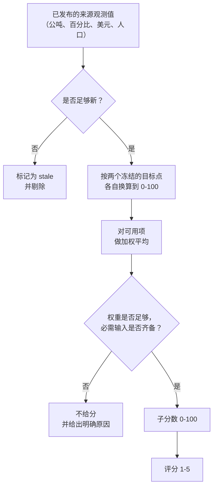

_本方法论由 World Monitor 创始人 [Elie Habib](https://www.worldmonitor.app/blog/authors/elie-habib/) 维护。已发布的修订记录在[更正日志](/zh/corrections)中。_

## 从这里开始

五因素评分卡对一个国家提出五个直白的问题，并各用一个 1 到 5 的数字回答：

1. **食品**——它能养活自己吗？
2. **能源**——它能供应自己的能源吗？
3. **人口结构**——它有维持自身运转所需的人口、技能与劳动力吗？
4. **科技**——它能开发并运用技术吗？
5. **国防**——它能保卫自己吗？

**1** 表示严重的结构性缺口。**5** 表示这个国家在该项上基本自给自足。这个数字没有别的玄机。

它的意义在于，用一屏回答分析师通常要花一周、从十几个数据集里拼出来的问题：*如果这个国家被切断，最先断掉的是什么？*

<Note>
评分卡描述的是**结构**，不是**事件**。它以年为尺度变化，因为底层数据——收成、能源平衡、人口普查年龄结构、国防预算——都是年度发布的。若要追踪快速变化的风险，请改用[综合不稳定指数](/zh/methodology/cii-risk-scores)。
</Note>

## 如何读懂评分

每个评分都是**绝对值**，不是排名。日本的 4 分和巴西的 4 分，对"自给自足"的含义完全相同；它们不是"第 4 名"。一个国家可以五项全是 5 分，也可以五项全是 1 分，两者都是合法结果。这里不做曲线评分。

| 评分 | 标签 | 实际含义 |
|---:|---|---|
| 1 | `severe-deficit` | 该国无法靠自身覆盖这项需求。中断几乎立刻见效。 |
| 2 | `material-deficit` | 存在真实缺口，靠进口或伙伴填补。易受供应方冲击。 |
| 3 | `mixed-capability` | 国内能覆盖大部分需求，但有重要漏洞。 |
| 4 | `strong-capability` | 大体自给自足。缺口存在但可管理。 |
| 5 | `high-capability` | 结构性自给自足，通常还有余量可供出口。 |

除 1–5 分之外，每个因素还会给出一个 **0 到 100 的子分数**。用 1–5 分快速横向比较国家；当你需要看清同一档位**内部**的差异时用子分数——比如区分一个刚过 61 分的"勉强 4 分"和一个 79 分、几乎够到 5 分的国家。

### 一次示范性的解读

假设某国返回：

- 食品 **4**（子分数 68.8）
- 能源 **2**（子分数 31.0）
- 人口结构 **3**
- 科技 **4**
- 国防 **2**

通俗的读法是：这个国家产的粮食多于自己吃掉的，储备也还不错，但能源基本靠买，军事装备也依赖外国供应商。一场封锁或一套制裁，会先通过燃料和武器伤到它，远早于伤到任何人的饭碗。

### 它*不是*什么

- **不是生活质量或"好国家"指数。** 一个富裕、安全、深度互相依赖的国家可能得分很低。自给自足与宜居是两回事。
- **不是预测。** 它说的是今天存在什么能力，不是将来会发生什么。
- **不是[综合不稳定指数（CII）](/zh/methodology/cii-risk-scores)**（衡量近期不稳定风险），也**不是[国家韧性指数（CRI）](/zh/methodology/country-resilience-index)**（衡量恢复能力）。三者相互独立，不可互相替代。
- **不是编辑判断。** 每个数字都能追溯到一条带年份的、具名的公开来源观测值，API 会把它与评分一并返回。

## 评分是如何构建的

每个因素都用同样的四步构建。



**第 1 步——收集观测值。** 每个因素各自拉取一小组已发布指标。例如食品会用到热量生产、热量消费、期末库存、水压力与进口集中度。

**第 2 步——把所有指标放到同一把 0–100 的尺子上。** 原始指标的单位互不兼容——公吨、百分比、美元、人口。每一项都通过两个固定参照点换算到统一的 0–100 标度，这两个点称为*目标点*：一个得 0 分，一个得 100 分。达到或超出目标点的数值会被截断在该端。

例如，食品平衡的目标点是 `0.50 -> 0` 与 `1.25 -> 100`。一个只生产自身消费量一半热量的国家得 0 分；生产量比消费量高 25% 的得 100 分；产销恰好持平的落在 67 分。目标点作为已发布方法论的一部分被冻结，因此去年的分数和今年的分数是用同一把尺子量出来的。

**第 3 步——加权平均。** 各指标的重要性不同。在食品中，产销平衡占 55% 的权重，而进口多样性只占 5%。各组成分数的加权平均即为该因素的 0–100 子分数。

**第 4 步——换算成 1–5 分。** 子分数按固定切分点映射到档位。下限含在内，因此 40.0 正好是 3 分。

| 子分数 | 评分 | 标签 |
|---|---:|---|
| `0 <= x < 20` | 1 | `severe-deficit` |
| `20 <= x < 40` | 2 | `material-deficit` |
| `40 <= x < 60` | 3 | `mixed-capability` |
| `60 <= x < 80` | 4 | `strong-capability` |
| `80 <= x <= 100` | 5 | `high-capability` |

### 工作示例：某国的食品评分

设某国有以下四条已发布观测值。

| 指标 | 观测值 | 目标点 | 组成分数 | 权重 | 贡献 |
|---|---:|---|---:|---:|---:|
| 热量生产 / 消费 | 1.05 | `0.50 -> 0`、`1.25 -> 100` | 73.33 | 0.55 | 40.33 |
| 热量期末库存 / 总使用 | 0.15 | `0.05 -> 0`、`0.25 -> 100` | 50.00 | 0.25 | 12.50 |
| 水安全（水压力） | 25% | `100 -> 0`、`10 -> 100` | 83.33 | 0.15 | 12.50 |
| 进口伙伴多样性（HHI） | 0.30 | `0.65 -> 0`、`0.15 -> 100` | 70.00 | 0.05 | 3.50 |

四项指标齐备，因此覆盖率为 `1.00`，各项贡献直接相加：

```text
子分数 = 40.33 + 12.50 + 12.50 + 3.50 = 68.83
评分   = 4  （因为 60 <= 68.83 < 80）
```

用文字来说：这个国家产出的热量比吃掉的多约 5%，持有约两个月的缓冲库存，水压力中等，且进口来源分散到足以让任何单一供应方都掐不住它。**能力较强，缓冲仍有改进空间。**

## 为什么有时某个因素根本没有评分

有时一个因素返回的是"空"，而不是"低分"。这是刻意的，而且这个区别很重要：**缺失的评分不是差的评分。**

评分器绝不为缺失的指标编造占位值。它不会替换成中性的 50 分，也不会把"我们没有数据"当成"能力为零"——两者中的任何一种做法，都会把数据缺口悄悄变成关于一个真实国家的错误结论。

取而代之的是，每个因素都有一条**覆盖下限**：其指标权重中必须真实存在的最小比例，外加一小份不可或缺的必需指标清单。例如食品要求 70% 的权重可用，**并且**必须有产销平衡这一项。若某国达标，该因素就仅用现有指标评分，并把权重在它们之间重新归一化；若不达标，该因素返回"无评分"并说明原因。

<Warning>
**绝不要把缺失的评分读成零。** 通过 API 返回时，未评分的因素带有 `hasScore: false`，数值字段为 `0`——这些零是"无数据"的协议占位符，不是测量结果。读 `score` 或 `subScore` 之前，永远先检查 `hasScore`。参见[读取 API 响应](#读取-api-响应)。
</Warning>

每个未评分的因素都会从这个封闭集合中给出原因：

| 原因 | 通俗解释 |
|---|---|
| `source-unavailable` | 上游数据集完全读取不到。 |
| `country-unavailable` | 数据集本身正常，但没有该国的条目。 |
| `invalid-value` | 已发布的数值不可能成立，或超出取值范围。 |
| `stale` | 最新数值已超过该指标的年龄上限。 |
| `coverage-below-floor` | 可用指标太少，无法诚实地为该因素评分。 |
| `required-group-missing` | 缺少该因素不可或缺的某项指标。 |
| `missing-population` | 需要人口加权的计算没有人口数据。 |
| `redistribution-blocked` | 来源许可禁止再发布该证据。 |

## 数据有多新

每项指标都有一个最大年龄，因为一份 12 年前的能源平衡表并不能说明今天的情况。边界年份含在内。

| 最大年龄 | 指标 |
|---:|---|
| 3 年 | 人口、食品平衡、食品库存、年龄结构 |
| 4 年 | 一次能源平衡 |
| 5 年 | 低碳发电、贸易多样性、劳动力、国防 |
| 7 年 | 其他所有年度指标 |

超过年龄上限的观测值会被标记为 `stale` 并退出评分，而不是拖累评分。若某个来源自身的内容年龄约定过期，它所供给的全部指标也一并变为 `stale`，即使存储的数值仍可读取。

评分卡同样拒绝在数据稀薄的日子发布。只有当新的每日批次覆盖至少 180 个有可评分因素的国家、150 个有可用人口证据的国家，并达到以下各因素的国家数下限时，才会替换上一批次：食品 80、能源 120、人口结构 150、科技 110、国防 30。这些下限来自对 196 个国家与生产环境数据源的一次审计，并为正常的覆盖波动留出了余量。启用前的生产环境刷新实测到 116 个可评分的科技国家，因此该下限被修正为 110——保留六个国家的故障余量——同时不放宽任何国家的证据、评分、新鲜度或空值规则。因此，局部来源故障不会用更差的快照覆盖更完整的快照——上一份良好批次会继续保持在线。

## 五个因素详解

以下每个因素都列出它使用的指标、各自的权重、0–100 目标点，以及当你查询的是集团而非单一国家时的汇总方式。

### 食品

**核心问题：** 这个国家能否靠自身产量与库存覆盖自己消费的热量，而不必受制于某一个供应方？

食品把物理热量平衡与缓冲库存、水压力、进口集中度结合起来。以千公吨发布的商品数量，会先按 `千公吨 * kcal/kg / 1,000,000` 用一张冻结的商品换算表转为万亿千卡，然后才进行汇总。

| 组成 | 权重 | 方向与目标点 | 输入来源 |
|---|---:|---|---|
| 热量生产 / 消费 | 0.55 | 越高越好；`0.50 -> 0`、`1.25 -> 100` | USDA PSD / FAOSTAT 粮食平衡表 |
| 热量期末库存 / 总使用 | 0.25 | 越高越好；`0.05 -> 0`、`0.25 -> 100` | USDA PSD |
| 水安全 | 0.15 | 压力越低越好；`100 -> 0`、`10 -> 100` | 世界银行 AQUASTAT 静态证据 |
| 进口伙伴多样性代理 | 0.05 | HHI 越低越好；`0.65 -> 0`、`0.15 -> 100` | UN Comtrade 进口 HHI |

覆盖下限：**0.70**。热量生产 / 消费为必需输入。

- **1 分：** 产量接近或低于使用量的一半，且缓冲薄弱。
- **3 分：** 国内产出覆盖了大部分但非全部使用量，或缓冲情况参差。
- **5 分：** 产出显著超过使用量，且库存缓冲充足。

**集团规则：** 先把成员国的产量与消费量分别加总再算比率，期末库存与总使用也同样先加总——集团被视为一个物理系统。水安全与进口多样性则在有证据的成员国之间按人口加权。

### 能源

**核心问题：** 这个国家是否自己生产它所消耗的一次能源，输送这些能源的系统是否健全？

消费量来自 OWID `primary_energy_consumption`。产量由韧性静态数据源中已通过审计的净能源进口观测值推导：覆盖到的欧洲国家使用 Eurostat `nrg_ind_id`，其余国家使用世界银行 `EG.IMP.CONS.ZS`：

```text
产量 TWh = 消费 TWh * (1 - 净进口百分比 / 100)
```

两个提供方均已通过原始数据再分发审计，因此 `netEnergyImportsPercent` 观测值会标注实际提供该数值的一方。

| 组成 | 权重 | 方向与目标点 | 输入来源 |
|---|---:|---|---|
| 一次能源生产 / 消费 | 0.60 | 越高越好；`0.25 -> 0`、`1.25 -> 100` | OWID 与世界银行或 Eurostat |
| 低碳发电占比 | 0.25 | 越高越好；`0% -> 0`、`80% -> 100` | 韧性低碳发电数据 |
| 电网输送效率 | 0.15 | 损耗越低越好；`25% -> 0`、`3% -> 100` | 韧性电力损耗数据 |

覆盖下限：**0.60**。一次能源生产 / 消费为必需输入。

- **1 分：** 产量只覆盖很小一部分使用量。
- **3 分：** 平衡状况参差，进口仍然可观。
- **5 分：** 能源自给自足或为净出口国，且电力系统证据良好。

**集团规则：** 先加总生产与消费的 TWh 再评分。低碳占比与电网效率在有证据的成员国之间按人口加权。

### 人口结构

**核心问题：** 这个国家有足够的劳动年龄人口吗？他们受过足够的教育与训练，能运转一个现代经济体吗？

这个因素刻意把*有多少人*可用与*他们能做什么*混合在一起——一个人口结构良好却没有工程师的国家算不上有能力，一个大学体系一流、劳动力却在加速萎缩的国家同样如此。输入来自 `demographics:capability:v1`。

| 组成 | 权重 | 方向与目标点 |
|---|---:|---|
| 总抚养比 | 0.15 | 越低越好；`100 -> 0`、`35 -> 100` |
| 老年抚养比 | 0.10 | 越低越好；`50 -> 0`、`10 -> 100` |
| 劳动年龄人口 10 年比值 | 0.20 | 越高越好；`0.80 -> 0`、`1.10 -> 100` |
| 高等教育入学率 | 0.15 | 越高越好；`20% -> 0`、`90% -> 100` |
| 每百万人研究人员数 | 0.10 | 越高越好；`100 -> 0`、`5,000 -> 100` |
| STEM 毕业生占比 | 0.10 | 越高越好；`10% -> 0`、`40% -> 100` |
| 受训工业岗位占比 | 0.15 | 越高越好；`2% -> 0`、`25% -> 100` |
| 制造业就业占比 | 0.05 | 越高越好；`5% -> 0`、`25% -> 100` |

覆盖下限：**0.60**。至少需要一项年龄结构输入，以及一项教育、研究或劳动力输入。

- **1 分：** 抚养负担严重或人口收缩，且几乎没有能力方面的证据。
- **3 分：** 年龄结构与人力能力深度参差。
- **5 分：** 劳动力供给有利，且教育、研究与工业劳动力储备深厚。

**集团规则：** 成员国子分数的人口加权平均。它绝不对 1–5 分求平均——对档位求平均会让一个极小的成员国拥有与大国同等的影响力。

### 科技

**核心问题：** 这个国家连通性如何？它是自己产生技术，还是只在消费技术？

现有的技术就绪度评分、排名与组成保持不变；v1 新增的是展示与复现本评分卡所需的原始观测值。

| 组成 | 权重 | 方向与目标点 | 输入来源 |
|---|---:|---|---|
| 互联网使用率 | 0.20 | 越高越好；`20% -> 0`、`95% -> 100` | `IT.NET.USER.ZS` |
| 移动订阅数 | 0.10 | 越高越好；每百人 `50 -> 0`、`150 -> 100` | `IT.CEL.SETS.P2` |
| 固定宽带 | 0.15 | 越高越好；每百人 `0 -> 0`、`45 -> 100` | `IT.NET.BBND.P2` |
| 研发支出 | 0.25 | 越高越好；`0.2% -> 0`、`4% -> 100` | `GB.XPD.RSDV.GD.ZS` |
| 每百万人研究人员数 | 0.15 | 越高越好；`100 -> 0`、`5,000 -> 100` | 人口结构能力数据 |
| STEM 毕业生占比 | 0.10 | 越高越好；`10% -> 0`、`40% -> 100` | 人口结构能力数据 |
| 电力可及性 | 0.05 | 越高越好；`50% -> 0`、`100% -> 100` | 韧性静态证据 |

覆盖下限：**0.65**。至少需要一项连通性输入与一项创新输入。

- **1 分：** 数字接入有限，几乎没有可测量的创新能力。
- **3 分：** 使用广泛*或*研究能力尚可，但仍有明显缺口。
- **5 分：** 高连通性，加上深厚且持续的创新能力。

**集团规则：** 成员国子分数的人口加权平均。

### 国防

**核心问题：** 这个国家能否维持一支军队——并且在不依赖别人工厂的前提下装备它？

请注意，权重最重的一项是武器转让平衡，而不是支出。一笔全部花在进口装备上的巨额预算，在结构上弱于一笔由国内生产支撑的较小预算，权重设置正是这么表达的。世界银行的国防观测值来自 `military:industrial-base:v1`。

| 组成 | 权重 | 方向与目标点 |
|---|---:|---|
| 军费支出（美元） | 0.20 | 越高越好，对数标度；`1 亿美元 -> 0`、`1000 亿美元 -> 100` |
| 军费支出占 GDP 比重 | 0.15 | 越高越好；`0.5% -> 0`、`5% -> 100` |
| 武装部队人员 | 0.15 | 越高越好，对数标度；`10,000 -> 0`、`1,000,000 -> 100` |
| 武器出口占转让比重 | 0.30 | 越高越好；`0 -> 0`、`1 -> 100`；同年出口 /（出口 + 进口） |
| 供应国多样性 | 0.20 | HHI 越低越好；`0.65 -> 0`、`0.15 -> 100` |

覆盖下限：**0.50**。至少需要一项态势输入（支出或人员），以及武器转让的产业平衡输入。

- **1 分：** 规模有限，且高度依赖外部装备。
- **3 分：** 具备可观的态势*或*产业能力，但存在重要缺口。
- **5 分：** 规模大且持续，国内与出口产业深度都很强。

只有当出口与进口在同一年份都是明确的有限观测值时，产业平衡才会被计算。缺失的一侧绝不会被当作零；一个明确测得的零仍然有效。

<Info>
**目前所有国家的供应国多样性均不可用。** SIPRI 的原始转让记录不被存储也不被返回；在来源政策允许公开使用已派生的供应国 HHI 之前，该组成会返回 `redistribution-blocked`。因此国防评分是用其余 0.80 的权重计算的。
</Info>

**集团规则：** 成员国子分数的人口加权平均；在政策限制期间，供应国多样性仍然不可用。

## 为集团而非国家评分

你可以把一组国家当作一个整体来评分——把欧盟当作一个能源系统，把金砖国家当作一个食品系统。

作为版本化方法论的一部分，内置六个预设：`USMCA`、`EU27`、`BRICS`、`GCC`、`ASEAN` 与 `NATO`。自定义集团接受 2–30 个来自公开可排名范围的、不重复的大写 ISO-2 代码。一次请求只能选择一个预设**或**一份自定义成员列表。预设本身可以超过 30 个成员。

汇总规则有两种，两者的差别是刻意的：

- **食品与能源先做物理汇总，再评分。** 公吨与太瓦时先在成员国之间加总，因为一个集团确实共享同一张物理平衡表。
- **人口结构、科技与国防按人口加权连续分数。** 这些是无法直接相加的人均能力，因此对成员国的子分数按人口加权平均。

**任何集团公式都绝不对 1–5 分求平均。** 每个集团因素都会报告它的汇总方式、纳入与排除的成员、适用时的人口覆盖率，以及所用的证据。

预设成员资格已于 2026-08-29 对照官方名单核对：
[欧盟成员国名单](https://european-union.europa.eu/principles-countries-history/eu-countries_en)、
[金砖国家成员名单](https://brics.br/en/about-the-brics)、
[东盟成员国名单](https://asean.org/member-states/)，以及
[北约成员国沿革](https://www.nato.int/cps/en/natohq/nato_countries.htm)。
ASEAN 预设包含东帝汶，BRICS 预设采用官方的 11 国名单。成员资格变更需要一条方法论变更日志条目。

## 面向开发者

### 访问权限

三个评分卡 RPC——`GetFiveFactorScorecard`、`GetBlocScorecard` 与 `ListFiveFactorScorecards`——均需 Pro 订阅（tier 1），MCP 工具 `get_five_factor_scorecard` 与 `list_five_factor_scorecards` 同样如此。请求结构参见 [Pro 情报套件](/zh/pro-intelligence-suite)。

### 读取 API 响应

每个因素返回四个容易混淆的字段：

| 字段 | 类型 | 含义 |
|---|---|---|
| `hasScore` | bool | 先读它。为 `false` 时，该因素未被评分。 |
| `score` | int32 | 1–5 的评分。`hasScore` 为 `false` 时为 `0`。 |
| `subScore` | double | 0–100 的子分数，保留两位小数。`hasScore` 为 `false` 时为 `0`。 |
| `band` | string | `score` 对应的标签：`severe-deficit`、`material-deficit`、`mixed-capability`、`strong-capability` 或 `high-capability`。`hasScore` 为 `false` 时为空字符串。 |

`inputCoverage` 报告可用指标权重的占比，取值 0 到 1，保留四位小数。

<Warning>
Protobuf JSON 会把数值字段以零的形式保留，因此若不先根据 `hasScore` 分支判断，未评分的因素与真实的零无法区分。那些零是"数据不足"的占位符，不是测得的零能力。
</Warning>

### 不要用子分数反推评分

`score` 由**未取整**的连续值推导；`subScore` 是同一个值取两位小数的结果。在档位边界附近，两者可能合理地不一致。连续值 `19.996` 会发布为：

```json
{ "hasScore": true, "score": 1, "subScore": 20, "band": "severe-deficit" }
```

这是正确的，不是 bug。请始终使用发布的 `score` 与 `band`，绝不要从 `subScore` 重新计算档位。

### 证据记录

每项指标都返回一条带标记的"可用 / 不可用"记录。可用证据包含输入 ID、数值、年份、单位、来源与来源键。被保留的最后一次成功上游观测仍然可用，并标记为 `quality=retained`。

### 版本约定

- **方法版本：** `1.0.0`
- **输入注册表：** `1.0.0`
- **存储模式：** `1`
- **规范快照：** `scorecard:five-factor:v1`
- **原子读取模型：** `scorecard:five-factor:v1:read-model`
- **种子健康：** `seed-meta:scorecard:five-factor`

每个结果都携带其方法版本与计算时间。修改权重、目标点、档位切分点、覆盖下限、必需组、汇总规则或输入映射，都需要提升方法版本并新增变更日志条目。修改存储结构还需提升模式版本。健康端点分别发布人口计数与五个因素的计数。

## 变更日志

### 1.0.0 — 2026-08-29

- 初始五因素方法论。
- 冻结绝对档位、目标点、权重、覆盖下限、必需组、汇总规则、不可用原因与取整规则。
- 增加来源安全的证据出处，以及明确的 SIPRI 再分发限制。
- 定义当前预设与自定义集团的校验约定。
- 冻结各输入的证据年龄与各因素的发布下限；数据过时或覆盖率崩塌的批次会保留此前的最后成功快照。
