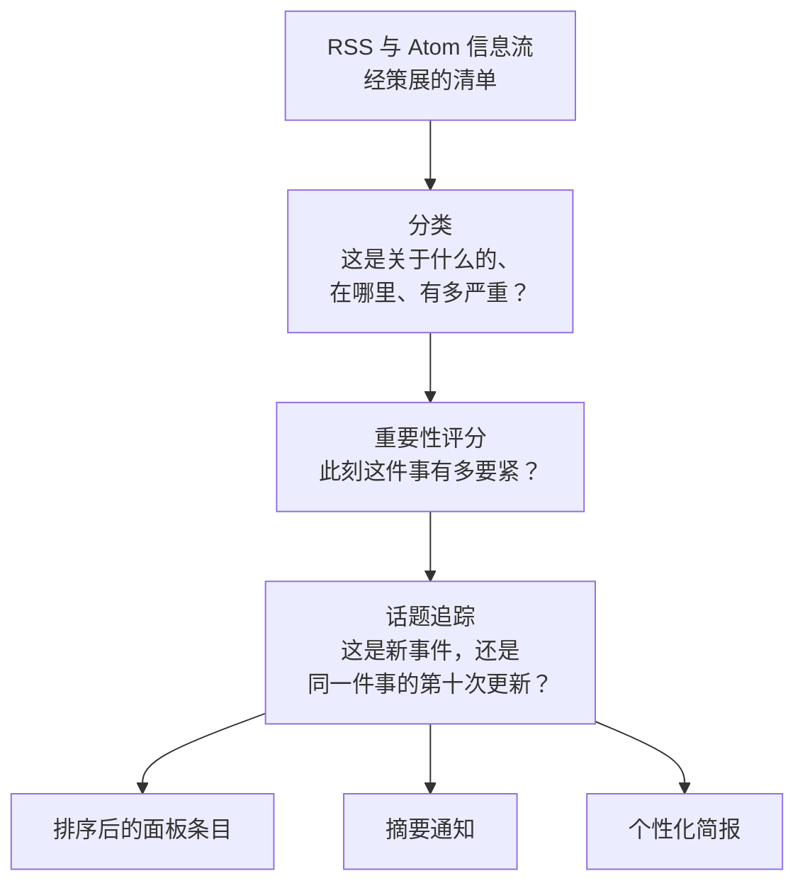

_本方法论由 World Monitor 创始人 [Elie Habib](https://www.worldmonitor.app/blog/authors/elie-habib/) 维护。已发布的修订记录在[更正日志](/zh/corrections)中。_

## 从这里开始

每天有成千上万条头条涌入。这套机制决定你会看到哪些、以什么顺序看到，以及哪些会被写进你的晨间简报。

它分四个阶段，各自回答一个不同的问题：

**话题追踪是最容易被低估的一环。** 没有它，一起持续发酵的事件会用二十条几乎相同的头条淹没面板，把其他一切都压下去。把头条归并成一条持续的话题，意味着一个重大事件只占据一个会不断更新的位置，而不是挤掉世界其余部分。

### 两个数字，刻意分开

每条头条都带有一个**重要性**分数（此刻这件事有多要紧）和一个独立的**可信度**分数（该来源在这件事上有多可信）。一家国家媒体可以在前者上很高、在后者上很低。后者的构建方式参见[新闻可信度](/zh/methodology/news-credibility)。

### 哪里用了 AI，哪里没有

语言模型在这里是**受约束的编辑助手，绝不是记录的来源**。它们撰写简报的行文，也可以调整一条话题的类别或严重性——但只能在硬性上限之内，这些上限阻止模型单方面把某件事提升为"关键"。

它们绝对不被允许做的，是编造溯源信息。发布方、文章 URL 与发布时间一律来自结构化信息流，绝不来自模型。简报行文必须通过与输入头条的专有名词接地校验；未通过的输出会回退到确定性合成。每个 LLM 环节都有这样的回退，因此模型故障只会让简报降级，而不是让它中断——或者更糟，让它凭空补全。

<Note>
**没有人工审阅队列。** 质量来自来源策展、日期门控、分类器上限、已公布的评分公式、读取路径过滤器、冷却遥测和上述 LLM 回退护栏——而不是来自编辑逐条审批。这些机制每一项都记录在本页中。
</Note>

## 范围

本页是新闻信息流摘要、每日摘要通知和 WorldMonitor Brief 的规范公开
方法论。它涵盖了将 RSS/Atom 信息流转化为排序后的面板条目、持久化的
报道轨迹、摘要通知和个性化编辑简报的自动化管道。

## 信息流清单

信息流清单位于 `server/worldmonitor/news/v1/_feeds.ts`。
接受的摘要变体为：

| 变体 | 用途 |
| --- | --- |
| `full` | 全球地缘政治、区域、政府、情报、气候、金融和专题信息流。 |
| `tech` | 初创、AI、安全、云、硬件、开发者、融资、政策和科技市场流。 |
| `finance` | 市场、政策、衍生品、外汇、加密货币、央行和机构流。 |
| `happy` | 关于保护、科学、慈善、进步、活动和正面公共行动的建设性新闻流。 |
| `commodity` | 大宗商品、采矿、能源、航运、农业、金属和政策流。 |

`energy` 是一个站点和客户端信息流变体（`energy.worldmonitor.app`），但它
还不是独立的服务端摘要变体：`listFeedDigest` 只接受上述变体，并将任何
其他请求（包括 `variant=energy`）归一化为 `full`。能源面板仍有用于能源
头条、能源市场和咽喉要道/路线的客户端信息流清单；服务端摘要中不存在的
类别使用直接的按信息流回退路径，而非专用的
`news:digest:v1:energy:{lang}` 缓存键。

每个信息流条目都带有显示名称、URL 和可选的语言标签。
按语言限定的信息流仅在请求语言匹配时才被包含。
对于 `full` 变体，构建还会在 `intel` 类别下添加 `INTEL_SOURCES` 信息流集合。

抓取路径首先直接尝试发布者 URL。每个直接请求都发送 `User-Agent`、
RSS/XML `Accept` 和英语 `Accept-Language` 请求头。
如果直接响应缺失、非 OK 或看起来像 HTML 而非
RSS/Atom/RDF，系统会尝试位于 `/rss?url=...` 的 Railway 中继。中继
路径使用中继认证头并应用相同的 RSS 形态嗅探，因此 Cloudflare 页面或
验证码主体不会被缓存为空信息流。

抓取可观测性记录缓存未命中是由 `direct`、`relay` 还是 `both-failed`
满足，以及中继状态和主体形态。健康的已解析信息流缓存 3600 秒；
零对零或解析失败缓存 300 秒，以便瞬时封锁快速恢复。

## RSS 与新鲜度

解析器接受 RSS `<item>` 和 Atom `<entry>` 块。在应用下游类别上限之前，
每个信息流最多读取 `5` 个条目。

日期提取是严格的。RSS 风格的条目依次尝试 `pubDate`、`dc:date`、
`dc:Date.Issued`，然后是 `published`；Atom 风格的条目依次尝试 `published`、
`updated`、`dc:date`，然后是 `dc:Date.Issued`。没有可解析日期的信息流条目
会被丢弃。比服务器时钟提前超过 1 小时的未来时间戳也会被丢弃。

解析后，摘要应用一个硬性新鲜度下限。默认的
`NEWS_MAX_AGE_HOURS` 为 `96`；无效、未设置或非正值回退到 96 小时。
该下限在佐证计数之前丢弃过时条目，因此旧副本无法抬高新聚类。时效性
评分保持独立：它在 24 小时曲线上贡献，并在 24 小时后归零。

`feed_statuses` 响应映射仅发出非 OK 的信息流状态：

| 状态 | 含义 |
| --- | --- |
| `empty` | 信息流完成但未产生任何保留条目。 |
| `timeout` | 信息流未在构建截止前完成。 |
| `all-undated` | 找到了条目，但每个已解析条目都因日期缺失、不可解析或为未来而被丢弃。 |
| `partial-undated` | 部分已解析条目被保留，部分因日期问题被丢弃。 |

缺失的信息流状态键意味着 OK。

## 分类

每个已解析条目都从 `server/worldmonitor/news/v1/_classifier.ts` 中的
关键词分类器开始。

分类器发出威胁级别、事件类别、置信度和来源标签。级别为 `critical`、
`high`、`medium`、`low` 和 `info`。事件类别包括 conflict、protest、disaster、
diplomatic、economic、terrorism、cyber、health、environmental、military、crime、
infrastructure、tech 和 general。`tech` 变体有额外的科技专属关键词集，因此
科技事件不会被强行套用地缘政治关键词配置。

critical 和 high 关键词匹配会被检查是否有历史回顾标记。
例子包括锚定的 "Science history"、"Throwback"、"Flashback"、
"On this day in YYYY"、"This day in history"、周年纪念用语，以及至少两年前的
完整日期。如果 critical/high 关键词匹配带有历史标记，它会被降级为 `info`
并打上 `keyword-historical-downgrade` 标签。

在严重性关键词运行之前，分类器应用一个消费/生活方式排除列表。如果
小写化的标题包含以下任何子串，该报道会被强制设为低置信度的
`info` / `general`：
`protein`、`couples`、`relationship`、`dating`、`diet`、`fitness`、`recipe`、
`cooking`、`shopping`、`fashion`、`celebrity`、`movie`、`tv show`、`sports`、
`game`、`concert`、`festival`、`wedding`、`vacation`、`travel tips`、
`life hack`、`self-care` 和 `wellness`。这些是子串匹配，而非单词边界
关键词匹配，因为目的是在诸如 "war"、"ban" 或 "virus" 等词能够提升它们
之前，抑制宽泛的生活方式和娱乐假阳性。

摘要可以从 LLM 分类缓存中丰富条目。缓存的 LLM 结果受三项控制约束：

- 历史标记护栏：任何看起来像历史的标题都保持在 `info`。
- 高置信度 critical 跳过：关键词分类为 critical 的条目不需要
  LLM 缓存升级。
- 升级上限：LLM 最多可将严重性提升到关键词结果之上 `+2` 级。
  `info` 只能升到 `medium`；`low` 只能升到 `high`；`medium` 可以升到
  `critical`；`high` 可以升到 `critical`。

LLM 降级会直接通过。当升级被限制时，系统会记录关键词级别、LLM
级别、应用级别和一个标题样本以供审计。

## 重要性评分

`importanceScore` 在关键词/LLM 分类、新鲜度过滤、精确标题佐证和
实体级佐证之后计算。基础分使用以下权重：

| 分量 | 权重 |
| --- | --- |
| 严重性 | `0.55` |
| 来源层级 | `0.20` |
| 佐证 | `0.15` |
| 时效性 | `0.10` |

严重性映射为：

| 级别 | 分数 |
| --- | --- |
| `critical` | `100` |
| `high` | `75` |
| `medium` | `50` |
| `low` | `25` |
| `info` | `0` |

来源层级映射为：第 1 层为 100，第 2 层为 75，第 3 层为 50，第 4 层为 25。
规范层级表是 `shared/source-tiers.json`，由 `server/_shared/source-tiers.ts`
导入并为中继镜像。来源溯源即信息流名称：如果某信息流不在表中，则
默认为第 4 层。

精确标题佐证按归一化标题哈希计算唯一来源数。佐证分数上限为五个来源，
在 `0.15` 权重之前每个来源计 20 分。

实体级佐证与精确标题佐证是分开的。对于最近 24 小时内的新鲜报道，
外交/引爆点术语按实体-动作对或通用外交-引爆点键分桶。当至少两个来源
命中同一实体级桶时，每个匹配的报道获得一个 `entityCorroborationCount`。
评分路径使用精确标题佐证和实体级佐证中较大者，并为每个实体级来源
添加 `4` 分的直接实体加成，上限为五个来源。

当标题包含配置的实体-动作对，或外交关键词加引爆点关键词时，
外交/引爆点报道会获得额外 `18` 分加成。任何非 `critical`、非 `high` 的
条目（包括 `info`），在其非历史性、具有外交/引爆点信号且至少有 `3` 个
第 1 层或第 2 层实体级来源时，也可被提升为 `high`。

在每个类别内，条目按 `importanceScore` 降序排序，然后按发布时间降序。
信息流摘要每个类别最多返回 `20` 个条目。

## 可信度评分

`credibilityScore` 是同一 `NewsItem` 上的独立 0-100 字段。它不替换
`importanceScore`。它衡量来源可靠性，而不是新闻重要性，因此一条极具新闻价值
的 RT 报道可以在重要性上得高分、在可信度上得低分。

规范公开方法论是
[新闻可信度评分](/zh/methodology/news-credibility)。摘要在同一次分类和佐证
之后于 `shared/news-credibility.js` 中计算它：

| 分量 | 权重 |
| --- | --- |
| 宣传风险 | `0.50` |
| 来源层级 | `0.30` |
| 独立佐证 | `0.20` |

高宣传风险来源（国家控制媒体）上限为 `40`。未审阅来源使用宣传风险
`unknown`（`35`），绝不用 `low`。严重性、时效性和外交/引爆点加成**不是**
输入。第三方 AllSides/MBFC 评级已预留且不应用。

新闻列表在平铺列表和聚类卡片上都渲染 `CRED NN` 徽章。MCP
`get_news_intelligence` 和 `get_news_clusters` 暴露同一字段。相关性排序仍是
`importanceScore`。

## 报道追踪

摘要将切片后的报道持久化到 Redis，以便后续的摘要通知和简报可以读取
相同的报道池。

| 键 | 类型 | 用途 | TTL |
| --- | --- | --- | --- |
| `story:track:v1:{titleHash}` | Hash | 当前报道元数据和分类器戳记。 | 7 天 |
| `story:sources:v1:{titleHash}` | Set | 提及该报道的信息流名称。 | 7 天 |
| `story:peak:v1:{titleHash}` | ZSet | 单个 `peak` 成员，保存所见的最高分数。 | 7 天 |
| `digest:accumulator:v1:{variant}:{lang}` | ZSet | 按最后所见时间排列的报道哈希，用于摘要窗口。 | 48 小时 |

今天写入的 story-track 哈希字段为：

`firstSeen`、`lastSeen`、`mentionCount`、`currentScore`、`title`、`link`、
`severity`、`lang`、`description`、`publishedAt`、
`entityCorroborationCount`、`isOpinion`、`isFeelGood`、
`isEphemeralLiveCoverage`、`category`，以及 `anchorEligible`。

仅当报道具有已整理的 1/2 级来源，或得到至少两个独立发布者家族的交叉印证时，
`anchorEligible` 才为 `1`。规范化采用会忽略值为 `0` 或缺少旧版元数据的行。

交叉印证默认使用服务器配置的信息流标签。只有明确配置的可信聚合器（目前为 Google News）
才可用 RSS `<source>` 名称替代该标签；普通信息流内容不能伪造发布者家族。Redis 跟踪写入会
分块发送，因此每个 pipeline 最多包含 1,000 条命令。别名行按完整规范组在单个带围栏的原子事务中
单独提交；超过该限制的组会延后，以免读取方看到部分别名组。短 Redis 租约和事务内令牌检查会阻止
延迟的旧摘要覆盖较新的别名组。

`sourceCount` 未存储于当前行的 story-track 哈希中。
不同的信息流名称通过 `SADD` 写入 `story:sources:v1:{titleHash}`；
需要真实来源计数的消费者必须读取该集合并用 `SCARD` 或等效的集合基数
来计数。`peakScore` 同样是 story-track 哈希中保留的读取路径占位符；
实时峰值分数保存在 `story:peak:v1:{titleHash}` ZSet 中。

标题哈希是归一化标题的 SHA-256 哈希：小写化、去除常见发布者后缀、
仅保留 Unicode 字母/数字/空格、折叠空白，并截断至 120 个字符。

报道阶段由首次所见时间和提及计数推导：

| 阶段 | 规则 |
| --- | --- |
| `breaking` | 提及计数为 1。 |
| `developing` | 提及计数为 2-5 且报道产生不足 2 小时。 |
| `sustained` | 持续追踪报道的回退。 |
| `fading` | 保留。信息流 API 不发出此阶段。 |

信息流 API 不发出 `fading`。线路枚举保留该值，客户端必须继续处理它，
但没有任何摘要响应会设置它。

议题 #7081 测试了此阶段过去承诺的规则。该规则在报道的当前重要性分数
降至峰值分数的一半以下时将其标记为 fading。测试使用冻结的生产证据，
并给出否决结果。原因有三：

1. 该规则无法运行。它从 `story:track:v1` 哈希读取 `peakScore`，但峰值
   写入 `story:peak:v1` 有序集合。该哈希字段没有写入方，因此在全部
   14,000 个采样行中都不存在。本页早先的版本称写入器为两个分数都存储
   零占位符。这仅对 `peakScore` 正确。`currentScore` 在每个周期写入，
   并且在全部 14,000 行中都大于零。
2. 该比值衡量的是文章年龄，而非关注度。重要性分数给严重度 55% 的权重，
   给时效性 10% 的权重。除非严重度发生变化，否则 critical 或 high 报道
   无法降至其峰值的一半。当 info 报道的文章超过 24 小时后，仅凭时效性
   一项即降至一半以下。在采样行中该规则触发 673 次，其中 670 行为 info
   或 low 严重度。679 个 critical 或 high 行中无一触发。
3. 在构建的该环节无法观测到 fading。阶段仅为出现在当前周期中的报道推导，
   且传给推导函数的记录其最后所见时间为当前时刻。不再被报道的报道不在
   该周期内，因此从不到达推导函数。

通知 cron 有自己的用于摘要投递的读取路径阶段辅助函数。它读取累加器，
因此可以看到不在当前周期中的报道。在那里，沉默超过 24 小时的报道被视为
`fading` 并从延迟摘要/简报池中丢弃。该辅助函数为内部实现，其 `fading`
结果不会到达信息流 API 响应。

冻结证据位于 `tests/fixtures/story-phase-fading-study.json`。运行
`node scripts/study-story-phase-fading.mjs` 可重放该研究。

## 摘要与简报读取路径

摘要通知 cron 为用户的摘要窗口读取
`digest:accumulator:v1:{variant}:{lang}`，然后批量读取 story-track 哈希。

读取时的新鲜度下限锚定于用户自己的摘要窗口，并有 24 小时缓冲。每日
用户的有效截止为 48 小时；每周用户的有效截止为 8 天。没有 `publishedAt`
的旧版行为向后兼容而保留，但发布来源时间过时的当前行会被丢弃。

cron 排除非事件驱动情报的行：

- 意见和分析专栏，使用摄取戳记或从标题/链接/描述进行的残留重分类。
- 正能量和生活方式报道，使用摄取戳记或残留重分类。
- 短暂的直播节目预告，例如 "WATCH LIVE" 或实时简报预览。这些在实时
  面板中可以保持可接受，但不适用于延迟的每日简报。
- 敏感的政府、军事和国际组织域名上的机构静态页面，作为纵深防御的
  URL/路径过滤器。
- 消退中的报道和低于用户敏感度阈值的报道。

报道按 `currentScore` 排序，然后去重。默认去重器基于嵌入
（`DIGEST_DEDUP_MODE=embed`），采用单链聚类、实体否决开启、余弦阈值
`0.60` 和 `45000` 毫秒的挂钟时间预算。`DIGEST_DEDUP_MODE=jaccard` 是
即时回滚。如果嵌入路径因提供商、密钥、超时或响应形态失败而抛出异常，
整个批次回退到 Jaccard。Jaccard 回退在标题词重叠大于 `0.55` 时合并聚类；
该阈值有意不可通过环境变量调节。`DIGEST_DEDUP_CLUSTERING=complete` 将
嵌入路径切换到更保守的全链模式，无效的聚类值也回退到全链。去重后主题
分组默认启用，阈值为 `0.45`；`DIGEST_DEDUP_TOPIC_GROUPING=0` 将其禁用。

去重后运行一个可选的绝对评分下限。`DIGEST_SCORE_MIN` 默认为 `0`，
表示无下限。正值会丢弃其代表 `currentScore` 低于下限的聚类。

在渠道格式化之前，摘要池上限为 `30` 个聚类。严重性格式化器将 high 报道
限制为 `15` 个，medium 报道限制为 `10` 个，且不限制 critical 报道。渲染后的
简报使用 `MAX_STORIES_PER_USER`，默认 `12`，可通过
`DIGEST_MAX_STORIES_PER_USER` 调节。简报还将每个来源/类别对限制为 `2`
个报道，以减少编辑杂乱。

简报中的主题排序首先是确定性的：严重性、该严重性下的报道数量、
符合条件的区块大小、评分，最后才是 LLM 提供的 `rankedStoryHashes`。
一个狭窄的覆盖规则允许排名最高、经实体佐证的外交/引爆点报道领衔其
主题区块。

## 冷却

冷却当前是一个 shadow/off 系统。`DIGEST_COOLDOWN_MODE` 接受：

| 模式 | 行为 |
| --- | --- |
| `shadow` | 默认。计算并记录冷却决策，但不抑制发送。 |
| `off` | 不计算冷却决策产物。 |

任何无法识别的值（包括 `enforce`）都回退到 `shadow`，并暴露 `invalidRaw`
以供运维告警。

冷却表为：

| 类型 | 下限 | 绕过条件 |
| --- | --- | --- |
| `critical-developing` | 4 小时 | 新增 5 个来源、新事实，或严重性层级变化。 |
| `critical-sustained` | 24 小时 | 硬下限，除非有新事实。 |
| `high-event` | 18 小时 | 新增 5 个来源、新事实，或严重性层级变化。 |
| `high-single-corporate` | 48 小时 | 硬下限，除非有真实升级。 |
| `sanctions-regulatory` | 18 小时 | 新增 5 个来源、新事实，或严重性层级变化。 |
| `analysis` | 7 天 | 硬下限。 |
| `med` | 36 小时 | 新增 5 个来源、新事实，或严重性层级变化。 |

评估器对明显的分析类域名、政府监管通知、单一公司财报标题和严重性
派生的回退进行分类。当下限内存在先前的投递时，视具体行而定，它可以在
层级变化、基于标题的新事实或来源计数演变时允许发送。

## LLM 使用

LLM 被用作有界的编辑助手，而非记录的真相源。

分类缓存路径可以更新类别/严重性，但仅在上述历史标记、高置信度
critical 和 `+2` 升级上限控制范围内。

WorldMonitor Brief 使用两个 LLM 界面：

- 摘要文稿（`brief:llm:digest:v9`）从可见报道池生成 JSON 导语、线索列表、
  信号和 `rankedStoryHashes`。
- 每条报道的 `whyMatters` 首先使用分析师端点，然后是直接的 Gemini
  回退，如果每个 LLM 层都失败则使用基线存根。

两条路径都经过事实锚定。提示输入由确定性管道已选中的报道字段构建。
摘要文稿缓存键包括敏感度、档案哈希、问候桶、公开/私有模式、报道哈希、
标题、威胁级别、类别、国家和来源。缓存的和新的 LLM 输出都经过形态验证。
摘要文稿必须针对输入标题通过专有名词锚定校验；未锚定或格式错误的输出
会回落到降级合成或存根。每个提示都会收到一行当前日期，以便当来源报道
省略日期时模型不会杜撰年份。

简报是编辑性背景信息，而非投资、法律、医疗、安全或旅行建议。LLM 指令
禁止 markdown、开场白、提问、行动号召和泛泛的编辑填充语。产品语言应
描述发生了什么变化以及为何可能重要，而非告诉读者买什么、卖什么、
做什么或相信什么。

## 简报来源如何展示

AI 简报来源列表派生自被选为锚定输入的信息流条目。从不要求模型创建
URL、发布者或发布时间。Web 简报界面和 MCP 简报工具从用作上下文的
相同已选摘要或国家新闻条目中附加一个有界的 `sources` 数组。不安全或
缺失的文章 URL 会被丢弃而非渲染。

来源页脚是一种来源溯源辅助，而非句子级的引用对齐。诸如 `[1]` 的方括号
标记在模型使用它们时可能链接到本地来源列表，但权威的文章链接仍来自
结构化的信息流数据。缓存的简报将其结构化来源与缓存的摘要一起保留；
较旧的无来源缓存条目在重用前被丢弃。

规范的摘要文稿和直接回退的 `whyMatters` 路径通过跳过 Ollama 和 Groq
将提供商链固定到 OpenRouter，因此当 LLM 层启用时，实时简报在这些界面
使用 Gemini 3.5 Flash-Lite（`google/gemini-3.5-flash-lite`）。摘要文稿和报道描述调用
使用温度 `0.4`。区域每周简报有意与那些摘要文稿和 `whyMatters` 界面
不同：`scripts/regional-snapshot/weekly-brief.mjs`
首先用 `deepseek/deepseek-v4-flash` 尝试 OpenRouter，然后依次尝试固定的免费
OpenRouter 模型 `google/gemma-4-26b-a4b-it:free` 和
`minimax/minimax-m3:free`，最后回退到 Groq `openai/gpt-oss-20b`。所有提供商都使用温度
`0.3`，因为其输出是用于区域快照的结构化每周 JSON，而非按用户的摘要
文稿。摘要提示要求指明行为者/事件导语，禁止诸如 "the global stage" 的
泛泛编辑用语和诸如 "this comes as" 或 "meanwhile" 的弱衔接短语，在导语
合并两个报道之前要求实质性关联，并通过相同的形态、专有名词锚定、
身份限定词和衔接短语门控来验证缓存命中和新输出。衔接短语门控匹配词干
（`comes as`、`occurs as`、`meanwhile`）而非提示中的精确变体，会丢弃
违规的导语句子，并在剩余导语不足 40 个字符时拒绝该摘要。按报道的提示
也尽可能要求指明行为者，并可使用 RSS 描述作为锚定上下文。

## 偏见姿态

系统在简报路径中有意偏向减少假阳性。无日期的条目会被丢弃，而非打上
服务器时间戳；历史周年标题会被降级；LLM 升级受上限约束；意见、生活
方式和直播节目条目会从延迟简报中排除；机构静态页面会在读取路径上
被过滤。当真实事件日期不清、来源薄弱或措辞像回顾时，这可能产生假阴性。

摘要评分仍偏向严肃、经佐证、近期、权威的事件。来源分层可能低估本地
媒体，并过度呈现大型英文通讯社。来源集中度是一个已知风险：来自同一
编辑生态系统的多篇文章可能看起来比实际更多样，而重要的本地语言报道
可能迟到或根本不出现。部分选定区域存在非英语报道，但分类器关键词和
许多 LLM 锚定启发式在英语中最强。

地理覆盖同样不均衡。拥有许多策展信息流和强通讯社覆盖的区域，会比
RSS 稀少、发布者信息流被封锁或日期元数据薄弱的区域更可靠地浮现。

关注国家个性化是一种软性的同档内提升。名义上的
`FOLLOWED_BIAS_MULTIPLIER` 为 `1.25`，可通过环境变量在 `1` 和 `2` 之间
调节，但实时列表机制是一种稳定的严重性档位排序：关注国家的报道可以
在同一严重性档位内移动到非关注报道之前，但永远不会将较低严重性的
报道提升到较高严重性的报道之上。免费层读者最多可关注 `3` 个国家；
PRO 读者可以保留更大的关注集合。如果关注国家中继不可用，简报会回退
到无偏排序，而非将缺失的列表视为真相。

`happy` 变体有意与情报简报不同。它呈现建设性和正面新闻流，不应被
解读为移除了负面事件的全球风险简报。在情报简报路径中，正能量和生活
方式条目会被排除，因为该简报意在成为事件驱动的全球情报。

## 源文件

- 信息流清单与摘要构建：`server/worldmonitor/news/v1/_feeds.ts`，
  `server/worldmonitor/news/v1/list-feed-digest.ts`
- 关键词分类器：`server/worldmonitor/news/v1/_classifier.ts`
- API 契约：`proto/worldmonitor/news/v1/list_feed_digest.proto`
- 摘要 cron 与简报合成：`scripts/seed-digest-notifications.mjs`，
  `scripts/lib/brief-compose.mjs`，`shared/brief-filter.js`
- 去重与主题分组：`scripts/lib/brief-dedup.mjs`，
  `scripts/lib/brief-dedup-jaccard.mjs`，
  `scripts/lib/brief-dedup-embed.mjs`
- 冷却：`scripts/lib/digest-cooldown-config.mjs`，
  `scripts/lib/digest-cooldown-decision.mjs`
- 中继一致性：`scripts/ais-relay.cjs`
- MCP 简报界面：`api/mcp/registry/rpc-tools.ts`
