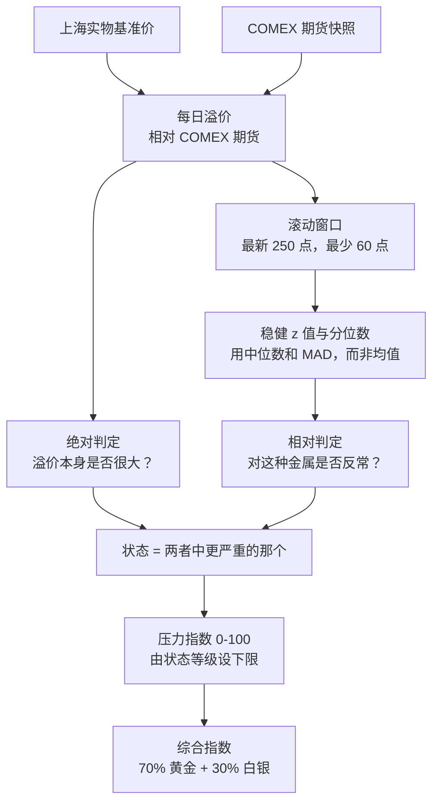

_本方法论由 World Monitor 创始人 [Elie Habib](https://www.worldmonitor.app/blog/authors/elie-habib/) 维护。已发布的修订记录在[更正日志](/zh/corrections)中。_

## 从这里开始

**一段话讲清这个想法。** 黄金和白银活在两个不同的世界：纽约 COMEX 上的纸面合约，以及上海的实物金属。正常情况下两者价格贴得很紧。当上海开始为实物支付明显的*溢价*时，意味着有人愿意多花钱去持有真金白银，而不是一纸承诺——而这个价差，是公认的实物市场承压的早期症状。

本指数盯住黄金和白银的这个价差，并告诉你今天的读数是否异常。

### 输出告诉你什么

每种金属会得到一个**状态（regime）**——`normal`、`elevated`、`stressed` 或 `extreme`——以及一个 0 到 100 的**压力指数**。

状态由两种方式同时判定，取更严重的那个：

- **绝对判定：** 溢价本身是否很大？3% 的黄金溢价无论历史如何都至少是 `stressed`。
- **相对判定：** 对这种金属近期而言，这个溢价是否反常？一个幅度不大、但处于过去一年前 1% 的溢价同样算数。

这套双重判定是刻意的。只看绝对值，会漏掉一个正悄悄偏离自身常态的市场；只看相对值，则会在平静期每次微小上浮时都尖叫。一道幅度下限阻止了后一种失效——溢价必须至少达到 `elevated` 的一半，其分位数才有资格提升它的状态。

<Note>
**这是市场结构指标，不是交易建议。** 它描述实物金属市场的一种状态。它不预测价格，也不构成买卖任何东西的信号。
</Note>

### 一次读数是如何产生的



窗口统计使用**中位数与 MAD**，而不是均值与标准差，因为单个尖峰否则会把用来衡量它的那把尺子一起撑大，反而掩盖掉你真正关心的事件。

### 为什么读数会缺失

这个指数宁可不发布，也不猜。每个结果都带有一个明确状态——`missing_input`、`stale_input`、`insufficient_history` 或 `ok`——只有 `ok` 的结果才带数字。只要任一金属不是 `ok`，综合指数就整体失效（fail closed）。参见[趋势和数据状态](#趋势和数据状态)。

<Info>
**访问方式。** 每日原始溢价来自 `GET /api/market/v1/get-physical-premiums`；派生指数来自 `GET /api/market/v1/get-physical-divergence-index`。两者均需 Pro 订阅——参见 [Pro 情报套件](/zh/pro-intelligence-suite)。基于缓存的 MCP 工具 `get_market_data` 的数据包中也包含 `physical-premium` 与 `physical-divergence` 数据集，该工具在每日额度内对已登录的免费账户开放。
</Info>

## 历史和稳健归一化

Seeder 按实物公布日期把黄金和白银分别写入 `market:physical-premium-history:v1:gold` 与 `market:physical-premium-history:v1:silver`。同一日期会替换旧点。写入、去重和截断在一个 Redis 操作中完成。每个列表最多保留 750 点，分类器使用最新 250 点，至少需要 60 个有效点。

每个点和响应都声明 `methodologyVersion: physical-divergence-v2`。

```text
稳健 z = 0.67448975 * (当前值 - 中位数) / MAD
MAD = median(abs(历史值 - 中位数))
```

当 MAD 为零时，如果当前值等于中位数，z 值为 `0`；否则不提供 z 值。百分位是小于或等于当前溢价的窗口值占比，范围为 0 到 100。

## 混合状态

系统分别计算绝对状态和相对状态，并选择较高者。

相对阈值仅在溢价达到该金属 `elevated` 阈值的一半时才生效：黄金为 0.5%，白银为 2.5%。仅判断正负是不够的——当前印价本身属于其滚动窗口，且百分位为闭区间，因此任何创窗口新高的取值都会得到 100，与幅度无关。若没有这道幅度下限，一个极小的正溢价只因高于一段平静窗口就会被判为 `extreme`。下限取在 `elevated` 阈值之下而非阈值本身，是为了让第 80 百分位这一档仍然可达。若按完整 `elevated` 阈值设限，相对判定并不会完全失效——第 95 与第 99 百分位仍可把绝对判定为 `elevated` 的溢价提升为 `stressed` 或 `extreme`——但第 80 百分位这一档将不可达，因为任何越过该下限的溢价在绝对幅度上本就已经是 `elevated`。取一半是该区间内的选定取值，并非唯一满足该约束的取值。

| 金属 | elevated | stressed | extreme |
| --- | ---: | ---: | ---: |
| 黄金 | 1% | 3% | 5% |
| 白银 | 5% | 10% | 20% |

相对百分位阈值为 80、95 和 99，分别进入 `elevated`、`stressed` 和 `extreme`。因此，黄金溢价达到 3% 时至少为 `stressed`，即使历史窗口中还有更高值。

单金属压力指数范围为 0 到 100。绝对幅度在压缩后的分段顶点 45（elevated）、70（stressed）、以及略低于 90（接近 extreme；stressed 分段故意不到 90，避免两位小数舍入顶到 extreme 下限）之间插值；只有突破绝对 extreme 溢价阈值（黄金 5%、白银 20%）才发布 `100`。

当相对阶梯超过绝对幅度时，`index` 仍表示**带状态有序下限的压力幅度**，不是百分位的副本：

| 状态 | 指数下限 |
| --- | ---: |
| normal | 0 |
| elevated | 45 |
| stressed | 70 |
| extreme | 90 |

`index = max(absoluteStressIndex, regimeFloor)`。仅由相对阶梯触发的 extreme 下限为 90，不会顶满 100，从而把刻度顶端留给绝对 extreme，并保证指数对状态等级单调：任何 `stressed` 读数的指数都不会高于任何 `extreme` 读数。`regime` 仍承载混合分类（绝对与相对取较高者）；百分位作为独立字段发布。

综合指数为 `70% 黄金 + 30% 白银`，且只在两个金属状态均为 `ok` 时发布。

## 趋势和数据状态

5 日和 20 日变化是当前溢价减去 5 或 20 个观测点之前的溢价。变化大于 `0.01` 个百分点为 `widening`，小于 `-0.01` 为 `narrowing`，其他为 `stable`。

状态按以下顺序判定：

1. `missing_input`：没有当前实物溢价输入。
2. `stale_input`：实物公布日期超过 12 个日历日、COMEX 快照超过 36 小时，或外汇快照超过 60 小时。实物阈值容忍中国市场的长假休市；纸面价格和外汇阈值与各自的数据源健康预算一致。
3. `insufficient_history`：有效历史点少于 60。
4. `ok`：输入未过期且历史充分。

市场休市时可接受 9 日前的延续数据，13 日前的数据会判为过期。非 `ok` 状态不提供数值指数。任一金属不是 `ok` 时，综合指数也不发布。

## 转换信号和来源

只有前后状态均为 `ok`、状态等级发生变化，并且同一金属在 48 小时内没有发过转换信号时，系统才生成跨源信号。48 小时正好是每日 cadence 的两倍。缺失、过期或历史不足的数据不会生成信号。向下转换也会保留。

响应包含实物基准来源、代码、实物公布日期、COMEX 快照时间、汇率快照时间、历史 key、样本数、窗口大小和方法版本。`/api/health` 使用独立 seed metadata 和 activation marker 监控 `market:physical-divergence:v1`。

## 版本记录

| 版本 | 日期 | 变更 |
| --- | --- | --- |
| `physical-divergence-v1` | 2026-08-30 | 首次发布有界历史、混合状态、明确数据状态、综合指数、趋势和转换信号。 |
| `physical-divergence-v2` | 2026-08-30 | 指数下限压缩为 0 / 45 / 70 / 90；绝对分段顶点嵌在这些下限之下；`100` 留给绝对 extreme，避免仅相对 extreme 顶满刻度（#7423）。固定 `methodologyVersion` 的客户端应重新建立基线。 |
