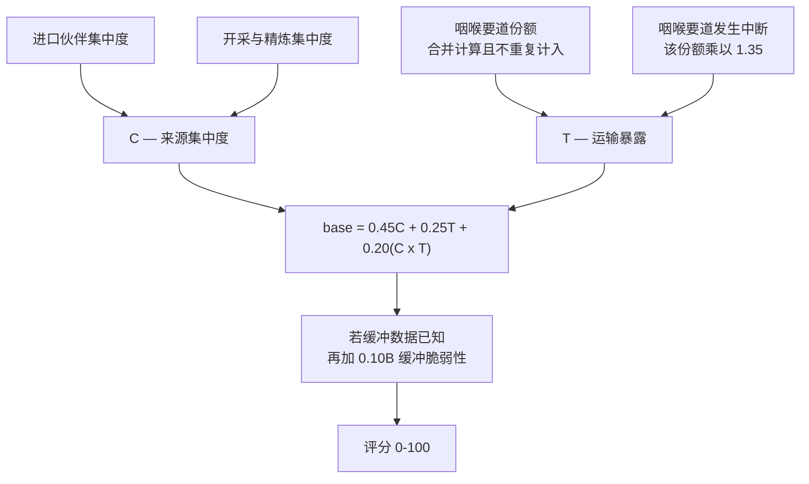

_本方法论由 World Monitor 创始人 [Elie Habib](https://www.worldmonitor.app/blog/authors/elie-habib/) 维护。已发布的修订记录在[更正日志](/zh/corrections)中。_

## 从这里开始

一个国家、一种商品、一个问题：**如果这条供应被切断，这个国家的暴露有多严重？**

暴露来自三个地方，评分也正是由这三者构成：

1. **集中度**——供应来自很多地方，还是只有一个？一个从十二个伙伴买铜的国家，和一个全部依赖单一矿山、单一冶炼厂的国家，处境完全不同。
2. **运输**——它必须经过海运咽喉要道吗？一批必须穿过霍尔木兹或马六甲的货物，就承担了那条海峡的风险。
3. **缓冲**——手头有没有库存能撑过缺口？

前两者是**相乘放大**，而不是简单相加。单一来源已经很糟；**单一来源且必须走同一条海峡**，则比两者之和更糟——公式中有一个明确的交互项来表达这一点。



### 它不是什么

它**不是**价格预测、短缺预测，也**不是**国内需求指标。高分说明这个国家会强烈感受到一次供应中断——而不是说中断即将发生。

### 缺失即中性，绝不当作零

如果缓冲数据未知，评分器不会假定"没有缓冲"。它会移除缓冲的权重并对其余权重重新归一化，因此缺失既不加分也不减分。当某条已覆盖路线的证据确实缺失时，评分会被整体扣下（`state: insufficient_data`），而不是靠猜测补上。

方法版本为 `supply-vulnerability-v2.0.0`。每条记录都包含评分组成、来源证据、覆盖状态、新鲜度状态、原因和方法版本。缺失值保持缺失，绝不转为零。

## 评分

`C` 是来源集中度，`T` 是海运咽喉要道暴露，`B` 是缓冲脆弱性。三个分量都在 0–1 范围内。

```text
base = 0.45C + 0.25T + 0.20(C × T)

B 已知：score = 100 × clamp(base + 0.10B, 0, 1)
B 未知：score = 100 × clamp(base / 0.90, 0, 1)
```

`C × T` 使集中度和运输暴露产生复合效应。缓冲未知时，模型删除缓冲权重并重新归一化，因此未知是中性的，不是零。

进口 HHI 是供应伙伴份额平方和，并包含未列出伙伴的剩余份额。这些份额来自规范双边分片中的前五个来源；国家简报读取的更深来源证据发布在另一个键中，本评分器并不读取，因此它不改变任何评分。矿山和精炼 HHI 都可用时：

```text
production HHI = 0.25 × mine HHI + 0.75 × refining HHI
C = 0.55 × import HHI + 0.45 × production HHI
```

精炼权重较高，因为即使矿源多样，处理环节仍可高度集中。咽喉要道暴露采用 `T = 1 - product(1 - ti)`。活动中断把对应份额乘以 `1.35`，上限为 `1.0`。中断解除后恢复基线。缺失的流量状态分两种情况处理。若该路线有状态数据源但当前缺行，状态为 `unknown`：评分为 null，状态为 `insufficient_data`，并给出 `missing_transit_status`，直到状态证据恢复。若该路线根本没有流量状态数据源（暴露索引覆盖的咽喉要道多于 PortWatch/EIA 流量记录），状态为 `uncovered`：其过境份额按基线倍数计入评分，并在覆盖标签中给出 `transit_status_uncovered`，而不是让永远不会发布的证据把评分全部置空。`uncovered` 路线永远不会显示为 `disrupted`。

已知缓冲转换规则：食品使用 USDA PSD 库存使用比；LNG 代理使用 GIE AGSI+ 储气填充率；油品使用 IEA 覆盖天数。只有储备容量但没有消费分母时，缓冲保持未知。

## 分级和数据状态

| 评分 | 等级 |
|---:|---|
| 0–24.99 | `low` |
| 25–49.99 | `moderate` |
| 50–74.99 | `high` |
| 75–100 | `critical` |

`ok` 表示最低证据存在且输入未过期。`stale_input` 保留最后可用评分并明确标记过期输入。`insufficient_data` 表示来源集中度或运输暴露缺失，此时 `score` 和 `band` 为 null。

## 映射和来源

版本化注册表使用 UN Comtrade HS 2022 (`H6`)。它覆盖稀土、锂、钴、铜、镍、石墨、钨、镓、锗、氦、铝、铝土矿、氧化铝、铀、原油、LNG、成品油、小麦、大豆、玉米、大米、大麦和棕榈油。每行都包含 HS4、运输 HS2、映射理由、限制和来源 URL。可执行 JSON 注册表是映射事实的权威来源。

证据来自 [UN Comtrade](https://comtradeplus.un.org/)、[USGS Mineral Commodity Summaries](https://www.usgs.gov/centers/national-minerals-information-center/mineral-commodity-summaries)、[World Bank PortWatch](https://www.worldbank.org/en/programs/ports)、[USDA FAS PSD](https://apps.fas.usda.gov/psdonline/app/index.html)、[GIE AGSI+](https://agsi.gie.eu/) 和 [IEA](https://www.iea.org/data-and-statistics)。许可和署名要求见[来源署名](/zh/source-attribution)。

## 发布与新鲜度

Railway 的 `seed-bundle-static-ref-heavy` 服务每日 04:00 UTC 启动，并在镜像输入完成后运行 `Supply-Vulnerability` 区段。该区段在一次内存计算中生成两个紧凑 Redis 清单：

- `supply-chain:vulnerability:v1`
- `supply-chain:chokepoint-dependencies:v1`

完整国家和咽喉要道记录存放在确定性的实体分片中。发布在两个槽位之间轮换：先写入非活动槽位的全部分片和两个公开清单，然后以原子方式切换唯一的权威批次描述符和永久激活标记。所有读取方使用该共享描述符。因此，任一清单写入失败都会继续提供上一个完整批次，下一次运行也不会覆盖仍被引用的槽位。清单和批次描述符 TTL 为 72 小时；分片 TTL 为 6 天。发布必须达到配置的国家和咽喉要道下限。系统会实测具有国家级进口证据的国家、具有全球生产证据的商品、可排名及新鲜可排名记录的深度、具有来源证据的商品 ID、双边输入中实际出现的 HS4，以及运输输入中实际出现的 HS2；注册表常量本身不算实际覆盖。覆盖测量写入 seed metadata，发布门槛和健康检查对其强制执行同一组下限。对全部已审核映射都具有证据的国家数量仅作为诊断信息发布。健康检查会探测所有 RPC 实际读取的权威批次描述符。首个完整批次发布前，探针保持待定；原子激活后，缺失、过期或部分输出都会严格告警。国家记录和反向咽喉要道依赖来自同一快照，因此评分、状态、运输份额和方法版本可对账。

公开 RPC 是 `GetCountryVulnerabilities`、`GetChokepointDependencies` 和 `ListVulnerabilityRankings`。MCP 工具是 `get_supply_vulnerabilities` 和 `get_chokepoint_dependencies`。

## 手工校验

自动化测试包含 10 个固定合成案例：稀土/中国式集中度、氦/卡塔尔式集中度、镓、锗、海湾小麦进口方，以及德国 LNG 储气填充前后。它们验证单调性、集中度与运输复合、未知缓冲中性、中断敏感性和反向索引对账。这些输入只用于验证算术和方向，不代表当前实时国家状况。完整输入和预期值见[英文方法页](/methodology/supply-vulnerability)。

## 变更记录

- `supply-vulnerability-v2.0.0` — 首个公开版本。加入精炼主导的生产 HHI、集中度与运输复合、中性未知缓冲、中断敏感性、明确覆盖/新鲜度状态，以及单次生成的咽喉要道反向索引。
